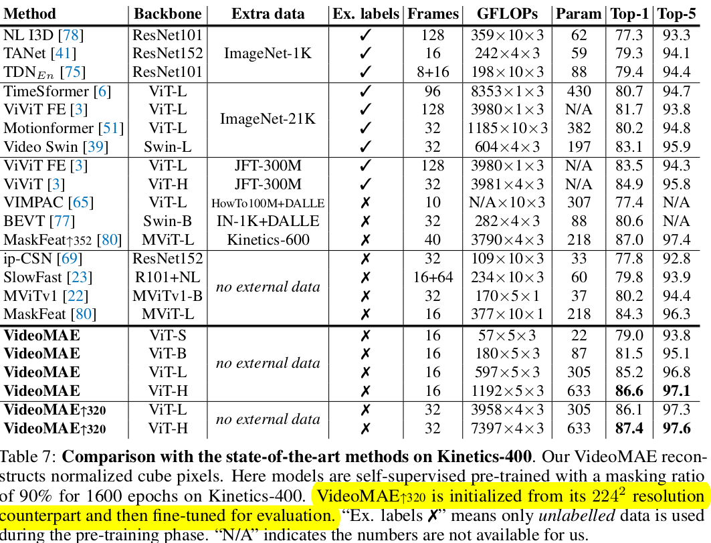

# [SSL2][AR] VideoMAE: Masked Autoencoders are Data-Efficient Learners for Self-Supervised Video Pre-Training

- paper: https://arxiv.org/pdf/2203.12602.pdf
- github: https://github.com/MCG-NJU/VideoMAE
- NeurIPS 2022 accpeted (Spot Light, 인용수: 537회, '24-03-27 기준)
- downstream task: Video action classification, Video action detection

# 1. Motivation

- Image domain에서 MAE 기반의 self-supervised learning로 학습한 representation이 매우 효과적인 것을 바탕으로 video domain에서도 이를 응용하고자 함
- Temporal dimension으로 redundunt한 video domain 특성을 살린 VideoMAE를 제안해보자!

# 2. Contribution

- Simple하지만 effective하게 vanilla ViT를 활용할 수 있는 masked video autoencoder를 제안함

  - 특징: extremely high masking ratio (90~95%) + temporally same masking (*tube masking*)

    

- Self-Supervised Video Pretraining (SSVP) 분야에 제안한 VideoMAE가 다른 pre-trained 기법들 (random initalization, contrastive learning)보다 효과적임을 입증

  

- 기존까지 Masked Modeling에서 간과했던 점들을 추가 분석을 통해 발견함

  - VideoMAE는 Data-Efficient Learner임 (3.5K video만 사용해도 됨)

  - Data의 Quality가 Quantity보다 중요함 (Domain Shift관련 실험)

    

    - 회색 점선: Kinetics-400으로 Pretrain하고, SSV2에 Fintuning한 결과

    - 초록 점선: SSV2 100% pretrain한 iteration과 동일한 iteration으로 x%만 사용해서 pretrain하고, SSV2에 Fintuning한 결과

    - 파란 점선: SSV2 100% pretrain한 epoch과 동일한 epoch으로 x%만 사용해서 pretrain하고, SSV2에 Fintuning한 결과

      $\to$ 비록 훨씬 많은 데이터 (Kinetics-400)로 pretrain했다고 하더라도, domain shift가 있는 데이터로 SSVP한 경우보다 적은 양이지만 domain shift가 없는 (Preatrin data = Finetune data)에 Finetune결과가 좋음

# 3. VideoMAE

## 3.1 Revisiting Image Masked AutoEncoders

- overall diagram

  

  - 목적: masking한 이미지 영역을 나머지 영역만 가지고 reconstruction을 수행함으로써, high-level information (spatiotemporal reasoning over the content)를 학습

    

## 3.2 Characters of Video Data

- Temporal redundancy

  - Temporal dimension으로 semantic의 변화가 매우 느리게 나타남 $\to$ original temporal frame rate을 사용하는건 비효율적임
  - NLP나 Image-vision에서 사용하는 50~75%의 normal masking ratio로 reconstruction을 수행하는 것은 어렵지 않아, motion에 대한 representation 학습을 약화시킴 $\to$ **high masking ratio** 제안 

- Temporal correlation

  - 인접한 frame간의 내재적인 correspondence가 존재하는 것을 Temporal correlation이라고 함

  - plain한 random masking이나 frame masking(frame 통째로 masking)하는 것)만 가지고는 high-level spatiotemporal reasoning over content보다 low-level temporal correspondence를 학습하게됨 $\to$ **tube masking**방식 제안

    

## 3.3 Video MAE

### Temporal downsampling

- strided temporal sampling 기법 사용 
  - dataset마다 다른 stride 사용 $\tau =2, 4$

### Cube embedding

-  2x16x16개의 token embedding을 cube로 정의 $\to \frac{T}{2} \times \frac{H}{16} \times \frac{W}{16}$ 의 cube embedding이 생성
-  $\frac{T}{2} \times \frac{H}{16} \times \frac{W}{16} \to D$ dimension의 mapping을 학습
-  차원 축소된 만큼 video 내 spatiotemporal redundancy를 감소시키게 됨

### Tube masking with extremely high ratios

- Video의 information density는 image보다 낮으므로, high masking ratios (90% or 95%)을 적용하는게 key factor
- Temporal correlation을 고려하여 Temporal dimension으로 tube masking을 수행하는 것이 high-level semantic을 향상시킬 수 있음

### Backbone: joint space-time attention

- Vanilla ViT backbone을 사용한 joint space-time attention을 학습하여 high-level spatiotemporal information을 remaining token을 가지고 학습함

- masking된 영역은 제외한 나머지 영역만 encoder 입력으로 들어가 Self-attention 수행 $\to$ x10배의 computation efficient함

- light-decoder의 입력으로 masking 영역에 learnable-mask token과 함께 enocder의 출력을 가지고 reconstruction 수행 $\to$ light하므로 efficient함

  - shallow decoder layer를 사용함 (4개 block)

    

# 4. Experiments

- ablation: 

  - (a) Decoder block 수, (b) masking ratio & 방식 (c) target frame sampling방식 (center=현 frame만 사용) (d) Pre-training 방식 (e) Pretraining dataset (f) Loss

  

  

- Pretraining 방식에 따른 성능 비교

  

  - Table 2: Pretrained dataset과 Fine tuning dataset 동일
  - Table 3: Pretraining 시 학습에 걸린 epoch 수, walltime
  - Table 4: Pretraining을 큰 데이터 (K400)으로 하고, Fintuning을 작은 데이터 (SSV2, UCF, HMDB)에 한 결과.
    - SSV2는 상대적으로 데이터셋도 많고, temporal related된 특성으로, K400으로 학습한것이 그렇지 않은것 (Table 2)보다 성능하락 발생
    - 나머지는 데이터 셋 양이 워낙 적어, K400 pretraining한게 성능 향상에 긍정적임

- Masking ratio

  

- Pretrain Quantity vs Quality (Intro에서 언급)

  

- Downstream Task : Video Detection (Transfer Learning) 적용 실험

  

- Something-to-Something V2

  

- K400

  
