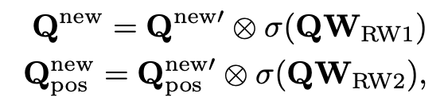

# [OD] SAM-DETR: Accelerating DETR Convergence via Semantic-Aligned Matching

- paper: https://arxiv.org/pdf/2203.06883.pdf
- github: https://github.com/ZhangGongjie/SAM-DETR
- CVPR 2022 accepted (인용수: 74회, '24-03-30 기준)
- downstream task: OD

# 1. Motivation

- (Naive) DETR은 decoder의 cross-attention시 object query와 features (key, value)간의 align이 안된 상태로 학습하기에 학습 수렴 속도가 매우 느림

- Object query와 image features간의 semantic을 alignment하게되면 학습 수렴 속도가 향상되지 않을까?

  $\to$ Semantic alignment하는 방식을 제안해보자!

  

# 2. Contribution

- "Matching and feature distillation"해주는 Cross Attention에 object query와 encoded image features간의 semantic alignment를 수행하여 둘 간의 matching을 용이하게 해주는 SAM-DETR을 제안함

  

- Salient point를 explicit하게 찾아 cross-attention에 입력으로 넣어주는 방식을 제안하여 성능 향상을 보임

- original DETR에 비해 학습 수렴속도가 빨라짐을 보임

- DETR계열에 쉽게 Plug-and-play할 수 있는 모듈임

# 3. SAM-DETR

- preliminaries

  - Cross Attention

    

- overview

  

  - Semantic Aligner Module 

    

    - 목적: object query와 encoded feature간의 projection된 embedding vector가 같은 space에 위치하도록 alignment 수행

    - 입력

      - Object query
      - Encoded features : $HW \times D \to H \times W \times D$로 reshape된 encoded feature
      - Reference box : positional embedding으로, encoded feature 영역 중 RoIAlign하고자 하는 초기 영역 

    - RoIAlign

      - Reference box 영역에 대해 **F**$_R \in \mathbb{R}^{N \times 7 \times 7 \times d}$영역을 추출함

    - Resampling

      - Reference box 영역에 대해 RoIAlign을 수행한 영역 **F**$_R$에서 salience point를 multi-head (M)개수만큼 추출하여 object query를 생성

      - Conv + MLP로 구현

        

        - **R**$_{SP}$: Salient Point (M개)

        - sampling point를 reference bbox내부로 한정하는게 성능향상에 도움이 됨 (실험적)

          

          

    - 출력

      - New object query + New positional embedding 추출

      - 1st decoder layer외에는 이전 decoder layer의 query값을 이용하는 것이 성능 향상에 도움이 될 것이라 생각되어 아래처럼 변경

        

        - **W**$_{RW1}$, **W**$_{RW2}$: linear projection layers
        - $\sigma$: sigmoid function

  - visualization

    

    

# 4. Experiments

- MS COCO

  

- Ablation

  
