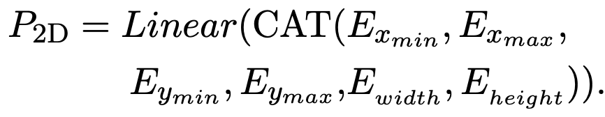

# [SDU] LiLT: A Simple yet Effective Language-Independent Layout Transformer for Structured Document Understanding

- paper: https://arxiv.org/pdf/2202.13669.pdf
- github: https://github.com/jpWang/LiLT
- ACL 2022 accpeted (인용수: 97회, '24-04-06 기준)
- downstream task: language-specific, cross-lingual zero-shot transfer, multi-task fine-tuning

# 1. Motivation

- Structured Document Understanding 분야의 발전으로 intellectual document processing이 가능해지고 있다.

- 하지만, 기존 연구들은 특정 언어(영어)에 국한되어 응용이 가능한 한계를 지닌다. $\to$ 해당 언어의 structured document data가 부족한 경우 특히 응용이 어려움 

- Layout은 변경하지 않고 번역만 수행했을 경우, 잘 되는 것을 목격함.

  

- 언어와 (Document)의 Layout을 disentangle하여 pretraining 시에 특정 언어로 학습하더라도, 학습된 Layout 정보를 fine-tuning시에 응용할 수 있지 않을까?

# 2. Contribution

- Multi-lingual / mono-lingual structured document understanding (SDU)에 적용 가능한 Language Independet한 Layout Transformer (LiLT)을 제안함
- 세 가지 모듈 및 학습기법을 제안함
  - BiACM (Bi-directional Attention Compensation Module) : Language & layout간에 encoding 과정에서 cross-modality interaction 수행
  - KPL (Key Point Location) : Key-point Layout을 분류하는 pre-training task를 적용하여 SDU task의 성능향상에 기여
  - CAI (Cross-modal Alignment Indentification) : OCR로 예측한 text embedding과 layout bbox embedding 정보간에 align이 되었는지 이진분류로 예측하는 pre-training task $\to$ SDU task의 성능향상에 기여
  - Asyncronous training: pre-training과 fine-tuning 수행할 때 Off-the-shelf text model이 같아야 한다는 제약을 없애고자, text embedding은 detach에서 학습을 배제하고, layout embedding만 Optimization을 수행

# 3. LiLT

- overall digarm : Dual transformer 구조

  - Text Transformer : RoBERTa/XLM-R/InfoXLM..
  - Layout Transformer : Same as Text Transformer except hidden & intermediate size.

  

- Input : Off-the-shelf OCR을 사용하여 text & layout embedding을 추출 (https://www.textin.com)

  - text embedding

    $E_T \in \mathbb{R}^{N \times d_T}$: $LN(E_{token}+P_{1D})$

    - LN: Layer Norm.
    - P: 1-dim positional embedding
    - $E_{token}$: BERT-style word embedding (tokenizer)
    - $d_T$: # of text feature dimension

  - layout embedding

    $E_L \in \mathbb{R}^{N \times d_L}$: $LN(P_{2D}+P_{1D})$

    - Text sequence $S_T$와 동일한 크기의 2-dim positional embedding $P_{2D}$를 생성

      

      - Bbox = $\(x_{min}, y_{min}, x_{max}, y_{max}, width, height\)$

        - [0, 1000]로 normalize & discretize 수행
        - [CLS], [SEP], [PAD] = [0,0,0,0,0,0], [1000,1000,1000,1000,0,0], [0,0,0,0,0,0]
        - text string이 존재하는 영역의 좌표값을 사용

         

- BIACM : text와 layout간의 cross-modality interaction을 수행하는 역할

  - 각 modality에 대해 independent하게 encoding하는 과정에서 서로 다른 modality간의 attention complementation mechanism을 추가해야 model이 이해할 수 있음

    

    - $\tilde{\alpha}_{ij}^T$: BIACM으로 modified된 text attention
    - $\tilde{\alpha}_{ij}^L$: BIACM으로 modified된 Layout attention
      - 실험적으로 Layout BIACM으로 attention을 구할 때, text attetion에 대해 detach하여 textual stream이 pretraining시 영향을 받지 않게 하는것이 좋았음

    

- Pre-training task

  - MVLM (Masked Visual-Language Modeling) : Language-side만 학습하며, CE loss 사용
    - 15% masking
      - 80%는 [MASK]로
      - 10%는 전체 vocabulary에서 random selection
      - 10%는 그대로
  - Key Point Location : Layout information을 더 잘 이해하도록 훈련 (CE Loss 사용)
    - key point = (top-left, bottom-right, center point)
    - 구현: 49개의 region으로 세분화하여, bbox정보를 masking한 후, 해당하는 text 정보만 가지고 어느 영역에 위치할지 분류하는 문제
      - 15% masking
        - 80%는 (0,0,0,0,0,0)로 변경
        - 10%는 batch 내 random box로 변경
        - 10%는 그대로
    - 목적: key point에 대한 이해도록 향상시킬 수 있음
    - 방식: CE loss. 
      - OCR의 pseudo label 결과가 부정확할 수 있으므로, direct regression에 비해 moderately punish할 수 있게됨

  - Cross Modal Alignment Identification : encoded layout-bbox token들이 같은 pair에서 왔는지 예측하도록 훈련
    - 구현: 별도의 head를 두어 위 task를 예측
    - 목적: 다른 modality간 alignment 수행
    - 방식: 이진분류 (BCE)

- Optimization
  - 일반적인 unified learning rate 방식보다 layout flow가 optimize가 더 되고, text flow는 덜되도록 학습하는게 성능이 좋음
  - Detach하는 것보다 learning rate를 줄여주는게 효과적임

# 4. Experiments

- dataset: Pretrain 용으로 English SDU dataset활용
  - IIT-CDIP(Illinois Institute of Technology Complex Document Information Processing) Test Collections 1.0
    - 6M document + 11M scanned document

- Model
  - pre-trained English : $RoBERTA_{BASE}$
  -  Multi-lingual : $InfoXLM_{BASE}$

- Ablation Study : 빠른 구현을 위해 전체 데이터셋 중 2M을 random select하여 구현

  

  - (a) 8개의 언어의 평균 F1 score
    - 1vs3: BiACM이 monolingual로만 pretraining한 결과를 multiLingual에서 성능 향상을 볼 수 있게 하는 요소임 증명
    - 3vs4: pretraining시 text flow에 loss를 detach하는게 성능에 좋음
    - 3vs5: fintuning시 text flow에 loss를 detach하는 것보다, 조금은 학습시키는게 좋음
    - 2vs3: co-attention은 key, value도 attetnion값을 조절하는데, text flow를 깨뜨림
  - (b) KAL & CAI의 유효성 검증
    - 둘 다 개별적으로 적용 시 성능 향상 보임
    - 둘 다 적용시 제일 좋은 성능 보임
  - (c) text flow의 best slow-down ratio 찾기
    - 1e-3배 learning rate가 가장 좋음

- (Monolingual) Language specific Finetuning (vs. SOTA)

  - LiLT가 monolingual to multiLingual transform에 최적화되었음에도, mono-lingual fine-tuning에서도 좋은 성능을 보임

  |  |  |
  | -------------------------------------------------- | -------------------------------------------------- |
  |  |  |

  

- Zero-shot transfer learning (vs. SOTA)

  - LiLT는 non-English document를 (pre-training 포함) 단 한번도 보지 않고, test domain에서 정확히 예측 수행함
  - 이는 English $\to$ Other language transfer가 Layout Net의 도움으로 큰 성능 향상을 보인 것임

  

- Multi-task fine-tuning (vs. SOTA)

  - 8개의 language와 병렬적으로 학습
  - monolingual fine-tuning보다 좋은 성능을 보임 $\to$ layout을 공통으로 사용함으로써 multilingual structural document 이해해 도움

  

