# [SDU] ViBERTgrid: A Jointly Trained Multi-Modal 2D Document Representation for Key Information Extraction from Documents

- paper: https://arxiv.org/pdf/2105.11672.pdf

- github: https://github.com/ZeningLin/ViBERTgrid-PyTorch

- ICDAR 2021 accpeted (인용수: 50회, '24-04-08 기준)

- downstream task: KIE (Key Information Extraction)

  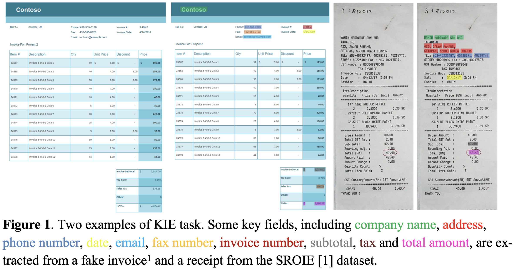

# 1. Motivation

- Document 내의 text 정보와 Layout 정보를 SOTA od, seg와 함께 사용하는 BertGrid방식은 SOTA sequence 모델이나 graph기반 모델보다 성능이 안좋음 $\to$ grid-based 성능을 향상시킬 수는 없을까?

  - Sequence-based: Document내의 text를 1-dim text sequence로 serialize후 NLP 모델로 해당 sequence를 tagging

    $\to$ 복잡한 layout을 가진 document를 serialize하는 것이 non-trivial하고, 초기 학습을 위해 많인 계산량과 dataset이 요구됨

  - Graph-based: Document를 graph로 모델링 하고, text를 node로 표현하여 GNN, MHSA를 통해 enhanced된 feature를 가지고 text를 예측

  - Grid-based: Document를 2-dim grid로 모델링하여 instance segmentation 모델을 통해 field value를 추출함

    $\to$ Sequence-based & Graph-based에 비해 두 가지 이유로 성능이 떨어짐

    1. BERT와 같은 SOTA word-embedding을 미사용
    2. 사용하더라도 (BERTgrid) BERT 모델이 fixed되어 학습되지 않아 최적화과정이 결여

# 2. Contribution

- SOTA word embedding을 grid-based Document Understanding에 적용한 ViBERTgrid을 제안함
- sequence based, graph based 모델에 비해 열등했던 grid based model의 성능을 향상시킴 

# 3. ViBERTGrid

- overview

  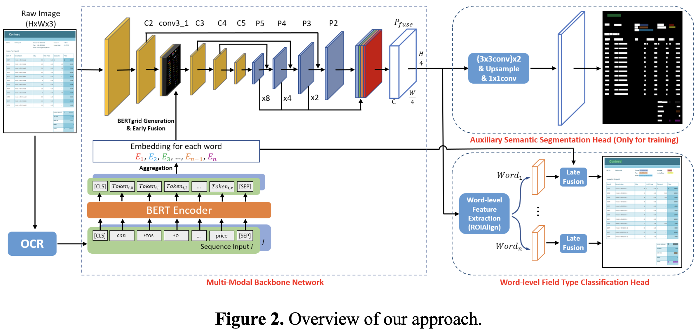

  - backbone : Res-18-FPN
    - visual & textual feature fusion ($P_{fuse}$)
  - (Auxiliary) Semantic segmentation head
    - pixel-wise field type classification
  - world-level field type classification
    - word-level field type classification

- BERTgrid generation $\to$ backbone을 통해 ViBERTgrid multi-modal feature map (Layout & text) 을 추출

  - Input : OCR engine에서 추출한 text & layout (bbox)

    - 추출된 정보는 좌상단 ~ 우하단 순서로 정렬

      *D*=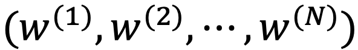

      - 각 word는 quadratic bbox임 

        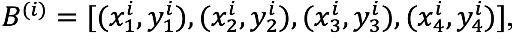

      - 추출된 각각의 word를 *M* 개의 sub-word sequence로 tokenize

        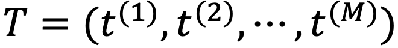

        - M= 512라면 510개 + 2개 ([CLS], [SEQ])로 tokenize
        - 1개의 word가 > M이라면 여러개의 sub-word token으로 slice

      - BERT encoder를 통과시켜 평균값을 취해 word에 대한 encoded token을 계산

        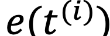

        

        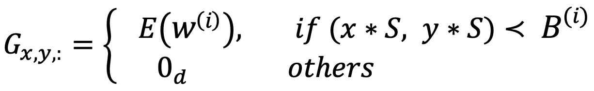

        $G \in \mathbb{R}^{(H/S) \times (W/S) \times d}$

- Word-level field type classification head

  - BERT의 word embedding과 early-fused feature간에 late fusion을 수행

  - 2개의 classifier로 구성

    - 1st classifier : 해당 word가 pre-defined field type인지 여부 (binary classfication)

      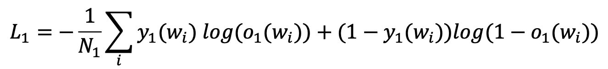

      - $o_1(w_i)$: i번째 word의 pre-defined field type일 가능성
      - $y_1(w_i)$: pre-defined field type GT
      - $N_1$: Document 내 전체 word의 수

    - 2nd classifier: 해당 word가 pre-defined filed type일 경우, 어느 field type인지 

      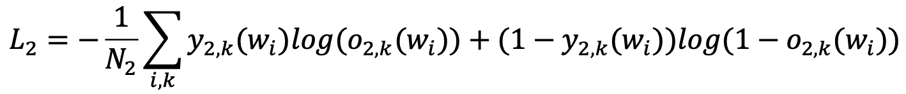

      - $o_{2,k}(w_i)$: i번째 word가 k번째 pre-defined field type일 가능성
      - $y_{2,k}(w_i)$: i번째 word의 k번째 pre-defined field type GT
      - $N_2$: Batch 수

  - Total loss

    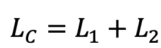

    

- Auxiliary segmentation classification head

  - auxiliary segmentation head를 붙이면 학습이 더 빠르고, 안정적으로 됨

  - word-level field type classifier와 마찬가지로 두 가지 pixel-classifier로 구성

    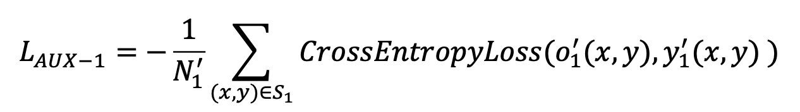

    - 1st classifier: 해당 pixel을 아래 3 가지 타입으로 분류

      - word box에 해당하지 않는 pixel
      - pre-defined field에 속한 word의 pixel
      - pre-defined field에 속하지 않은 word의 pixel

    - 2nd classifier : 1st classifer의 pre-defined field에 속한 word의 pixel일 경우, c개의 pre-defined field type에 대해 예측

      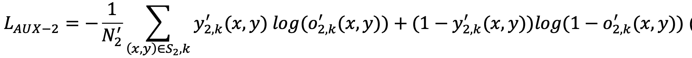

  - Total Loss

    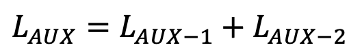

- Joint Training Strategy

  - BERT와 CNN은 서로 다른 optimizer, hyperparameter를 통해 학습하므로 joint training이 쉽지 않음

  - 서로 다른 optimizer를 적용하여 최적의 성능에 도달함

    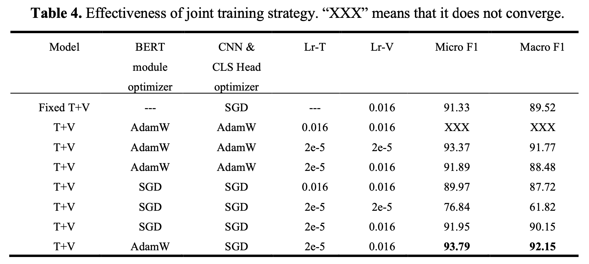

  - Total Loss

    

# 4. Experiments

- Dataset

  - SROIE : Scanned Receipts OCR and Information Extraction

    - 626 / 347 (train / test) dataset으로 구성

    

  - INVOICE 

    - real-world invoice dataset : 14개의 field type을 예측

      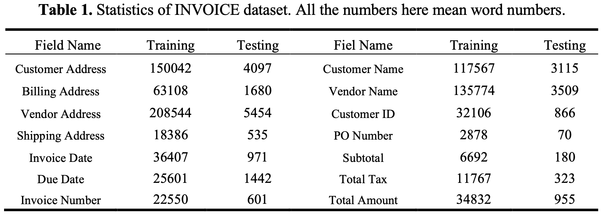

    - 24,175 / 643 (train / test) dataset으로 구성

- INVOICE

  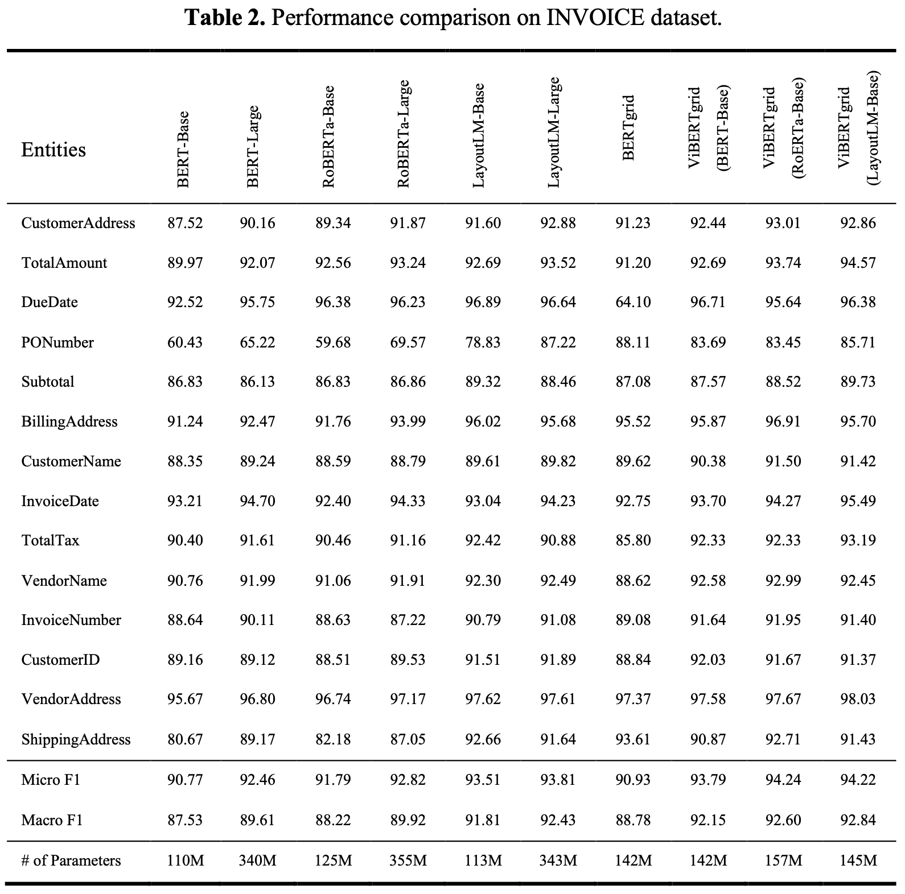

- SORIE

  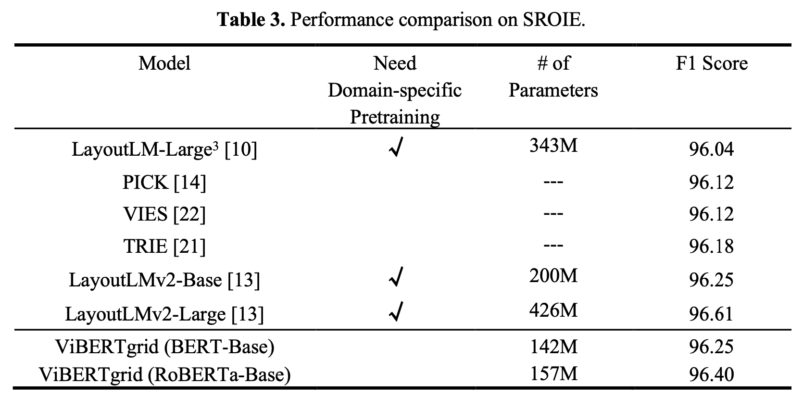

- Ablation

  - Multi-modal feature 사용 여부

    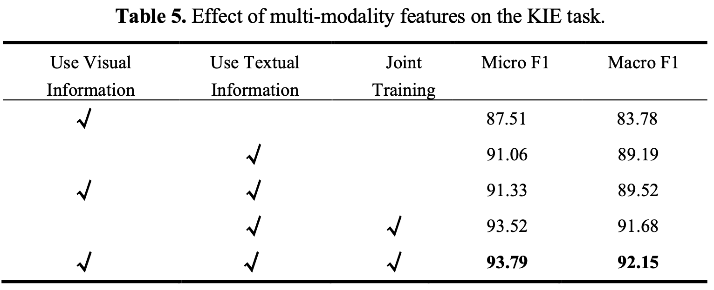

  - CNN module의 유효성

    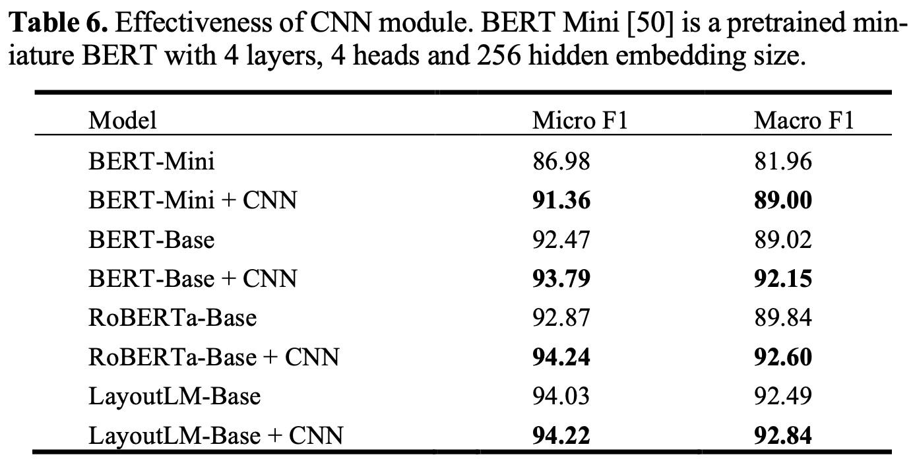

  - Joint Training

    

  - Early fusion stage

    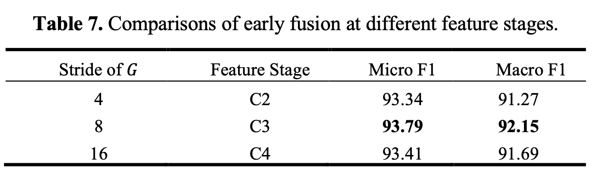

  - Early fusion & Late fusion의 유효성

    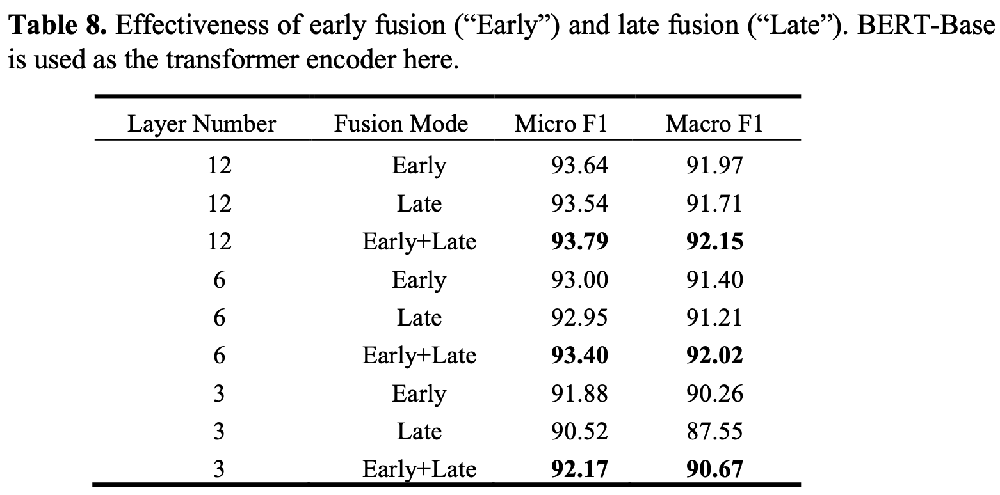
