# [CTTA][CLS][SS] VIDA: HOMEOSTATIC VISUAL DOMAIN ADAPTER FOR CONTINUAL TEST TIME ADAPTATION

- paper: https://arxiv.org/pdf/2306.04344.pdf
- github: https://github.com/Yangsenqiao/vida
- ICLR 2024 accpeted (인용수: 9회, '24-04-09 기준)
- downstream task: CTTA for classification & semantic segmentation

# 1. Motivation

- target domain이 dynamic하게 변화하는 환경에서 pseudo-label 기반의 학습은 **error accumulation** & **catastrophic forgetting**이 발생

- Middle layer feature의 dimension마다 위 문제를 해결하는데 효과적임을 발견함

  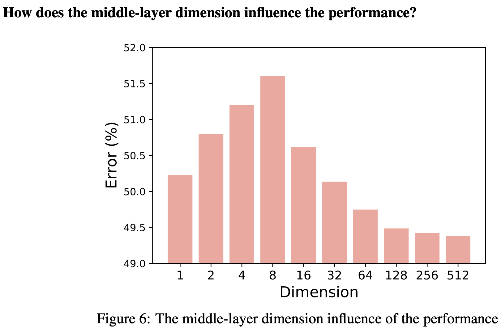

  - Low-dimension일 경우, dimension이 낮아질수록 error가 줄어듦  $\to$ domain shared feature를 잘 추출하기 때문
  - High-dimension일 경우, dimension이 높아질수록 error가 줄어듦 $\to$ domain specific feature를 잘 추출하기 때문

  $\to$ pretrained model에 low-rank / high-rank adpater를 붙여서 CTTA의 한계를 극복해보면 어떨까?

# 2. Contribution

- 다른 rank의 adapter의 representation 특성을 분석하고, ViDA (Visual Domain Adapter)를 제안함

  - Low-rank adapter: task-related (domain-invariant) feature를 학습

  - High-rank adapter: domain-specific feature를 학습

    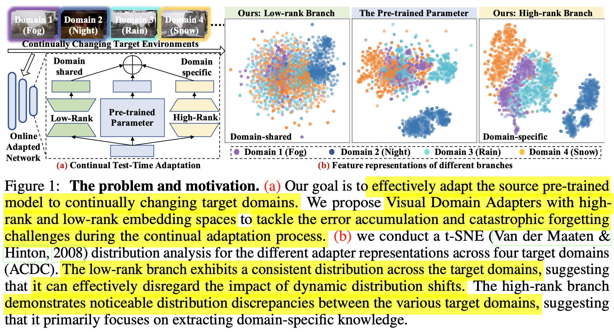

- Low-rank와 High-rank adapter에서 학습한 knowledge를 dynamically merge하는 Homeostatic Knowledge Allotment (HKA)를 제안함

- CTTA classification & semantic segmentation에서 SOTA

- Foundation Model의 **새로운 transfer paradigm**을 제안하였음.

  - +**Domain Generalization**에서도 좋은 성능을 보임

# 3. VIDA

- Task: TTA와 마찬가지로 source data는 접근하지 못하는 상황에서 dynamic target domain data를 한 번만 볼 수 있음

- Purpose: seen domains에서 좋은 성능을 보임

- overview

  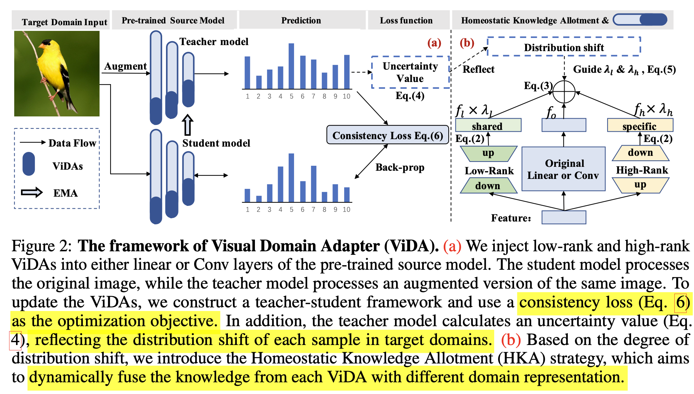

## 3.1 Low-rank Adapter

- low-rank adapter는 다른 target domain에서도 상대적으로 consistent한 distribution을 보임
- 이는 dynamic distribution shift를 묵살하고 domain-invariant한 특성을 학습하는데 집중하는 역할을 하게됨
- 이는 domain shift를 정량적으로 분석하는 H-divergence를 사용해서 입증할 수 있음

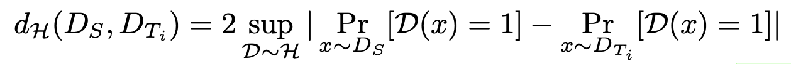

- $d_H$: 두 도메인간의 gap을 나타냄. 높을수록 gap이 크다는 의미

- Johnson-Shannon divergence로 근사할 수 있음

- $d_H$값이 작다는 것은 domain shfit가 발생함에도 상대적으로 consistent한 feature가 생성됨을 의미

  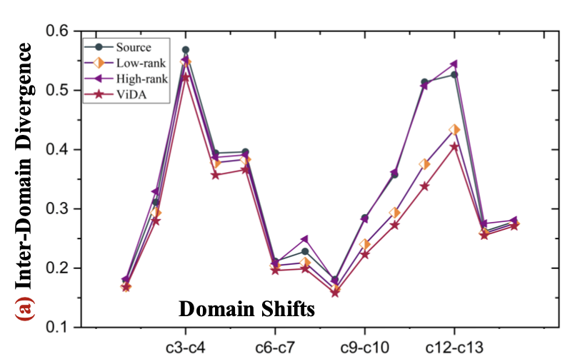

  - Low-rank adapter가 original & high-rank adapter에 비해 domain shift에 대해 consistent한 값을 보이고 있음

- CAM을 비교해보면 Low-rank adpater가 original & high-rank adapter에 비해 전경에 더 집중하는 경향이 있음

- 반면, High-rank adapter는 domain specific한 배경에 집중하는 경향을 보임

  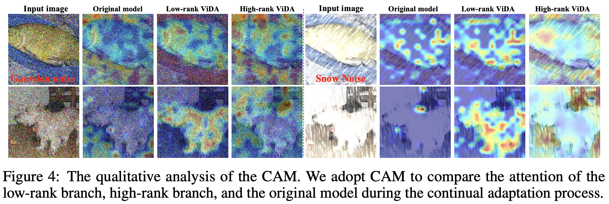

## 3.2 High-rank Adapter

- high-rank adapter는 domain specific한 특성을 학습함 (Fig.4 참고)

- domain별 Intra-class간 분포를 살펴보면, class간 gap이 적고, coonsistent한 분포를 나타냄 $\to$ current domain에 adapt하는데 적합함하고, error accumulation을 완화함

  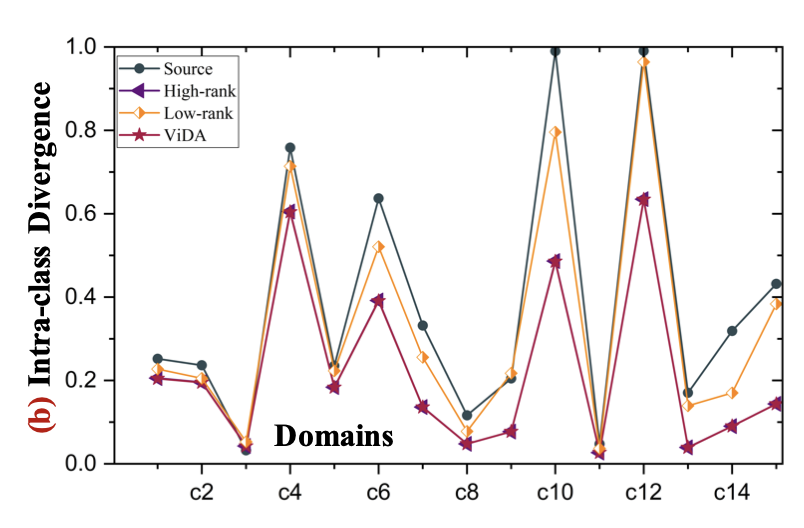

  - Intra class divergence *E*

    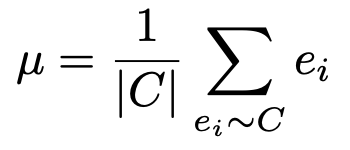

    - $e_i$: i번째 sample의 class C에 대한 feature output

    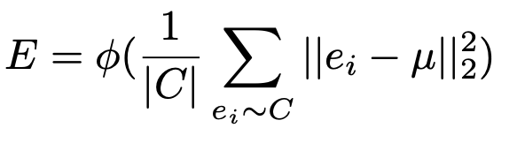

## 3.3 ViDA

- Original branch에 Low-rank adapter + High-rank adapter로 구성

  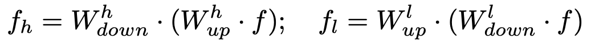

  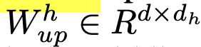

  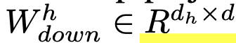

  - $d_h > d$

  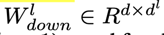

  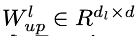

  - $d_l << d$

- Final output

  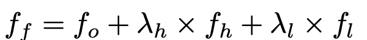

  - $\lambda_h, \lambda_l$: HKA algorithm으로 결정

## 3.4 Homeostatic Knowledge Allotment

- teacher의 uncertainty를 기준으로 low-rank & high-rank adapter의 weight를 dynamic하게 부여함

- CTTA환경에서 uncertainty로 confidence score는 너무 fluctuation이 심해서 미사용

- sample별로 uncertainty를 아래와 같이 계산

  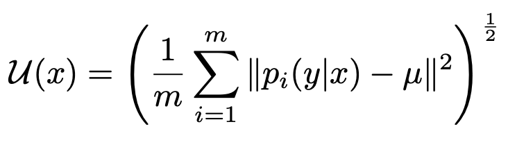

  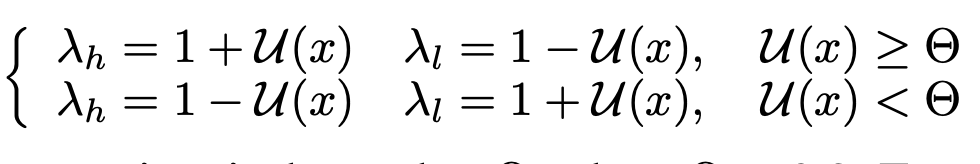

  - 즉 uncertainty가 높을 때는 high-rank adapter 비중을 높이고 ()$\theta=0.2$)
  - uncertainty가 낮을 때는 low-rank adapter 비중을 높임

- Optimization Objective

  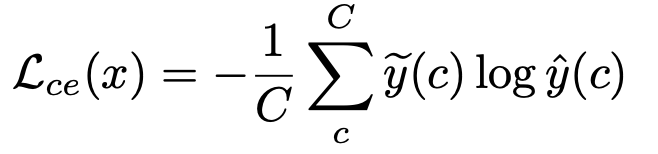

  - $\tilde{y}$: teacher output
  - $\hat{y}$: student output

- teacher 는 EMA로 업데이트

  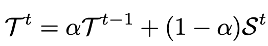

# 4. Experiments

- classification

  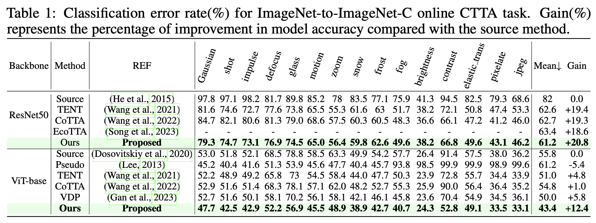

  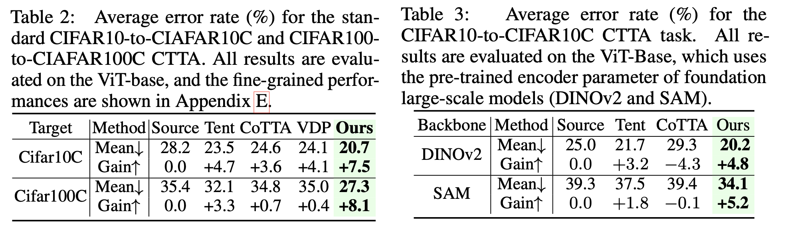

- semantic segmentation

  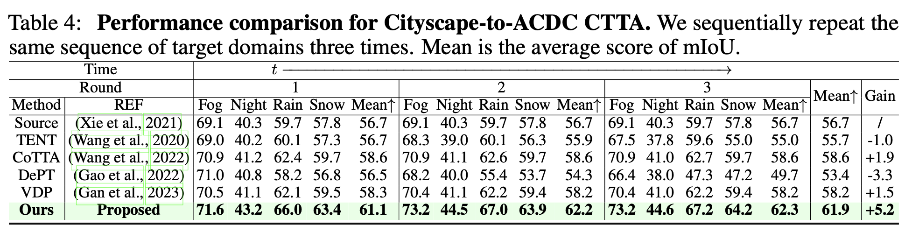

- Domain Generalization

  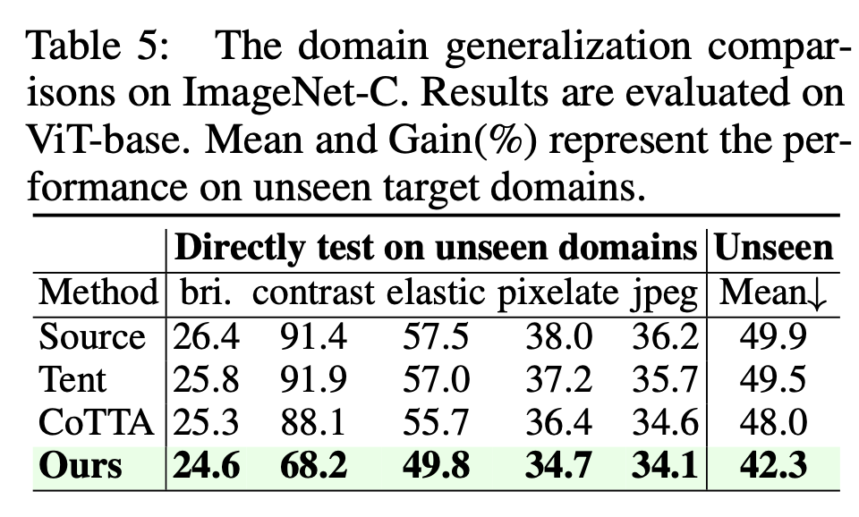

- ablation study

  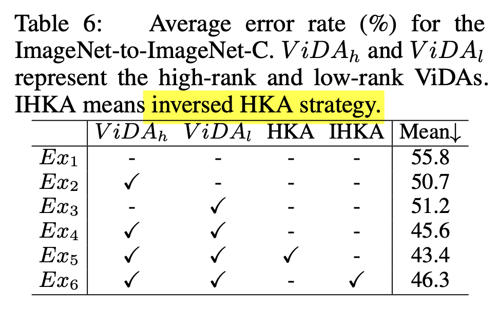
