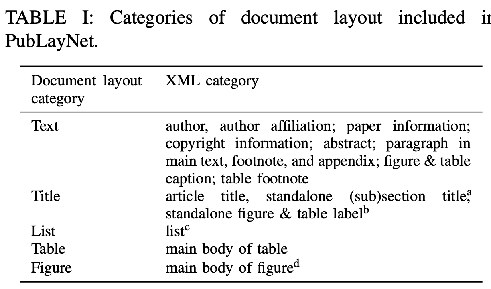

# [SDU] UDoP: Unifying Vision, Text, and Layout for Universal Document Processing

- paper: https://arxiv.org/pdf/2212.02623.pdf
- github: https://github.com/microsoft/i-Code/tree/main/i-Code-Doc
- CVPR 2023 accepted (인용수: 45회, '24-04-10 기준)
- downstream task: Semantic Entity Recognition, Question & Answering, Information Extraction, Table QA/NLI 

# 1. Motivation

- Doucment Understanding은 classic vision-language와 다른 특징이 존재한다. 즉, 2D spatial layout이 존재한다.
- Document에 주어진 3가지 modality, 즉 image, text, 그리고 layout간의 강한 correlation을 잘 활용하여 하나로 통하는 model을 만들 수 있지 않을까?
  - 기존 연구들은 image를 배제하고 text와 layout (2D positional embedding) 만 사용하는데, image 정보를 활용할 수 있지 않을까?
- Document Understanding의 또다른 특징인 다양한 domain이 존재한다는 것이다. 이처럼 diverse한 text, image, layout을 효과적이고 효율적으로 학습할 수 있는 방법은 없을까?
  - text vocabulary에 추가적으로 layout (discretized bounding box)를 추가해보자!

# 2. Contribution

- Vision, text, 그리고 layout을 통합한 document AI UDoP (Universal Document Processing)을 제안함

- 모든 document (pretraining) task를 sequence-to-sequence generation framework로 통합함

- Supervised dataset과 더불어 새로운 self-supervised objective를 활용하여 unlabel data를 효과적으로 활용함

- UDoP는 최초로 3가지 modality를 한번에 처리하는 VLT(Vision Layout Text) Transformer 를 이용함

  

- UDoP는 8가지 task에서 SOTA를 내는 Document AI의 Foundation model임

# 3. UDoP

- Overall Diagram

  

  - Given

    

    - Image *v*

      

    - text tokens $\{s_i}$ : OCR이 생성

    - bounding boxes $\{x_i^1, y_i^1, x_i^2, y_i^2\}$ : OCR이 생성

    - *M*: Document내에 존재하는 (ocr이 예측한) word의 수

## 3.1 A Unifired Visual, Text, and Layout Encoder

- Document AI는 document 안에 text가 존재하므로, text와 해당 text가 존재하는 image region이 1:1 매칭이 가능하다

- image patch

  

  - *P*: Patch의 갯수
  - D: embedding dimension

- word token

  

- layout-induced vision-text embedding

  - 해당 이미지 영역의 patch를 만들어 text embedding과 함께 추가로 사용한다.

  

- 추가된 입력을 encoding하는 modality-agnostic encoder를 도입한다.

  

  - image만 존재하고, text가 존재하지 않는 영역은, image patch 그대로 활용한다.

    

- T5와 마찬가지로 text의 token position으로 2D relative attention bias을 준다.

## 3.2 Vision-Text-Layout Decoder

- VTL Decoder의 목적은 text, layout, 그리고 image를 모두 생성하는 것이다.

  - Text-Layout Decoder: sequence-to-sequence manner로 text와 layout을 생성
    - Layout의 경우, vocabulary화 하기위해 해당 normalized bbox coordinate를 vocabulary size로 descritize를 수행함
      - (0.1, 0.2, 0.5, 0.6), vocabulary-size=500 $\to$ <50><100><250><300>
  - Vision Decoder: MAE의 decoder를 사용

  $\to$ 두 decoder 모두 VTL encoder와 cross-attention을 수행

## 3.3 Unified Generated Pretraining

- 라벨 스펙 등이 다양한 Document AI의 학습 목적을 통합하기 위해 universal generative task format with task prompt를 제안함

   

### Self-supervised pretraining task

- OCR engine을 가동해 document image, text, 그리고 해당 bbox (layout)을 가지고 있음

1. Joint Text-layout Reconstruction

   - 일정 ratio로 text를 masking하고, masking된 text와 해당 bbox 영역을 예측하는 task $\to$ masking ratio 15% 사용

   

   - text_layout_0, text_layout_1 : text-layout sentinel tokens
   - <100><350><118><372>: "Ship Date" text가 위치한 layout (bbox)

2. Layout Modeling

   - Layout만 예측하는 task $\to$ 높은 masking ratio 사용 (75%)

     

3. Visual Text Recognition

   - 주어진 location의 text를 예측하는 업무 수행 $\to$ masking ratio 50% 사용

     

4. Masked Image Reconstruction with Text and Layout

   - Masking된 image patch를 복원하는 task

   - OCR engine이 출력한 text 정보와 unified encoder 중 unmasked image patch간의 cross-attention을 수행

     

## 3.4 Supervised Pretraining Task

- Label spec이 다양한 open dataset을 활용하여 fine-grained model supervision 역할 수행

1. Classification

   - RVL-CDIP dataset을 사용

   - Document의 카테코기를 분류하는 task (class : 16개)

     

2. Layout Analysis

   - PubLayNet dataset을 사용

   - Entity의 bbox를 추출하는 task

     

3. Information Extraction

   - Target entity의 label과 bbox를 예측
   - DocBank, Klesiter Charity, PWC, DeepForm dataset을 사용

4. Question Answering

   - Question에 대한 Answer를 예측
   - WebSRC, VisualSRC, DocVQA, Infographics VQA, WTQ(Wiki Table Quesitons) dataset 사용

5. Document NLI (Natural Language Inference)

   - 두 text간의 Entailment(수반) 여부를 이진분류하는 task
   - TabFact dataset 활용

# 4. Experiments

- Text tokenizer : T5 tokenizer 활용

- Curriculum learning

  - image & layout reconstruction을 위해 high-resolution image 사용이 불가피
  - 초기부터 high-resolution으로 학습하면 시간이 너무 오래걸림
    - 256 $\to$ 512 $\to$ 1,024 resolution으로 점차적으로 해상도를 높여가며 학습

- DUE-Benchmark (Document Understanding Evaluation benchmark)

  

- FUNSD, CORD, RVL-CDIP의 Semantic Entity Recognition

  

- Document Generation & Editing

  - Image reconstruction의 cross-attention에 사용되는 text prompt를 edit하여 이미지를 생성

    - Reconstruction Result

      

    - Editing Result

      

      

- Ablation

  - Pretraining loss & dataset 분석

    

- Dual vs Single tower encoder

  

- TiLT auxiliary training 적용 전/후 

  - auxiliary training : 매우 큰 QA dataset (SQuAD)에 pretraining 후 DocVQA, Inforgraphics VQA에 finetuining

  

- Vision modality에 따른 분석

  - visually rich (Infographics VQA)한 문서에 visual modality가 더 큰 성능 향상에 기여

  
