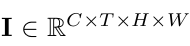
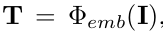
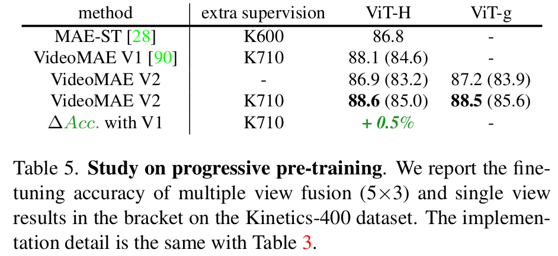

# [AR] VideoMAE V2: Scaling Video Masked Autoencoders with Dual Masking

- paper: https://arxiv.org/pdf/2303.16727.pdf
- github: https://github.com/OpenGVLab/VideoMAEv2
- CVPR 2023 accpeted (인용수: 135회, '24-04-12 기준)
- downstream task: video action classification, spatial action detection, temporal action detection

# 1. Motivation

- 10억 (billion) parameter의 Video foundation model을 학습하는 것은 challenging 하다.

- Efficient 한 video pretraining (VideoMAE)에서는 encoder는 high ratio로 masking하지만, decoder는 여전히 계산량이 많이든다.

  $\to$이를 해결할 수 있지 않을까?

# 2. Contribution

- **dual masking**: VideoMAE의 decoder 부분에서도 video의 redunduncy를 활용해서 masking을 통한 computational cost를 줄임으로써 성능하락 없이 3배의 학습 속도를 향상시키고, batch size를 키우며, model & data scalability를 향상시켜주는 VideoMAEv2를 제안
- **dataset mixing**: billion-paramter의 모델을 학습하기 위한 Video data가 부족한 상황에서, 심플하게 multi-source video data를 mixing하는 것이 효율적임을 밝힘
- **progressive learning**: Image pretraining에서 영감을 얻어, large-scale pretraining dataset과 small-scale finetuning dataset 사이에 multiple labeled dataset으로 intermediate dataset으로 post-pretraining을 거치는 것이 효율적임을 보임

# 3. VideoMAEv2

- preliminary : videoMAE

  - Input: video frames

    

  - autoencoder: ($\Phi_{enc}, \Phi_{dec}$)

  - Cube embedding: $\Phi_{emb}$

    - Token embedding: 
      - token added with positional embedding

  - joint space-time attention

    

    - **T**$^u$: unmasked tokens

      $\to$ model & data를 scale-up했을 때, computation & memory consumption이 bottleneck이 됨

  - reconstructed image

    

  - Loss

    

  

- overall diagram

  

  - Dual masking

    

    - $\mathbb{M}_e$: **tube masking**으로 VideoMAE와 동일하게 high-ratio masking

      

      - tube masking: information leakage을 극복하기 위한 masking

    - $\mathbb{M}_d$: **running cell masking**으로 computation 감소를 위해 information leakage를 만들어 최소한의 정보만 가지고 information complement하는게 목적

      

      - decoder의 visible 영역만 reconstruction 수행

    - Decoder input

      

      - **Z**: encoder output
      - **M**$_i$: encoder의 안보이는 영역에서 masking된 영역

    - Loss

      - Encoder, Decoder 모두 visible 영역에 대해서만 supervision 수행

        

- Scaling

  - Model : ViT-g
    - 10억개 이상의 parameter가 있는 최초의 video-domain large model
  - dataset
    - unlabeled hybrid video dataset (1.35M)
      - General Webs, Youtube, Instagram, Movies, Manual Recodings 등으로 취득
    - labeled hybrid video dataset (0.66M)
      - Kinetics-family dataset (K-710)로 구성

- Progressive Training

  - Direct adaptation보다 post-pretraining step을 통해 gradually fintuning으로 adapt하는게 효과적임
  - Labeled hybrid video dataset을 통해 구현

  

# 4. Experiments 

- ablation

  - Decoder masking type에 따른 분석

    

  - Dual masking의 분석

    

  - Progressive Pretraining 분석

    

  - Hybrid data에 따른 분석

    

- Downstream task 결과

  
