---
title: "Improved prediction of clinical pregnancy using artificial intelligence with enhanced inner cell mass and trophectoderm images"

---

# Improved prediction of clinical pregnancy using artificial intelligence with enhanced inner cell mass and trophectoderm images

- paper: https://www.nature.com/articles/s41598-024-52241-x

- github: x

- Nature 2024 accepted (인용수: 0회, '24-04-14 기준)

- downstrem task: Clinical pregnancy prediction

  blastocyst (배반포) $\to$ embryo (배아) $\to$ fetus (태아)

  | 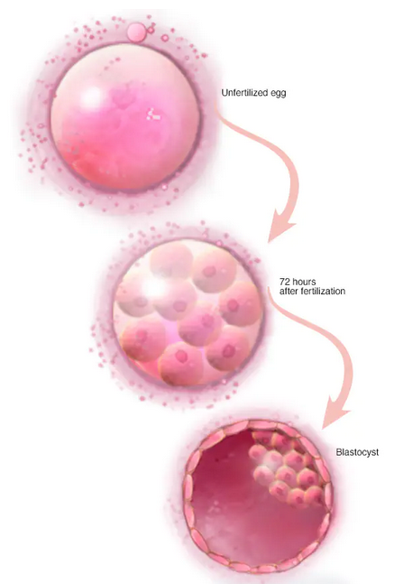 | 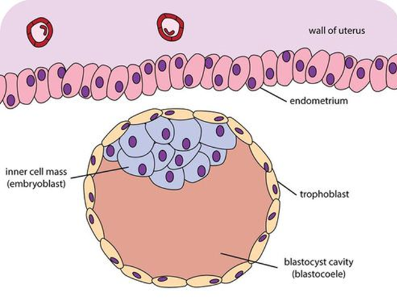 |
  | ----------------------------------------------------- | ----------------------------------------------------- |

  

# 1. Motivation

- 성공적 체외 인공수정을 위해 배아의 질이 매우 중요한 요소임에 따라, 제일 좋은 배아를 선택하는 것이 매우 중요하다.
- 현시점에서 배아 평가를 위해 형태학자론자들이 배아의 형태를 보고 평가하는 "Gardner scale"을 가지고 평가하고 있다.
  - Inner Cell Mass (ICM), TrophEctoderm (TE), blastocysts의 stage등을 기반으로 평가한다.
- 하지만 형태학자론들이 평가하는 방식은 상호간에, 그리고 같은 형태학자들이라 하더라도 다른 결과가 도출되는 문제가 있다.
- 최근 AI를 이용해 폐의 segmentation guidance를 활용하는 것이 전체 이미지를 활용하는 것보다 성능이 좋았다.
- 이 점에 착안하여, ICM, TE를 segmentation한 결과를 원본 이미지와 결합한 enhanced image를 활용해서 임신 가능성을 예측해보자!

# 2. Contributions

- ICM/TE 영역의 segmentation guidance를 활용하여 임신을 예측하는 새로운 방식을 제안함
  - 임신의 정의 : G-sac (gestational sac)의 존재 여부로 결정
- Grad-CAM과 sensitivity를 활용하여 기존 대비 성능의 우위를 보임

# 3. ICM and TE

## 3.1 Methods

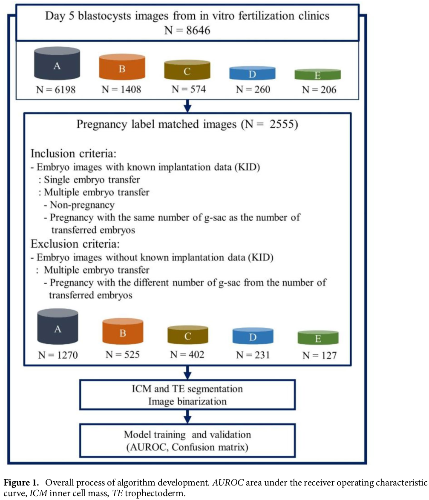

- 2011.06 ~ 2022.05에 7개의 IVF clinics 병원에서 취득한 day-5 8,646장의 배아 이미지를 취득

- 배아 이미지와 임신 결과를 매칭해서 GT label를 생성

  - 4-6주 후 G-sac 생성 여부로 임신 결과 확인

- Filtering

  - G-sac의 갯수가 자궁 이식 전/후로 다른 경우 제외

  - 임신 정보가 없어도 제외

  - 4개의 그룹 (A,B,C,D)로 나누고, 개별 그룹은 최소 200장 이상의 이미지로 구성

    

## 3.2 ICM & TE 이미지의 생성

- 5일차 배반포-배아 이미지를 활용하여, 훈련된 사람이 ICM & TE영역에 대해 annotation을 수행

  - ICM: tightly packed mass of cells within the inner blastocoel cavity
  - TE: spherical layer of outer cells ­surrounding

- annotation quality: 형태학자론자들이 처음 annotation 수행 후, 20년 이상 고연차 디렉터들이 검수를 수행

- Oiginal Embryo (R) + TCM (G) + TE (B)를 채널별 결합하여 3채널 이미지를 생성함

  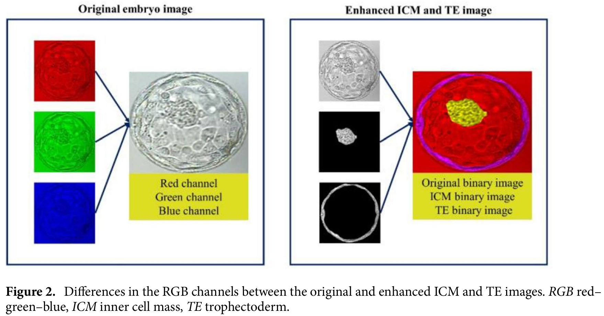

## 3.3 Train 데이터 split & 전처리

- 2,555장의 실험변인이 통제된 이미지를 활용 (80%-train, 20%-test)

- 3-fold cross-validation으로 train-val split

- normalization 및 224x224 resize수행

  - ImageNet pretrain model의 size에 종속

- 아래 augmentation 수행

  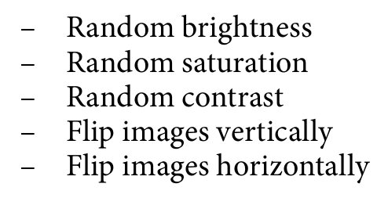

## 3.4 통계적 분석

- positive group (임신에 성공한 그룹), negative group (임신에 실패한 그룹)의 나이 분석 $\to$ t-test로 진행

  - positive : 34.0 세

  - negative : 36.2 세

    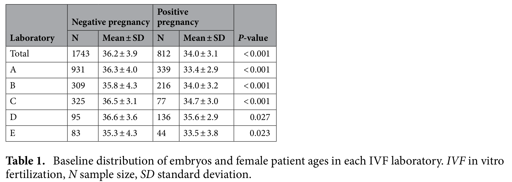

  

## 3.5 모델 개발 및 검증

- ImageNet pretrained weight 활용 $\to$ 224 $\times$ 224 로 resize

- 산모의 age정보를 마지막 FC layer에 concat해서 활용

  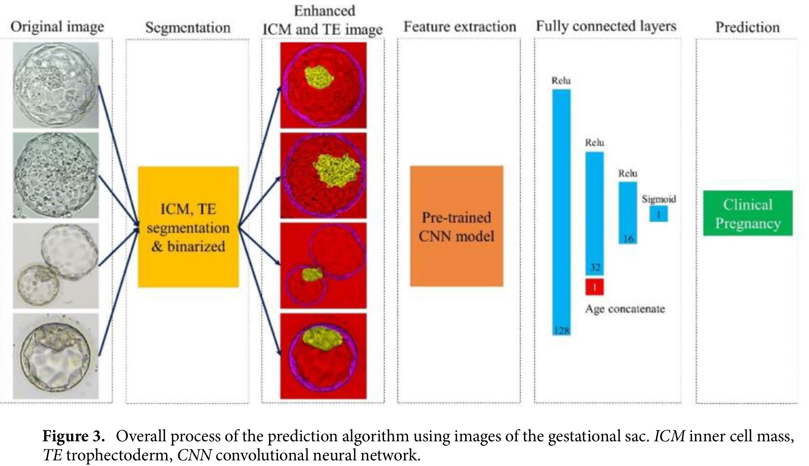

- 검증 metric: AURoC

  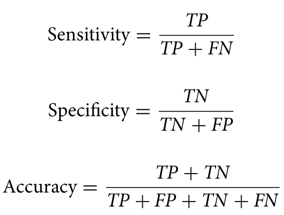

# 4. Experiments

- 원본 Embryo image vs. ICM/TE enhanced image 비교 실험 진행

  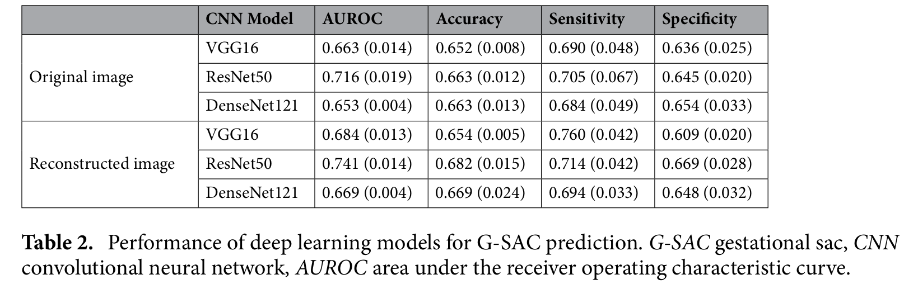

  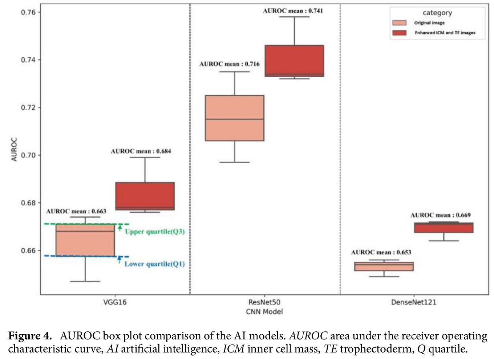

  - 모델은 Res50 > VGG16 > DensNet 순으로 좋았음
  - 제안한 방식이 원본 이미지 사용한 실험보다 좋았음

- 정성적 분석 (Grad-CAM)

  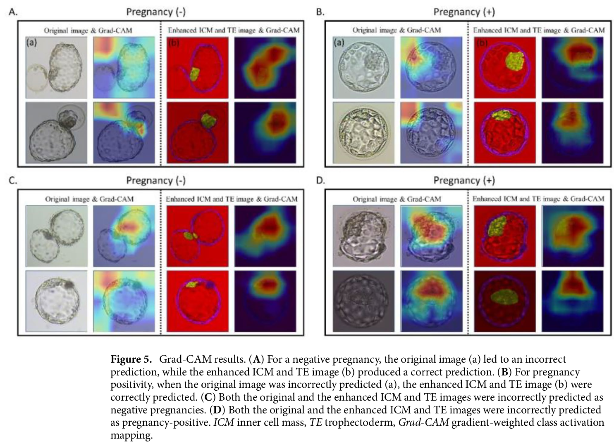

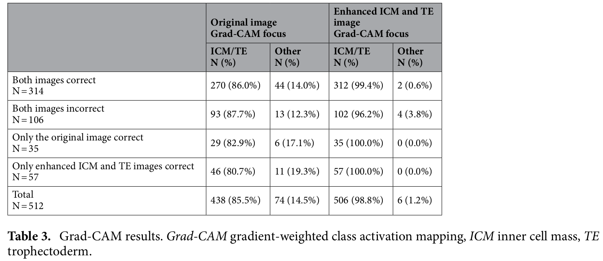

# 5. Discussion

- domain knowledge를 활용한 ICM/TE segmetation guided 임신 예측 성능 향상 결과를 확인
- Grad-CAM분석 결과, 학습된 AI model이 원본 이미지에 비해 ICM/TE 영역을 더 집중 조명하는 것 확인
- isotonic regression으로 prediction score를 calibration했음에도 high ratio (0.7-0.9)의 TP가 오히려 감소함
  - Small sample size가 calibration이 안되는 주요 원인으로 생각됨
- 한계점 
  - 낮은 AUCROC score: 0.68~0.76은 침습적 PGT 기법에 비해 낮은 성능임
    - 비침습적 PGT와 결합하는 방향도 고려 대상
  - 한국인으로 국한된 데이터셋
  - 자동으로 ICM/TE 영역을 segmentation하는 기술 필요

