# [DG][CLS] SPARSE MIXTURE-OF-EXPERTS ARE DOMAIN GENERALIZABLE LEARNERS

- paper: https://arxiv.org/pdf/2206.04046.pdf
- github: x
- ICLR 2023 accepted (인용수: 30회, '24-04-21 기준)
- downstream task: DG for classification

# 1. Motivation

- 기존에 DG 방법들은 loss fucntion 설계에 집중하였음

- 본 논문에서는 convolution 계열에 비해 Transformer계열로 단순히 모델 구조를 변경한 것만으로도 최신 DG보다 좋은 성능을 내는 점을 발견함

  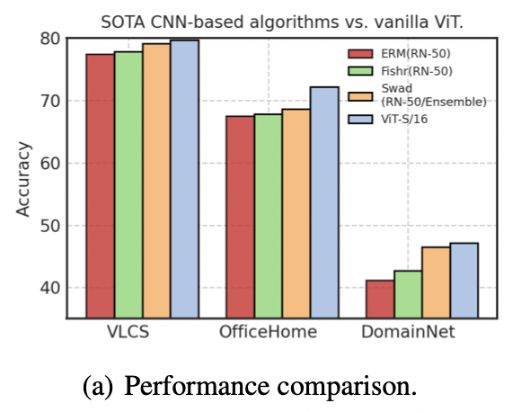

- 모델 architecture가 DG에 적합한 domain invarinant한 특성을 추출할 수 있지 않을까?

# 2. Contribution

- DG의 새로운 관점 (algorithmic alignment)을 제시: model architecture가 invariant correlation과 align이 잘 되었다면 DG에 적합한 backbone임
  - 반대로, spurious correlation과 align된 backgone은 distribution shift에 less robust함
- DG의 새로운 모델 (Generalizable Mixture-of-Experts) 을 제시
- DG benchmark에서 SOTA

# 3. GMoE

- preliminaries

  - label y는 multiple attributes (1~k)에 종속되어 generative process와 비슷하게 도출할 수 있다

    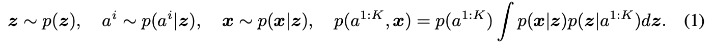

    - $a^{1:K}$: K개의 attribute
    - **z**: latent variable
    - **x**: features

  - distribution shift: 서로 다른 marginal distribution을 가지지만, 동일한 conditional generative process를 공유

    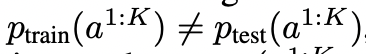 

    - $p_{train,test}$: marginal distribution

    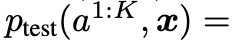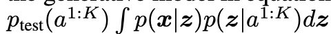

    - $p_{train,test}\(a^{1:K}, x\)$: conditional distribution

- Algorithmic alignment

  - Model *f*가 *y=g(**x**)* function을 학습하기 위한 target function을 $f_1, ..., f_n$로 decompose한다고 했을 때, N개의 module $\{N_i\}_{i=1}^N$로 구성된 model *f*의 alignment는 아래처럼 정의된다.

    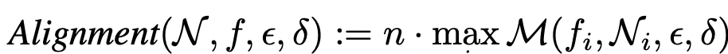

    - *Alignment*$\(N,f,\epsilon, \delta\)$: $N_i$모듈이 $f_i$ function을 $\epsilon$의 accuracy와 $\delta$의 failure probability로 replace할 수 있음을 의미한다.
    - *n*: number of modules for Model

## 3.1 GMoE

- MoE Layer : Mixture-of-Experts layer

  - Top-k개의 FFN(Expert)의 합으로 output 도출

    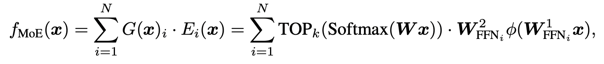

  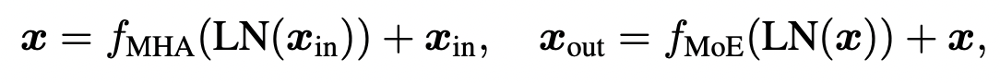

- overall diagram

  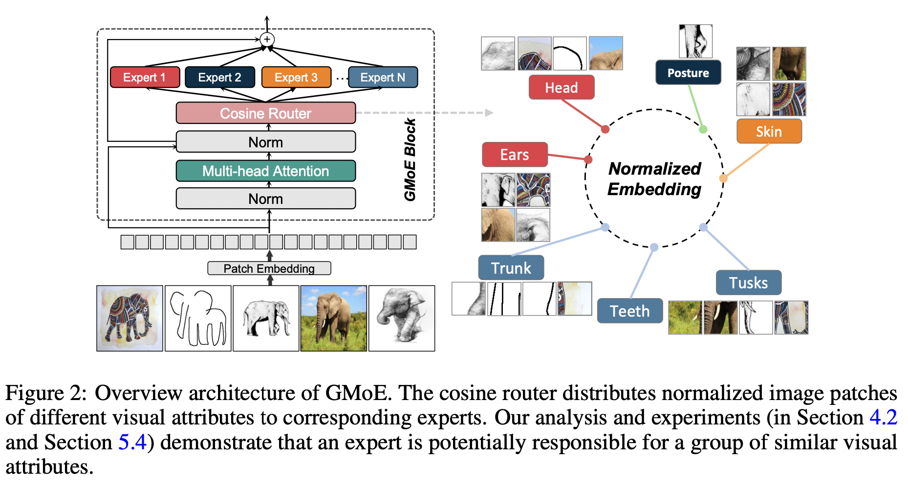

  - Routing scheme

    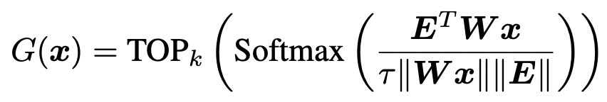

    - ***E***: code book for visual attribute (pretrained)
    - ***x***: input embedding $\in \mathbb{R}^d$

  - Number of MoE Layers

    - Last-two : 마지막 짝수번째 layer만 GMoE로 변경한 구조
      - 마지막을 변경한건 마지막 high semantic영역에 domain-invariant한 특성이 학습되었기 때문

# 4. Experiments

- Multi-Source DG result (GMoE with ERM loss)

  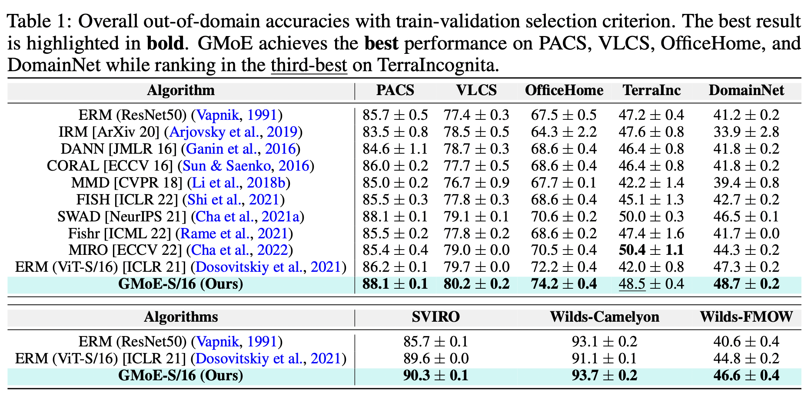

- GMoE with other DG losses

  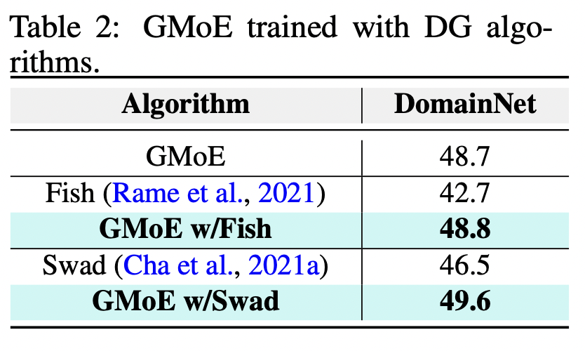

- Single Source DG result

  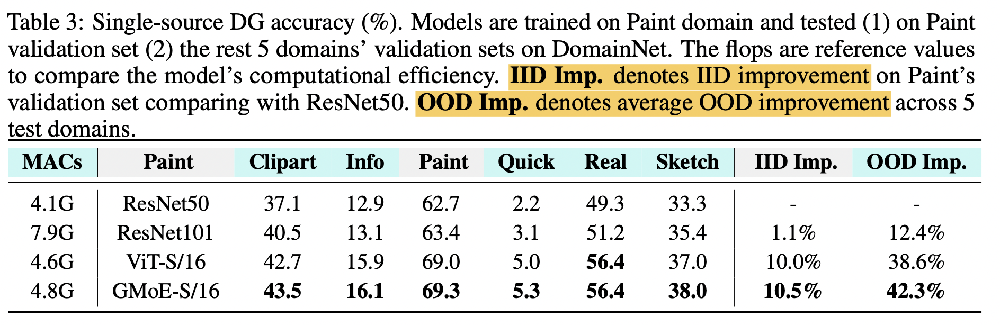

- Expert selection

  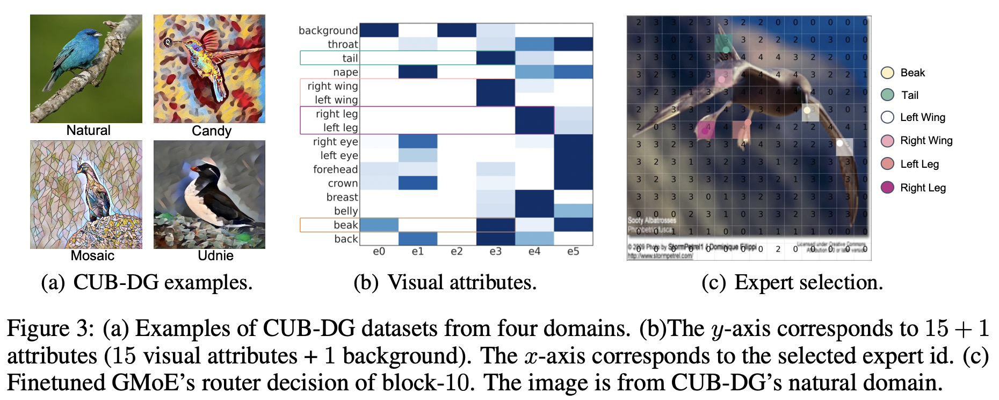

  - 같은 visual attributes (예: 다른 class의 새 부리, left&right legs)는 같은 expert로 할당됨
