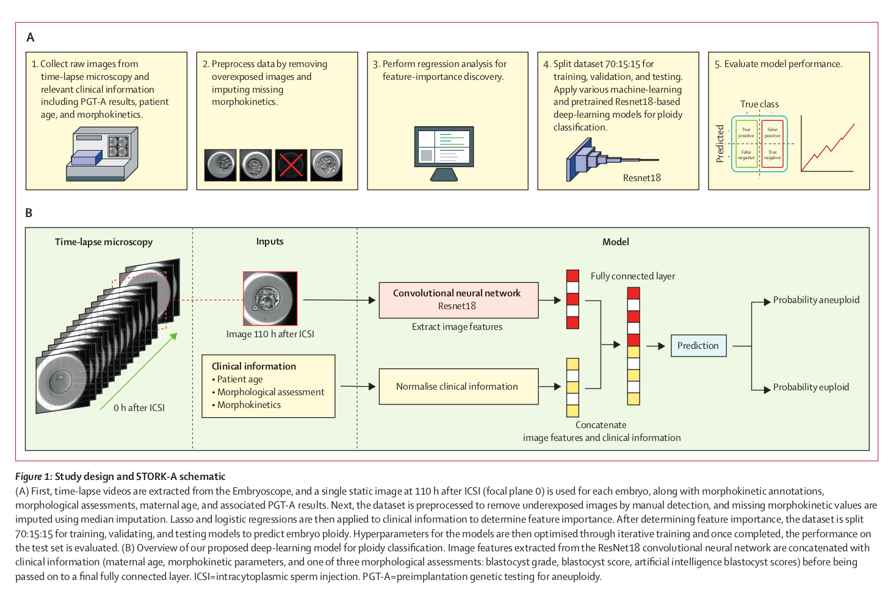

# [Med] STROK-A: A non-invasive artificial intelligence approach for the prediction of human blastocyst ploidy: a retrospective
model development and validation study

- paper: https://www.ncbi.nlm.nih.gov/pmc/articles/PMC10193126/pdf/nihms-1859601.pdf
- github: x
- Lancet Digit Health 2023 accpeted (인용수: 25회, '24-04-24 기준)
- downstream task: predict aneuploids(비정상 염색체) & euploids (정상 염색체)

# 1. Motivation

- IVF (In-vitro Fertilization)에서 challenge는 생존 가능한 수정란을 옮기는 일이다.
- 기존 형태학자들이 형태만 보고 평가하는 방식은 내외적으로 많은 차이가 존재해 일관되지 못하다.
- 반면 침습적 방법인 PGT-A의 경우 비용과 윤리적 문제가 있다.
- 비침습적이고, 비용-effective한 방법으로 model기반의 분류기법을 제안해본다.

# 2. Contribution

- 10.4K의 110h 이후 정적 이미지를 취득하여 이를 이용해 AI 모델을 학습시켜, WCM-ES+ & IVI Valencia dataset에서 일반화된 성능을 AUC로 평가함 $\to$ STROKE-A제안

- 3가지 이진 분류 task를 실험하고 분석함

  - aneuploid vs. euploid : 69.3% (PPV: 76.1%, NPV: 62.1% / AUC: 76.1)
  - complex aneuploidy vs. euploidy and single aneuploidy : 74% (PPV: 54.9%, NPV: 87.6%)
  - complex aneuploidy vs. euploidy : 77.6% (PPV: 76.7%, NPV: 78%)

  

# 3. STORK-A

### 3.1. Preliminaries

사용 정보 : Image, 모세포 나이, morphokinetics, blastocyst score

- blastocyst score:

  - blastocyst의 expansion 정도 & hatching status : Grade 1-6로 분류
  - ICM (Inner-cell-mass): Grade A-C로 분류
  - TE (Trophectoderm): Grade A-C로 분류

- Morphokinetics : time-lapse microscopy로 취득한 이미지에 대해 형태학자들이 label을 수행

  - blastulation(포배 형성)을 시작으로 full blastulation까지로 정의 (aneuploidy, euploidy의 Morphokinetics time이 다름을 이용)

    $\to$ 성능에 도움이 안됨

    - 이는 형태학자들간의 편차가 심하기 때문으로 사료됨
    - PGT-A를 대체하진 못함

- 기존 연구

  - ERICA: DL model과 PGT-A & $\beta$-HCG concentration (임신 호르몬) 정보를 활용하여 embryos를 ranking
    - accuracy : 70% (AUC 74%: sensitivity: 54%, sepcificity: 86%)
    - 한계점: single & complex aneuploid를 구분하지 않음
  - Full-length time-lapse video를 이용
    - 3D Conv활용하여 1~5일의 수정란 time-lapse video에 대해 예측 수행
    - AUC: 0.74 
    - 한계점: 데이터 부족 (n=690), 37년 이상된 난자 부족, time-lapse microscopy가 범용적이지 않다.

- STORK-A: 

  

  - Time-lapse 이미지 중 static image 1장만 취해 사용

    +난자의 나이, morphokinetic parameters, morphological assessment 정보를 활용

    

- Dataset

  - Weill Cornell Medicine Center에서 10,378장의 이미지를 1385명의 환자로부터 취득 : 500x500 resolution
    - day-5: 3994
    - day-6: 6384
  - 장비: EmbryoScope time-lapse imaging 장비
  - GT: PGT-A를 활용 (aneuploids: 5953, euploids: 4425)
    - Aneuploids (5953)
      - single aneuploids (2944) 
      - complex aneuploids (3009)
  - Validation : maternel age, morphokinetics parameters, morphological assessment 존재
    - WCM-ES+ (841) 
      - single aneuploids (170)
      - complex aneuploids (261)
      - euploids (410)
    - IVI Valencia (554) : 
      - aneuploids (319)
      - euploids (235)

- Lasso Regression을 feature에 추가

  - Regularization을 목적으로 l2 loss를 추가
  - Feautre에 maternel age, morphokinetics parameters, morphological assessment 를 사용

- Model

  - Deep Learning: Res18사용
  - Machine Learning: XGBoost, k-NN, SVM, Random Forest 사용

# 4. Experiments

- ML 결과: 5-fold-Cross-validation

  

- DL 결과 : 5-fold-Cross-validation

  

  - AIBS: AI generated Blastocyst Score $\to$ 형태학자들의 score가 없더라도 이용 가능한 장점 + 성능 향상에 기여 (pseudo label 느낌)

- 다른 Dataset 결과

  

  - Generalized되었음

- 수정란 이진 분류 & 임신 상관관계

  

- Ablation

  - Maternal age & blastocyst score가 성능에 제일 큰 기여를 함

  - correlation between ploidy

    trephectoderm grade (0.703) > inner cell mas (0.697) > expansion grade (0.692)

  

- Web-site example of STORK-A

  
