# [MM] InternVL: Scaling up Vision Foundation Models and Aligning

for Generic Visual-Linguistic Tasks

- paper: https://arxiv.org/pdf/2312.14238
- github: https://github.com/OpenGVLab/InternVL
- CVPR 2024 accepted [Oral, 인용수: 11회, '24-04-26 기준]
- downstream task: vision-language understanding 

# 1. Motivation

- LLM의 비약적인 발전에 못미치는 vision & vision-language foundation model의 성능은 AGI (Artificial Generalized Intelligence) system에 치명적이다.

  - 주요 원인 3가지를 발견했음
    - Disparity in parameter scales : LLM은 1,000B parameter까지 증가한 반면, 주로 사용하는 vision encoder (VLLM)은 1B임
    - Inconsistent representation : 이따끔 LLM의 representation과 align이 안되어 있음
    - Inefficient connection : "glue" layer가 lightweight하여 vision-text의 cross modal-interaction을 잘 학습하지 못함

  $\to$ parameter scale에서 VLLM과 LLM을 align하여 LLM의 표현력을 잘 흡수하는 LMM (Large Multi-Modal)을 만들어보자!

# 2. Contribution

- Large-scale Vision-Language foundation model인 InternVL을 제안함

  - large-scale vision encoder (6B param.)을 LLM과 align한 최초의 시도
  - 장점 3가지
    - Versatile (다재다능) : vision-only로 backbone처럼 사용할 수도 있고, multi-modal dialogue system등에도 활용 가능
    - Strong : 다양한 vision-language task에서 SOTA
    - LLM-friendly: LLM과 VLLM간의 align이 잘되어 있어 다양한 application에 적용 가능

- Opensource (text, image) pair를 효율적으로 학습하는 **Progressive image-text alignment strategy**를 제안함

  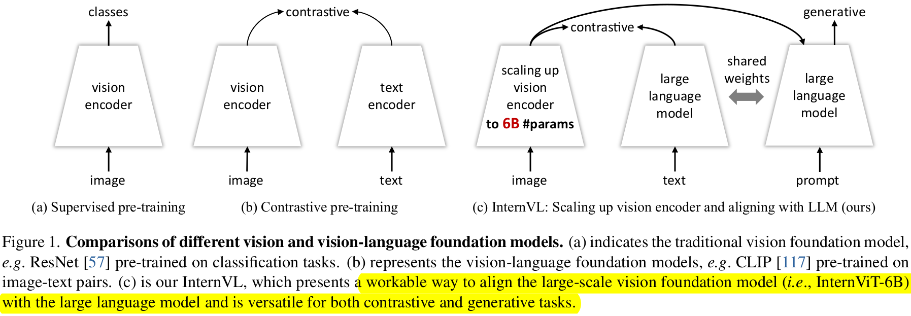

  - 1st: web-scale noisy image-text data를 contrastive learning 수행
  - 2nd: vision-instruction data를 활용한 generative learning

- 다양한 Multi-modal downstream task + vision downstream task 에서 SOTA

  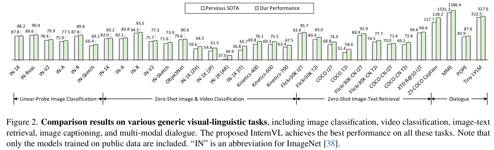

# 3. InternVL

- Overall Architecture

  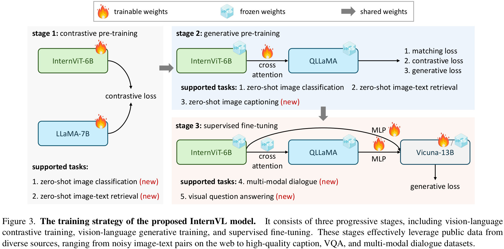

  - Vision Encoder : ViT-6B로 scale-up한 형태
  - Text Encoder : LLaMA-mult로 pretrain weight를 삼고 있는 형태

## 3.1 Model Design

- Vision Encoder

  - hyper-parameter search를 수행하여 최적의 model architecture 산출

  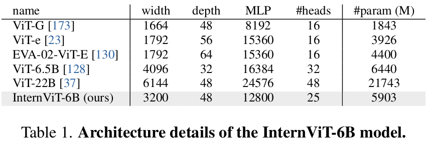

  - 6 Billion parameter로 구성

- Language Middleware : QLLaMA로 가칭. 

  - LLaMA-multilingual weight로 initialize
  - 96개의 learnable query와 Cross-attention layer (1B)이 추가된 형태
  - Visual encoder와 초기에 contrastive learning을 수행하며 학습함으로써, visual & language domain간의 smooth alignment 수행
  - 8 Billion parameter로 구성

- VisionVL = "Swiss Army Knife"

  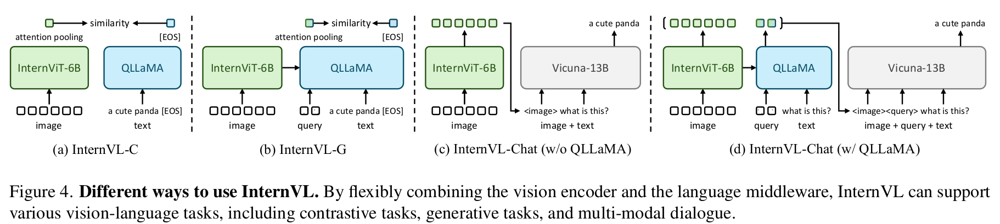

  - Visual perception tasks 
    - Contrastive learning기반 Pretraining만 가지고 학습된 visual encoder를 backbone으로 활용하여 image classification task 사용 가능
  - Contrastive tasks
    - Contrastive learning기반 Pretraining만 가지고 학습된 visual encoder를 backbone으로 활용하여 I2T retrieval task 사용 가능
  - Generative tasks
    - QLLaMA의 image captioning성능을 상속받앗기에 Image captioning task 사용 가능
  - Multi-modal dialogue
    - VQA등 다방면 MMD에 사용 가능

## 3.2 Alignment Strategy

3 Stage로 구성

1. Vision-Language Contrastive Training

   - 모델

     - InterViT-6B + LLaMA-7B

   - Dataset

     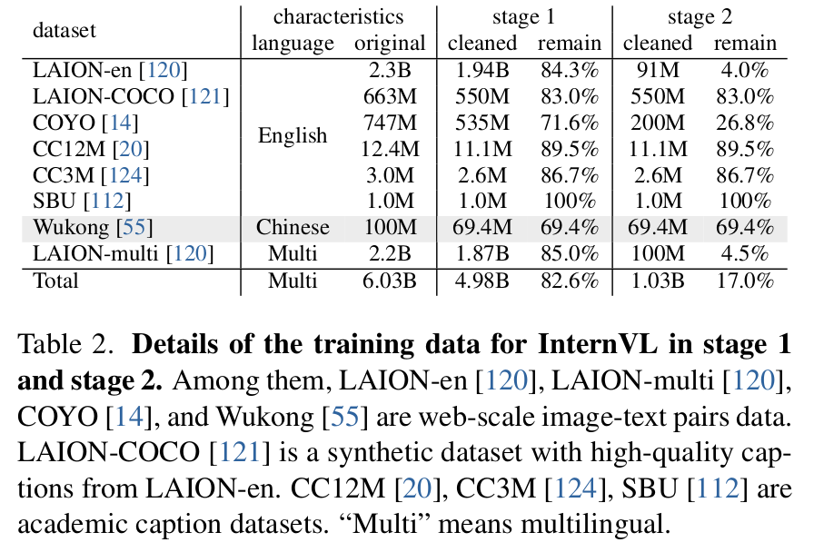

     - LAION-en, LAION-multi, LAION-COCO, COYO, Wukong

   - CLIP을 따라 Cross-entropy기반 CE Loss로 학습 수행

2. Vision-Language Generative Training

   - 1st stage에서 학습한 weight로 initialize

   - Vision & Langauge encoder는 freeze하고, 추가된 learnable query과 cross-attention layer만 학습

   - 이때, high-quality의 fitered data로만 학습

   - Loss : BLIP-2를 따라 3가지 Loss로 학습

     - ITC (Image-Text Contrastive) loss
     - ITM (Image-Text Matching) loss
     - ITG (Image-grounded Text Generation) Loss

     $\to$ text feature와 visual feature를 추가 align 수행

3. Supervised Finetuning (SFT)

   - Off-the-Shelf LLM decoder "Vicuna"와 연결해서 사용
   - High-quality instruction data를 활용 (4M)하여 fine-tuning
   - LLM decoder도 freeze하고, QLLaMA의 MLP layer만 혹은 QLLaMA만 학습

# 4. Experiments

- Linear Probling DG classification

  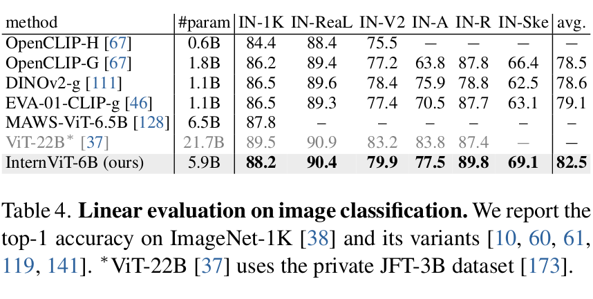

- Semantic Segmentation

  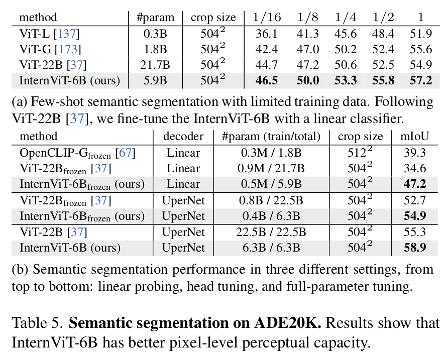

- Zero-shot Image classification & Multi-Lingual task

  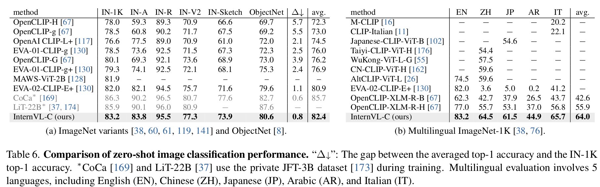

- Zero-shot Video classification

  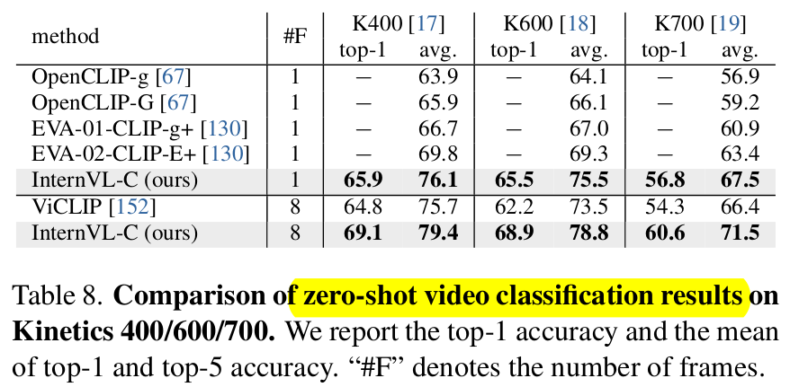

- Zero-shot Image-Text Retrieval

  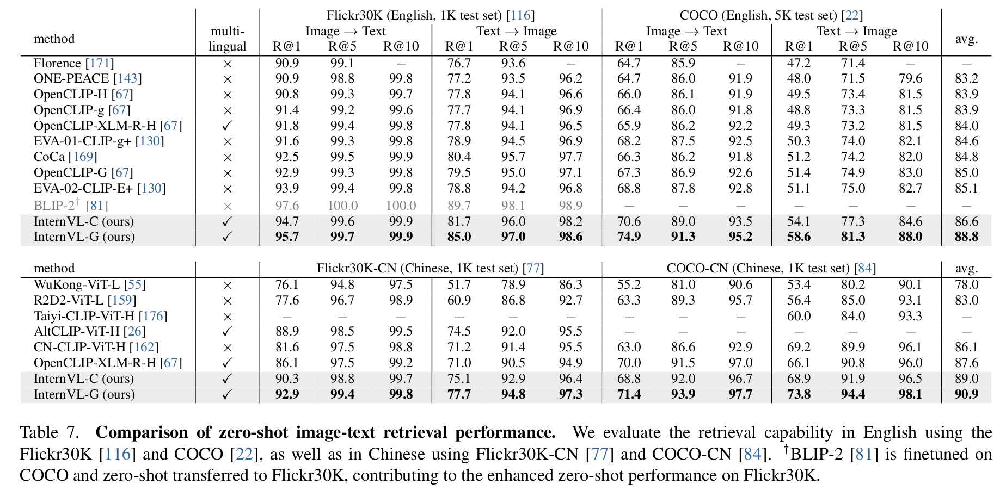

- Zero-shot Image Captioning (InternVL-G)

  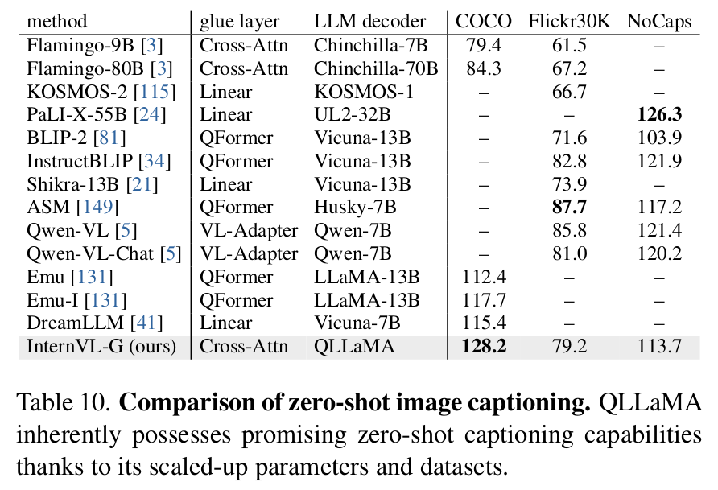

- Multi-Modal Dialog Benchmarks (Intern-Chat)

  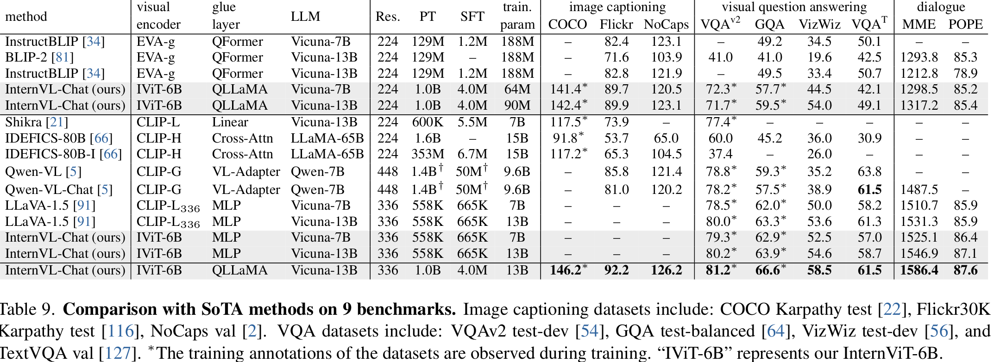

- Ablation

  - Vision Encoder 설계

    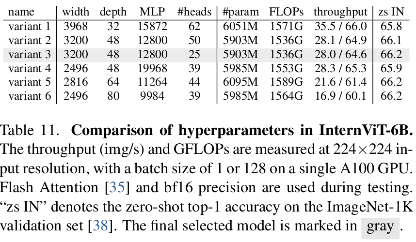

  

  - Scale & Glue layer에 따른 성능분석

    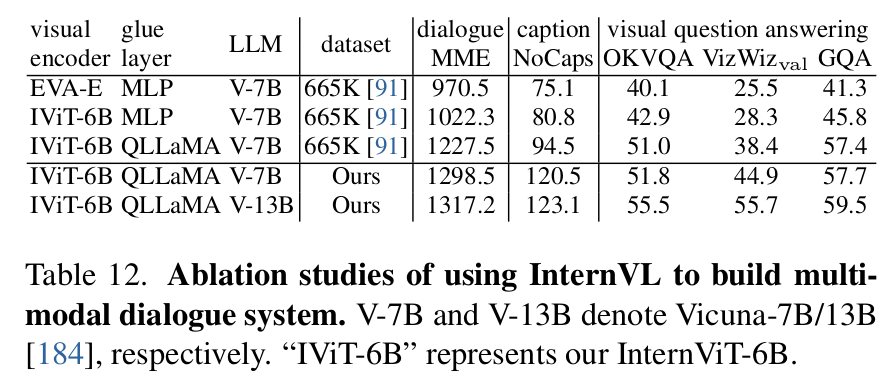
