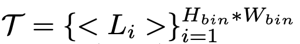

# [GM][OD] GEODIFFUSION: TEXT-PROMPTED GEOMETRIC CON- TROL FOR OBJECT DETECTION DATA GENERATION

- paper: https://arxiv.org/pdf/2306.04607
- github: https://github.com/KaiChen1998/GeoDiffusion/tree/main
- ICLR 2024 accepted (인용수: 14회, '24-04-28 기준)
- downstream task: GM for OD

# 1. Motivation

- 기존에 controllable detection data generation에 이용된 연구들은 한계가 있음

  1. copy-and-paste: 단순하지만, 성능 향상되는 기법. 단, 생성된 데이터가 부자연스럽고, 기하학적인 형태를 제어하기가 불가능

  2. L2I (Layout to Image) generation: 추가 module이 필요 (ex. RoIAlign, LayoutAttention). 하지만, 이는 추가적인 기하학적 condition을 삽입하기 힘듦

     $\to$ Diffusion기반의 기하학적 condition을 "foreign language"로 dictionary에 추가하여 적용하는 기법은 없을까?

# 2. Contribution

- Text prompt를 기하학적 condition으로 삽입하여 pretrained Diffusion model의 data generation에 활용하는 단순한 기법 "GeoDiffusion"을 제안함
- 기존 L2I generation에 비해 성능을 뛰어넘을 뿐더러, 학습 속도도 4x 향상됨을 입증함
- Object Detector를 학습하는데 L2I data가 성능 향상에 기여함을 보인 최초의 논문

# 3. GeoDiffusion

- preliminaries

  - Input

    

    - *v*: layout에 관한 geometric condition. 여기서는 text를 활용
    - $c_i$: i번째 layout의 class
    - $b_i$: i번째 layout의 box 정보

  - Output

    

    - *g*: generation model
    - z: latent variable
    - *I*: generated Image

  - Conditional Diffusion Model

    

    - *y*: condition given by text
    - $\tau_{\theta}$: conditional encoder

    

  ## 3.1 Geometric condition as a Foreign Language

  - Location Token

    

    - bbox 정보는 태생적으로 continuous한 정보를 포함하므로, tokenize가 불가능

    - "Pix2Seq" 논문에서 영감을 받아, discretized bin으로 location 정보를 변환하여 tokenize 수행

      

      - *T*: Location set of token

        

      - $\sigma$: discretized box token

    - Layout information : 3개의 token들로 구성

      

  - Prompt construction

    

## 3.2 Foreign Prompt Reweighting

- Forground에 비해 Background의 차지 공간이 imbalance하게 커서, 생성된 이미지가 forground에 집중하기 힘듦

- 작은 box에 비해 큰 box가 마찬가지 이유로 imbalance하게 커서, 생성된 이미지가 작은 forground 생성을 못함

  $\to$이를 해결하고자 reweighting 수행

  

  - *w*: >1보다 큰 masking weight
  - $c_{ij}^p$: (i,j)째 pixel이 속한 instance의 area
    - p: hyper-parameter
  - $H\', W\'$: feature map의 height, width

- GeoDiffusion Loss

  

# 4. Experiments

- Evaluation Metrics

  - Fidelity : 얼마나 semantic meaning을 훼손하지 않은 채, real image와 유사하게 생성했는지를 평가
    - FID : smaller, the better
    - mAP: Input Layout 영역에 대해 생성된 이미지 forground가 같은 위치에 생성 했는지를 평가
      - Pretrained object detector를 활용하여 평가 (NuImages: Mask-RCNN, MS-COCO: Faster-RCNN)
  - Trainability : 생성된 이미지로 Object Detector를 수행헀을 때, 얼마나 성능 향상의 이득이 있는지를 평가
    - CoCO average precision (mAP@0.5:0.95) : larger, the better
    - 동일한 iteration으로 학습하되, batch size를 늘어난 generated image만큼 키워서 학습을 수행
  - Generalizability : GeoDiffusion 모델이 학습 중에 보지 못한 layout bbox의 위치 및 크기, 그리고 class에 따라 그럴듯한 이미지가 생성되었는지를 평가
    - 정성적으로 평가 수행함
    - 본 논문에서는 layout bbox의 위치 변화는 flip과 shift를 수행

- NuImages Fidelity Result

  

- NuImages Trainability Result

  

- NuImages Trainability for differnt budget of real images

  

  - data가 부족할수록, 생성된 이미지로 인한 OD 성능 gain이 더 증가함
  - 75%만 가지고 100% 보다 좋은 성능 (37.3 vs. 36.9)

  

- NuImages 정석적 평가

  

- NuImages Generalizability 평가

  - layout bbox shift & flip 수행했음에도 비탈길을 만들면서 semantic meaning을 훼손하지 않으며 이미지가 생성됨 (1행 4열 참고)

    

  - OOD bbox 크기 및 class에 따른 generalizability 평가

    

    - OOD 크기는 robust하게 잘 생성
    - OOD class는 잘못 생성 $\to$ text encoder finetuning 과정에서 catastrophic forgetting 발생한 것으로 사료됨
      - 이는 향수 PEFT등을 수행하겨 수정하면 좋을거 같음

- Universality

  - MS-COCO dataset에서도 동일한 실험을 진행

  - Generation Fidelity

    

  - Generation Trainability

    

  - Generation Inpainting Result

    - 정량적

      - Fidelity와 유사하게 YoLo모델을 기반으로한 YoLo Score를 가지고 비교

      

    - 정성적

      

- Ablation Studies

  - Box bin 크기에 따른 성능 비교 : bin이 정교할수록 좋음

    

  - Reweighting 유무 / Pretrained weight에 따른 비교

    

- Geometric condition 유무 & learnable Location token에 따른 성능 비교

  

- Other Applications

  - Domain Adaptation

    

    - domain 특성을 text로 입력하여 생성 가능

  - 3D-OD 생성

    

    - 2D-OD와 동일하게 local bin으로 descritize하여 실험 가능

  - Long-tailed class 생성 가능 : LVIS dataset

    s
