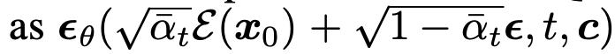

# [GM][3DOD] MAGIC DRIVE : STREET VIEW GENERATION WITH DIVERSE 3D GEOMETRY CONTROL

- paper: https://arxiv.org/pdf/2310.02601
- github: https://github.com/cure-lab/MagicDrive
- ICLR 2024 accepted (인용수: 21회, '24-04-29 기준)
- downstream task: GM for 3DOD

# 1. Motivation

- 3D Object Detection image synthesis를 위해서는 3D 정보의 손실 (ex. height, depth) 없이 3D environment을 필요로 함

- 하지만 기존 연구들 (BEVGen, BEVControl)은 height가 없거나, depth 정보가 없는 2D만 가지고 3D image를 생성함 

  

  $\to$ 3D environment 정보를 효율적으로 encoding하여 3D Bbox와 함께 synthesis하는 방법은 없을까?

# 2. Contribution

- 3D 정보와 BEV를 활용하여 multiview perspective camera & video synthesis를 수행하는 Magic Drive를 제안함
- Multi camera view consistency의 challenge를 효율적으로 해결하는 3D geometric data 관리 전략을 제안함
- 기존 3D streetview generation task 뿐 아니라,  3D perception task의 성능을 향상시킴

# 3. Magic Drive

- preliminaries

  - Conditional Diffusion

    

  - Laten Diffusion : **x**$_0$를  **z**$_0$로 변경 

    

- overview 

  

## 31. Geometric conditions encoding

- scene-level encoding

  - **P**: camera pose. sine/cosine로 구성되어 high frequency variation을 잘 취득하고자 Furior Transform을 거쳐 embedding

    

    

  - **L**: scene annotations. Pretrained Clip text encoder를 활용함

    “A driving scene image at {location}. {description} ”

    

  - 최종 scene level embedding

    

- 3D Bounding Box encoding

  - class 정보는 average pooling하여 embedding

  - Bbox 정보는 Fourior Transform 후에 embedding

    - $b \in \mathbb{R}^{8 \times 3}$

    

  - view마다 visible bbox가 다르므로 visible 영역만 사용

    

  - 단 학습 중에는 CFG(Conditional Free Guidance)의 특성상 주기적으로 condition을 drop하며 학습해야 함. 따라서  invisible도 일정 비율로 random하게 augmentation 수행

- Roadmap encoding

  - 2D grid format으로 구성되어 있음. 이 형태는 별도의 addictive encoder로 embedding하는게 효율적이라 알려짐 (Adding conditional control to text-to-image diffusion models)
  - 별도의 2D & 3D view transformation이 explicit하게 없더라도, 위에 3D bbox와 camera pose만 가지고 addictive encoder가 implicit하게 transformation을 수행하도록 학습이 됨

## 3.2 Cross-view Attention Module

- Multi-camera view generation에서는 consistent한 image synthesis가 매우 중요함 $\to$ 이웃 scene간 cross-attention 도입

- overview

  

- $t, l, r$: target view, left view, right view

- **h**$^v$: hidden state of target view

- 정성적 비교 (vs. BEVControl)

  

- Background / Forground control 정성적 비교

  

## 3.3 Model Training

- Objective

  

  - invisible bbox 10% random augmentation 수행 (CFG에서 한번 언급)
  - Naive한 학습 방지하고자 near view image에 random noise 추가

# 4. Experiments

- Evaluation Metric

  - Realism (Fidelity): 얼마나 real image와 유사하며 (FID), semantic meaning이 훼손되지 않았는가 (mAP)
  - Controllability (Trainability): 얼마나 synthesized image가지고 3D perception task의 성능이 향상했는가 (mAP, mIoU)

- Fidelity

  

- Trainability

  

- 정성적 분석

  - Target text: Sunny & Rainy 

    

  - Forground / background control

    - car frount/back flip, 혹은 50% bbox 제거

    

- Video Generation

  - Temporal attention을 추가

    

- Ablation

  

  - CFG

    
