# [GM][OD] *DetDiffusion*: Synergizing Generative and Perceptive Models for Enhanced Data Generation and Perception

- paper: https://arxiv.org/pdf/2403.13304
- github: x
- CVPR 2024 accpeted (인용수: 4회, '24-05-04 기준)
- downstream task: GM for OD

# 1. Motivation

- 기존 연구에서는 Perception model과 generation model을 구별하여 따로 성능 향상을 시켜왔음

  $\to$ Perceptive model의 signal을 통해 generative model간의 synergy를 내는 방향으로 성능 향상을 시켜보자!

# 2. Contribution

- Generative model과 perceptive model간의 synergy를 처음으로 제안한 DetDiffusion framework를 제안

  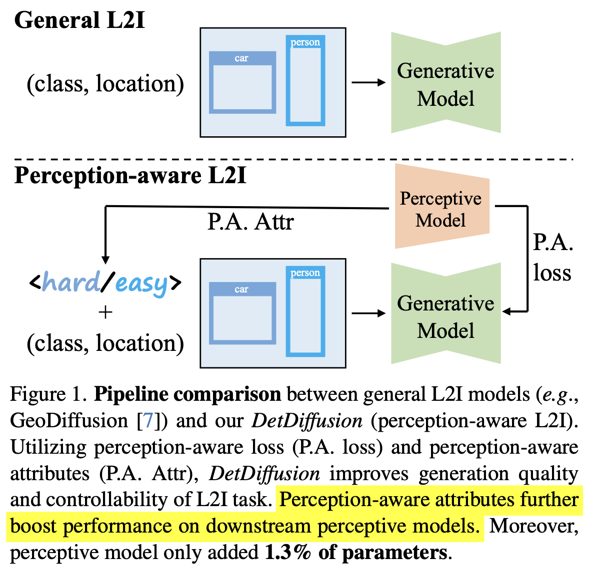

  - Generation quality 향상을 위해 segmentation head를 기반한 Perception loss를 추가함

  - Perceptive model의 Trainability 향상을 위해 perceptive attribute 을 제안

- Layout-guided generation에서 SOTA 뿐만 아니라 다른 object detector에서도 boosting 

# 3. DetDiffusion

- overall diagram

  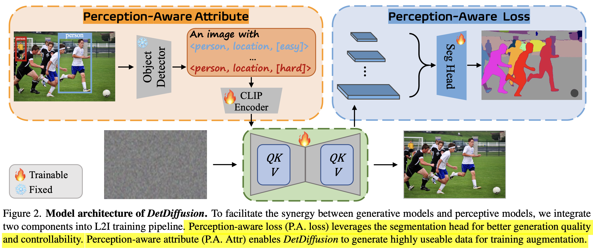

  - pretrained object detector의 perceptive attribute를 generation model 학습에 활용함으로써, perceptive model과 generation model간의 align을 효율적으로 할 수 있게 됨

- Perceptive-aware attribute

  - probability score가 $\gamma$ threshold를 넘는 confident bbox를 기준으로 G.T. box와 IoU threshold $\beta$를 넘는 bbox를 easy, 그렇지 않은 것들을 hard로 분류

    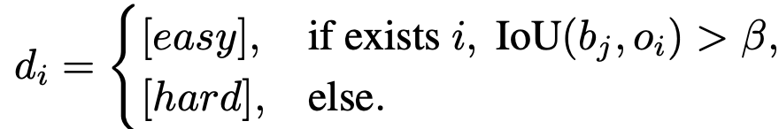

    - $d_i$: i번째 predicted bbox의 perceptive attribute [hard or easy]

- Perceptive-aware attribute as prompt token

  - "An Image with {objects}"의 objects는 다음과 같이 구성

    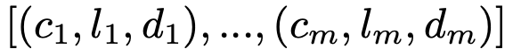

    - m: m개의 g.t. box
    - $c, l, d$: class attribute, bbox attribute (discretized), perceptive attribute

- Perceptive Loss as supervision

  - 기존 LDM의 VQ-VAE는 freeze하고, text encoder부분을 학습함

  - U-Net의 feature가 class, localization task 수행에 효과적이라는 기존 연구에 착안하여 기존 LDM loss과 함께 multi-feature map에 segmentation head를 붙여 만든 instance mask를 사용하여 perceptive loss를 부여

    - Multi-Feature

      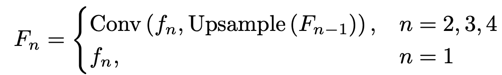

    - Perceptive Loss

      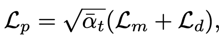

      - $\bar{\alpha}$: DDPM의 time-step별 가중치. Noise가 작은 time-step에 가중치를 크게 부여하기 위해 사용

    - Total Loss

      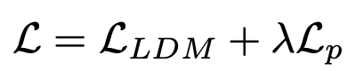

      - $\lambda$: 0.01 사용

# 4. Experiments

- MS-COCO dataset

  - Image에서 object area가 2% 미만 차지하는 이미지는 fitering

- Fine-tuning

  - VQ-VAE는 freeze
  - text encoder만 학습
  - text prompt의 10%는 null text로 replace해서 unconditional generation 수행

- DetDiffusion concept

  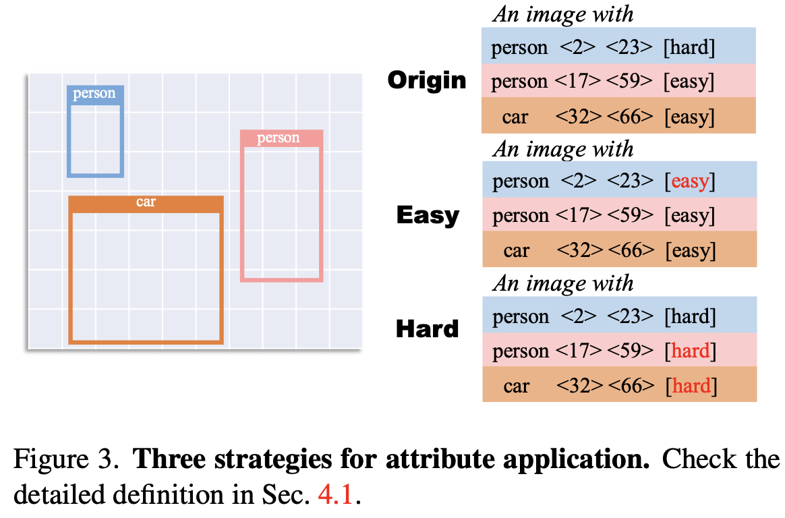

  - origin: hard, easy 모두 사용
  - hard: 모두 hard 적용
  - easy: 모두 easy 적용

- Fidelity

  - 정성적 분석

    

  - 정량적 분석

    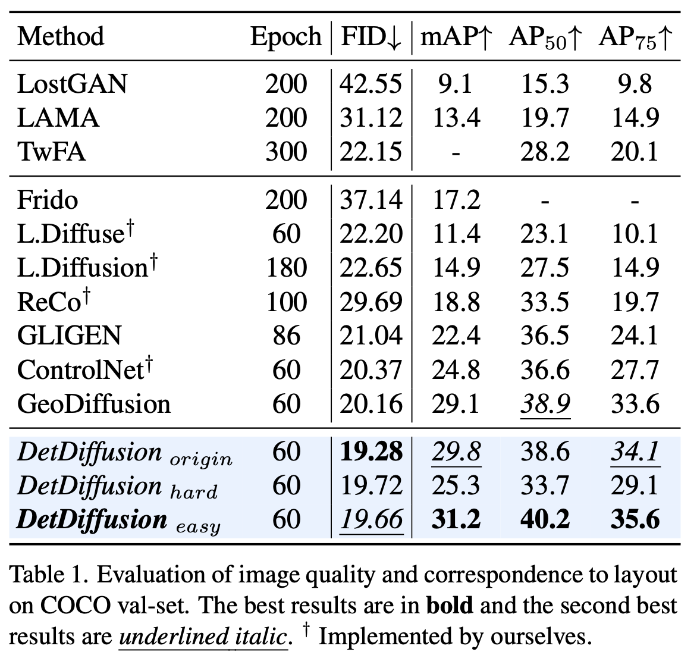

- Trainability

  - 정량적 분석

    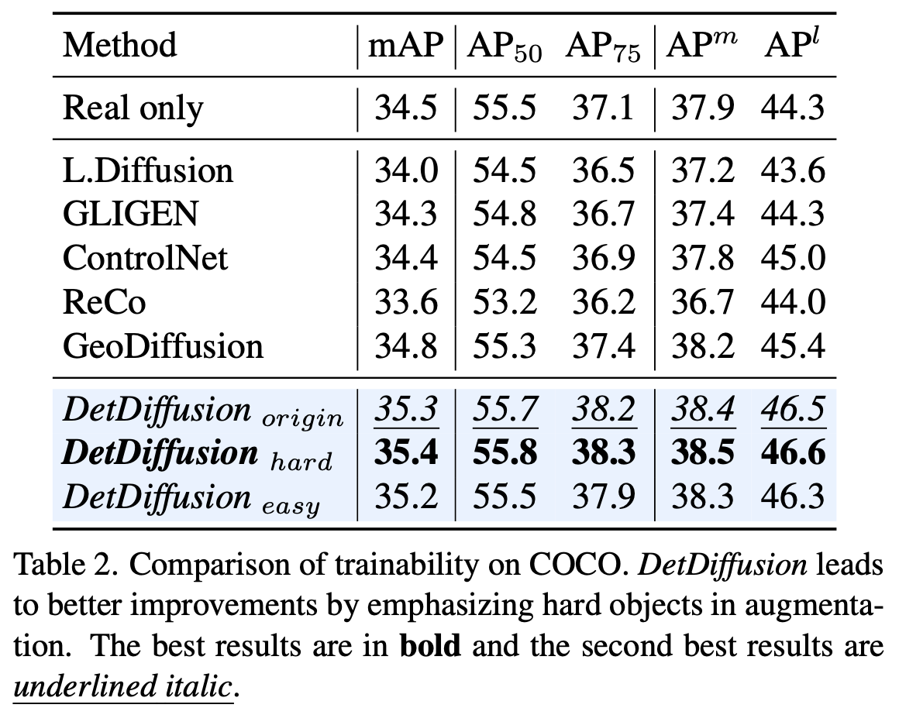

  - Learning curve

    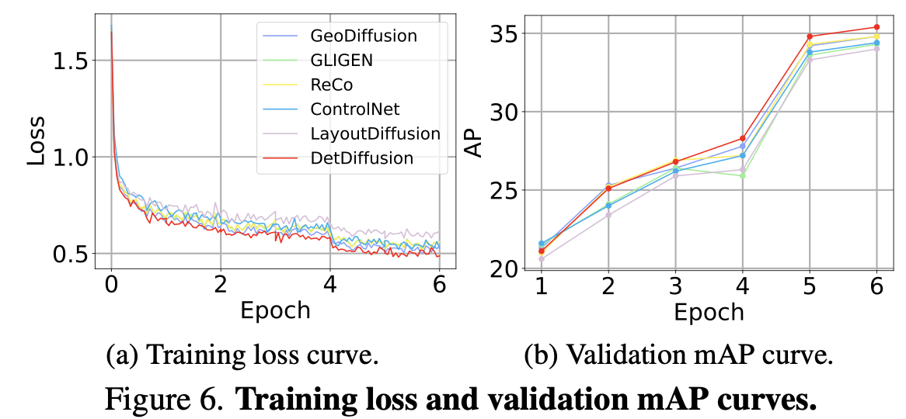

  - Rare class에서 효과적인지 검증

    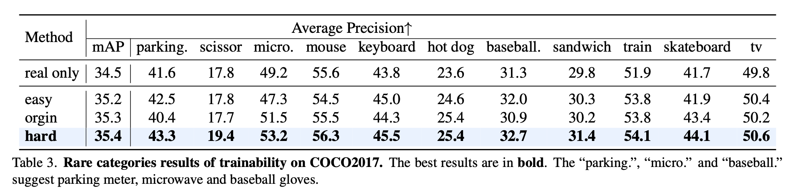

- Easy and hard

  - 단순히 easy를 hard로 변경하면, perceptive model이 맞추기 어려운 형태로 (색이 변한다던지, occlusion이 생긴다던지) 변화됨

    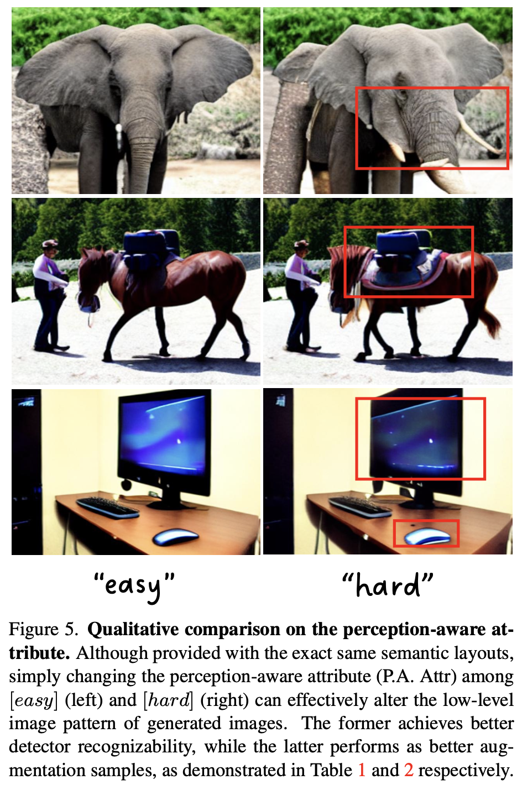

- Ablation Study

  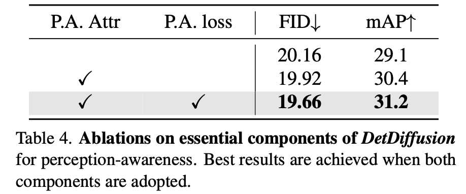

  - 다른 Detector에도 범용적인가?

    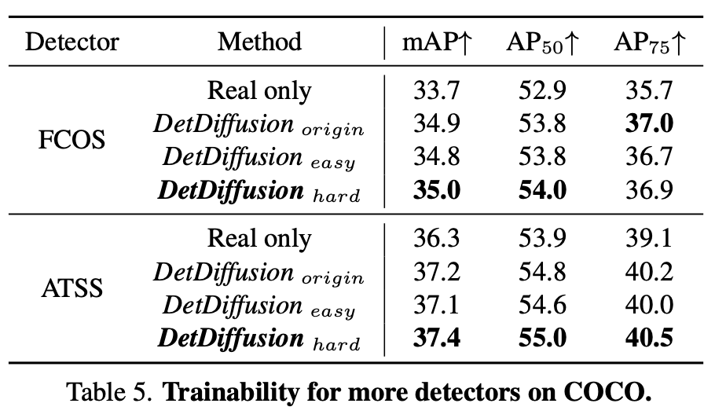

  - Perceptive-aware attribute를 다른 Detector에서 사용하면?

    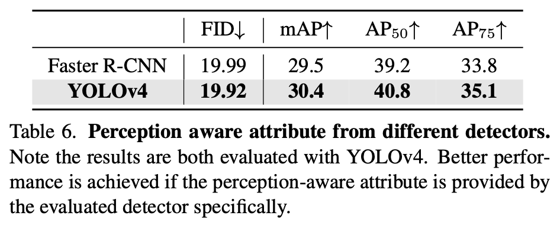

    - Optimize는 같은 detector를 사용할것!
