# [DM]\[LG] LACE: Towards Aligned Layout Generation Via Diffusion Model With Aesthetic Constraints

- paper: https://arxiv.org/pdf/2402.04754
- github: https://github.com/puar-playground/LACE
- ICLR 2024 accepted (인용수: 1회, '24-05-15 기준)
-  downstream task: Graphic Layout Generation

# 1. Motivation

- 최근 연구들에 따르면 Diffusion기반의 conditional generation이 좋은 성능을 보이고 있음

- Diffusion based model은 두 분류로 나뉨

  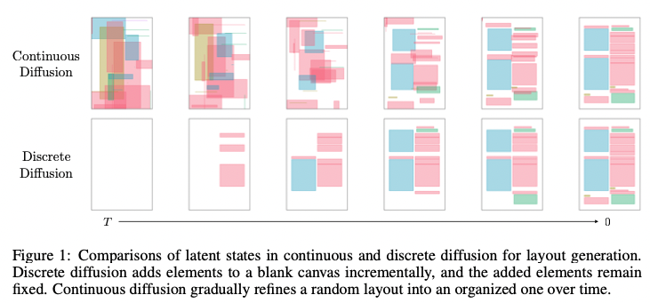

  - Discretized: generation과정에서 빈 상태에서 distinct pattern이 연속적으로 생성되므로, 이전 process에 제약을 받아 표현력이 떨어짐
  - Continuous: generation과정에서 random layout에서 매 step별로 organize되므로, 표현력이 높다고 알려짐. But alignment 및 IoU성능이 떨어지게 됨

  $\to$ Evaluation에 사용하는 alignment loss, IoU loss를 학습에 추가하면 어떨까?

# 2. Contribution

- Diffusion model기반으로 continuous space에서 layout generation을 수행하되, Constraint optimization을 통해 quality를 향상시키는 LACE를 제안함
- Global alignment & Minimize overerlap Loss를 추가함
- 다양한 benchmark에서 SOTA

# 3. LACE

- Continuous Layout Generation

  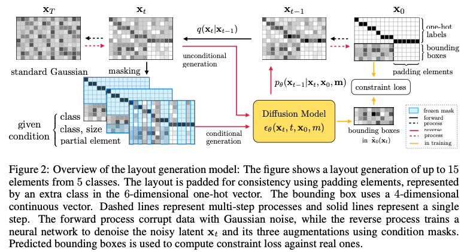

  - *l*개의 layout을 정의

    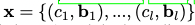

  - $c_i$: class label. [0, N-1]중 1개의 Class로 구현. N=padding element

  - $b_i$: bbox. 4개의 element(x, y, w, h)로 구성 

    $\to$ N+5 dimension

  - Continuous label + bbox space로 정의함으로써, continuous constraint loss를 사용하여 generated layout quality를 enhance할 수 있게됨

- Reconstruction Loss

  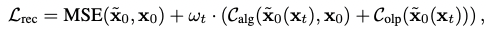

  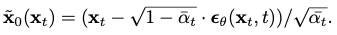

  - $C_{alg}$: Alignment Loss. Global & Local alignment loss로 구성

     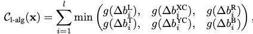

    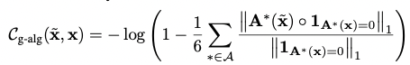

    - **x**: layout
    - **1**$_{A*(x)=0}$: binary ground truth alignment mask matrix
    - 

  - $C_{olp}$: Overlap loss

    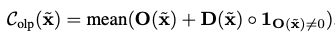

    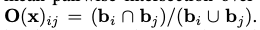

    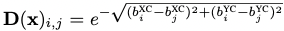

- Time dependent Weight

  - Reconstruction loss를 alignment loss와 함께 direct로 사용하면 local minima에 빠지기 쉽다.

    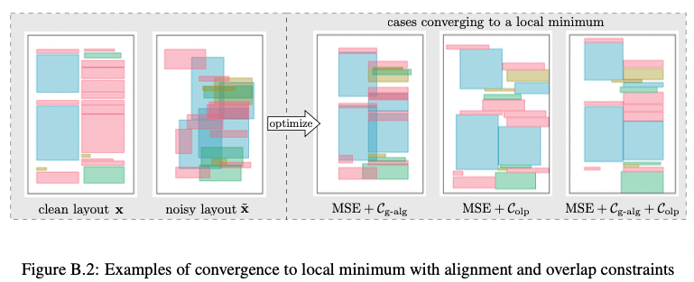

  - smaller time *t*에서 alignment weight를 크게 주는 것이 generated layout quality를 높여준다. 즉, 초기에는 layout generation에 focus해서 denoise하다가 FID score가 수렴하기 시작하면 그때 높여준다. 

    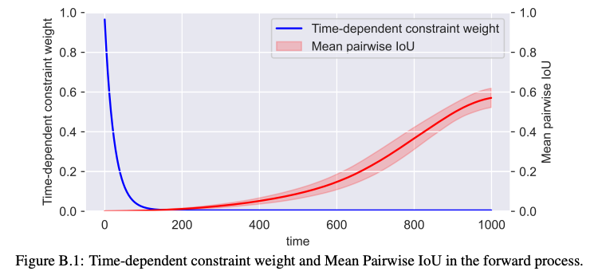

- Post-processing
  - Global alignment 수행을 위해  raw output layout에 대해 threshold $\delta$를 통과시킨 후, 서로 align이 되도록 후처리 로직을 추가한다.
  - Inference할 때는 groud truth가 없으므로, threshold를 통과한 뒤 살아남은 layout를 기준으로 alignment mask를 생성한다.

- Model Architecture

  - LayoutDM과 동일

    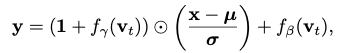

    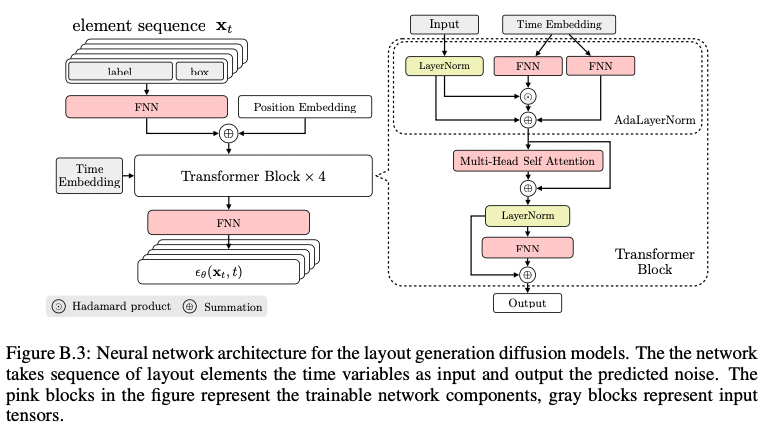

# 4. Experiments

- Quantitative Results

  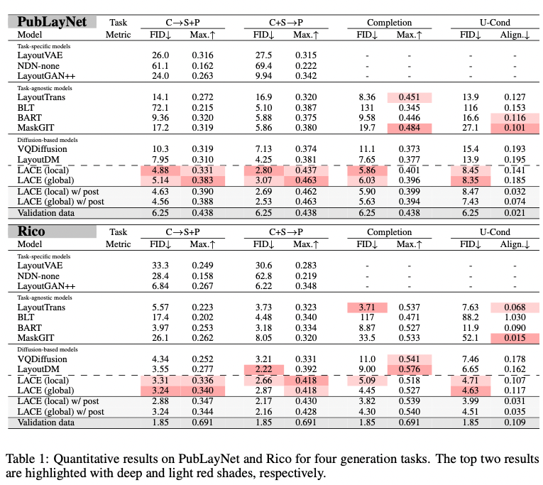

- Qualtitative Result

  

- Refinement task

  - 특히나 refinement task같은 경우, continuous diffusion model이 expert인데, 이는 태생적으로 diffusion forward process에서 noise를 가하고, backward process에서 해당 noise를 denoise하는 process이기 때문

    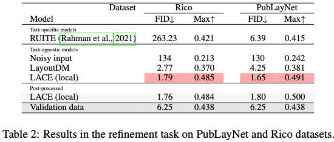

- Ablation Study

  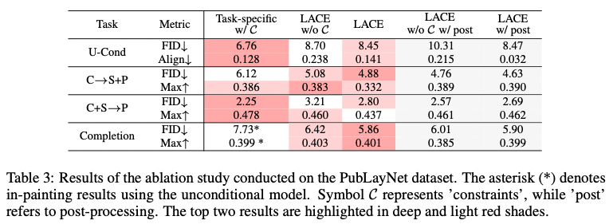

  - Task-specific: C$\to$S+P, C+S$\to$P, complete, refinement를 개별 task로 finetuning
  - LACE는 Task-specific과 동등 수준의 결과를 나타내므로, our unificied method가 유효함
  - aesthetic constraints 유무에 따라 성능 차이 발생하므로, 유효함을 입증
