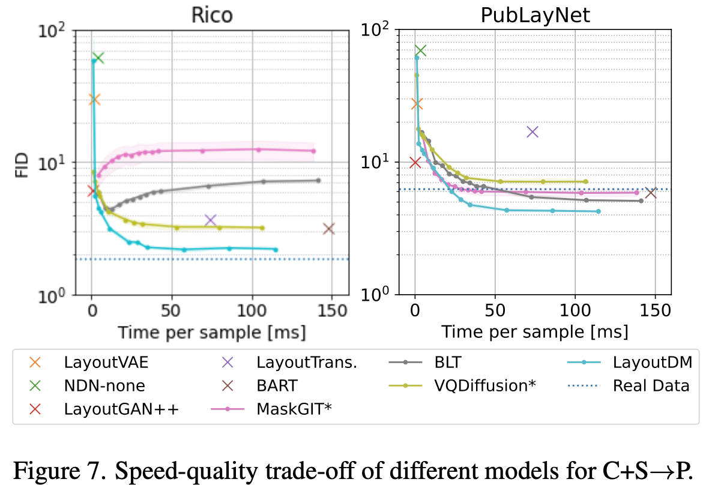

# [DM][LG] LayoutDM: Discrete Diffusion Model for Controllable Layout Generation

- paper: https://arxiv.org/pdf/2303.08137
- github: https://github.com/CyberAgentAILab/layout-dm
- CVPR 2023 accepted (인용수: 44회, 2024-05-17 기준)
- downstrema task: Layout Generation

# 1. Motivation

- Diffusion이 image뿐만 아니라 text generation에도 좋은 성능을 보이고 있음

- 특히 discretized space는 text 생성 시 잘되고 있음 (D3PM)

  $\to$ Discretized space에서 layout을 generation해보면 어떨까?

# 2. Contribution

- Discrete diffusion process를 Layout generation task에 적용하기 위해 **modality-wise diffusion**을 제안하고, dynamic layout size를 고려한 **padding approach**를 적용함
  - modality-wise diffusion: entity (class), x, y, w, h 등 modality마다 transition matrix를 denosing step별로 구분해서 denoising
  - padding approach: Max layout 갯수를 predefined하고 document별로 layout을 할당하고 남은 tokeN에 대해 [PAD] token으로 setting
- Inference때 [Masking] token과 logit adjustment를 사용한 layout constraint를 적용하여 single model로 multi-task (C$\to$S+P, C+S$\to$P, completing, refinement, 등) 수행 가능해짐
- 다양한 layout generation benchmark에서 준수한 성능을 냄

# 3. LayoutDM

- Preliminaries: 

  - D3PM

    - categorical variable을 text 생성에 맞춰 디자인한 논문
    - forward process

    
    
    - *T*: total time step
    
    - 
    
    - **Q**$_t$: transition matrix $\in [0,1]^{K \times K}$
    
      - [*Q*$_t$]$_{mn}$ = q($z_t=m|z_{t-1}=n$)
    
    - Markov property를 이용해 다음을 유도할 수 있음
    
      
    
      - 
    
    - overall loss
    
      

- VQDiffusion : Mask-and-Replace를 통해 여러 task를 통합

  

  - $\alpha_t$: 기존 token을 그대로 사용하는 비율
  - $\beta_t$: 다른 random token과 replace하는 비율
  - $\gamma_t$: 기존 token을 [MASK] token으로 replace하는 비율
  - $\in \mathbb{R}^{(K+1) \times (K+1)}$

overall diagram

- Unconditional Layout Generation

  - $l={(c_1, b_1), ..., (c_l, b_l)}$

  - b_1은 0~1로 normalized된 bbox로, discretized bin 수행

  - Noise는 각 modality별로 아래와 같이 줌

    

  - Variable Length Generation

    - class 갯수 K + 2 (mask token, padding token)	

    - Modality-wise Diffusion
      - $Q_t^c \in \mathbb{R}^{(K+2) \times (K+2)}$
      - 나머지는 $Q_t \in \mathbb{R}^{(B+2) \times (B+2)}$

    - Adaptive Quatization
      - 각 modality별로 분포가 다르므로 uniform quantization보다 K-means quantization 수행하는게 효과적임

  - Decoupled Positional Encoding
    - 기존 연구들은 1-D flatten layout sequence에 positional encoding을 embedding하였음
      - 반면, 여기서는 i, j decoupled시켜 positional encoding을 수행했음. $\to$ 실험적으로 성능이 좋아짐

- Conditional Generation

  - Strong Constraint : masking처리된 token에 대해서만 모델이 예측한 값으로 복원하고, 나머지는 gt 그대로 활용

    

  - Weak Constraint: Logit adjustment를 통해 별도의 network 없이 Unified model로 target condition을 생성하도록 유도

    

    - : desired term이 생성되도록 유도하는 prior weight term
    - $\lambda_{\phi}$: hyper-parameter
    - 

# 4. Experiments

- Quantitative Result on Conditional Generation

  

- Qualitative Result on Conditional Generation

  

- Quantitative Result on Unconditional Generation

  

- Quantitative Result on refinement task

  

- Qualitative Result on refinement task

  

- Quality vs. Violation trade-off

  

- Relation task

  - Definition

    

  - Result

    

- Speed vs. Quality trade-off

  

- Ablation study

  

