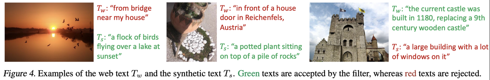
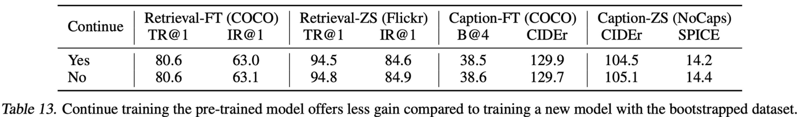

# [MM] BLIP: Bootstrapping Language-Image Pretraining for Unified Vision-Language Understanding and Generation

- paper: https://arxiv.org/pdf/2201.12086
- github: https://github.com/salesforce/BLIP
- SalesForce Research (‘22.02.15), 인용수: 2137회 ('24-05-19 기준)
- 한줄요약: BLIP이라는, noisy text-image pairs에서 학습가능한 framework를 제안함

## Abstract

- Vision-Language Task는 데이터셋의 scale-up을 통해 성능 향상을 이루었다.
- Noisy image-text pair는 최적의 성능이 아닌, 차선의 성능 (sub-optimal)을 제공한다.
- Blip은 효과적으로 image의 caption을 생성하는 captioner와 noisy label를 제거하는 filter를 사용하여 성능 향상을 돕는다.
- Vision-Language task 중 understanding (image-text retrieval, text-to-video retrieval, videoQA)과 generation (image captioning, VQA) 등에서 SOTA 성능을 달성한다.

## Introduction

- 기존 방식의 한계점

  - 모델 관점

    - Encoder는 understanding task에는 좋지만, generation task에 약하다.

      → Text only Encoder, Image grounded text Encoder, Image grounded Text Decoder로 구성

    - Encoder-Decoder 모델은 image-text retrieval task에 잘 적응하지 못한다.

      → Decoder의 generation 특성에 알맞게 bi-directional self-attention layer를 next token prediction하는 causal attention layer로 변경함으로 해결

  - 데이터 관점

    - Web에서 수집한 noisy data로 pre-train 하므로 sub-optimal 하다

    → CapFilter를 사용

- 본 논문의 contribution

  - MED (Multi-modal Encoder-Decoder)
    - 유연한 transfer learning이 가능하도록 unimodal encoder, imaged-grounded text encoder, Image-grounded text decoder로 구성됨
    - ITC, ITM, LM 3가지 loss로 pre-train
  - CapFilter를 제안함
    - MED로 pretraining된 모델을 fintune할 때, captioner를 통해 생성된 synthetic caption을 사용하고, filter를 통해 여과된 noisy caption을 버림

## Method

### 3.1 MED (Multi-modal mixture of Encoder-Decoder)

- understanding & generation 능력을 위해 새롭게 제안한 모델구조.

- Encoder : Visual Transformer → 왜? 최근 연구에서 자주 사용하므로

- Input : image patch embedding, [CLS] token → Global image feature

  [CLS] embedding vector를 FC+softmax layer에 통과시켜 probability score를 구하고, 이를 2-dim one-hot gt 와 crossEntrophy Loss로 ITM Loss를 정의함

- 사용처

  1. Unimodal encoder : image, text를 별도로 encode. BERT계열과 동일한 text encoder임. [CLS] token이 text 입력 앞에 붙음. → sentence를 요약
  2. Image-grounded text encoder : Bidirectional Self-Attention Layer (SA)와 Feed Forward layer (FF) 사이에 Cross Attention layer (CA)를 둠 → visual 정보를 추가하기 위해
     - [Encoder] token을 사용 → task-specific한 image-text pair의 multi-modal representation로 사용
     - [Encoder] token output은 multimodal representation으로 사용됨
  3. Image-grounded text decoder : 2의 B-SA를 causal self-attention layer (SA)로 변경. [Decode] token은 sequence의 시작을 알리는 token으로 사용됨.

### 3.2 Pretraining Objectives

- Image-Text Contrastive Loss (ITC) : ALBEF논문에서 채택한 방식처럼, MoCo에서 착안하여 2개의 queue (Image, text)를 기준으로 momentum encoder에서 출력한 queue를 업데이트 한다. $s'(I,T_m), s'(T,I_m)$ similarity score를 기준으로 $p'(I,T), p'(T,I)$를 계산한다. 이 값과 target one hot similarity label $y^{i2t}, y^{t2i}$를 이용해 CrossEntrophy Loss를 정의한다. 이를 이용해 unicoder encoder에서 ITC Loss를 계산한다.

- Image-Text Matching Loss (ITM) : binary classification head를 두고, image와 text간의 관계를 positive, negative 맞히는 문제. hard negative를 sampling해서 학습에 좋은 negative만 얻음

  - [CLS] token output vector를 FC+softmax layer에 통과시킨 값을 probability score의 기준으로 삼는다. gt 는 2dim one-hot vector로, Cross-Entropy Loss를 사용한다.

  → Hard negative mining 기준 : image가 semantically similary하나, pair가 아닌 경우, hard example로 정의한다.

- Language Modeling Loss (LM) : image-grounded text decode를 학습함. label smoothing을 적용하여 autoregressive manner로 text를 예측함. MLM방식보다 LM은 visual info를 image caption으로 변환하는 generalization capability가 뛰어남.

### 3.3 CapFilt

- Captioner
  - Image-grounded Text Generator로, LM Loss를 통해 pretraining함. Pretraining은 MED decoder와 동시에 학습
  - COCO Captions dataset으로 LM Loss를 통해 finetuning함. Finetuning은 MED decoder와 별도로 학습
  - web image에 synthetic caption을 생성하여 new dataset를 생성하는 용도
- Filter
  - Image-grounded Text Encoder로, ITM Loss + ITC Loss를 통해 pretraining함
  - COCO Captions dataset으로 ITM Loss + ITC Loss를 통해 finetuning함
  - ITM head가 unmatched text-image로 예측할 경우 noisy label를 filtering함

## Experiments

## 4.2 Effect of CapFilter

- Captioner, Filter 각각 추가해도 성능이 향상되나, 둘다 추가할 경우 제일 성능이 좋음

  

  

### 4.3 Diversity is a key for Synthetic Captions

- text decoding 방식에 따른 성능 향상 정도 비교

  - Nucleus sampling vs. Beam search
    - Beam search : 가장 높은 확률의 text만 decoding함. safe caption만 생성하므로, dataset에 자주 등장하는 text만 생성함.
    - Nucleus sampling : random하게 sampling하여 decoding하는 방식. 누적 probability mass가 0.9를 넘기만 하면 됨. 이럴 경우, 더 다양한 synthetic caption이 생성되긴 하지만, noise 정도가 늘어남. 그럼에도 성능이 beamsearch보다 좋아짐

- Sharing parameter에 따른 성능 비교

  - Image-grounded text encoder와 decoder

    

    - 같은 기능을 하는 FFN, Cross Attention Layer는 공유하면 성능과 효율(메모리?)이 좋아짐
    - Self Attention Layer의 경우, encoder와 decoder의 task가 상이하므로 분리해야 성능이 향상됨

  - Captioner & Filter

    

    - 둘의 경우 parameter를 share할 경우, captioner의 synthetic text를 filter가 noise로 예측을 잘 못하는 **confidence bias** 문제가 생김 → 분리해야 downstream task의 성능이 좋아짐

## SOTA와 비교

- Image-Text Retrieval (걍 좋음)

  

- Image Captioning

  

  - LEMON의 경우 추가로 OD를 필요로 하고, image 해상도도 높은걸 요구함 (384x384 vs. 833x1333)
  - SimVLM의 경우 13배 많은 학습 데이터를 요구하고 학습 & 추론 속도도 느림

- VQA (Vision Question & Answering)

  

  - Answer classificaiton task에서 Answer generation task로 바굼
  - 제일 성능이 좋음

- NLVR (Natural Language Vision Reasoning)

  

  - 두 이미지에 대해 Text가 유관되었는지 아닌지 예측하도록 질문
  - web image와 NLVR image가 달라서 그런지 희안하게 성능 향상이 안돼었음

- Visual Diaglog

  

  - Chat history를 고려하여 답변하도록 ITM loss로 학습 (In-context learning?)

    

- Zero shot Transfer to Video-Language task

  - text-to-video

  

  - video question and answering

    

## Additional Ablation Study

- Bootstraped dataset이 성능 향상되는 이유는 오랜 학습 시간때문이 아님

  

  - Text 수가 많아졌기에 학습 시간이 오래걸리게 됨.
  - original text의 text수를 늘려서 동일한 시간으로 학습했으나 성능향상이 없었음
  - 따라서, CapsFilter의 효과는 오랜 학습시간이 아니라, 유용한 caption을 생성하고 noisy label을 효과적으로 제거했기 때문임

- New dataset으로 New model에서 학습해야함

  

  - Teacher로부터 학습을 하는것보다 Random Initialized model로 시작하는게 유의미함
