# [MM] BLIP-2: Bootstrapping Language-Image Pre-training with Frozen Image Encoders and Large Language Models

- paper: https://arxiv.org/pdf/2301.12597
- github: https://github.com/salesforce/LAVIS/tree/main/projects/blip2
- ICML 2023 accepted (인용수: 2007회, '24-05-20 기준)
- downstrem task: VQA, I2T, Image captioning

# 1. Motivation

- Unimodal image & text encoder를 compute-efficient하게 학습할 수 있는 방법은 없을까?

  - Frozen encoders: catastrophic forgetting을 방지

    $\to$ frozen시키고 어떻게 text-image를 alignment를 수행할까?

    $\to$ Learnable query기반의 Light-weight Transformer를 사용해보자!

# 2. Contribution

- Q-former라는 light-weight transformer를 사용하여 pretrained vision & language model을 leverage할 수 있는 2-step training기법과 함께 제안함

  1. Image-text representation learning: Frozen image encoder와 Q-former를 학습
     - text representation에 제일 matching되는 visual feature를 learnable query가 학습하도록 유도
  2. Image-to-text generation learning: Frozen text encoder와 Frozen Q-former, 그리고 learnable FFN를 학습
     - visual feature가 text representation으로 표현 가능하도록 학습

- Zero-shot Image-to-Text generation, visual knowledge reasoning, visual conversation 등 Multi-modal 기능 수행

  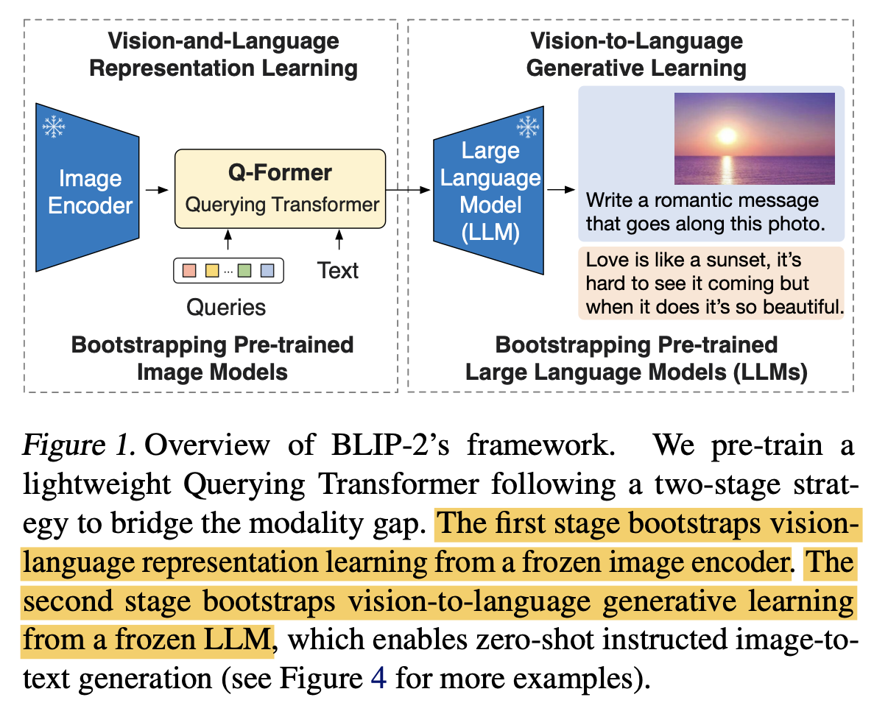

- 여러 benchmark에서 SOTA

# 3. Blip-2

- Q-former

  - 두 개의 transformer로 구성
    - Image encoder
      - learnable query: Self-attention layer를 통해 상호 interaction 및 cross-attention layer를 통해 image feature와 interaction 수행
    - Text encoder+decoder
      - learnable query: Self-attention layer를 통해 상호 interaction 및 causal-attention layer를 통해 text feature와 interaction 수행
  - 32개의 learnable query + BERT 기반 initialize 수행

- Pretraining: Image-Text representation Learning $\to$ BLIP과 동일하게 3개의 loss로 학습

  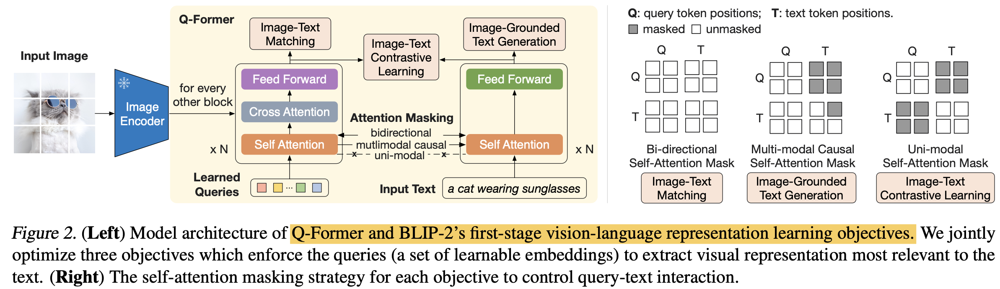

  - ITC (Image Text Contrastive learning) : Query, Text feature간의 attention만 수행하여, information leak 방지
  - ITG (Image-grounded Text Generation): Text에 대해 Next token은 못보도록 Causal-attention을 수행. [CLS]$\to$ [DEC] token으로 변경하여 decoding task임을 인지시켜줌
  - ITM (Image-Text Matching): Binary classificaiton을 통해 image-text 간의 fine-grained representation을 학습

- Fine-tuning : Image-to-Text generation learning

  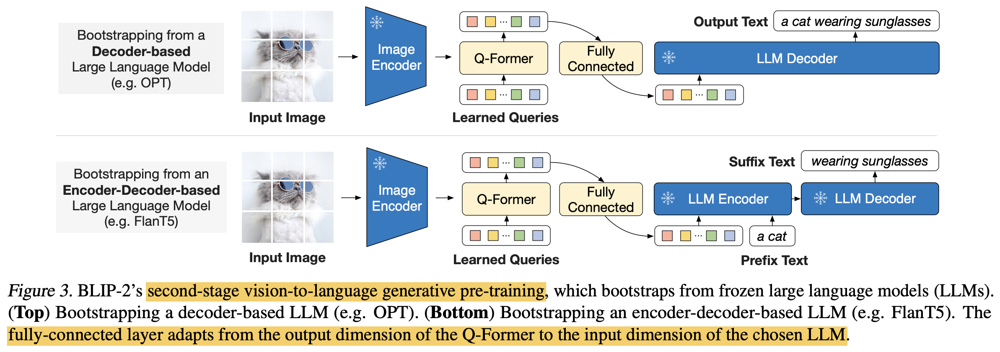

  - FC layer를 학습하여 soft-visual prompt를 생성하여 LLM 모델에 입력할 prompt를 만드는 역할

- Model pretraining

  - BLIP과 마찬가지로 CapFilter를 사용하여 Synthetic caption을 생성

- Zero-shot Image-to-text generation example

  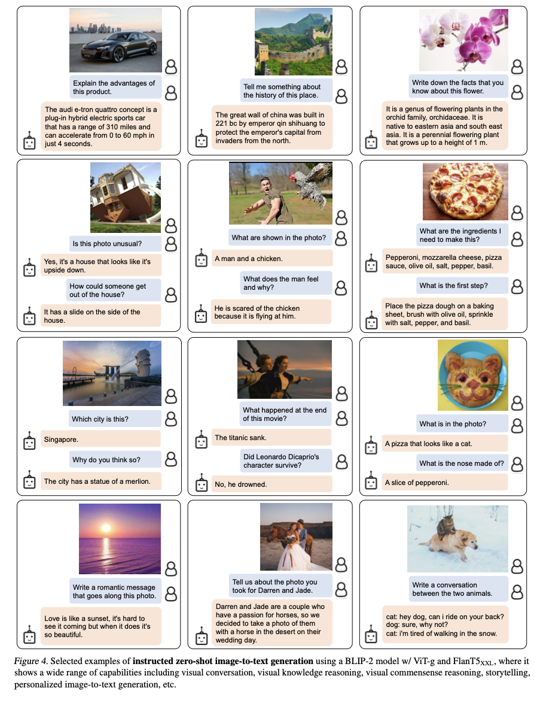

# 4. Experiments

- zero-shot vision-language tasks

  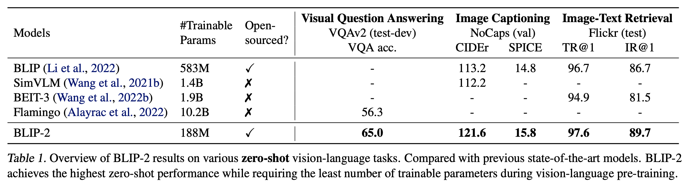

- zero-shot VQA

  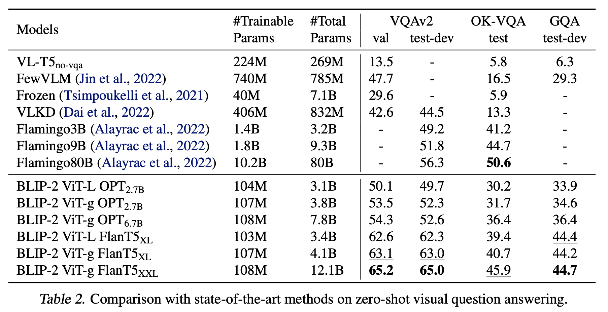

- Image Captioning 

  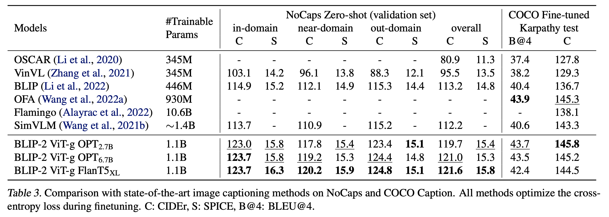

- VQA finetuned

  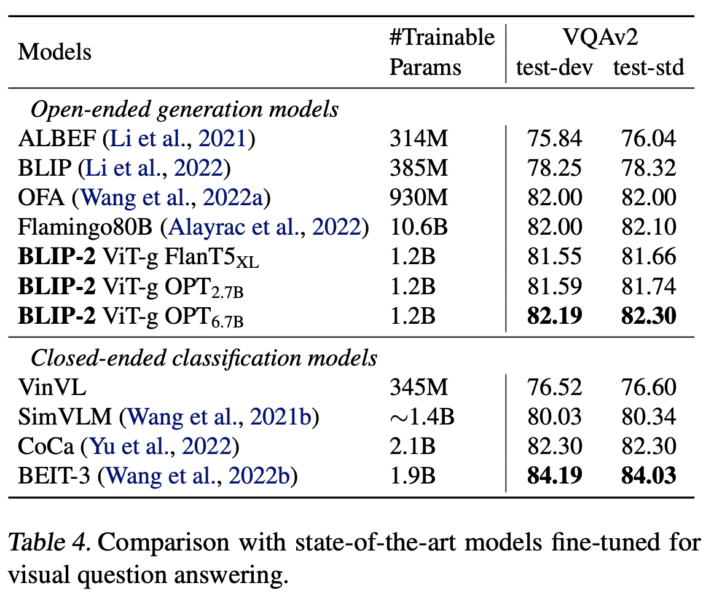

- Image Captioning Fintuned COCO & zero-shot Flickr30K

  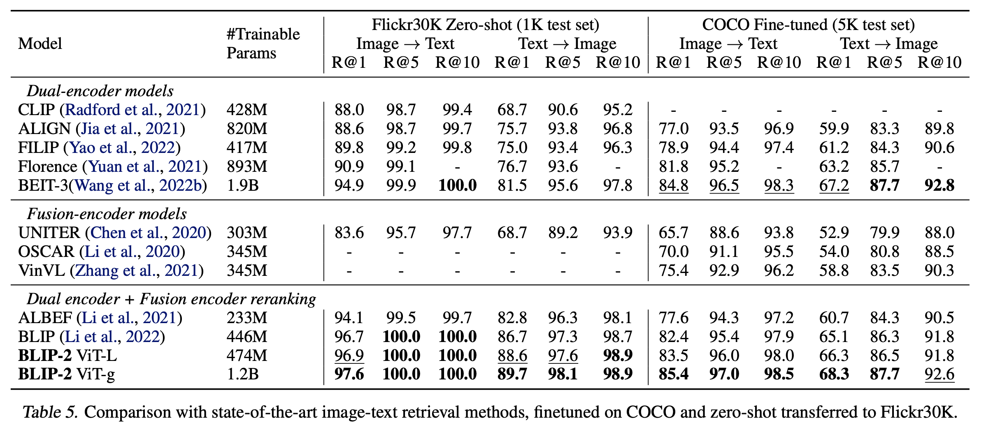

- Ablation Study

  - Pretraining stage의 효과 

    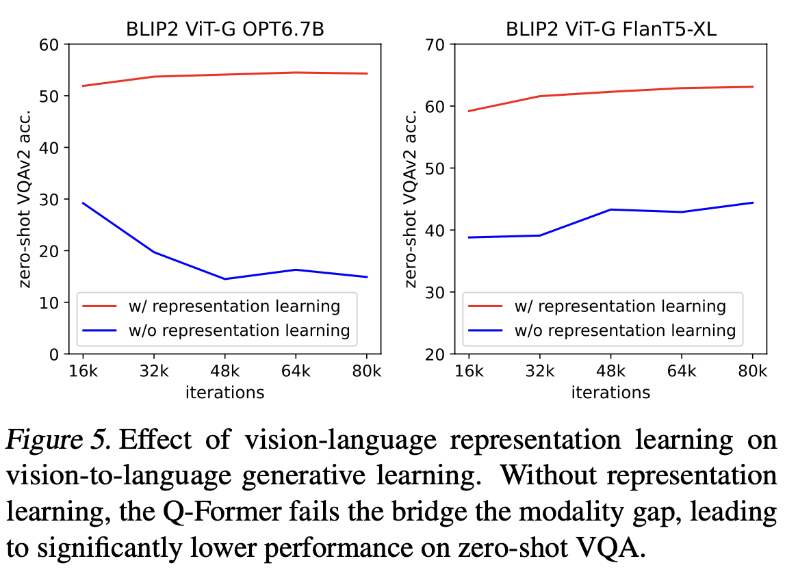

  - ITG Loss 유무에 따른 성능 비교

    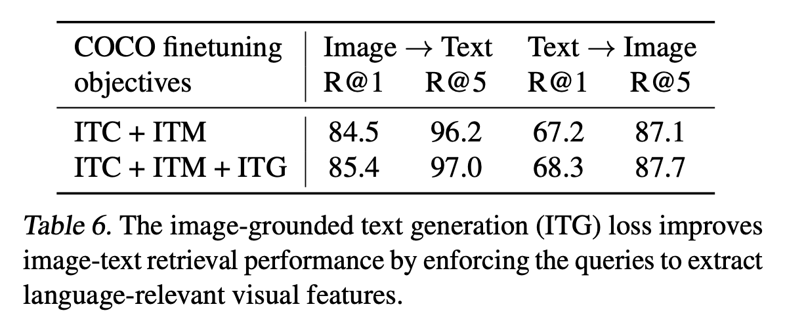
