# [LG] Spot the Error: Non-autoregressive Graphic Layout Generation with Wireframe Locator

- paper: http://arxiv.org/pdf/2401.16375
- github: https://github.com/ffffatgoose/SpotError
- AAAI 2024 accpeted (인용수: 1회, 2024-05-22 기준)
  - MicroSoft
- downstream task: Layout Generation

# 1. Motivation

- AR (Auto Regressitve) model (ex. LayoutTransformer)와 NAR (Non-AutoRegressitve) model (ex. BLT)를 비교하다 보니, NAR 기반 모델이 element (x, y, w, h, c)간의 order 변화에 더 robust하다는 특성을 발견함

  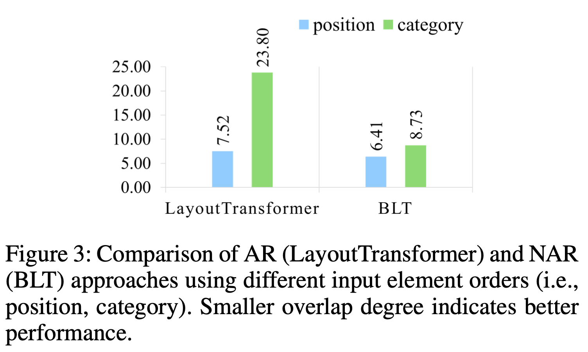

- 또한 NAR은 AR에 비해 causal attention으로 이전 step의 prediction이 다음 step에 영향을 끼치지 않고, 한번에 병렬적으로 모든 masked token을 예측하기에 한 gt에 겹치는 prediction 생성하는 경향이 있음 $\to$ overlap problem

  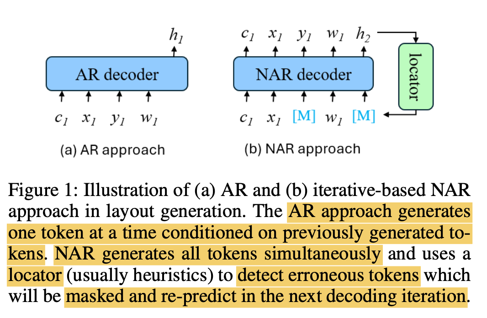

  - 이를 해결하기 위해 BLT는 heuristic하게 prediction score기준으로 masking하고자 하는 token을 찾았음

    - iterative하게 refine을 수행하면 NAR성능이 좋아지는 것을 확인

      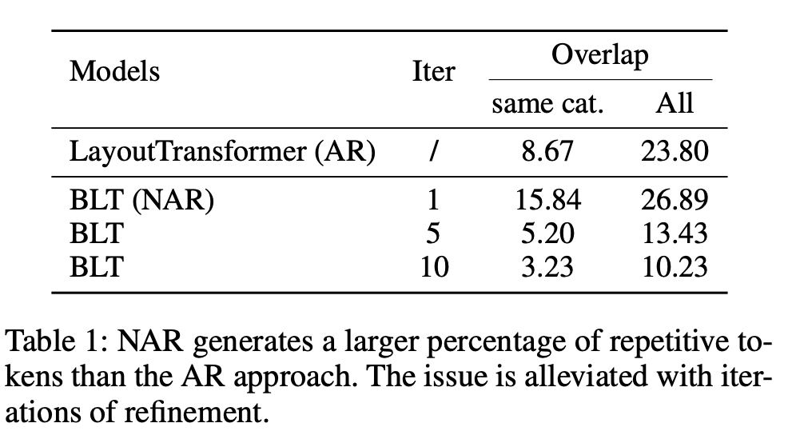

    - 하지만 이는 decoder의 학습된 distribution에 종속되어, error propagation을 유발할 수 있음

    $\to$ iterative decoding을 learnable locator를 두어 end-to-end로 피드백하면 어떨까?

# 2. Contribution

- AR과 NAR의 장단점을 분석함. NAR이 AR에 비해 input element order에 robust한 장점이 있는 반면, repetitive token generation하는 단점이 있음

- 이를 해결하고자 iterative-based NAR을 기반으로 learnable locator를 두는 방법을 제안함

- locator의 input으로 pixel-level (Image)와 object-level(entity) 비교 실험 결과, image level input의 locator가 더 noisy label을 잘 찾는 특성이 있음을 발견함 $\to$ image-level 기반으로 locator를 설계

  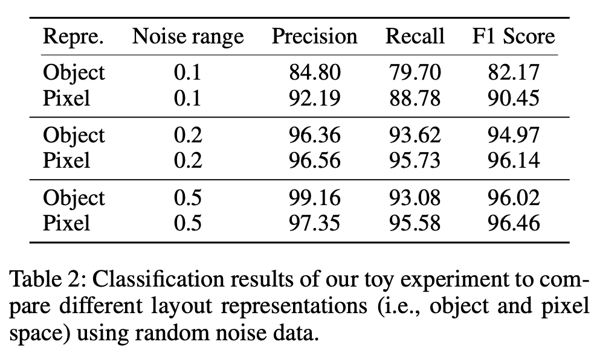

# 3. Spot the Error

- preliminaries

  - Layout Generation : Sequence generation task

    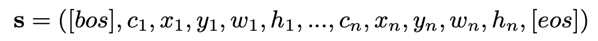

  - AR : 이전 step의 sequence를 condition으로 현재 step의 sequence를 예측

    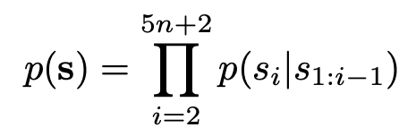

  - NAR: bi-directional attention을 통해 자기 자신 외의 다른 sequence를 condition으로 자기 sequence를 예측

    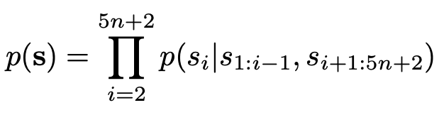

- Finding1. NAR은 AR보다 input element order에 robust함 $\to$ 앞서 설명

  - overlap 기준으로 비교

  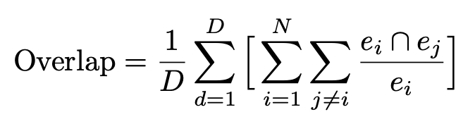

  - *D*: 전체 layout의 갯수
  - *N*: layout의 element 갯수?

- FInding2. NAR은 repetitive token generation 이슈가 있음

  - full bi-directional attention 기반으로 token prediction을 하다 보니 positional encoding만으로 모델이 서로 다른 token을 분류하는게 어려 $\to$ overlap이 커짐
  - iterative-based NAR은 이를 완화시켜줌 (앞서 설명)

- Layout Representation : Object vs. Pixel

  - Refine하는 주체인 Locator의 입력으로 object, pixel중 비교

    - Object: Transformer 입력으로 object entity을 주고, binary classification head를 두어 real layout, noisy layout 분류하는 task 수행하여 noisy layout일 경우 masking

    - Pixel: Faster-RCNN 입력으로 rendering된 이미지를 주고, RoI를 통과시켜 FC layer를 붙여 마찬가지로 noisy layout일 경우 masking

      $\to$앞서 본 표대로 Pixel기반이 성능이 좋아, learnable Locator로 채택!

- overall architecture

  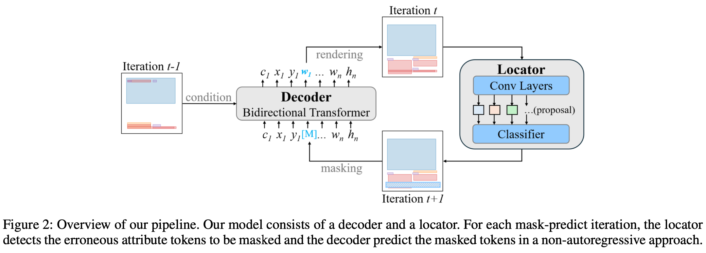

  - Decoder: BLT을 기반으로 사용

    - Positional Encoder만 3개의 entity 추가

      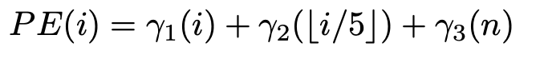

      - $\gamma_1$: token sentence index
      - $\gamma_2$: element-level index
      - $\gamma_3$: element의 갯수

    - Training : BLT와 동일하게 masking된 token을 예측

      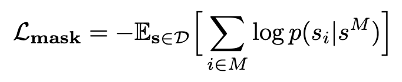

    - Inference: unknown token은 모두 masking후 예측

  - Wireframe decoder

    - 앞선 BLT decoder 출력과 Faster-RCNN의 image feature 출력간에 Cross attention 수행

      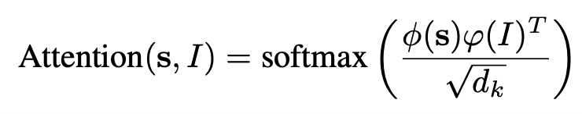

      - $\phi(s)$: query matrix로 BLT decoder 출력
      - $\phi(I)$: key matrix로 Faster-RCNN의 출력

  - Locator

    - 기존 BLT의 low predicted token masking은 model의 error propagation 문제가 있음

    - learnable locator의 경우 Faster-RCNN을 사용

      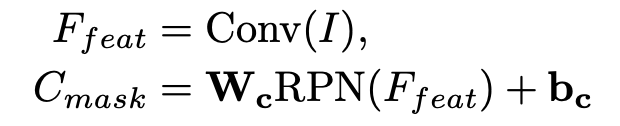

      - **W**$_c$, **b**$_c$: mask classifier의 weight & bias

    - BLT decoder의 generated (noisy) layout과 GT layout간의 동일 class entity간의 Bipartie matching 후, distance를 산출하여 threshold를 넘는 token을 masking

      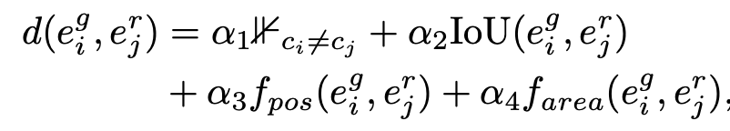

      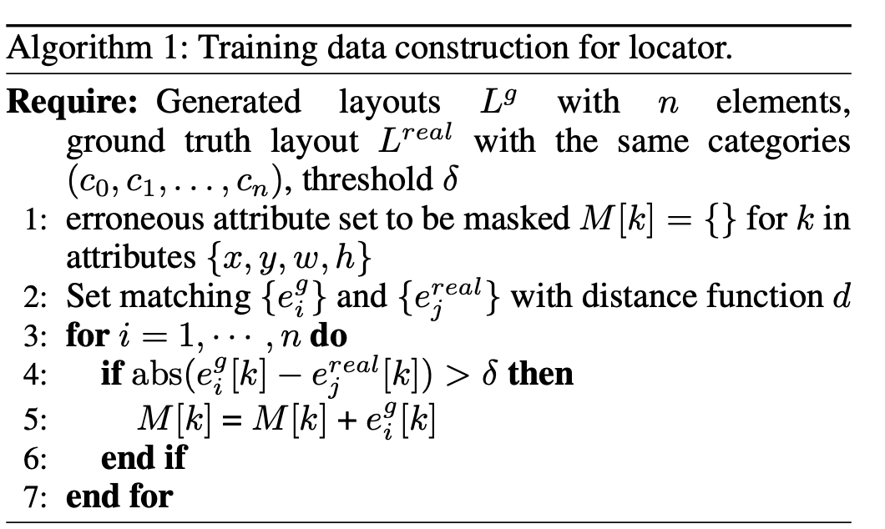

# 4. Experiments

- $C \to SP$

  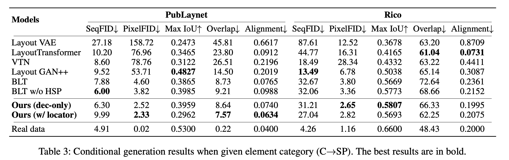

- $CS \to P$

  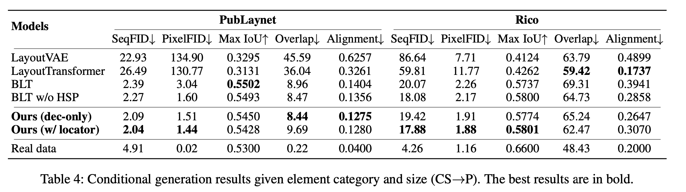

- Qualitative result

  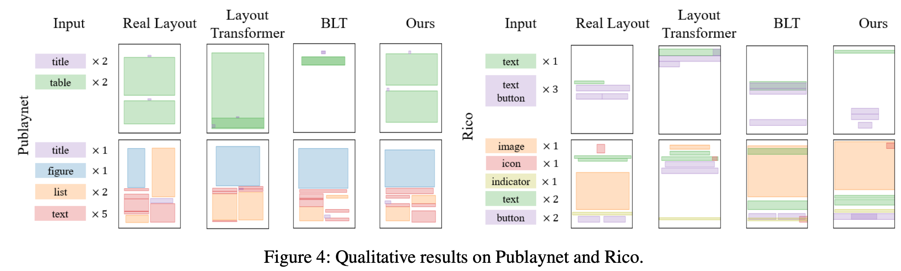

- Cross Attention Mask

  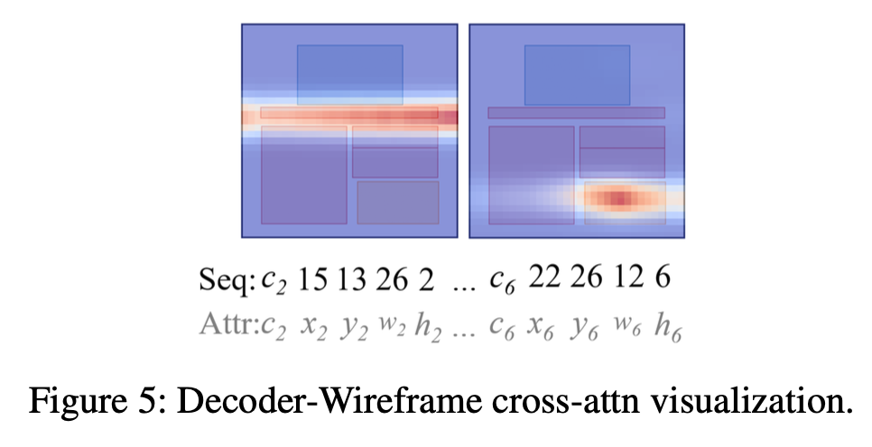

- Overlap performance vs. BLT

  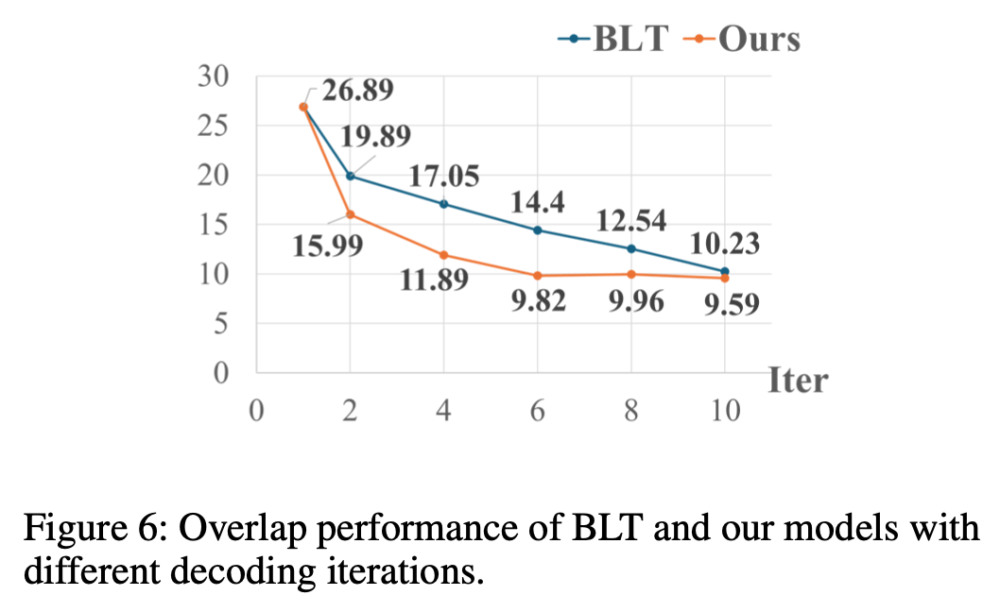

- Ablation study

  - Locator

    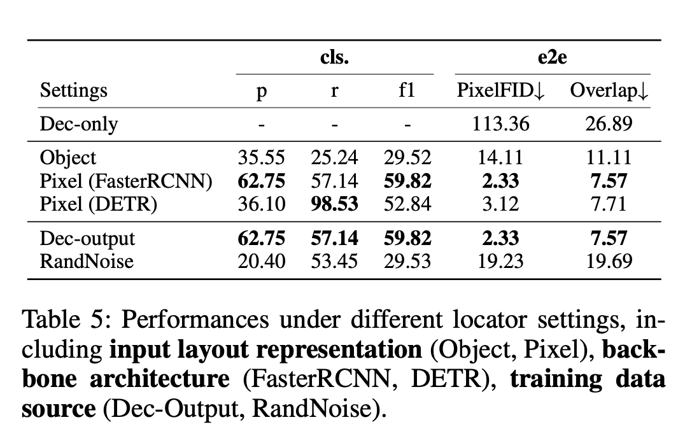
