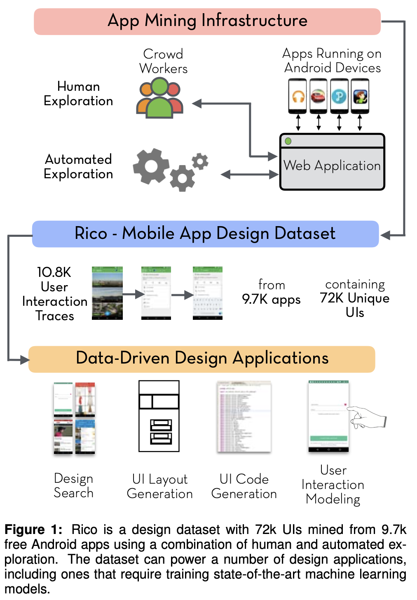
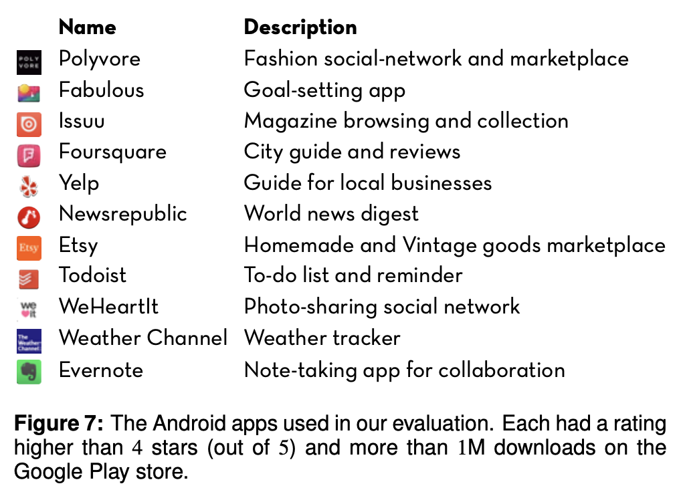
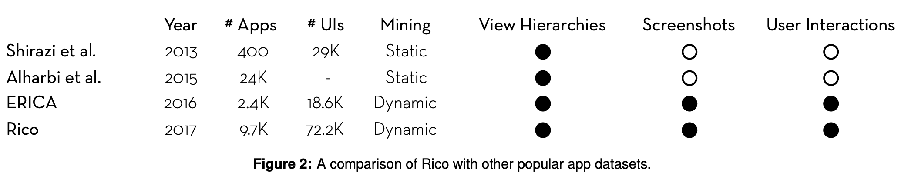
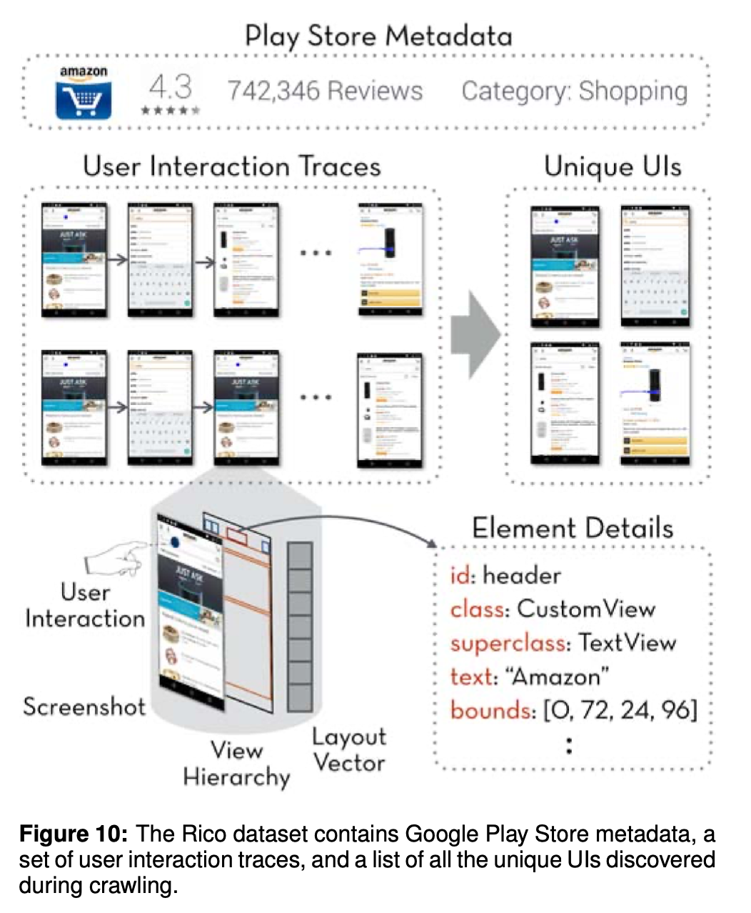
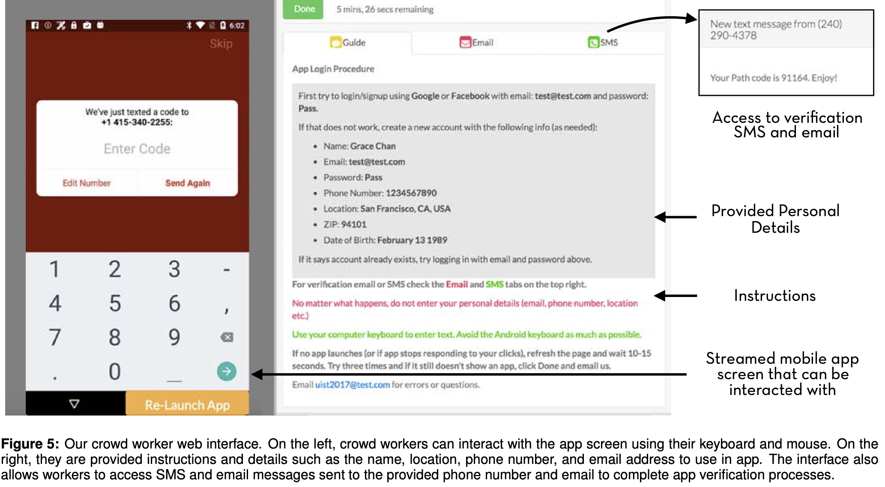
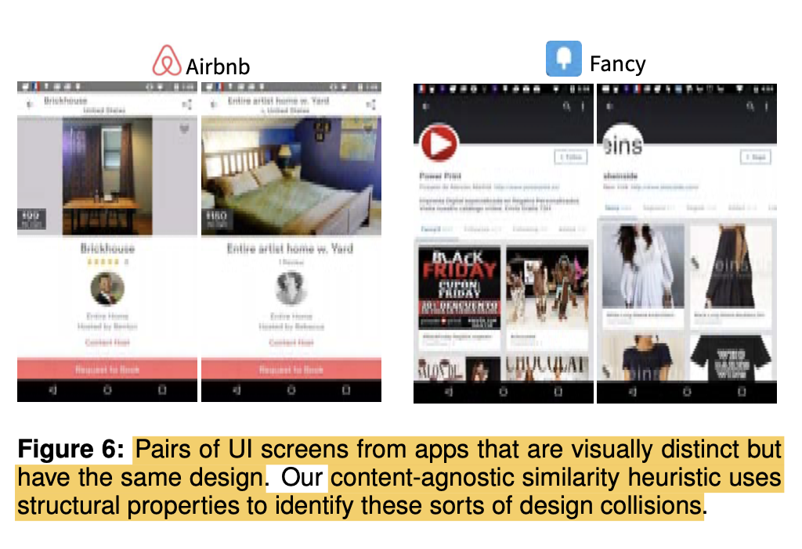
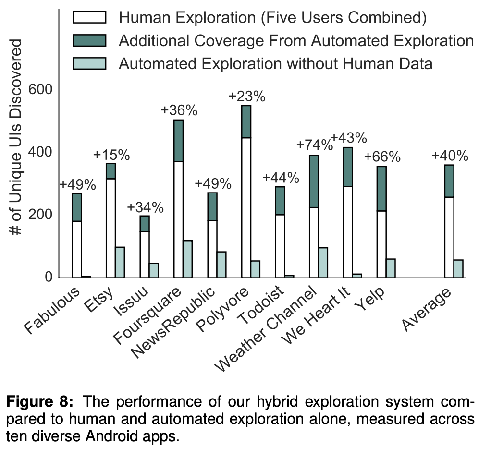
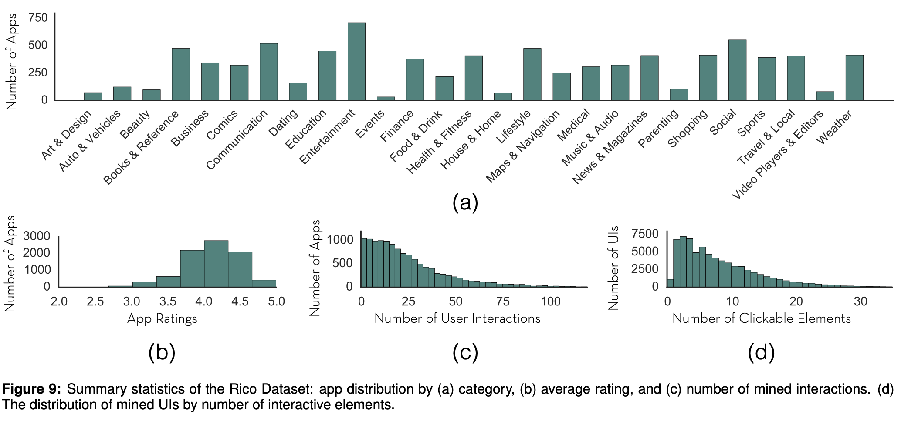
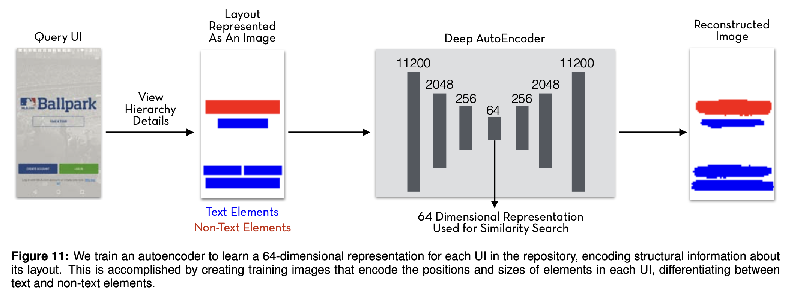
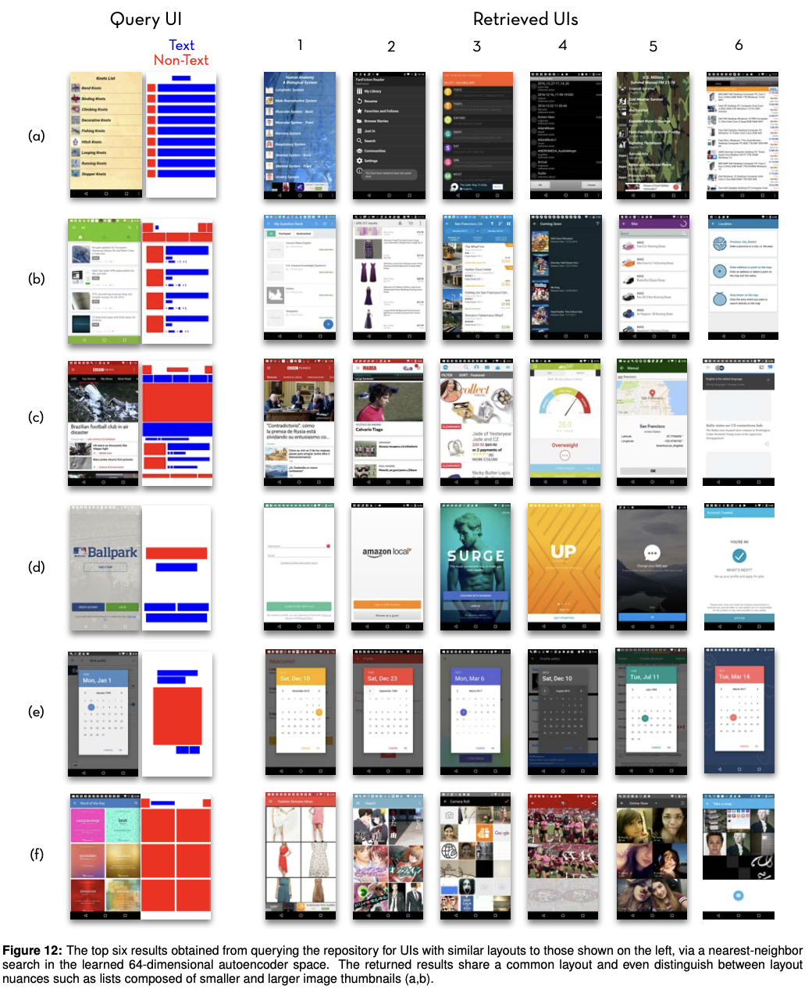

# Rico: A Mobile App Dataset for Building Data-Driven Design Applications

- paper: https://dl.acm.org/doi/pdf/10.1145/3126594.3126651
- site: http://interactionmining.org/rico
- UIST 2017 accepted (인용수: 274회, '24-05-23 기준)
- downstream tasks: design search, UI layout generation, UI code generation, user interaction modeling, and user perception prediction

# 1. Motivation

- Data-driven model은 app designers에게 최고의 연습 및 trend를 제공할 수 있고, design에 대한 performance를 예측함으로써 adaptive UI의 기준을 제공할 수 있다.
- Data-driven Deep Learning 모델을 개발하기 위해 필요한 App UI dataset을 제공해보자!

# 2. Contribution

- Android App store에서 제공된 app UI를 mineing하고 human-annotation을 가미하여 App UI design에 필요한 데이터셋 Rico를 제안

  

  - 27 category에 속한 app 9.7K (평점: 4.1)

    

  - visual, textual, structural, and interactive design property를 내포한 72K unique UI screen

- Auto Encoder기반으로 제안한 Rico dataset을 학습시켜 64-bit embedding vector를 생성하여 retrieval task를 효과적으로 수행

# 3. Rico

- Dataset

  - 기존에 존재하는 App UI dataset들에 비해 훨씬 대량

    

  - UI Layout뿐만 아니라, visual style, motion detail도 내포함

    

- Design search

  - query-by-example 기반으로 designer들은 종종 design sample을 찾고자 함
  - Keyword search를 충족하고자 Rico dataset은 Google Play Store의 meta data를 제공함
    - text 유무 정보 제공
    - content creator가 정의한 resource-id, classname 제공
    - textual data는 weakly-supervised하게 해당 functionality에 대한 semantic clue를 제공

- UI Layout Generation

  - 모든 element들과 그 attributes (position, dimension)을 제공
  - app ratings, app download 횟수 제공 $\to$ good, bad layout design에 대한 insight 얻을 수 있음

- UI Code Generation

  - App 개발에 필요한 code를 제공

- User Perception Prediction

  - Web page에 대한 user의 첫인상을 모델이 예측하는데 활용
  - Play store의 metric을 기반으로 UI screen과 animation에 대한 정보 제공 (ex. average rating)

- Mining App Design

  - Human-powered + Programmatic exploration 기반으로 UI design을 mining

  - Crowdsourced Exploration

    - 해당 web-based architeture 활용

      

  - Automated Exploration

    - Depth-first search 기반으로 UI app의 state space를 search하여 design을 찾음

  - Content Agnostic Similarity Heuristic

    - Content와 무관하게 pixel difference가 정해진 threshold보다 가까우면 같은 state로 정의

      

  - Coverage Benefits for Hybrid Exploration

    - App당 5명을 고용하여 app내 ui를 모두 따게 하고, automated exploration을 rating한 결과가 human-only, automated-only보다 좋음

      

- Rico Dataset 구성

  

- Training AE for Layout Embedding

  

  - query-by-example에 효과적

    
