# [LG] LayoutTransformer: Layout Generation and Completion with Self-attention

- paper: https://arxiv.org/pdf/2006.14615
- github: https://github.com/kampta/DeepLayout
- ICCV 2021 accepted (인용수: 115회, '24-05-25 기준)
- downstream task: Layout Generation

# 1. Motivation

- 원시단계의 element가 주어졌을 때, 요소간의 관계를 모델링하여 layout generation을 하면 좋겠다. $\to$ Transformer를 이용해보자!

  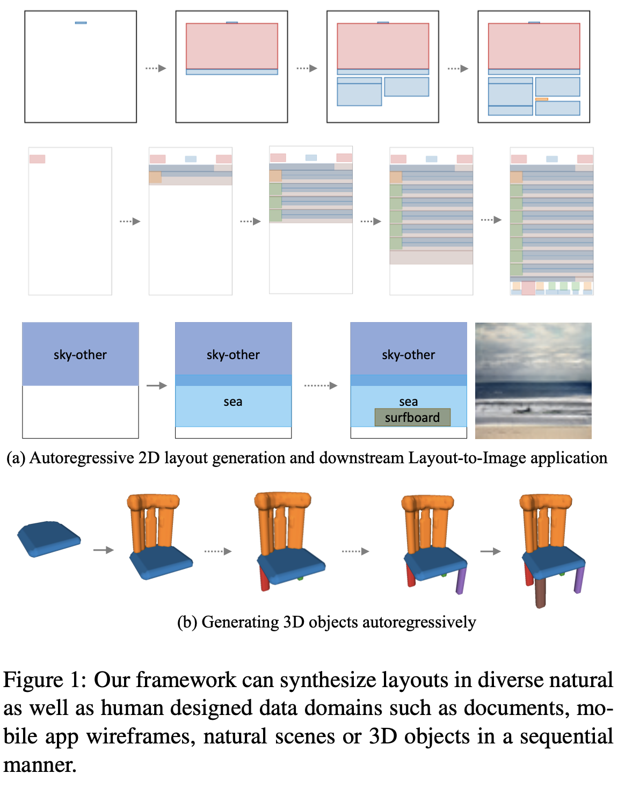

# 2. Contribution

- Self-attention 기반으로 이루어져 있어, next category를 예측하는데 중요한 부분이 무엇이었는지 쉽게 visualize할 수 있는 Auto-Regresstive 모델 LayoutTransformer를 제안함
- 중요한 attribute에 집중적으로 attention할 수 있게 하여 내재적인 대칭구조가 많은 document 나 app 개발 등에 중요한 기능을 수행할 수 있게 설계하기 위해 Layout element의 서로 다른 attributes를 개별적으로 모델링하였음
- Layout generation task를 학습했을때 학습된 feature가 object의 semantic relationship을 학습하는 신기한 현상을 발견함
- 다양한 domain에서 좋은 성능을 나타냄

# 3. LayoutTransformer

- preliminaries

  - Layout은 graph로 모델랑하며, layout의 category, geometry (x,y,w,h)를 각각 d-dim으로 embedding하고 모든 layout을 concat하여 표현한다.

    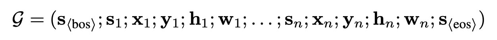

  - chain rule에 의해 conditional distribution을 구하는 task로 정의할 수 있다.

    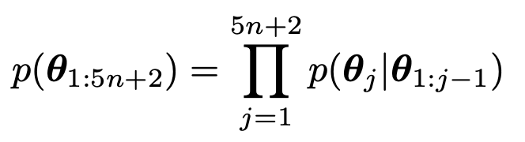

- overall diagram

  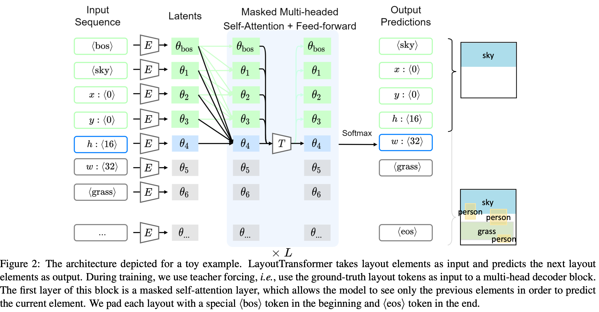

  - input sequence: 초기 K개의 주어진 layout (primitives)들로 random permutation으로 구성됨.

    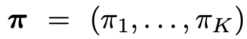

    - 총 attributes는 d-dimension의 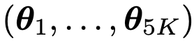로 구성

  - 모델 구조는 Transformer구조와 비슷

    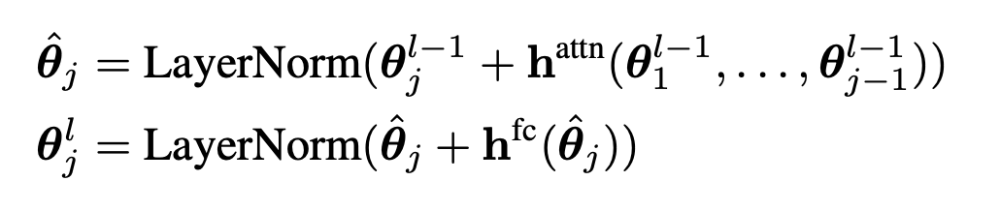

    - 이전 token들만 attention 수행하도록 masking

  - Loss

    - Over confidence를 방지하고자 Cross Entropy대신 KL Divergence를 활용

      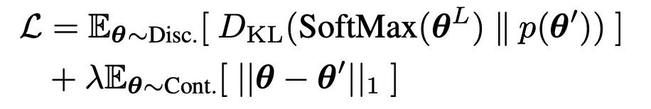

# 4. Experiments

- 3D shape synthesis using PartNet dataset

  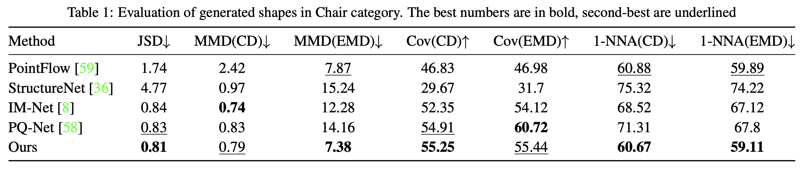

  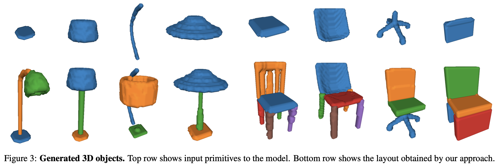

- Natural scene layout generation with MS-coc 

  - qualitative result

    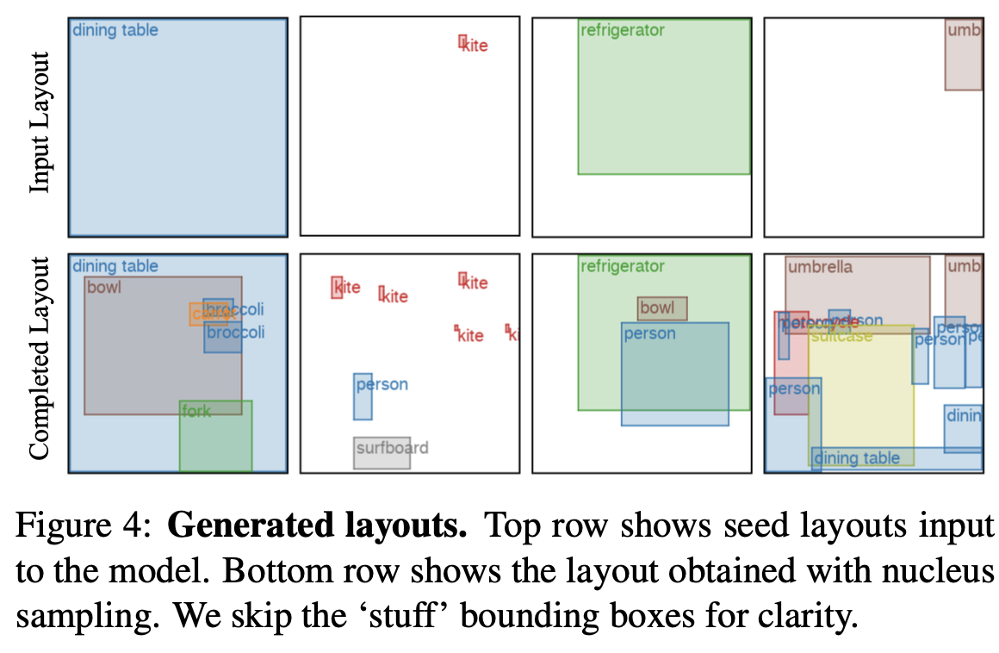

  - layout2Img

    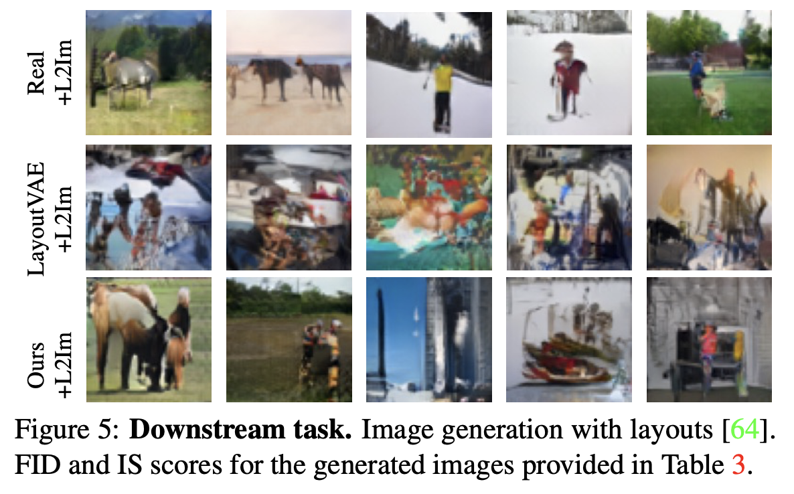

  - Distribution of layout attributes (real vs. generated)

    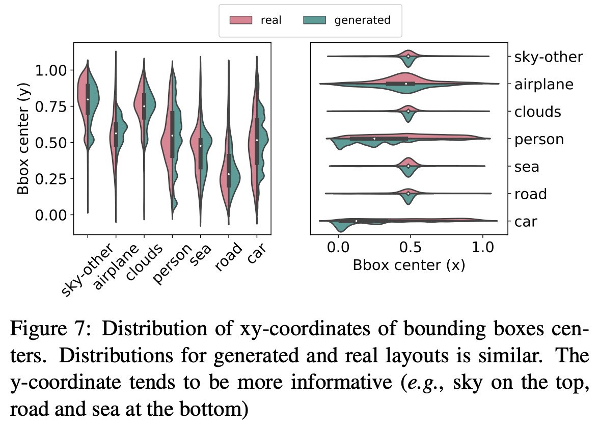

    - person, car등 major class에 경우 biased되어 center값이 real과 다른 경향

  - Quantitative result

    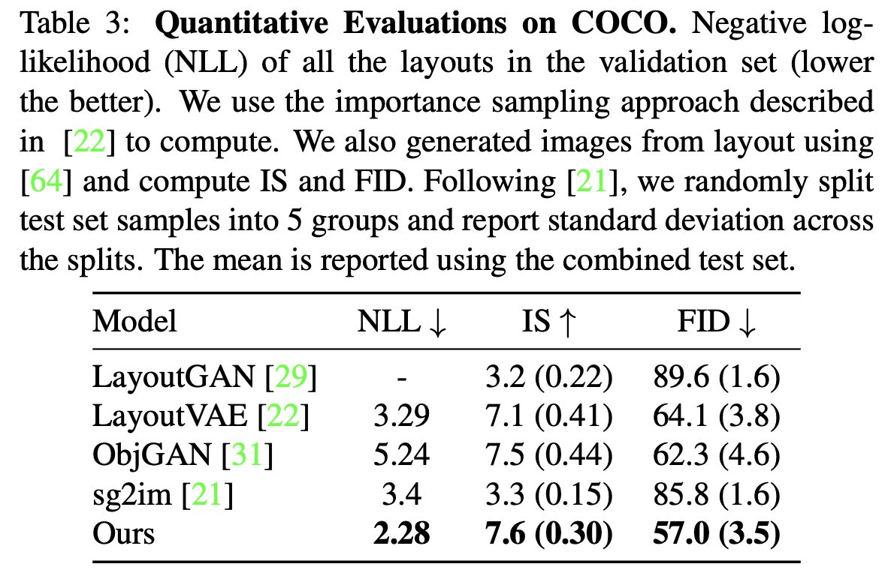

  - T-SNE plot of categorical embeddings

    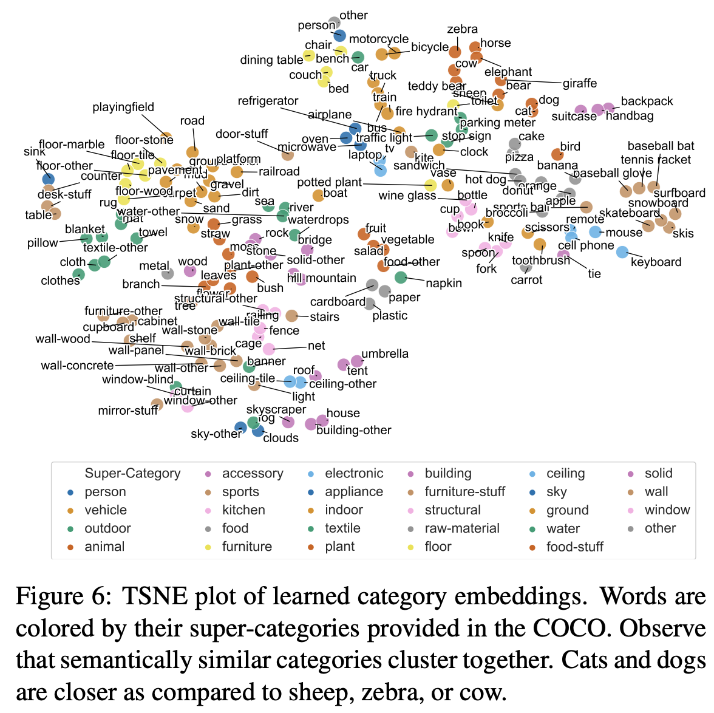

    - 유사 category끼리 clsutering된걸로 보아, layout generation task는 layout간 semantic relation을 학습함을 확인

  - Document & App

    - RICO 

      - Initial primitive에 따른 complete layout

        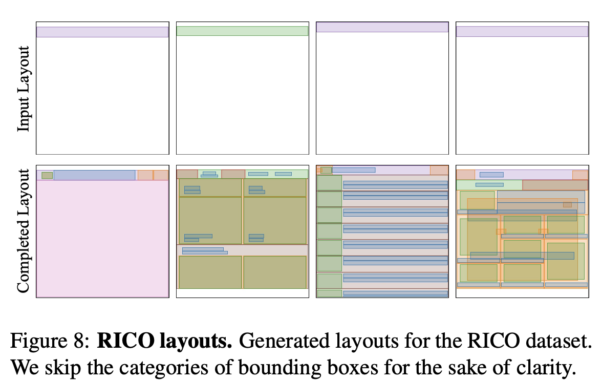

      - 동일 initial layout에 따른 multiple generated results

        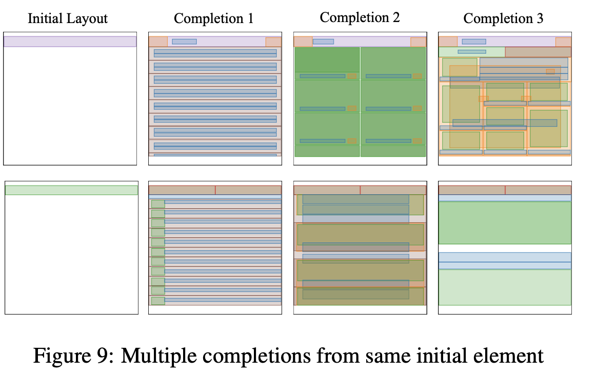

      - LayoutVAE vs. Ours

        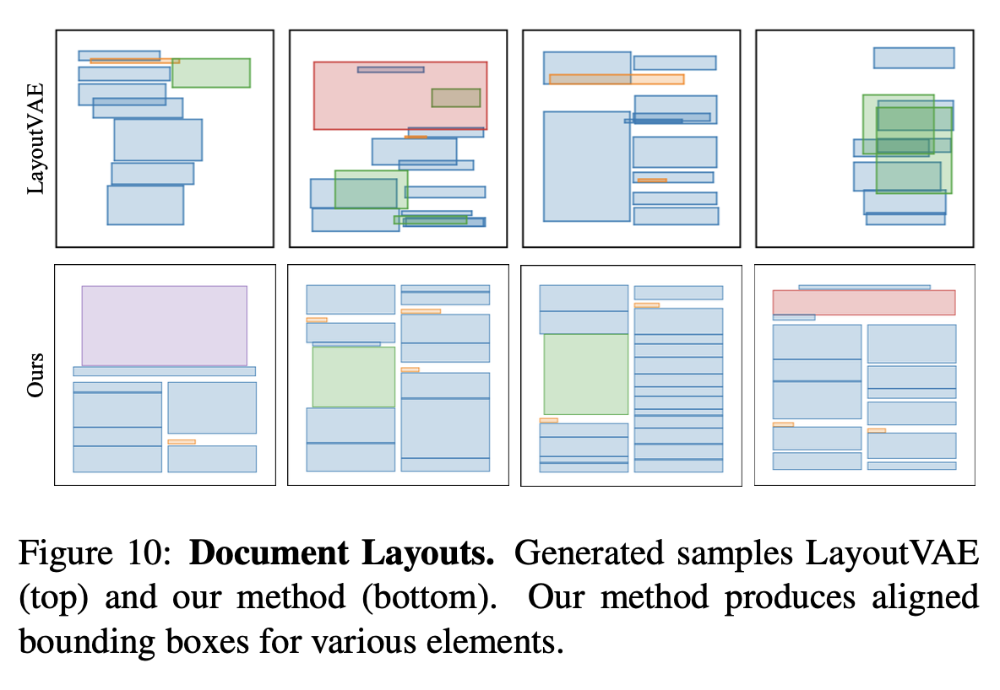

      - Quantitative results

        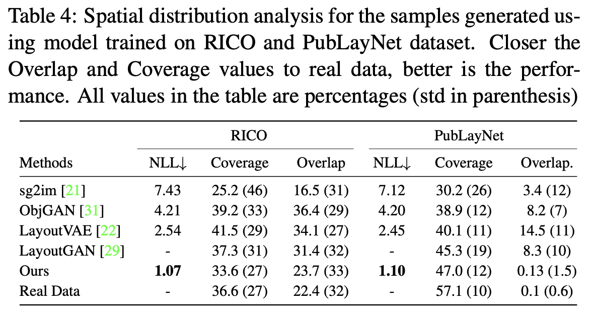
