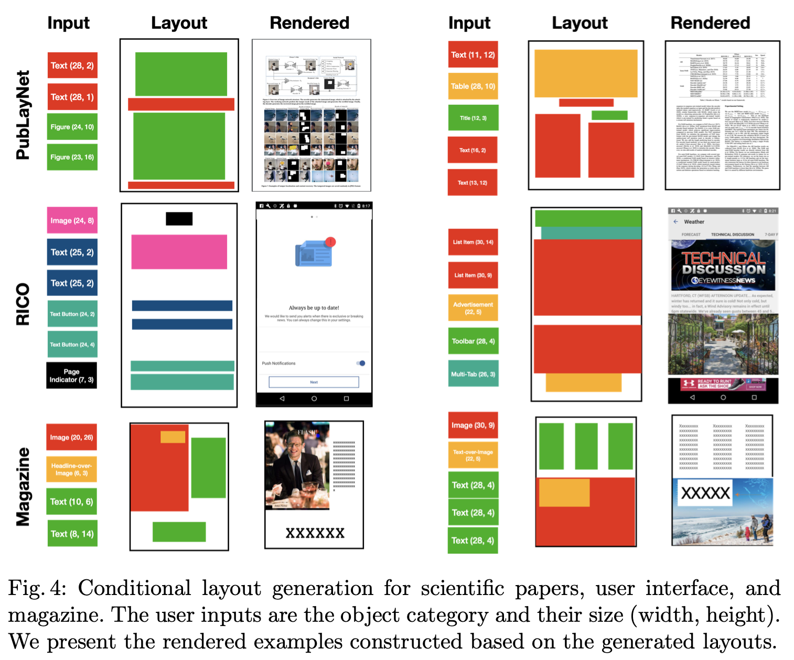

# [LG] BLT: Bidirectional Layout Transformer for Controllable Layout Generation

- paper: https://arxiv.org/pdf/2112.05112
- github: https://github.com/google-research/google-research/tree/master/layout-blt
- ECCV 2022 accpeted (인용수: 47회, '24-05-26 기준)
- downstream task: Layout Generation

# 1. Motivation

- 기존 Transformer 기반 Layout Generation은 layout을 sequence of objects로 보고, object를 sequence of attributes로 모델링함.

- 즉, 이전까지 prediction한 object attribute를 가지고 현재 attribute를 예측하다 보니, permutation에 따른 예측 밖에 못하는 한계를 지님

  - 이를 **auto-regressive** 혹은 **immutable dependency chain**에 묶여 있다고 표현

  

  $\to$ NLP처럼 bi-directional하게 attention을 기반에 **non-autoregressive**하게 수행하면 이를 해결할 수 있지 않을까?

# 2. Contribution

- 기존 SOTA transformer 기반의 layout generation의 한계를 해결할 수 있는 controllable layout generation 모델을 제안함
- Hierarchical mask sampling기반의 정책을 기반으로 기존보다 좋은 성능 향상을 보임
- 다양한 benchmark에서 SOTA를 달성함

# 3. BLT

- Problem formulation

  

  - 기존 방식 (Auto-Regressive)

    

    - 즉, 오직 $x \to y \to w \to h$순서로만 layout element prediciton을 수행함

- BLT

  - Non-autoRegressvie방식의 Bi-attention 으로 attention을 수행하되, 모델 및 구조는 LayoutTransformer와 동일

  - 하지만, Naive하게 NLP에서 사용한 Bi-attention을 수행하면 오히려 기존 auto-Regressive 방식에 비해 성능 하락을 보임

  - 이를 해결하고자 hierarchical mask sampling 도입

    

    - Layout의 attribute를 semantic group별로 3개로 묶음 (category, location(x,y), and size (w, h))

      - location은 8-bit로 discretize 수행

        

    - 이 중 random으로 masking 

    - Prediction은 parallel하게 하되, iterative attribute refinement를 통해 모델이 low prediction score로 예측한 attribute는 maksing해서 다시 돌림

      

    - Loss

    

# 4. Experiments

- Rico & PublayNet

  

- Ms-COCO, Ads, 3D-Front, Magazine

  

- Unconditional Layout Generation

  

- User study (AMT)

  

- Qualitative Result

  

  

- Attention token 분석

  

- Number of layout 에 따른 inference 속도 비교 (vs. Autoregressive)

  

- Ablation

  

  - Condition 순서에 따른

    
