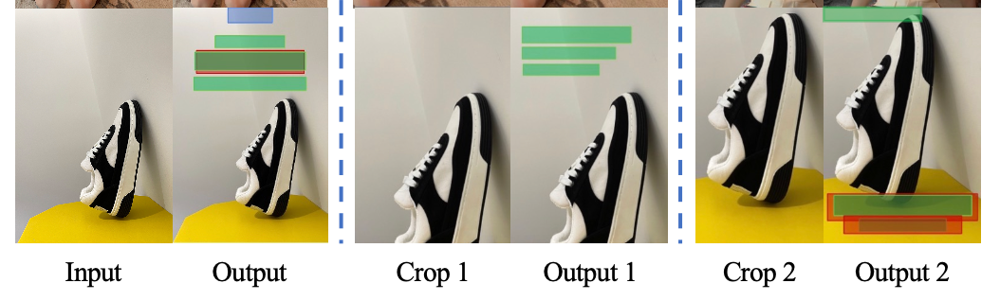
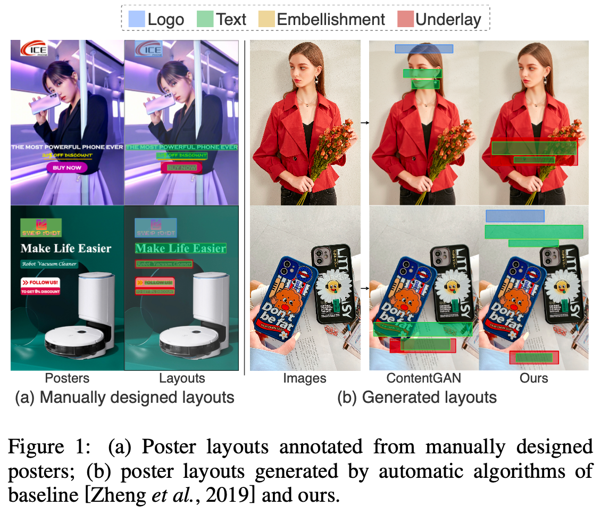
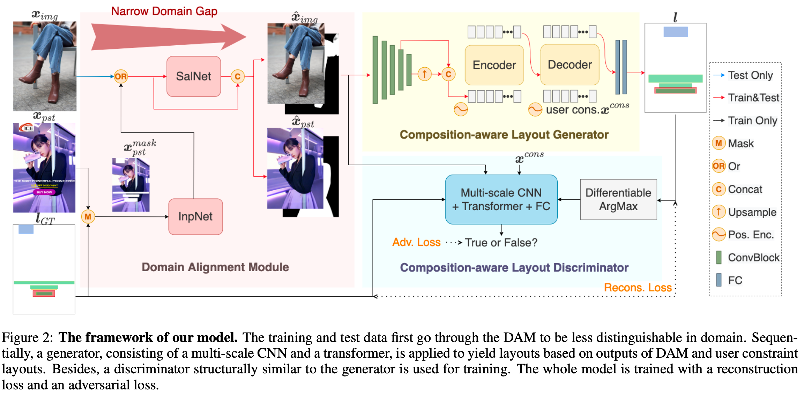
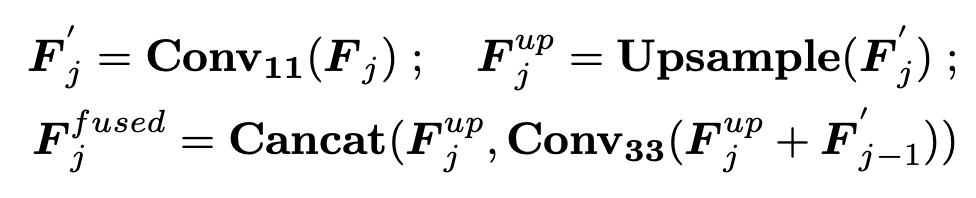
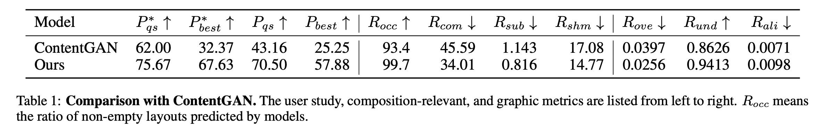
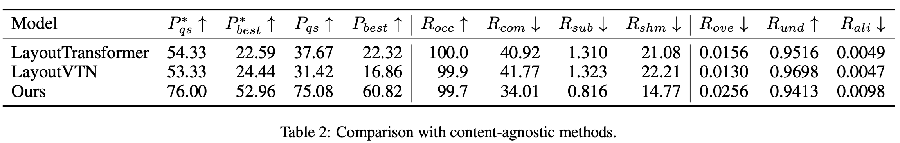
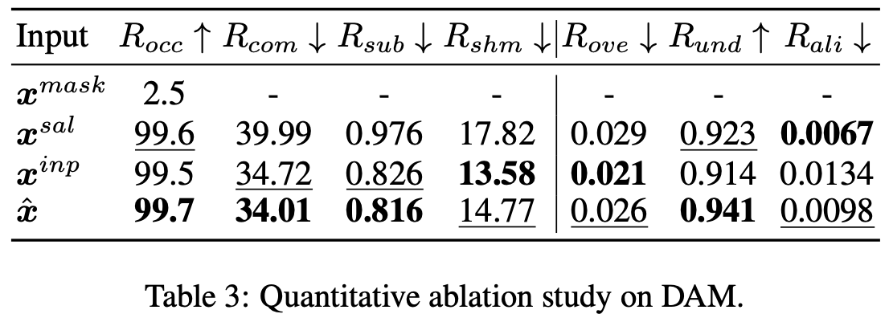
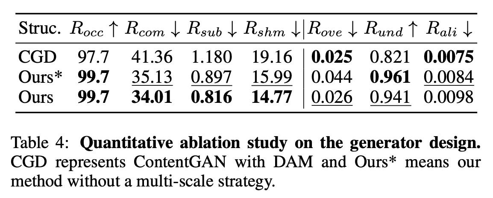
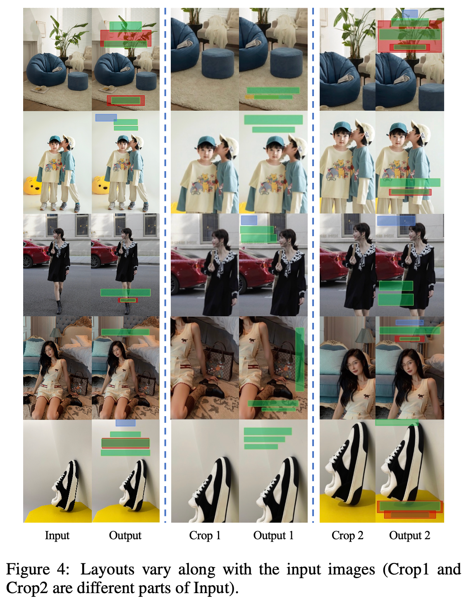
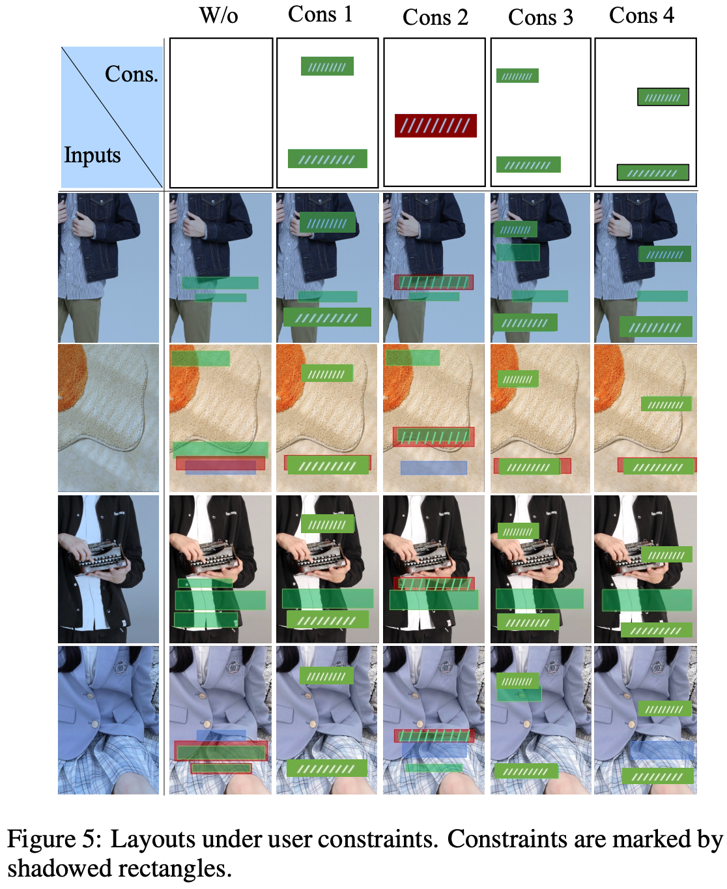

# [LG] Composition-aware Graphic Layout GAN for Visual-textual Presentation Designs

- paper: https://arxiv.org/pdf/2205.00303
- github: https://github.com/minzhouGithub/CGL-GAN (깡통)
- IJCAI 2022 accepted (인용수: 31회, '24-05-29 기준)
- Downstream task: Layout Generation

# 1. Motivation

- Layout Geneartion 분야에서 image contents를 무시하고 (agnostic) graphic relationships만 고려한 연구가 진행되고 있음

- 하지만 poster등과 같은 layout design을 하기 위해서는 image composition도 매우 중요함

  

   $\to$ Image composition을 고려하여 user-constrain을 만족하는 latyout generation을 수행해보자!

  - 용어 정리
    - Images: Layout이 없는 background에 들어갈 순수 이미지
    - Posters: Layout이 있는 이미지+layout 

# 2. Contribution

- Visual-Textural poster용 composition-aware graphic layout을 생성하는 CGL-GAN을 제안함
  - Domain Alignment Module (DAM)을 사용하여 image-poster-annotation pair없이 poster-annotation pair만 가지고 학습할 수 있게됨. 이를 위해 두 pretrained net을 활용하여 Image를 생성
    - Pretrained SalNet (Salient Detection Net)
    - Pretrained InpNet (Inpainting Net) 
  - Large layout dataset을 제안함 (Poster, human labeled)
  - Image-composition-aware layout generation 문제를 해결하여 제안한 데이터셋에서 SOTA를 달성

# 3. CGL-GAN

## 3.1. Dataset

- e-commerce platform에서 광고용 poster를 crawling하여 Human annotated dataset을 생성함

- Train: 60,548장의 poster-layout pair

- Test: 1,000 pure images

  

- Layout annotation : **c**$_i$ (category), **b**$_i$ (bounding box)로 라벨링 수행

## 3.2.  Composition-aware Graphic Layout GAN

- overall diagram

  

  - Domain Alignment Module: Train (poster) / Test (image)간의 간극을 줄여주기 위해 image-composition을 생성하는 모듈
  - Composition-aware Layout Generator: composition image를 기반으로 user constrained과 cross-attention을 수행하여 layout을 generation
  - Composition-aware Layout Discriminator : Image와 layout이 matching이 positive한지 negative한지 binary classification 수행. 

### Domain Alignment Module (DAM)

- 학습할 때는 Poster를 입력받고, 검증할 때는 Image를 입력받기 때문에, 두 domain 간의 gap이 발생 $\to$ Domain alignment를 수행
- InpNet (Inpaintint Network)
  - 학습 시, Layout GT를 기반으로 masking된 poster를 입력받아 (pure) image를 생성
- SalNet (Salience detection Network)
  - 학습 시, image에 대해 binary salient mask를 생성하여 뒷단 (generator)에서 image를 잘 이해하도록 salient 정보를 제공하는 역할
- 추론 시에는 image만 입력받아 salience map과 concat하여 generator에 제공

### Composition-aware Layout Generation

- CNN : multi-scale feature를 이미지에서 추출 (Non-autoregressive)

  - FPN구조이며, single feature에서 개별적으로 layout을 생성하지 않고, concat하여 한번에 예측

    

- transformer: layout generating rule을 implicit하게 학습 (w/ user constrain)

- FC layer: Layout의 class, bounding box 예측 수행

- Loss : DETR에서 영감을 받아 Optimal Transport기반 Bipartite matching기반으로 layout reconstruction loss로 학습
  - Dynamic layout 갯수를 고려하여 non-objects도 별도로 출력

### Composition-aware Layout Discriminator

- Generator와 유사한 구조
- Task가 generator보다 쉽기 때문에 encoder / decoder의 갯수를 줄이고 (8 $\to$ 4), backbone도 줄임 (Res50 $\to$ Res18)
- Loss: Hinge Loss
  - Image와 layout (user constrained + G.T. or predicted layout)이 matching pair이면 positive, 아니면 negative

# 4. Experiments

## Metrics

- 기존 메트릭은 graphic relation만 고려하는 메트릭이기 때문에, visual balance of poster, overlap of elements, product presentation등을 고려하기 위해 새로운 메트릭을 제안함
  - User study : Human이 위 사항을 고려하여 점수를 메김 
    - $P_{best}$: 개별 layout 중 제일 좋은 layout으로 선택되었는지 안되었는지 체크
    -  $P_{qs}$: 개별 layout이 eligible한지 안한지 체크
  - Composition-relevanct measures :Content-relevant 한 layout인지 아닌지 체크
    - Readability and visual balance $R_{com}$: designer들이 flat region에 text-only element들을 place하는 현상을 발견함. 이를 기반으로 text-only element가 놓인 위치에서 sobel을 적용해 gradient값이 낮은지 체크
      - (뇌피셜) text-only element가 놓인 영역은 edge (색, 모양이 급히 변하는 것)이 없는 곳이라는 가정
    - Presentation of subjects $R_{sub}, R_{shm}$: 매력적인 포스터는 해당 product를 highlight해야함. 
      - $R_{sub}$: clip기반으로 해당 category tag에 대한 attention map을 생성하여 layout region에 속하는 attention value를 sum을 취함
        - (뇌피셜) 해당 product 사진 영역과 layout이 겹치지 않기에, layout의 attention value가 낮아야 한다고 생각하는 듯
      -  $R_{shm}$: Layout 유/무에 따른 salient image를 VGG16에 입력하여 출력된 output logit의 $L_2$ distance를 메김. 
        - (뇌피셜) 해당 product 사진 영역과 layout이 겹치지 않기에, layout의 attention value가 낮아야 한다고 생각하는 듯

## Results

- Qualitative Result

  

- Quantitative Result with content-aware SOTA

  

- Quantitative Result with content-agnostic SOTA

  

- Ablation study

  - DAM의 출력값에 따른 성능 비교

    

  - Generator design에 따른 성능 비교 (vs. CGD)

    

    - Ours가 content에 따라 다른 layout을 생성함

      

    - User constrain에 따른 layout generation

      
