# [LG] LayoutGAN: Generating Graphic Layouts with Wireframe Discriminators

- paper: https://arxiv.org/pdf/1901.06767
- github: https://github.com/JiananLi2016/LayoutGAN-Tensorflow
- ICLR 2019 accepted (인용수: 207회, '24-05-30 기준)
- downstream task: Layout Generation

# 1. Motivation

- 기존 연구들은 Image-level로 layout을 생성하곤 했음

  $\to$ 반면, layout을 직접적으로 생성하면 더 좋을 수 있지 않을까?

# 2. Contribution

- 직접적으로 structured-data (layout)을 생성하는 LayoutGAN을 제안함
- Differentiable한 wireframe rendering layer를 통해 discrete element arrangements간에 alignment를 평가하는 Discriminator를 구현함
  - wireframe rendering layer: layout 정보 (c, x, y, w, h)를 통해 image를 rendering하는 layer

# 3. LayoutGAN

- Overall architecture

  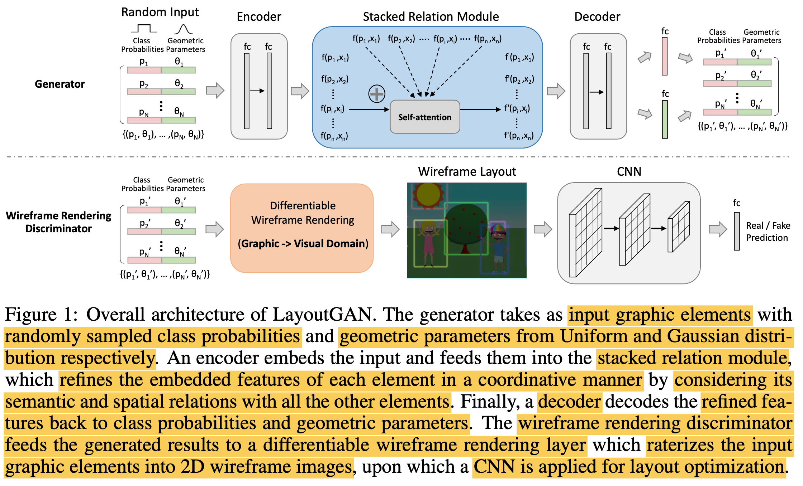

  - Design (layout) representation

    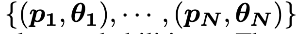

    - **p**$_i$: class probability. 6개의 class로 구성 (title, picture, etc)
    - **$\theta_i$**: geometric-parameters. 

  - Generator

    - input: randomized graphic elements

    - output: refined graphic elements

    - initial graphic element **z**를 입력받아, 학습 데이터의 graphic element structure를 예측

      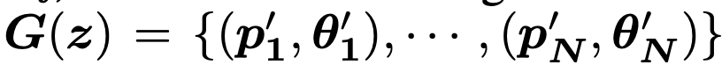

      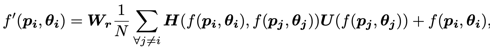

      - $f(p_i, \theta_i)$: i번째 입력 element의 feature map

      - $f'(p_i, \theta_i)$: i번째 출력 element의 feature map

      - ***H***: dot product

        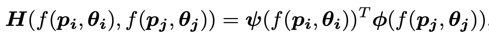

      - ***U***: unary function (element 간의 계산)
      - **$W_r$**: weight matrix

  - Discriminator

    - Synthesized & Real layout을 분류하는 분류기

    - layout parameter간의 relation-based / rendered image-based discriminator로 구성 (2개)

      - Relation-based discriminator

        - 역할: graphic element간의 global relation을 모델링

        - Generator의 출력값 $f'(p_i, \theta_i)$ 혹은 정답을 입력받아 global graphical relation을 FC layer + max-pooling을 통과시켜 얻음

          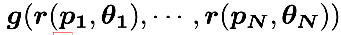

          - **g**: max-pooling

          - **r**: self-attention w/o residual

            **r**=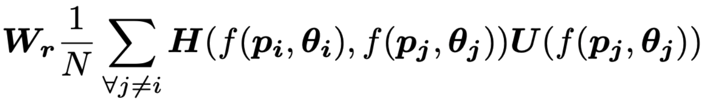

      - Wire-frame rendering discriminator

        - Wireframe rendering layer를 통해 image ***I***를 생성

          - input : *N* element layout

            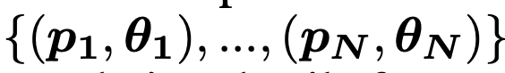

          - grayscale image ***F***$_\theta$로 변환

            - *M*개의 element type으로 구성된 ***I***를 생성

              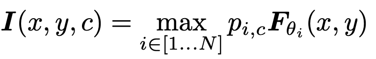

              - **F**$_\theta$ 의 $\theta$는 point, rectangle, triangle이 될 수 있으며, class probability, coordinate에 대해 differentiable 하도록 kernel을 구성함 

              - *k*: bilinear interpolation kernel $k(d)=max(0, 1-|d|)$

                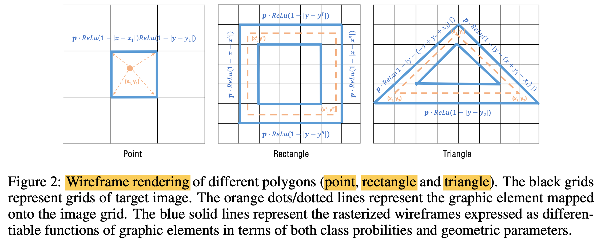

                -  $\theta$ = point

                  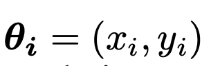

                  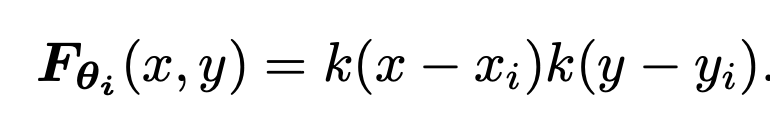

                - $\theta$ = rectangle

                  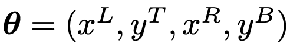

                  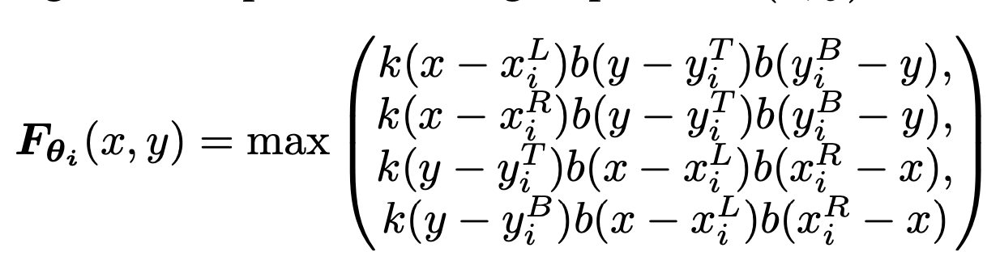

                  - $b(d)=min(max(0,d), 1)$

                - $\theta$ = triangle

                  #### 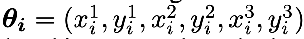

                  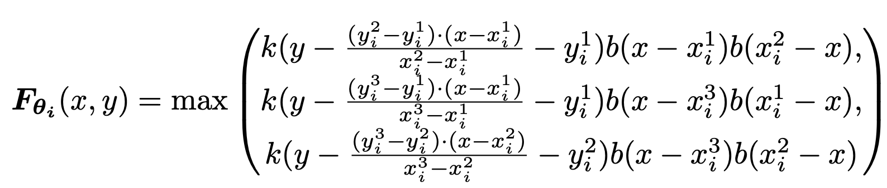

          - 생성된 이미지 ***I***는 CNN classifier를 통과함 (***I*** $\in W \times H \times M$)

        

# 4. Experiments

- mnist

  - digit generation

    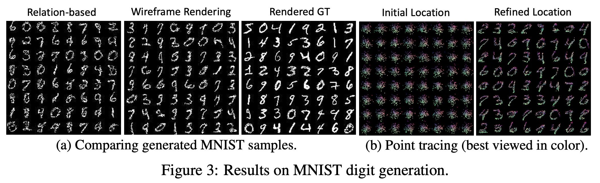

    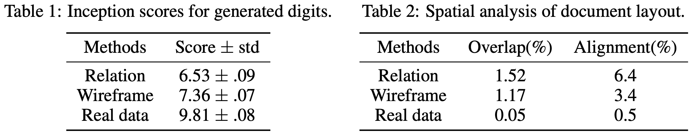

- Single column Document layout generation (< 9 elements)

  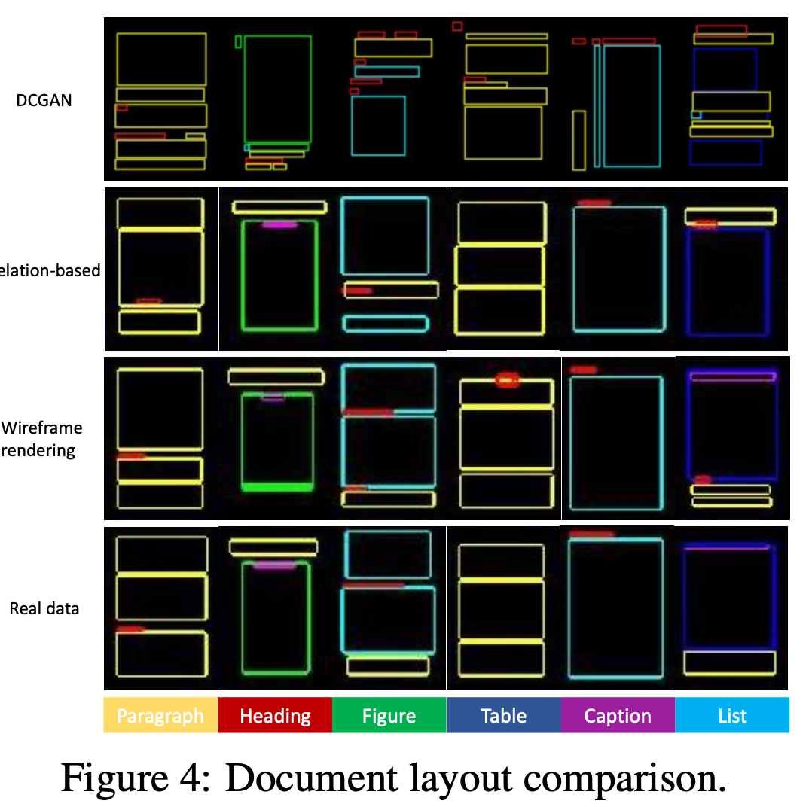

  - Wireframe discriminator vs. relation-based discriminator

    - 두 분류기의 noisy layout에 대한 robustness 평가하기 위해 perturbation shift를 가한 layout에 대해 그 정도에 따라 loss curve를 그려봄

      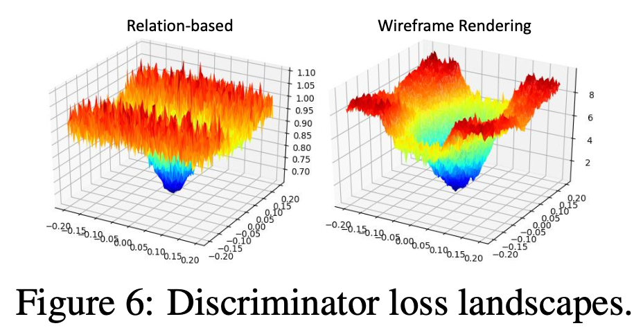

      - Wireframe loss curve가 smooth함

- Clipart abstract scene generation

  - Quantitative result

    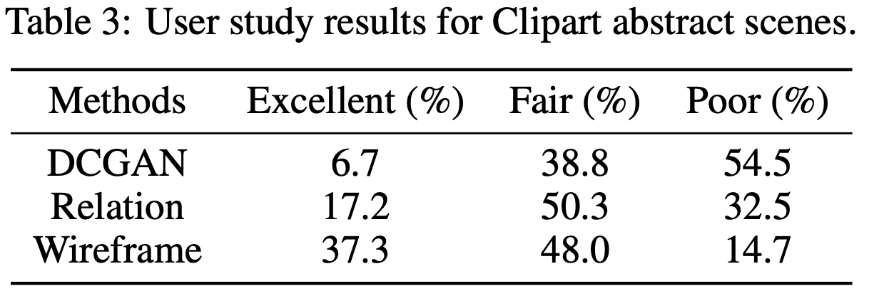

  - Qualitative result

    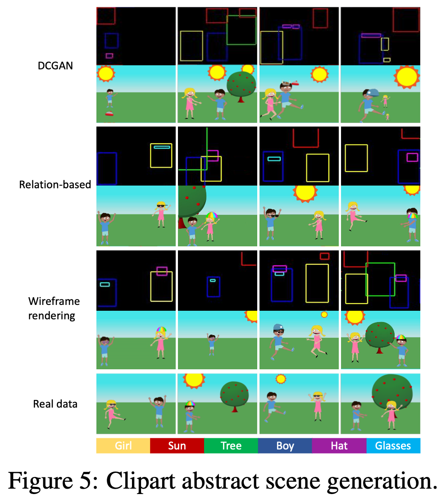

- Tangram graphic design

  - Qualitative result

    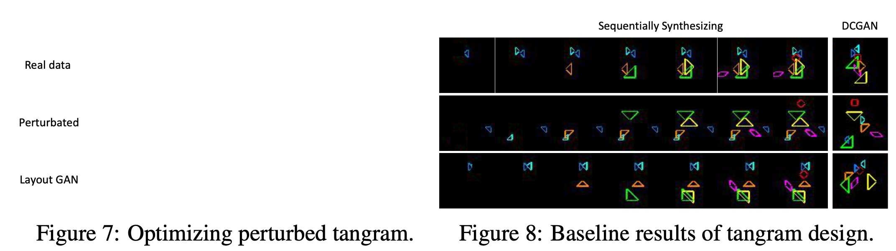

  - Training 에 따른 prediction 변화

    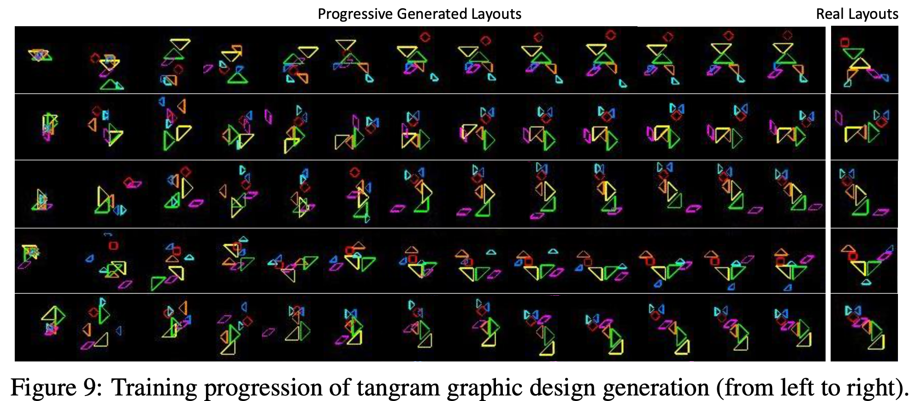
