# [LG] DLT : Conditioned layout generation with Joint Discrete-Continuous Diffusion Layout Transformer

- paper: https://arxiv.org/pdf/2303.03755
- github: https://github.com/wix-incubator/DLT
- ICCV 2023 accepted (인용수: 6회, '24-06-06 기준)
- downstream task: Layout Generation

# 1. Motivation

- Diffusion model의 생성 능력이 매우 훌륭하나, layout 생성의 특성상 discrete & continuous한 attribute를 동시에 생성하는 연구는 부재하다.

- 기존 연구는 두가지 한계가 있었음

  - 한쪽으로 생성하곤 했으나 한계가 있었다 
    - Discrete: localization attribute 본연의 특성은 continuous하므로, 이를 잘 반영하는데 한계가 있음
      - Large scale vocab 중 일부만 사용함
  - (BLT) 학습은 unconditional하게 하고, 추론만 iterative하게 conditional generation을 하므로 sub-obtimal함

  $\to$ 이를 해결해보자!

  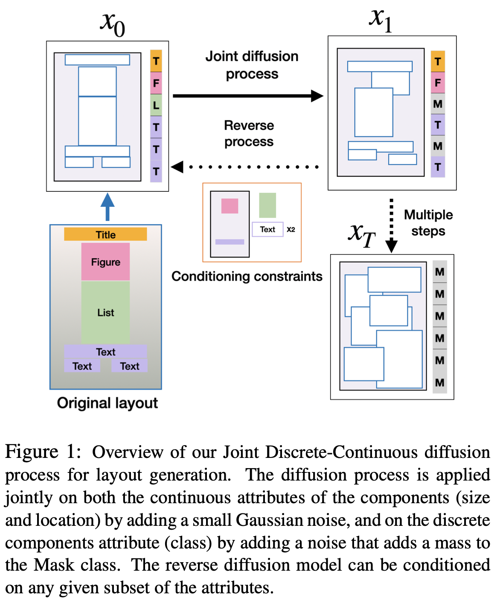

# 2. Contribution

- 유연하게 conditional layout editing이 가능하도록 학습 & 추론 단계에서 고려되도록 설계됨
- Joint continuous-discrete한 diffusion process를 도입한 DLT (Diffusion Layout Transformer)를 제안함
- Benchmark에서 SOTA

# 3. DLT

- overall

  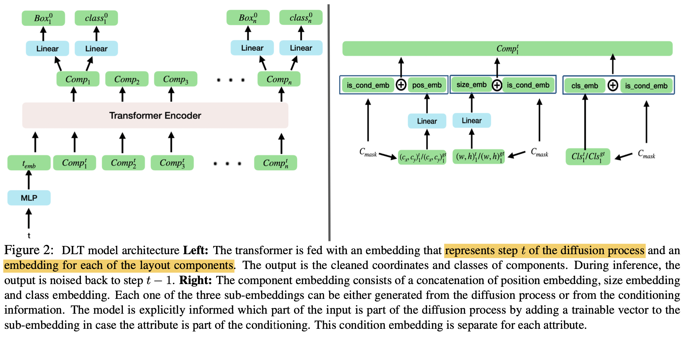

  - 학습할때도 condition embedding의 경우 loss에서 제외하도록 학습함으로써 conditional editing이 가능하도록 모델을 훈련시킴

- Continuous diffusion process

  - Forward

    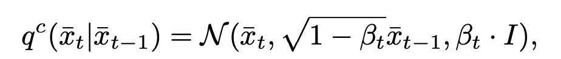

  - Backward

    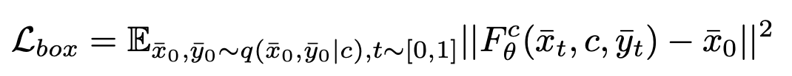

- Discrete diffusion process

  - Forward $\to$ Markov transition matrix

    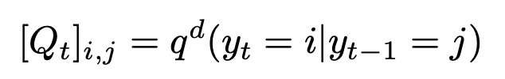

    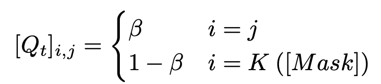

    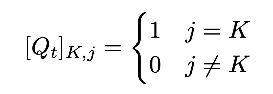

  - Reverse

    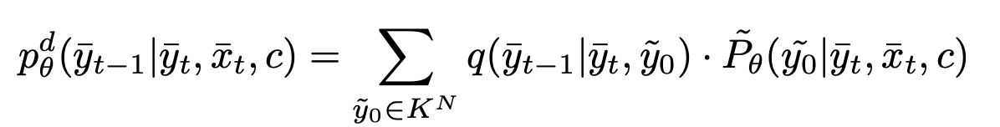

- Loss

  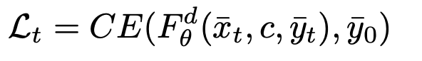

  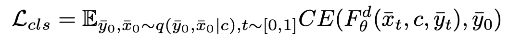

- Combined loss

  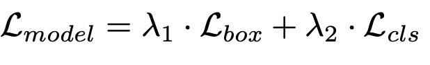

  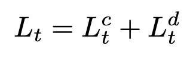

- Combined reverse process

  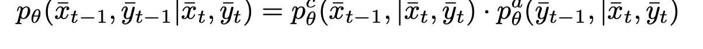

# 4. Experiments

- 정량적 결과

  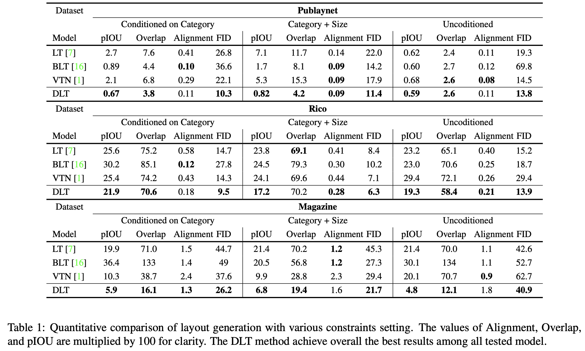

  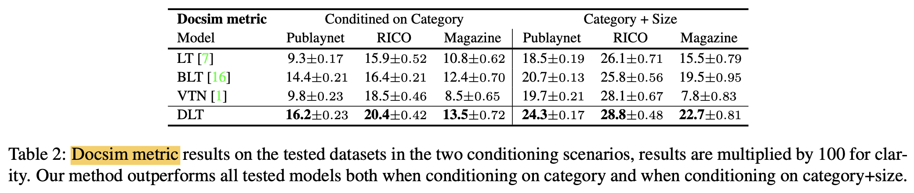

- 정성적 결과

  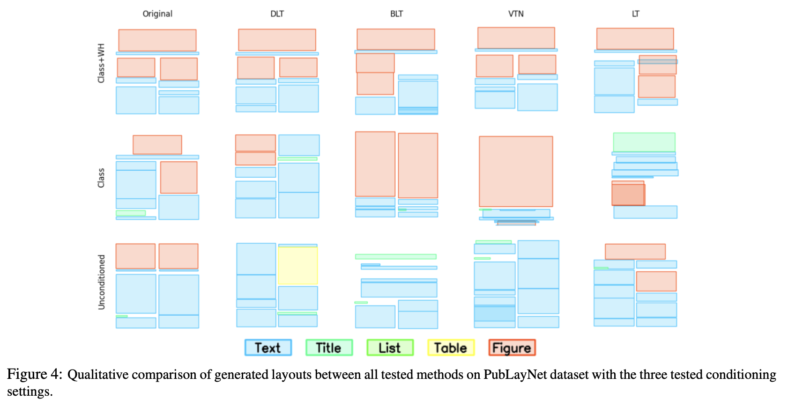

- Ablation

  - diffusion time step에 따른 변화

    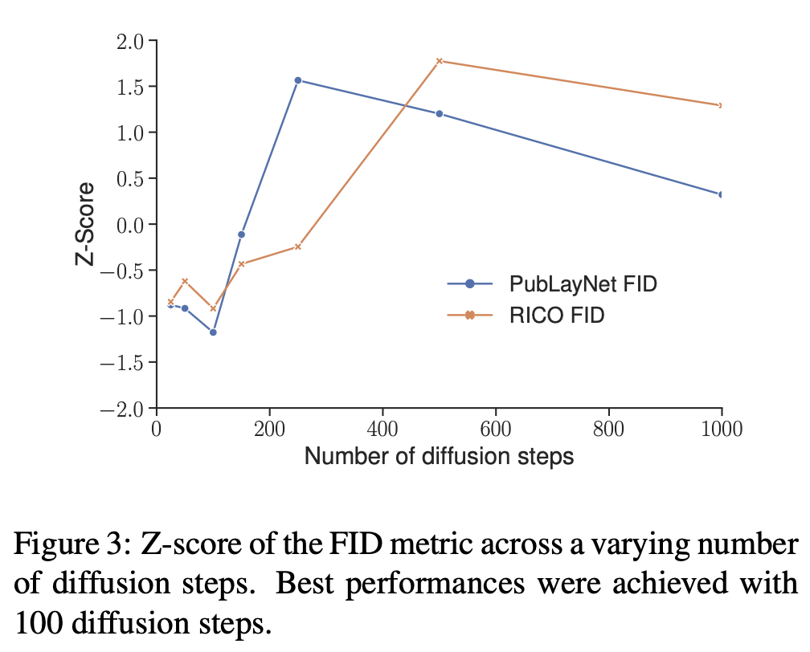

  - Condition 유/무에 따른 비교

    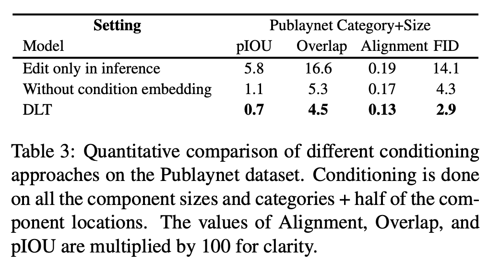

  - Joint process 유/무에 따른 비교

    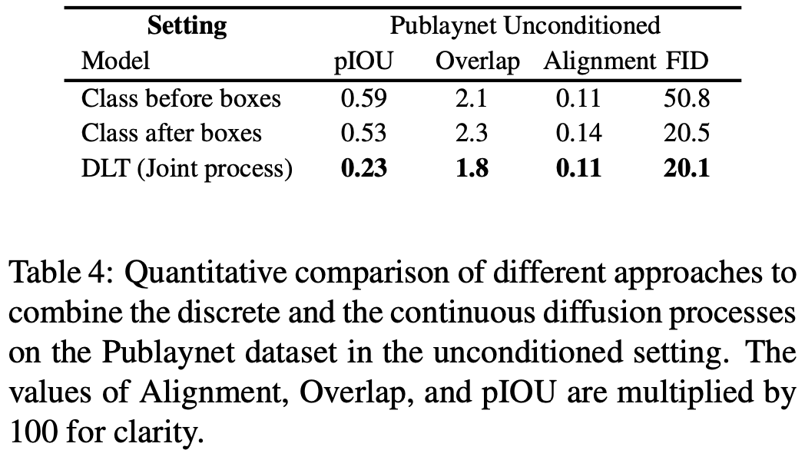
