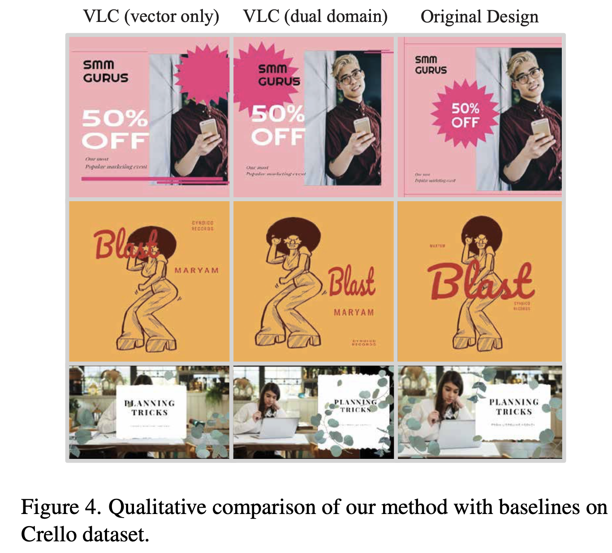

# [LG] Visual Layout Composer: Image-Vector Dual Diffusion Model for Design Layout Generation

- paper: https://aminshabani.github.io/visual_layout_composer/pdfs/visual_layout_composer.pdf
- github: X
- CVPR 2024 accepted (인용수: 0회 ,'24-06-05 기준)
- downstream task: Layout Generation

# 1. Motivation

- 기존 연구들은 visual feature를 무시하고, layout 기반 single modality만 가지고 연구하였음

  

- 하지만, Graphic designer들의 민감한 예술적 감각이 적용된 layout을 생성하지 못하는 한계가 있음 (포스터, 초대 카드, 책, 매거진 커버, 등)

  $\to$ web-crawled poster 이미지를 활용해서 image+layout 모두 고려하여 layout을 생성해보면 어떨까?

# 2. Contribution

- Image랑 Vector 두 domain을 입력으로 받아, user constraint가 적용된 layout과 해당 layout이 적용된 이미지를 생성하는 dual-diffusion model을 새롭게 제안함

  - Pre-trained Large Image diffusion model의 가이드를 받아 layout 간의 관계 모델링이나 중요한 부분 (salient region reasoning)이 가능해짐

  - Image의 implicit하게 패턴화된 design policy을 학습할 수 있게됨

  - 반대로, vector (layout) domain의 경우, explicit하게 layout을 생성하므로 layout editing이 가능함 $\to$ vector domain 장점도 활용 가능!

    

    - Frozen Diffusion model의 중간 요소별 attention map을 가지고 mask GT와 loss를 산출하며 학습함
    - 해당 attention map을 condition으로 per-element bbox를 Vector diffusion model에 입력해줌
    - 최종 vector, image는 각각 정답 element와 그 rendered visual design과 유사해지도록 학습이 됨

- 그 이유는 benchmark 데이터 중에 image-layout paired 데이터가 부족한 것도 하나의 이유임

- canvas resizing, design variation 과 같은 creative-design에 응용 가능함

- 새로운 benchmark 데이터와 기존 데이터에서 SOTA

# 3. Visual Layout Composer

- Preliminary

  - Element Modeling
    - class category $c_i$ : one-hot-vector 
    - element size & location & aspect ratio ($r_i$)
    - Index $o_i$: 요소별 layer order
    - RGBA image ***I***$_i$
    - Canvas의 aspect ratio $r_c$

- Overall Architecture

  

- Condition Embedding

  - Image embedding : image를 224x224로 resize후 CLIP + Linear layer 기반으로 *d* dimension visual embedding vector 생성

  - Vector embedding : vector attributes (element image ratio $r_i$, 등등) 를 vector encoder를 거쳐 embedding vector 생성 ( $N \times d$) 

    $\to$ 두 embedding은 concat되고, linear layer로 processing되어 최종 $N \times d$ vector가 되어 transformer-based condition processing module에 입력됨

    - Image Conition process 출력: $N \times 768$
    - Vector Condition process 출력:  $N \times d$

- Network Architecture

  - Image : Pretrained Stable Diffusion V1.5 (frozen) 에서 attention module만 학습
    - Original SD와 다르게 text prompt가 condition이 아니고, image condision feature + vector attribute embedding이 condition이 됨
  - Vector : 4개의 Transformer Block으로 구성됨
    - input: noisy input coordinate $x^t$ 을  $N \times d$ 로 embed한 vector + vector condition feature (vector+visual embed vector)
    - output: refined bbox position 4D vector 
  - Alignment
    - ControlNet 기반의 alignment는 시도해봤으나 잘 되지 않았음
    -  SD의 Attention map기반으로 alignment를 시도함
      - 장점
        - input element (요소)별로 attention map이 생기므로 요소별 vector embedding과 직접적 매핑이 용이함 (straightforward)
        - 각 요소별 위치를 이미지 도메인으로 표시를 제공하므로 vector embedding에 대한 해석을 쉽게 해줌
        - vector domain으로 하여금 U-Net의 Attention map (focusing 능력)을 adjust하게 해주므로 image domain을 보완해줌
    - 반복적 요소 발생 이슈 
      - cross-attention localization loss를 도입하여 해결했다고함 $\to$ 추구 followup 필요

- Controllable Element Composition

  - 단순 resize (224x224)하여 Clip에 입력하게 되면서 image-vector domain간 간극이 생기게 됨

    $\to$ Canvas의 aspect ratio 를 고려하여 image-domain에서 canvas 외부는 zero-padding 처리한다고함 (?) 

    

# 4. Experiments

- Datasets

  - Poster & Crello dataset
    - Poster dataset: 137,781 layout design
      - 1K : validation 
      - 3K : test
      - 5 categories (frame, canvas, shape, mix, text)의 RGBA image
      - 요소가 20개 넘어가는 경우 filtering
    - Crello datasets
      - training: 18,768 
      - validation : 2,316
      - test: 2,331
      - categories  : vector shape, image, text placeholder
  - RiCO & PublayNet
    - Rico : 25 category로 구성되며 휴대폰 UI design dataset (48K)
    - PublayNet: Document dataset (360K)

- 정량적 분석

  - Crelo & Poster

    

  - RICO & PublayNet

    

- 정성적 분석

  - Crello dataset

    

- Poster dataset

  

- Ablation study

  - Generated & Composed (vector로 rendering 된) 이미지의 consistency 체크

    

  - Attention map의 유효성 검토

    

- 위 기능을 사용해 latent space에서 모든 요소를 decompose해서 layered image representation으로 활용 가능

  

- 응용 예시

  - Layout2Image

    

- 템플릿 크기 변경에 따른 자동 요소 변경

  

  - input layout condition이랑 중간 latent state를 masking하여 구현

- 요소 추가

  

- Layout style transfer

  

  - 기존 attention map을 새로운 attention map으로 propagate해서 구현
