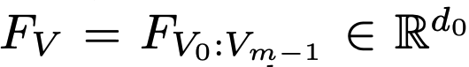

# [MM][LLM] LayoutLLM: Layout Instruction Tuning with Large Language Models for Document Understanding  

- paper: https://arxiv.org/pdf/2404.05225
- github: https://github.com/AlibabaResearch/AdvancedLiterateMachinery/tree/main/DocumentUnderstanding/LayoutLLM
- CVPR 2023 accepted (인용수: 2회, '24-06-10 기준)
- downstream task: Doc VQA, VIE task

# 1. Motivation

- Document understanding에 layout이 매우 중하다는 연구 결과가 기존에 많이 나왔음

- 기존 LLM/MLLM 모델을 document understanding에 활용할 때, 단순히 text prompt 기반으로 document을 이해시키고 있었음 

  $\to$ Layout을 explicit하게 학습하는 방법은 없을까?

  $\to$​ Layout instruction tuning 기법을 써보자!

  

# 2. Contribution

- Document의 layout을 더 잘 이해하기 위해 **3가지 다른 레벨**의 **pretraining task**를 **Instruction-tuning** 기반으로 고안함

  - 3-level: <u>document-level, region-level, segment-level</u>  $\to$ Global & Local content에 대한 이해도를 고루 향상
  - Instruction-tuning: 
  - Document pretrained model을 leverage하여 사용

- LLM의 Chain-of-Thought (CoT)에서 영감을 받아 새로운 Layout-aware supervised finetuning기법인 LayoutCoT을 고안함.

  - LayoutCoT

    1. Question에 대한 분석 수행 후, (Question Analysis)

    2. Region feature에 대한 이해를 바탕으로 document 에서 집중해야 할 area에 focus하도록 중간 과정을 거침으로써 (Releveant Area Concentration)
    3. 정확한 답변을 수행하도록 함 (Answer Formation)

- Zero-shot document understanding에서 SOTA

# 3. LayoutLLM

- overall diagram

  

  ## 3.1 Layout Architecture

  - Document Pre-trained Model (DocPTM) : 여기서는 LayuoutLMV3 모델을 활용

    

    - *V*: Visual features of document

      

      - *m*: visual feature의 갯수 (token 갯수인듯)

    - *T*: Textual + Layout (Bbox) features of document

      

      - *n*: document내에 포함된 (ocr?) token의 갯수

  - Multimodal projectors : LLM 모델의 embedding space로 LayoutModel feature를 투영시키기 위해 존재

    

    

    

  - LLM: 위의 $H_V, H_T$와 함께 quesetion's instruction text가 입력으로 들어가 answer가 출력됨. 여기서는 LLaMA-2 랑 Vicuna-7B가 사용됨.

## 3.2 Layout Instruction Tuning

- Layout-aware Pretraining

  - 목적: Global & Local 등 다양한 level의 layout을 이해하도록 모델을 학습

  - Document-level

    - Document Dense Description (DDD) : Document에 대한 장황한 설명하는 능력을 모델이 학습 (평균 373.25 words)

      

      `Q: Make a dense description to the given document.`

    - Text & Layout Reconstruction (TLR) : Document 내 text와 layout (bbox)을 "<{box}, {text}>" 형태로 reconstruction하여, LLM과 LayoutLLM간의 align하는 역할

      

      `Q:Generate all the text and layout in the document.`

  - Region-level : Plain text만 학습한 LLM 모델이 취약한 document 고유의 정보들 (titles, figures, tables) 에 대한 이해력을 학습

    

    - Document Layout Analysis (DLA) : 요소들의 type과 위치를 학습

      `Q:Where can we find the figure?`

      `Q:What is the document layout type for the [207, 949, 794, 962] area ?`

    - Table Understanding (TU) : Table의 row, column에 대해 이해하도록 학습

      `Q:How many rows and columns does the table have?`

      `Q: List the values in the column 9`

  - Segment-level : MVLM (Masked VLM)에서 영감을 얻어 masking 된 coordinate 예측, text 예측, 그리고 layout 요소간 거리 & 방향 예측을 수행하도록 학습

    

    - MVLM instruction : random masking된 text content를

      `Q:What is the <mask> text content?`

    - Mask Position instruction : random zeroed coordinate로 replace된 text의 coordinate을 예측

      `Q: Provide the original bboxes of the text lines with bboxes set to 0 in the doc.`

    - Geometric Layout instruction : random selected 요소간 상대적 방향 & 거리 예측 

      `Q: What is the direction and distance from "Date" to "No. 10"?`

- Layout-aware Supervised Finetuning

  

  - 기존 MVLM은 Instructions에 대한 answer를 하도록 학습됨. 즉, layout에 대한 **explicit learning** 이 부족했음

  - LayoutCoT (Layout Chain-of-Thought)를 기반으로 layout information을 중간 과정에 첨부하여 explicit하게 학습하도록 변경함 

    1.  Question Analysis: 질문에 대한 핵심 특성을 분석하는게 매우 중요함. 

       ex. Table understanding처럼 <u>더 복잡한 reasoning 문제</u> 혹은 entity extraction처럼 <u>심플하게 정보를 추출하는</u> 문제인가 **요소 관점에서** 평가하여 LLM 모델이 문제를 잘 이해하도록 guide를 제공

    2. Relevant Area Concentration: 중간 과정에서 <u>질문에 대해 집중해야할 영역</u>에 대한 **location** **정보**를 제공하도록 하여 더 정확한 답변을 모델이 생성하도록 함 $\to$ region&segment level pretraining덕분에 가능해짐 

    3. Answer Formation : step-1, step-2에 의거하여 최종 답변을 도출

  - 모두 manaul labeling-free하게 ChatGPT-v3-Turbo를 활용

    

  - 3가지 타입의 dataset이 활용
    - HTML documents ($D_H$)
    - Image documents ($D_I$)
    - Text documents ($D_M$) : Machine Reading Comprehension (MRC)를 위해 사용
  - Construction Process
    - Document Representation 
      - HTML document는 코드 내에 정확한 layout 정보가 있으므로 그대로 활용 
      - Image document는 original dataset annotation을 활용
      - Text document는 ChatGPT의 prompting을 활용하되, QA를 생성하고, 메뉴얼하게 organize한 CoT를 활용하도록 생성
    - QA & Text CoT Generation
      - Text doc.와 마찬가지
    - LayoutCoT Generation
      - Step1,3는 Text doc.과 마찬가지로 생성
      - Step 2(relevant area)는 sentence별 union bbox를 relevant area로 산정함  
    - Document Images Generation
      - $D_H, D_M$ 은 image 로 converting하여 document Images *I*, generated QA pairs *QA*, LayoutCoTs $L_c$ 그리고 LayoutCoT dataset $D_c$가 구성됨

# 4. Experiments

- Layout-aware pretraining data : 모두 opensource benchmark dataset만 활용하였고, <u>ocr로 layout을 생성</u>하고 <u>html을 pdf로 변환</u>하고, <u>ChatGPTv3 Turbo로 instruction 생성</u>한것 외엔 추가적인 가공이 없음

  - Document Dense Description : PubLayNet, DocLayNet, Docbank, RVL-CDIP, DocILE 활용

  - Region-level : PubLayNet, DocLayNet, Docbank

    - Table understanding: PubTabNet

    $\to$ 5.7M instruction이 생성 (1:4:4 = document:region:segment level)

- Layout-aware supervise finetuning data

  - LayoutCoT dataset을 생성하기 위해 기존 MRC(Machine Reading Comrephension) dataset을 chatGPTv3 Turbo를 활용하여 가공함

  - GPT에게 document layout을 이해시키는 것이 high-quality textual QA & document layout생성에 결정적임

  - layout text와 HTML을 활용하여 document를 표현 

  - $D_I$: PubLayNet, DocLayNet, Docbank, RVL-CDIP, DocILE에서 algorithm 1에 의거, pretraining과 비슷하게 layout text를 생성

  - $D_H$: ChatGPT로 free generation

  - $D_M$: FeTaQA (wiki question answering dataset)을 활용해서 Algorithm 1으로 생성

    $5:4.5:0.5 = D_I:D_H:D_M$

- Model
  - LayoutLLM (DocPTM)
    - LayoutLMv3-large을 pretrain weight로 활용
  - LLM
    - Vicuna-7B-v1.5
  - Pretraining : LLM frozen, projector와 DocPTM만 학습
  - SFT: DocPTM frozen, LLM + project만 학습

-  Zero-shot document understanding

  

- Ablation

  - Training stage에 따른 분석

    

    - 0: pretrain 없이, finetuning을 LayoutCoT 없이 진행

  - 정성적 분석

    

    - (a) LayoutCoT 유무 모두 정답이나, 기존 모델은 오답인 경우
    - (b) LayoutCoT 없으면 틀리나, LayoutCoT를 통해 정답인 경우

  - Interactive correction

    

    - LayoutLLM이 최종 오답이나, 중간 focusing 영역을 고치면 정답이 되는 경우
