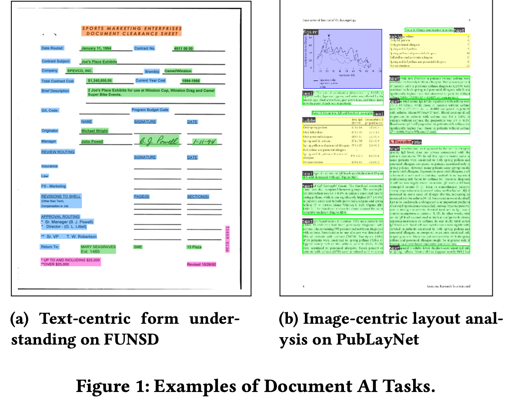

# [DU] LayoutLMv3: Pre-training for Document AI with Unified Text and Image Masking

- paper: https://arxiv.org/pdf/2204.08387
- github: https://github.com/microsoft/unilm/tree/master/layoutlmv3
- ACM 2022 accepted (인용수: 297회, '24-06-12 기준)
- downstream task: DocVQA

# 1. Motivation

- Language Model (BERT)로 Dcoument Understanding AI에서 text를 학습하는 목적함수와 image를 학습하는 목적함수가 다름

  

  - text: Masked Langauge Modeling
  - image: Masked Region Reconstruction

- 기존에 visual feature를 econding하기 위해 Faster-RCNN을 통한 noisy region 정보를 추출하거나, CNN으로 grid를 뽑아 사용하는 등, 비효율적이었음

  $\to$ ViT처럼 patch단위로 쪼개어, masked patch를 추출하는 방식을 도입해보면 어떨까?

# 2. Contribution

- CNN 혹은 Faster-RCNN을 사용하지 않은 Multi-modal Document Understanding AI분야에 최초 논문

- Image & Text alignment를 위해 image를 discretized token로 embedding하여 MLM과 MIM을 학습시키고, WPA (Word-Patch Alignment) loss를 통해 alignment를 수행

- Document AI에서 text-centric dataset뿐만 아니라 vision-centric dataset에서도 general 하게 잘됨 (SOTA)

  

# 3. LayoutLMv3

- overall diagram

  

- Text embedding
  - word embedding: off-the-shelf ocr를 통해 추출한 text content & layout을 사용. 
    - 이때 bbox는 word-level이 아니라 segment-level layout을 사용 $\to$ [28] 논문 확인!
    - x,y,w,h 모두 각자 embedding
    - word embedding은 RoBERTa로 초기화함
- Image Embedding
  - Image patch를 linear projection하여 embedding ($P \times P$)

- Pretraining Objectives

  

  - Masked Language Modeling: 30% text token를 masking

    - Masking된 token을 가지고 해당 token의 정답을 예측

      

      - $M'$: Masked image patch
      - $L'$: Masked token patch

  - Masked Image Modeling (MLM): 40% image token을 masking

    - Masking된 token을 가지고 해당 token의 정답을 예측

      

  - Word-Patch Alignment (WPA): Image와 Text를 align하기 위해, unmasked된 text token 중, image token과 pair인 경우 align, 아니면 unalign이 되도록 학습.

    

    - $L-L'$: unmasked text token

    - masked token은 WPA loss에서 배제

# 4. Experiments

- Model

  - LayoutLMv2와 같음 (pretrained : RoBERTa)
    - LayoutLMv3$_{BASE}$: 12-layer transformer encoder + 12 head self-attention + D=768
    - LayoutLMv3$_{LARGE}$: 24-layer transformer encoder + 16 head self-attention + D=1024
    - $H \times W$ = 224 x 224
    - $P$= 16
    - $M$ = 196

- Dataset

  - Pre-training : IIT-CDIP Test Collection 1.0	
    - 11 M document images

- Fine-tuning Result

  

- PubLayNet (Vision-centered)

  

- Ablation study

  - Loss

    

    
