# [LG][RAG] RALF: Retrieval-Augmented Layout Transformer for Content-Aware Layout Generation

- paper: https://arxiv.org/pdf/2311.13602
- github: https://github.com/CyberAgentAILab/RALF
- CVPR 2024 accepted (인용수: 0회, '24-06-14 기준)
- downstream task: content-aware layout generation

# 1. Motivation

- 기존에 content-aware layout generation task는 high-dimensional한 layout 정보를 학습하기에 limited training data가 있어왔다.

  $\to$ 심플한 retrieval augmentation을 generation에 추가하면 generation quality를 매우 높게 향상 시킬 수 있지 않을까?

  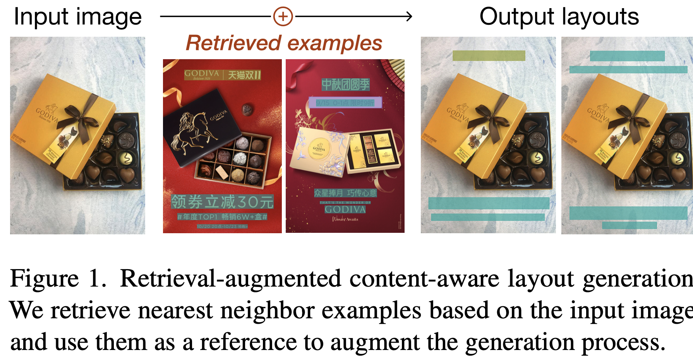	

# 2. Contribution

- Simple retrieval augmentation은 content-aware layout generation의 data scarcity 문제를 효과적으로 해결해주는 것을 발견함
- Retrieval-Augmentation Layout Transformer (RALF)를 디자인하여 layout generation task에 도입함
  - Transformer의 Cross-attention을 통해 서로 다른 modality (image & layout) 간의 aligment를 수행
  - Autoregressive 방식으로 layout을 생성 (one-at-a-time)
  - 학습 시간이 절반 이하로 줄어듦
  - user-constraint를 추가할 수 있음
- 다른 baseline들을 outperform함

# 3. RALF

- preliminaries

  - inputs

    - *I*: Image $I \in \mathbb{R}^{H \times W \times 3}$
    - *L*: Layout $L=\{l_1, ..., l_T\}=\{(c_1, \bold{b}_1), ..., (c_T, \bold{b}_T)\}$
    - *S*: saliency map $S \in \mathbb{R}^{H \times W \times 1}$​

  - outputs

    - *L*: 변경된 Layout

      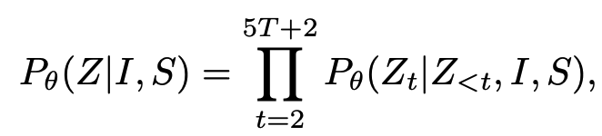

      - Autoregressive하게 layout을 next token prediction방식으로 생성 (start token, end token포함 총 5T+2개)

- overall architecture

  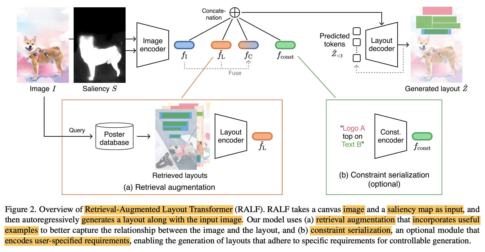

  - Image encoder

    - baseline : CGL-GAN

      - backbone : Res-50 + ViT

        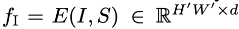

  - Retreival augmentation module

    - 가정: 유사한 이미지에서 추출한 layout 정보는 layout을 생성할 때 useful할 것이다.

    - Input: $f_I$​​

    - output: top-k 유사한 retrieved image의 layout feature $f_R$​

      $\tilde{L}=\{\tilde{L}_1, ..., \tilde{L}_K\}, k \in \mathbb{N}$​

    - Image embedding space : **DreamSim**  $\to$​ [12] 참고! 

      - object appearance, viewing angles, camera poses, overall layout을 고루 고려하여 embedding
      - retrieval source는 학습에서 배제함

    - Layout embedding : pre-train *F* 를 self-supervised로 학습후 freeze하여 사용 $\to$​ [25] 참고!

    - Feature augmentation

      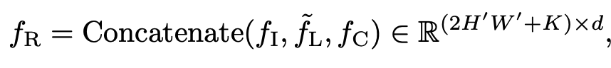

      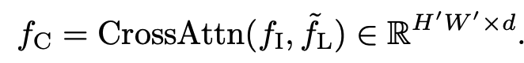

      - query: image feature $f_I$
      - key, value: retrieved layout feature $\tilde{f}_L$

  - Constraint encoder (optional)

    - user-constrain (instruction)을 embedding

      ex. element types, coordinates, inter-element relationships

    - Transformer 기반 encoder로 $f_{const} \in \mathbb{R}^{n \times d}$를 생성

  - Layout decoder

    - layout $\hat{Z}$를 iterative (autoregressive)하게 image feature와 함께 cross-attention 수행하여 도출
    - attribute-wise하게 *5T*+1 step으로 생성

# 4. Experiments

- Dataset
  - PKY: PosterLayout dataset
    - 3 categories : logo, text, underlay
    - Posters: 9,974개
      - train : 7,735
      - val : 1,000
      - test: 1,000
    - Unannotated canvases: 905개
  - CGL: Constrained GAN Layout
    - 4 categories: logo, text, underlay, embellishments
      - Posters: 60,548개
        - train: 48,544
        - val: 6,002
        - test: 6,002
      - Unannotated canvases: 1,000개

- Evaluation Metrics

  - Graphic metrics
    - FID
    - Underlay effectiveness (higher the better)
      - Underlay 요소가 얼마나 overlay 요소를 포함하는가?
    - Overlay effectiveness (lower the better)
      - Underlay외 다른 요소들간의 intersection이 얼마나 되는가?
  - Content metrics
    - Occlusion (lower the better) : saliency value가 얼마나 layout 요소들과 겹치는가?
    - Readability score (lower the better) : text 요소가 위치한 배경이 얼마나 non-flatness한가? (Gradient of image space를 계산)

- Annotated test set 결과

  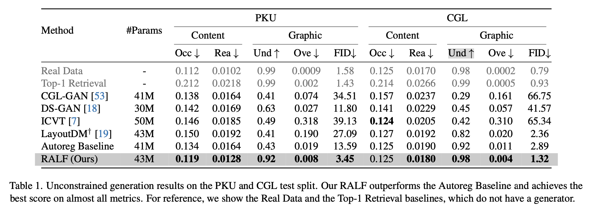

-  Unannotated testset 결과

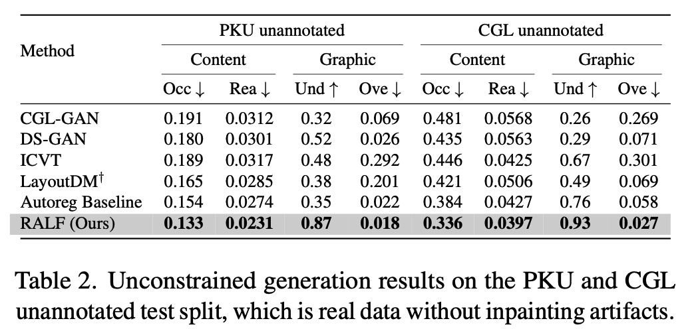

- 정성적 결과

  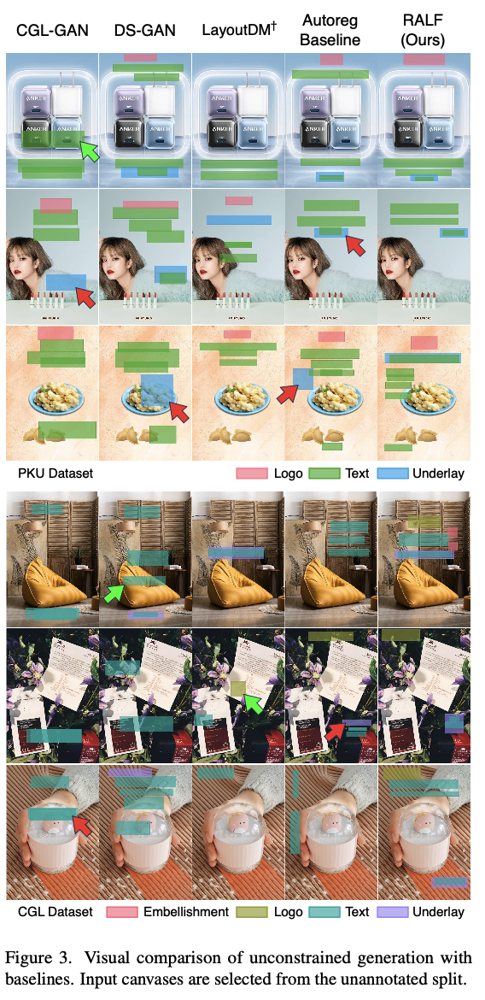

  - Constrained Generation

    - 정량적 결과

      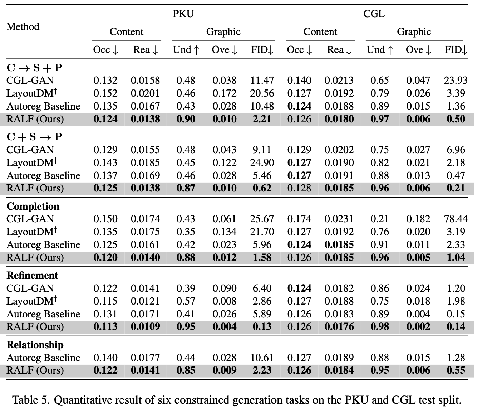

    - 정성적 결과

      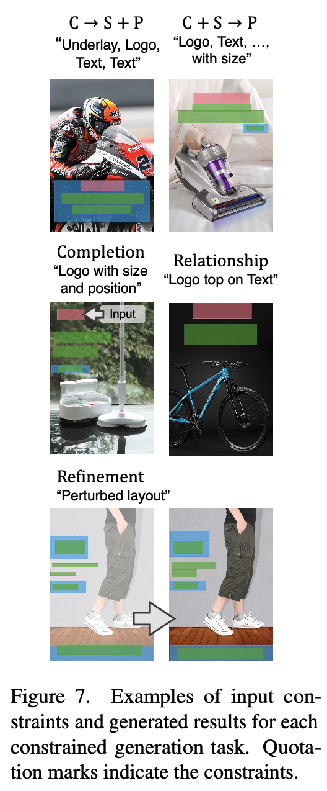

  - Ablation study

  - Training data 수에 따른 FID score

    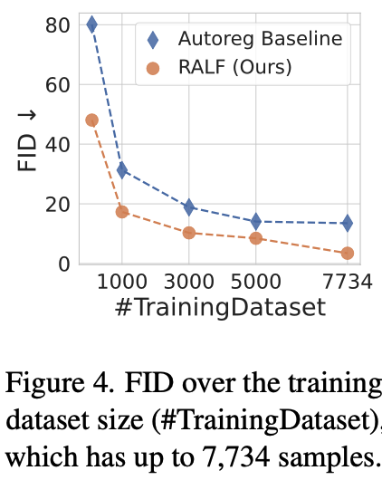

    - RALF는 baseline대비 절반 이하 데이터만 가지고 더 좋은 성능을 냄

  - K값에 따른 결과

    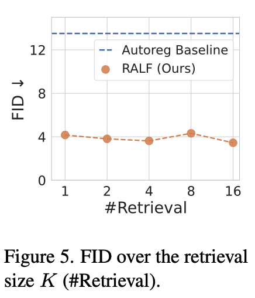

    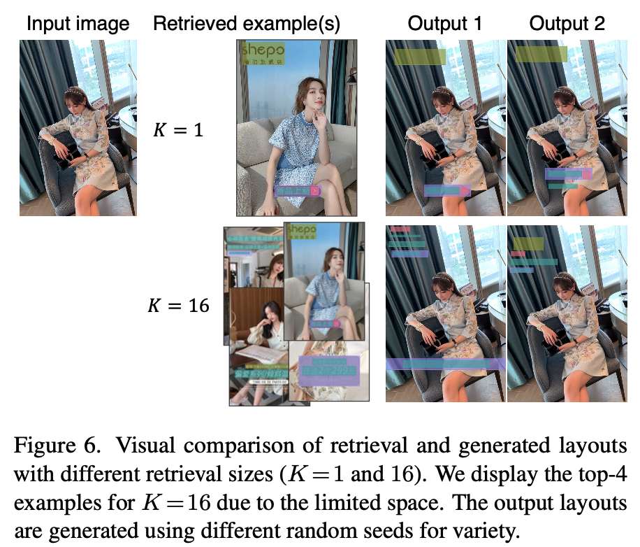

  - CGL-GAN말고 다른 generator (LayoutDM)에 Retrieval 적용된 결과

    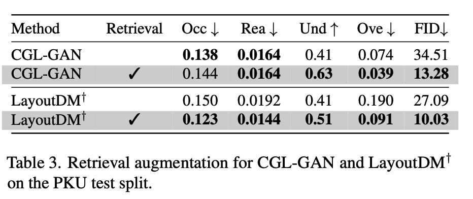

- Out-of-domain 결과

  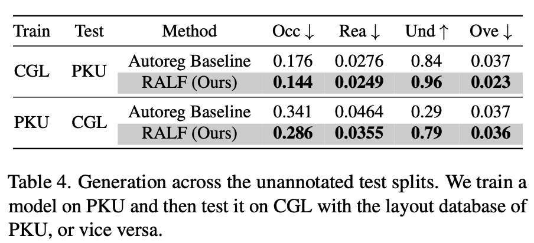

  - 학습: PKU $\to$ 검증: CGL (Retrieval database = 검증)
  - 학습: CGL $\to$ 검증: PKU

- Retrieval Image encoder에 따른 결과

  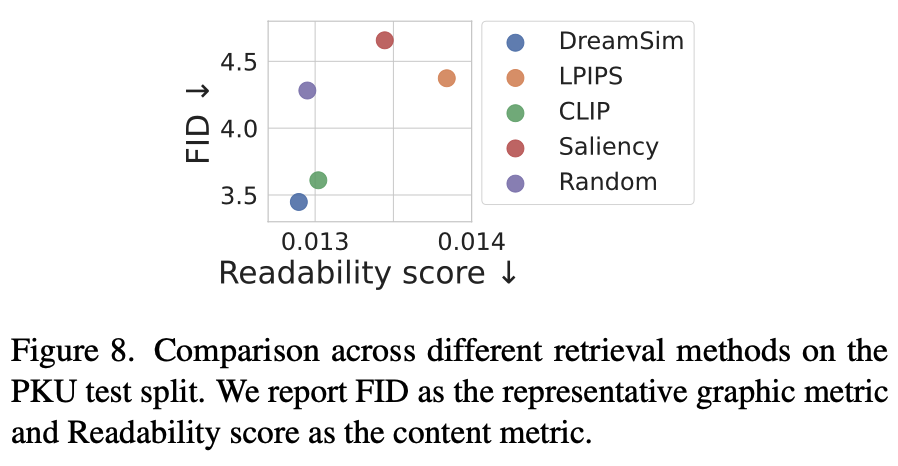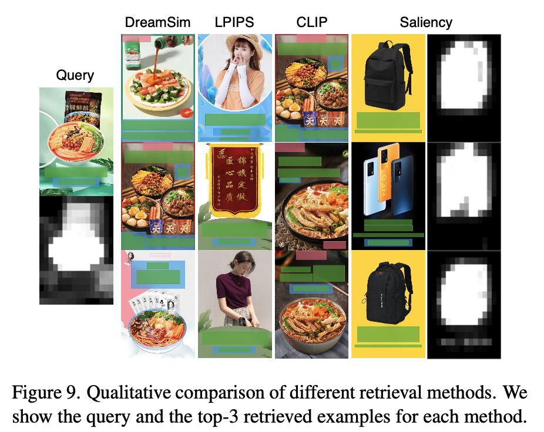

  - DreamSim > CLIP > Random > LPIPS  Saliency
    - Random하게 database의 layout 정보만 활용하는 것도 성능 향상에 기여

- Feature augmentation에 따른 결과

  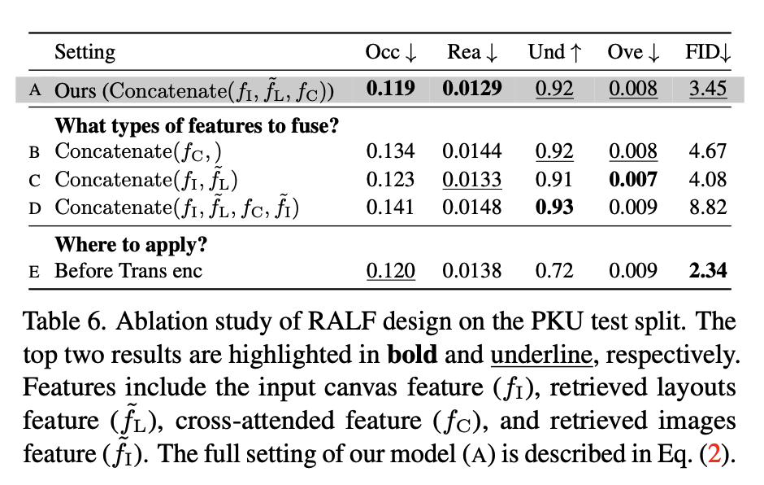
