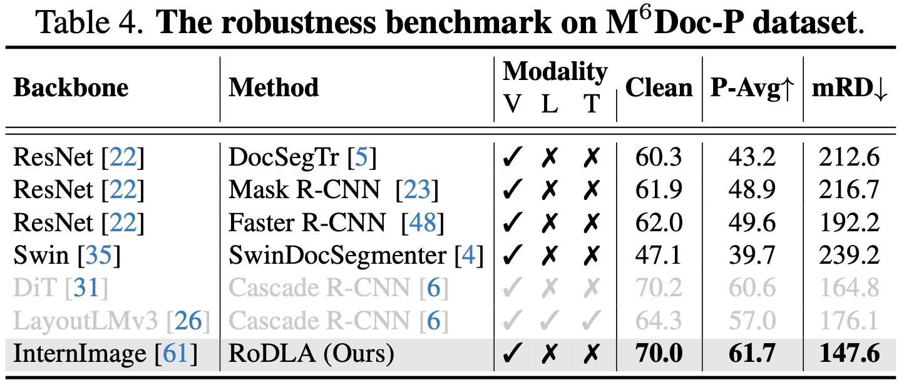

# [DLA] RoDLA: Benchmarking the Robustness of Document Layout Analysis Models

- paper: https://arxiv.org/pdf/2403.14442
- github: https://yufanchen96.github.io/projects/RoDLA/
- CVPR 2024 accepted (인용수: 0회, '24-06-16 기준)
- downstream task: Robust Document Layout Understanding

# 1. Motivation

- 기존 Document Layout Analysis (DLA) 모델들의 robustness에 대한 연구는 미진행 

- 기존 모델들은 document perturbation에 매우 취약한 특징이 있음

  

  $\to$ document robustness 측정할 dataset & metric이 필요!

# 2. Contribution

- DLA model들의 robustness를 분석하고, benchmark를 제안한 최초의 논문

  - 450K document image를 제안

- Document image perturbation에 대한 상세한 분류체계를 제안함

  - 5개의 group (content, spatial, inconsistency, blur, noise)

  - 3개의 severity level

    $\to$ 12개의 typ

- DLA Robustness를 측정할 새로운 metric을 제안함

  - mPE (Mean Perturbation Effect)
  - mRD (Mean Robustness Degradation)

- 새로운 baseline model RoDLA (Robust Document Layout Analysis)를 제안 $\to$ SOTA

# 3. RoDLA

- Hierarchical Perturbation

  - Real-world document dataset에 존재하는 perturbation을 12가지 perturbation으로 규정하고, 각각을 severity별로 level 1~3으로 분류함
  - 5가지 type으로 대분류 - 12가지 perturbationㅇ로 소분류
    - 대분류: content, spatial, inconsistency, blur, noise
    - 소분류: 아래 그림 참고
  - 전체 dataset의 평균값을 통해 model의 performance를 측정함

  

- Perturbation 소개

  

  - Spatial-Warping: gaussian filter $g$, smoothness를 조율하는 $R_{\sigma}$, magnitude를 조율하는 $R_{\alpha}$로 구성
  - Spatial-Keystoning: perspective transformation을 관여함 Homograph matrix $H$로 original $\to$ new coordinate mapping을 모델링. Standard deviation $R_k$​로 제어.
  - Content-backbround: Background image로 random하게 ILSVRC dataset을 추가함으로써 severity level을 제어
  - Inconsistency: ink, illuminator, 등 distortion을 제어
  - Blur: Blurring effect를 point spread fuction (PSF)로 제어
  - Noise: speckle, texture등 noise level로 제어

- Perturbation Evaluation Metrics

  - MS-SSIM (Multi-Scale Structural Similarity Index)

    

    - $l_M$: *M*개의 scale luminace(휘도) 차이

    - $c_j(x,y), s_j(x,y)$: x,y 위치에서 j번째 scale의 contrast. & structure 차이

      $\to$ watermark & warping에 대해 둔ㄷ감한 반면, rotation & keystoning에 예민함

  - CW-SSIM (Complex Wavelet Structural Similarity Index)

    - Wavelet domain으로 pixel intensity를 변환하여 측정한 SSIM

    

    - $x_l, y_l$: wavelet coefficients

    - $w_l$: l번째 coefficient weight

    - *K*: tiny value

    - *: complex conjugation

      $\to$ defocus에 둔감함

  - Degradation: 얼마나 모델의 performance가 해당 perturbation으로 성능이 하락했는가를 평가하는 지표

    $$D=1-mAP$$

    $\to$​ background & texture에 overly 민감함

  - Mean Perturbation Effect (mPE) 

    

    - $D_{s,p}^g$: severity level *s*, specific perturbation *p*에 따라 model *g*의 mPE
    - $f_{s,p}^i$: SSIM별 IQA metrics (MS-SSIM, CW-SSIM)

  

- RoDLA overall diagram

  

  - baseline: DINO (object detector)

    - backbone: InternImage (ImageNet22K pretrained)

  - Robust Encoder

    - 기존 self-attention layer는 irrelevant token들을 overemphasize하는 경향이 있음
    - 3x3 conv + avg pooling layer를 통해 이를 완화할 수 있음 (?)

  - Channel-wise Attention layer

    - channel dimension *d*로 attention을 수행함으로써 local feature를 channel-wise하게 획득할 수 있음 

      

      - **Q, K, V**: $\in \mathbb{R}^{d \times n}$

# 4. Experiments

- Datasets

  - PubLayNet-P: 360K document & class 5개
  - DocLaynet-P: 80.8K document & class 11개
  - $M^6$Doc-P: 9K document & class 74개

- Evaluation metric: mRD (Mean Robustness Degradation)

  

  - *p*: perturbation index [1,12]

     $mRD>100 \to$ perturbation으로 인해 예상보다 model performance가 더 줄어듦을 의미하므로 robustness는 낮을수록 좋음

- 정량적 결과

  

  - 대량의 class가 5개인 PubLayNet으로 pretrain한 결과.
  - DiT > LayoutLMv3 > RoDLA순 $\to$ pretrained data 영향이 큰 것으로 보임

   

  - RoDLA > DiT > LayoutLMv3

  

  - RoDLA > DiT > LayoutLMv3

- Ablation studies

  - backbone

    

  - Model Architecture

    

  - Perturbation

    
