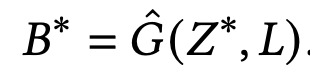

# [LG] CGL-LO: Constrained Graphic Layout Generation via Latent Optimization

- paper: https://arxiv.org/pdf/2108.00871
- github: https://github.com/ktrk115/const_layout
- ACM MM 2021 accepted (인용수: 69회, 2024-06-18 기준)
- downstream task: content-agnostic layout generation (constrained & unconstrained)

# 1. Motivation

- Pretrained Unconstrained Layout Generation 모델에 constraint를 집어넣기 위해서는 해당 constrain을 목적함수로 재학습해야 하는 비효율성이 존재함

  $\to$​ 생성된 Layout의 Latent space에서 optimization을 iterative하게 수행하면 어떨까? 

  $\to$​ 즉, **constrained layout generation** 문제를 **constrained optimization** 문제로 바라보자!

  

# 2. Contribution

- Latent code를 optimize하여 주어진 constraints를 만족하는 framework인 CLG-LO (Constrained Layout Generation with Latent Optimization)을 제안함
- LayoutGAN을 기반으로하여 self-supervised learning (reconstruction losS)을 추가한 형태인 LayoutGAN++를 제안
- Constrained & Unconstrained layout generation task 3개의 benchmark에서 SOTA 

# 3. CGL-LO

## 3.1 LayoutGAN++ architecture

- baseline: LayoutGAN 

- task: unconditional layout generation

  - Generator

    

    - input: random layout elements
    - output: generated bounding boxes
    - $f_{enc}, f_{dec}$: MLP로 구성
    - Transformer: LayoutGAN과 동일하나, residual connection은 배제

    $$G: (Z,L) \to B$$

    - *Z*: Randomly-generated codes $Z=\{z_i\}_{i=1}^N$​
    - *L*: conditional multiset of labels $L=\{l_i\}_{i=1}^N$
    - *B*:  Generated Bounding boxes $B=\{b_i\}_{i=1}^N$

  - Discriminator

    

    - input: generated bbox & labels
    - output: realism of layout에 대한 probability score

  - Auxiliary Decoder

    - 목적: document과 같이 layout이 alignment가 잘되어 있는 경우, 해당 layout content보다 alignment에 집중하여 학습하다 보니 위치에 대한 inductive bias를 잘 학습하지 못함.

    - Reconstruction loss를 regularization term으로 추가한 self-supervised loss를 추가함으로써 이를 해결

      

  - Training objective

    

## 3.2 Constrained Layout Generation via Latent Optimization (CGL-LO)

- user-specified constraints를 추가할 때마다 모델을 새로 학습하는 건 비효율적 $\to$ Generated layout latent space에서 iterative하게 optimization을 수행해보자

  

  - $c_n$: user-constraints for *n* element
  - $\hat{D}$: Discriminator output
  - $\hat{G}$: Generator output
  - *Z*: Layout latent code
  - *L*: labels for layout

  $\to$ optimized latent code $Z^*$를 통해 bounding box를 생성

  

-  Lagrangian method를 활용

  

  - 

  - 

  - $\lambda_n, \mu$: Lagrangian terms

    $\to$ iterative하게 점진적으로 증가시킴

    

- Algorithm

  

# 4. Experiments

- datasets

  

- Evaluation metrics

  - FID

    - 기존 Discriminator (binary classification)에 reconstruction loss를 추가한 형태가 가장 두 분포 (real/fake)를 sensitive하게 판별

      

  - MaxIoU

    - Generated / ground truth layout간에 optimal matching이 끝난 set에 대해 layout별 같은 class에 속한 두 분포별로 max IoU를 산정

      

      

      

- Results

  - Unconstrained layout generation

    - 정량적

      

    - 정성적

      

- Constrainted Layout Generation

  - Align

    

  - Size : *j*번째 element가 *i*번째 element보다 큰 제약조건 예시 

    

  - Location: *j*번째 element가 *i*번째 element보다 위에 와야 하는 제약조건 예시

    

  - 

- 결과

  - 정량적

  #### 

  - 정성적

    
