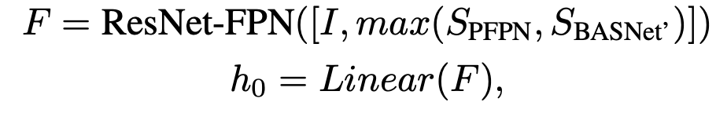
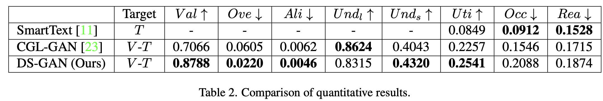

# [LG][CA] PosterLayout: A New Benchmark and Approach for Content-aware Visual-Textual Presentation Layout

- paper: https://arxiv.org/pdf/2303.15937
- github: https://github.com/PKU-ICST-MIPL/PosterLayout-CVPR2023
- CVPR 2023 accepted (인용수: 16회, "24-06-21 기준)
- downstream task: Content-aware Layout Generation

# 1. Motivation

- Element간 관계 (inter-element)뿐만 아니라 canvas와 layer간의 관계 (inter-layer)도 파악해야 함

- 기존엔 layer간의 관계를 파악하지 않아, 중요한 영역을 overlap하는 문제 종종 발생함

  $\to$ content-aware layout generation을 위한 데이터 & 모델을 제안해보자!

  

# 2. Contribution

- Content-aware layout generation을 위한 challenging dataset인 "PKU PosterLayout" dataset을 제안함

  

  - 9개의 주제 (category) 별로 고른 분포를 갖도록 데이터셋을 구성 
    - food/drinks, cosmetics/accessories, electronics/office supplies, toys/instruments, clothing, sports/transportation, groceries, appliances/decor, fresh produce
  - 데이터 뿐만 아니라 새로운 검증 메트릭 (utilization, non-occlusion, aesthetics, 등)을 제안

- Human Designer들의 desgin process를 흉내낸 Design Sequence Formation (DSF) 알고리즘을 제안함

  - 중요한 요소들을 우선 배치하고, 덜 중요한 요소들은 후순위 배치하는게 핵심

- CNN-LSTM기반의 DSF와 연동한 DS-GAN (Design Sequence GAN)을 제안함

  - Design sequence를 학습하여 content-aware layout generation task를 수행 $\to$ SOTA 

# 3. PosterLayout

- 기존 Content-aware layout dataset은 NDN, ICVT, CGL-GAN이 있었음

  - NDN, ICVT는 publicly available하지 않음
  - CGL-GAN은 데이터셋이 충분하나, single source에서 얻어 diversity가 취약하고, imbalance 비율의 데이터셋으로 이루어졌으며, 10개 element 이하 layout만 다룸

- PosterLayout dataset

  - 통계 분포

    

  - 예시

    

  - 요소
    - Text: 말 그래도 text 요소
    - Logos: 브랜드명, 홍보활동 등 이미지 요소 $\to$ 미리캔버스의 SVG 
    - Underlays: overlay 요소 (Text, Logos)를 덧대어 데코레이션하는 역할의 요소 $\to$ 미리캔버스의 투명도 0 초과하는 요소들
  - 라벨링
    - Object Detector를 거치고, Human 검수자를 거쳐 최종 label 생성하여 poster, label pair를 구축
      - poster = 미리대의 skin image
    - poster의 경우, Fourier-convolution-based inpainting 기법을 사용하여 구축

- DS-GAN overall architecture

  

  - Generator, Discriminator 모두 CNN+LSTM기반으로 설계

    - CNN+LSTM을 쓰는 이유는 time-series forcasting에 유용하기 때문

    

    - Generator : 2 FC layer로 fixed length 요소들의 box + category 예측
    - Discriminator: 1 FC layer로 real / fake layout을 분류

  - Loss

    - NLL loss, GIoU loss, Reconstruction loss, L1 loss, adversarial loss (hingle lossㅏ)

- Design Sequence Formulation (DSF)

  - 가설: Human designer들의 디자인 행동을 모델링하는 것은 content-aware layout generation에 중요하다
  - logo > text > underlay 순으로 design sequence를 생성
    - logo는 좌상단부터 우하단 순서로 sequence 생성
    - text는 area가 넓은순서로 sequence 생성

  

- Design sequence 예시

  

# 4. Experiments

- Evaluation Metrics

  - Gaphic Metrics

    - Validity (↑): 전체 요소 중 유효한 요소의 비율. 유효의 기준은 캔버스 이미지 크기 대비 0.1% 이상 area

    - Overlay(↓): Underlay 제외하고 요소간의 overlap되는 IoU의 평균값. 

    - Non-Alignment(↓): 요소간의 non-alignment 정도

    - Underlay(↑): Underlay 요소 중 유효한 요소의 비율. 유효의 기준은 underlay 요소가 최소 1개 이상의 다른 요소를 포함할 것

      - Loose: IoU를 기준으로 점수화

        

        - *u*: underlay element
        - *Inst*: 기타 underlay 외 element

      - Strict: 100% 포함할때 만 1, 아니면 0

  - Content-aware Metrics

    - Utility (↑) : Salient하지 않은 영역 중 element가 차지하는 넓이
    - Occlusion (↓): Salient 영역 중 element가 차지하는 넓이
    - Readability(↓): text element가 속한 배경의 non-flatness

- 정량적 분석

  

  - *SmartText*: Saliency-aware region proposal이다 보니, Content-aware Metrics가 좋음 (upper-bound)

    

    - (b) *TextSmart* vs. Ours: Textsmart결과가 occlusion, readability가 좋음
    - (c), (d): Salient 영역이 가득한 경우 *Textsmart* 성능은 급하락.

- Ablation study

  - CNN-LSTM 유무

    

  - DSF vs. Random vs. Geometric (좌상단 ~ 우하단)

    
