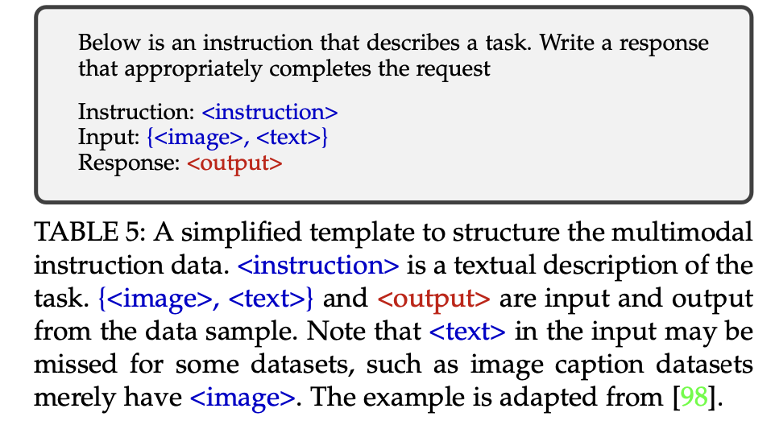
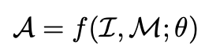
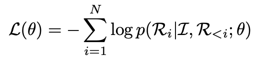
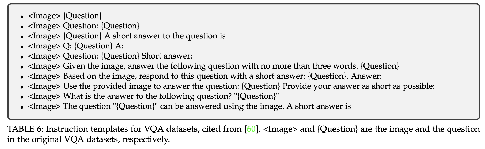
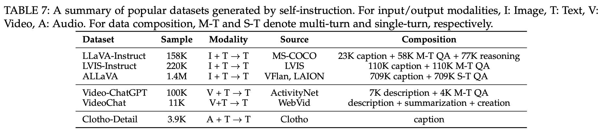
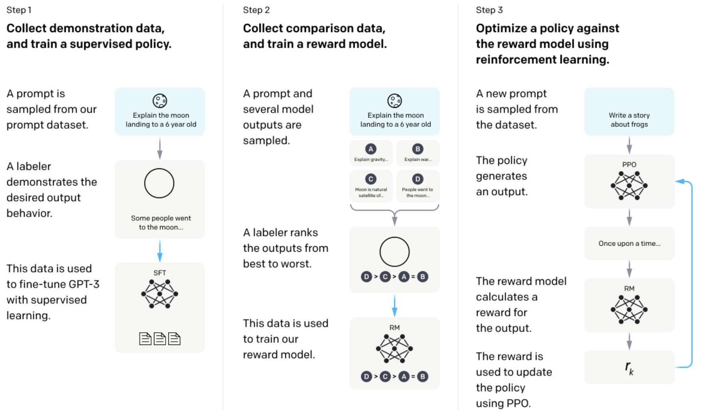
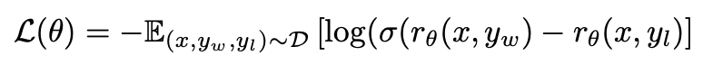
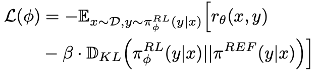
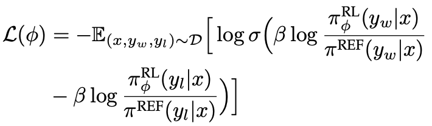
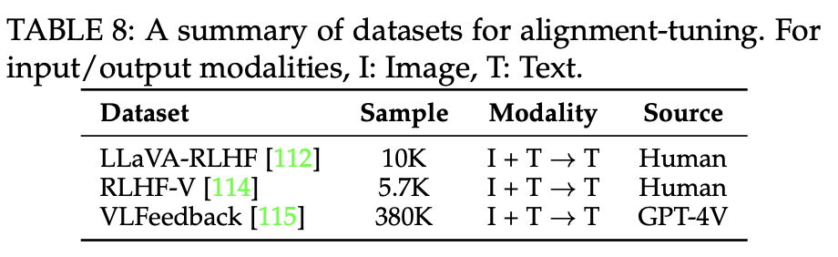

# [MM] A Survey on Multimodal Large Language Models

- paper: https://arxiv.org/pdf/2306.13549
- github: https://github.com/BradyFU/Awesome-Multimodal-Large-Language-Models
- Archived (인용수: 467회, '24-06-23 기준)
- Downstream task: Multi-Modal 

# Abstract

- Multimodal LLM의 architecture, training 전략, data, 그리고 evaluation에 대해 다룸
- Multimodal LLM의 응용 사례 (granularity, modalities, languages, scenarios) 소개
- Multimodal Hallucination 소개
- Extended techniques 소개 (Multimodal ICL, Multimodal CoT, LLM-aided Visual Reasoning (LAVAR))
- Future research direction 소개

# 1. Introduction

- LLM은 reasoning 수행이 가능하나 blind함

- LVM (Large Vision Model)은 볼 수 있으나, reasoning을 못함

  $\to$ MLLM 은 LLM과 LVM의 장점을 취합한 형태

- MLLM의 정의

  1. billion-scale parameter

  2. instruction tuning 기반의 new paradigm으로 학습

- Timeline

  

# 2. Architecture

- 3가지 모듈로 구성 

  

  - Modality Encoder: Eyes / Ears 역할

    ex. Image / Audio Encoder

  - Pretrained LLM: Brain 역할

  - Modality Interface : 다른 modality를 align하는 역할

## 2.1 Modality Encoder

- Text에 align된 CLIP과 같은 pretrained encoder를 주로 활용

  

- Encoder-less 구조 (Fuyu-8B)도 있음 $\to$ MLP로 directly projection 수행

  

- Parameter size, training data composition에 비해 input resolution이 더욱 중요한 parameter임 $\to$ [52] 참고!

## 2.2 Pretrained LLM

- Pretrained LLM을 사용하는게 계산 효율 및 비용 측면에서 현실적임

- 최근 LLM은 causal attention 기반으로 구성 $\to$ Next token prediction & Decoder-only 구조이기 때문으로 사료됨

  

- Scalability가 보장된다고 함 (7B $\to$ 13B $\to$ 34B일수록 성능 향상)

- MoE (Mixture of Experts) 기반의 sparse architecture가 computational cost 없이 scaling-up이 가능해서 성능 향상됨

  

## 2.3 Modality Interface

- VFM, LLM을 end-to-end로 학습하는 것은 학습 비용이 많이 들게 되므로, 이를 freeze하고 connector만 학습시킴 (PEFT)

- 2가지 type

  - token-level: Modality encoder의 feature를 token으로 변환후 text token과 함께 사용

    - Q-former 기반: Blip-2, etc
    - MLP 기반: LLaVa, etc

    $\to$ token adapter type보다 visual token 갯수, image resolution이 더 중요한 변수라고 함 $\to$ [52] 참고!

  - feature-level: visual cue (feature)와 text embedding을 augmenting 수행 : ex. Flamingo

  - feature-level보다 token-level 성능이 좋암 

    - cross-attention 기반 hyperparameter space가 크므로 최적화가 힘들기 때문이라고 함  $\to$ [73] 참고!

- Expert Model 사용

  - Blip-2와 같은 Expert Model (Image Captioning) 를 이용해 image를 text로 바꾸어 training-free하게 사용

    $\to$ learning보다는 flexable한 구조는 아님

# 3. Training Strategy and Data

## 3.1 Pre-training

- 목적: multi modality간의 alignment 수행 (CE loss) 및 world knowledge 취득 (MLM loss)

- 데이터: large-scale image-text paired data

  

  - Coarse-grained : Web-crawled data 특성상 규모가 크고, noisy & short caption이 특징.
    - CC-3M/CC-12M
      - 부적절한 Aspect ratio / size image는 fitering
      - NLP tool로 text annotation을 얻되, Heuristic design에 의해 filtering
    - SBU Captions (Flicklr에서 추출, 1M)
      - Heuristic하게 caption이 충분히 길 경우만 취득
      - 전치사와 pre-defined word가 존재할 경우만 취득
    - LAION
      - 너무 큰/작은 image, 짧은 text length는 filtering
      - URL에 의거 duplicate된 이미지 fitering
      - CLIP embedding 추출하여 illigal content, text&image similarity score 낮은 이미지 filtering
        - LAION-COCO: LAION-5B dataset 중 영어에 대해서만 사용. Caption은 Blip으로 caption 대체
    - COYO-7B
      - 너무 큰/작은 image, 부적절한 aspect ratio filtering
      - pHash value로 기존 benchmark dataset 중복 시 제거 (ImageNet, MS-COCO, etc)
      - 명사형, 적절한 길이의 text, 영어 text만 추출
      - 중복 띄어쓰기 수정, 10번 이상 사용된 문구 제거, 등 수행
  - Fine-grained: GhatGPT-4V를 사용하여 instruction tuning
    - ShareGPT4V-PT: cost-effective하게 100K data만 ChatGPT 사용, 나머지 1.2M는 pre-trained captioner로 추출

  

- 학습

  

  - VFM, LLM은 freeze하고 learable interface만 학습하는게 일반적임

  - 아래 테이블처럼 Autoregressive하게 Cross-Entropy loss를 활용

  - image, text pair가 noisy 할수록, short할수록 low image resolution /  clean 할수록, longer할수록 high image resolution 으로 학습해야 hallucination이 방지됨

## 3.2 Instruction Tuning

- Instruction: task에 대한 묘사 (Natural Language)

- Instruction tuning: 모델에게 user가 제공한 instruction을 더욱 잘 이해하도록 학습

  $\to$​​ LLM은 <u>specific task</u>에 <u>fitting</u>되도록 학습되는게 아니라 **unseen task**에 대해 **generalize**가 잘되도록 학습됨

  

  - Answer: 
    - $\theta$: learnable LLM parameters

- Objectives: Next Token prediction (response) 을 autoregressive하게 학습

  

- Data Collection

  - Data Adaptation: explicit하게 caption에 대한 묘사를 추가

    

    ex. "short", "brief" 라는 단어를 caption에 추가 

    ex. "single sentence"라는 단어를 caption에 추가

  - Self-Instruction

    

    - image를 text caption으로 변환 (ex. bounding boxes)
    - real-world dataset (multiple round conversation)에 사용

  - Data Mixture

    - Multimodal data를 random shuffle해서 사용

- Data Quality

  성능에 더 중요한 지표: Quality > Quantity $\to$ noisy label automatic fitering이 중요

  - Prompt diversity: 다양한 prompt 기반 instruction 제공하는 것이 모델 성능에 긍정적
  - Task coverage: instruction 성능 boost에 우선순위
    - visual reasoning > captioning, QA reasoning
    - Instruction complexity > task diversity

## 3.3 Alignment Tuning

- Human preference를 모방하도록 추가 학습함으로써 Hallucination 등을 해결

  - RLHF (Reinforcement Learning with Human Feedback)

    - Reward model을 추가 학습하여 활용

      

      1. Supervised Fine-Tuning (SFT): Human labeled caption을 가지고 *policy model*을 학습. 

      2. Reward modeling: 학습된 model의 output $y_l$에 대해 Human preference (우선순위)를 매겨 preferred response $y_w$를 따르도록 reward model을 학습

         

         - $\theta$: reward model parameter
         - $D=\{(x, y_l, y_w\}$​
         - $r_{\theta}$: reward model. policy model과 유사한 structure로 설계

      3. Reinforcement Learning: Proximal Policy Optimization (PPO) algorithm을 통해 reward를 최대화 하도록 학습. 2번째 term은 SFT freezed model로부터 너무 벗어나지 않도록 regularization term

         

         - $\phi$: RL policy model learnable parameter
         - $\pi_{\phi}^{RL}$: RL policy model
         - $\pi^{REF}$: SFT policy model

  - Direct Preference Optimization (DPO)

    - Reward model없이 학습

      

  - Data: model response에 대한 feedback을 수집하는 방식 (human, ChatGPT)에 따라 benchmark dataset이 구분

    

# 4. Evaluation

## 4.1 Closed-set

## 4.2 Opened-set

# 5. Extensions

# 6. Multi-modal Hallucination

## 6.1 Preliminaries

## 6.2 Evaluation Methods

## 6.3 Mitigation Methods

# 7. Extended Techniques

## 7.1 Multimodal In-Context Learning

- Few shot example과 instruction만 가지고 학습을 수행하여, unseen task를 해결함

- Training-free하게 진행됨

  

- ICL 능력을 improving하는 방법

  - Instruction Tuning과 함께 사용 (MMICT-IT)

    

  - Video와 함께 사용 (Emu)

    

  - Image/Text를 unified quatized input / output으로 표현 

    

  - LLM의 reasoning capability를 통해 Multi-image간의 relationship을 학습 (MMICL)

    

## 7.2 Multimodal Chain-of-Thought

- 3가지 learning paradigm이 있음

  - few-shot : 예시가 되는 샘플과 답변을 instruction과 함께 제공

  - zero-shot: 예시는 필요없고 아래와 같은 instrution을 제공

    "“Let’s think frame by frame” or “What happened between these two keyframes"

  - finetuning: M-COT learning을 위한 dataset을 curation해야함

    - ex. ScienceQA dataset

      

- Chain Configuration

  - Structure에 따라 2가지 type이 있음

    - single chain

    - tree shape chain

      

  - Length에 따라 2가지 type이 있음

    - adaptive: LLM이 알아서 prompt 생성을 멈추게 함
    - Fixed: 고정된 length가 생성되도록 함

  - Pattern 생성 방식에 따라 2가지 type이 있음

    - infilling-based: 이전 / 이후 step의 논리적 공백을 추론하도록 요구됨
    - prediction-based: 이전 reasoning history를 condition으로 요구됨

## 7.3 LLM aided Visual Reasoning

- World-knowledge 기반으로 generalizability가 좋음
  - meme도 이해할 수 있음
- Control & interactivity가 좋음 (NLP의 특성)
- 2가지 학습 기법
  - Training-free
    - zero-shot/ few-shot learning: LLM의 언어적 reasoning 능력, in-context learning 능력을 활용함
  - Finetuning
    - Tool을 활용 (ex. GPT4v + Dall-E)

# 8. Challenges & Future Directions

- Long context에 제한이 있음 	
  - Long-video understanding 등
- Complex prompt를 instrucion으로 활용하는 방향
- M-ICL / M-CoT를 활용하는 연구
