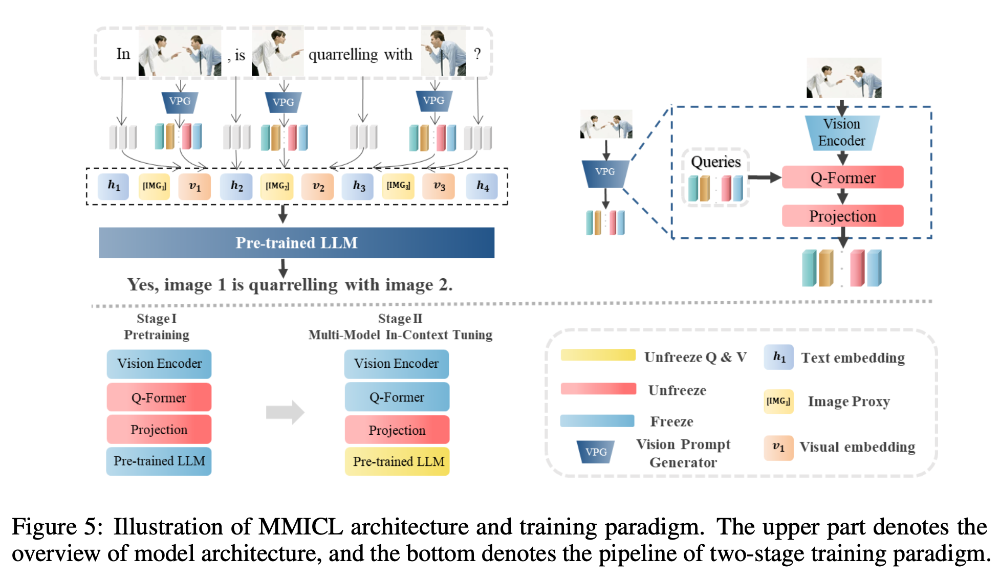

---
title: "[MM] MMICL: EMPOWERING VISION-LANGUAGE MODEL WITH MULTI-MODAL IN-CONTEXT LEARNING"

---

# [MM] MMICL: EMPOWERING VISION-LANGUAGE MODEL WITH MULTI-MODAL IN-CONTEXT LEARNING

- paper: https://arxiv.org/pdf/2309.07915
- github: https://github.com/PKUnlp-icler/MIC
- ICLR 2024 accepted (인용수: 10회, '24-06-27)
- downstream task: MME , VL reasoning, zero-shot VQA ,etc

# 1. Motivation

- 기존에 VLM (Vision-Language Model)은 multi-image 기반의 multi-modal prompt를 이해하는데 어려움이 있었음

  - Web-crawled dataset 특성상 동떨어진 multiple image간의 관계, text기반 referential relationship을 학습시키기가 어려웠음

  - In-Context Multi-modal demonstration이 힘듦 (Single image 제약 / Multi image 간의 관계나 text referential에 제약된 multi modal prompt 설계)

    

  $\to$ Image를 text와 동일하게 다루면서 Multi image를 In-Context Learning 기반으로 사용해보면 어떨까?

# 2. Contribution

- Multi-modal input를 효율적으로 다루는 MMICL (Multi-Modal In Context Learning)을 제안함

  

  - text-image reference가 가능 (fig 1.a)
  - image-to-image relationship 비교가 가능 ₩(fig 1.b, c, d, f)

- In-context learning 능력을 향상시키는 새로운 context scheme를 제안함

- Complex multi-modal input를 학습시켜 VLM의 ability를 향상시키는 MMICL dataset를 제안함

- MME, MMBench Vision-language benchmark에서 SOTA

# 3. MMICL

- architecture

  - LLM: FLANT5-XL / FLANT5-XXL

  

  - Pretraining: LLM이 image feature를 학습하도록 align

    - freeze: Image encoder, LLM
    - learn: Q-former, projection layer
    - data: COCO(Lin et al., 2014), CC3M(Sharma et al., 2018), Visual Genome(Krishna et al., 2017), CC12M(Changpinyo et al., 2021), SBU(Ordonez et al., 2011) and LAION-400M data(Schuhmann et al., 2021) + BLIP-large의 captions

  - Finetuning

    - 낮은 learning rate 사용 (1e-5)함
    - A40 6대로 3epoch 학습 (제일 큰 모델 기준 약 2일 소요)
    - data: MIC dataset으로 학습

    

    - freeze: Image encoder, Q-former, LLM 일부 (query embedding)
    - learn: projection layer, LLM 일부 (key, value embedding)

- Context Scheme

  

  - Image declaration: Image proxy $[IMG_j]$ 가 *j*번째 이미지를 지칭 (reference)하도록 $[IMG_j]$를 할당

    - [IMG_j]는 text와 image를 모델이 identify하여 visual & textual embedding을 구분짓도록 설계 $\to$ svg, text로 구분하면 더 좋겠다

    

    - **X**$_i$: i번째 image decoration set. prompt 어느 위치가 자유자재로 입력가능한 형태
    - **q**$_i$: question with instruction
    - **a**$_i$: answer

  - Multi-modal data with interconnected images

    - Human-annotation free하게 학습 데이터셋 구축 (baseline: VCR dataset)

    - ChatGPT를 활용해서 instruction만 여러개로 refinement 진행

    - 이미지들간의 spatial, logical, 그리고 temporal relationship을 갖는 interconnected multi-modala data를 생성

      

      - *k*개의 multiple image를 구성	

    

  - Unified Multi-modal In-context format for different tasks

    - 다양한 task를 1개의 in-context format으로 통합 가능 (high-quality)

    

    - few-shot으로 in-context 예시 (exempler **P**$_j$)를 제공

      

- Construction Dataset

  - 아래 3가지 관점에서 데이터를 오픈소스로부터 수집

    - image declaration

      

    - multi-modal data with closely related images 

      - VCR dataset의 bbox, image, QA 정보를 활용하여 annotation-free하게 학습 데이터 구축
      - 초기 instruction을 task별로 정의하고, 이를 ChatGPT를 활용해 같은 의미 instruciton을 여러개 생성 (augmentation)

    - multi-modal in-context data for different tasks

      - Few-shot exampler를 추가한 In-Context data 확보

  - 생성 절차

    - image declartion: : image (instance)별로 image proxy 설정
    - task별로 instruction을 구성하여, chatGPT기반 다양한 instruction augmentation 수행
    - In-context learning format에 맞게 학습 데이터 구축

  - Data quantity: 약 5.8M images 확보 $\to$ resource constraint로 10%만 활용

    - Training data : 16 datasets / 8 catagories

    - Test dataset: 20 datasets / 10 categories

      

# 4. Experiments

- baseline: Blip-2 (FLAN-T5) / Instruct-Blip (InstructFLAN-T5)

## 4.1 General Performance Evaluation

- MME: 14 sub-tasks VLMs (cognition & perception abilities)

  

  

  

  

- MMBench

  

## 4.2 Performance Prob

### Understanding T2I Reference

- Text의 전/후 순서만 바꾸어 **미세한 차이를** 구분하여 reference Image에 대해 정답 text를 예측하는 능력을 평가

  - Dataset: Winoground

  

### Understanding Image-to-Image Relationship

- VLM의 Non-verbal reasoning 능력을 평가

  

  - Dataset: RAVEN
  - Input: 3~8 as inputs + 6 candidate images for answers (unique 1개 answer)
  - Output: right image 예측

### In-Context Multimodal Demonstration기반 학습

- MMICL Few-shot (4-shot) 결과 비교 

  

  - VizWiz: 학습에 사용하지 않은 데이터. 성능이 좋은것을 토대로 MMICL의 generalizable 능력을 인증
  - Flickr30K

### Hallucination & Language Bias of VLMs

- dataset: ScienceQA-IMG

  - 기존 VLM은 text가 많은 경우, visual content를 overlook하곤 함 $\to$ Multimodal Hallucination

  

  - Answer하기 위해 Visual information이 필요한 경우, MMICL이 압도적으로 좋은 성능을 냄 $\to$ visual feature를 더 잘 추출함을 의미
    - ScienceQA : 4,221
      - ScienceQA-IMG: 2,017
      - SicenceQA-NonIMG: 2,204

- dataset: POPE

  

- Ablation Study

  - ICL 유무에 따른 성능 비교

  

- Video-Language task

  

  - MMICL은 Video 데이터로 학습하지 않았음에도 잘 됨 $\to$ image간 temporal 관계 학습이 되었음 

- 제안한 Context Scheme의 유무에 따른 성능 비교

  
