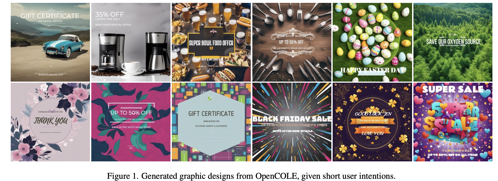
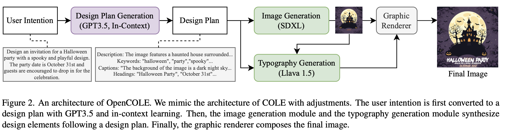
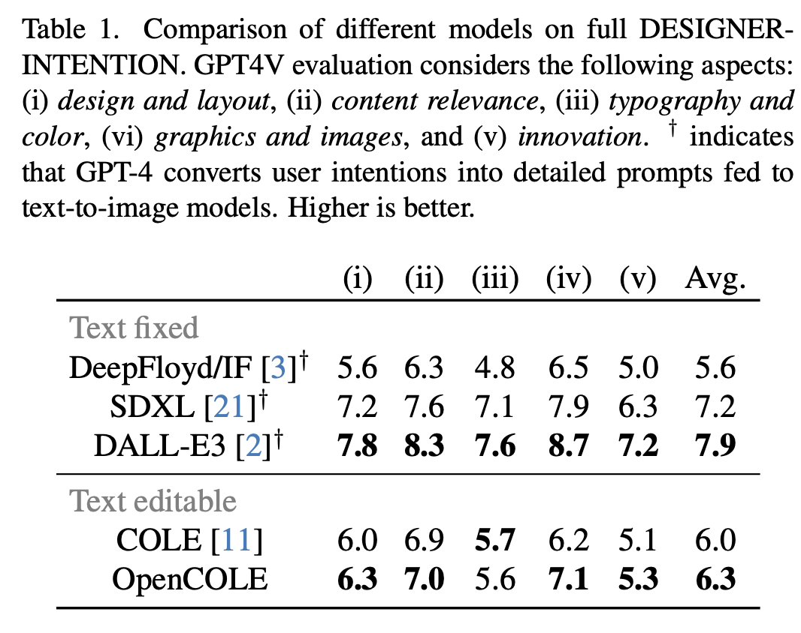
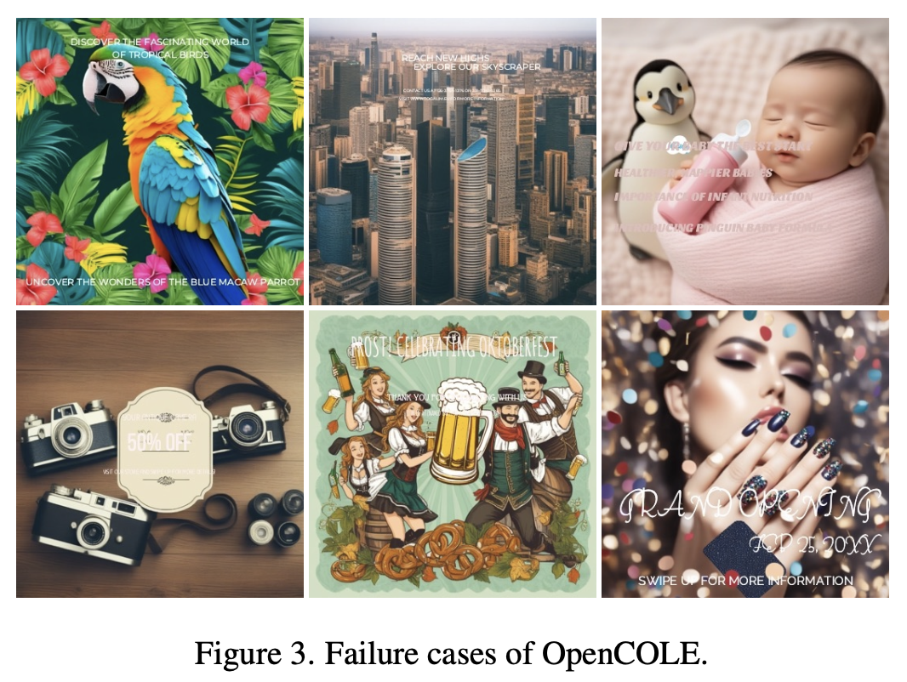
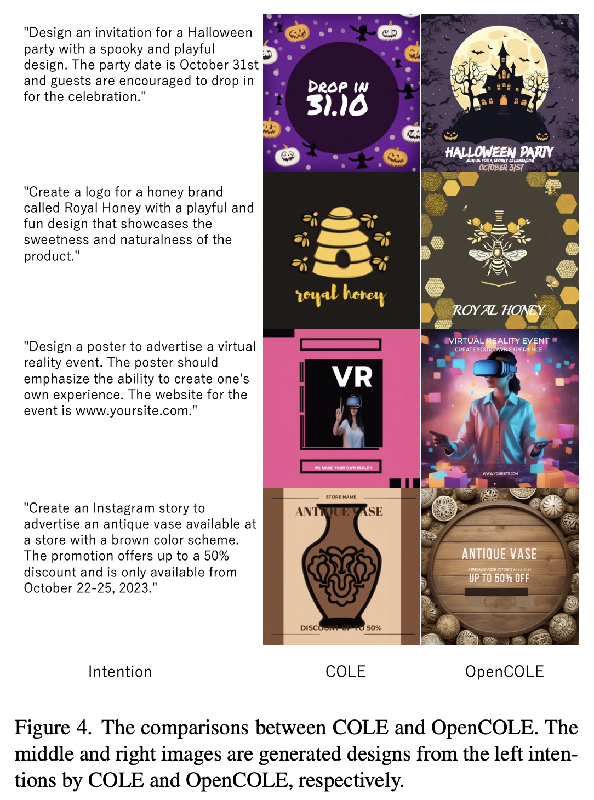

# [AGD] OpenCOLE: Towards Reproducible Automatic Graphic Design Generation

- paper: https://arxiv.org/pdf/2406.08232
- github: https://github.com/CyberAgentAILab/OpenCOLE
- CVPR 2024 workshop Graphic Design Understanding and Generation accepted (인용수: 0회, '24-06-30 기준)
- downstream task: Automatic Graphic Design

# 1. Motivation

- 최근 brief intention prompt만 가지고 graphic design을 생성하는 COLE이 각광을 받고 있음

- 하지만, COLE은 해당 data와 code가 공개되어 있지 않음 

  $\to$ opensource data(Crello)와 publicly available한 generative model을 통해 democratize를 해보자!

  

# 2. Contribution

- Intention prompt기반으로 graphic design을 생성하는 COLE을 재현 가능한 OpenCOLE framework를 제안함
- GPT4V-based DESIGN-INTENTION benchmark에서 COLE과 동등 이상 수준으로 성능을 냄

# 3. OpenCOLE

- overall workflow

  

  - Intention creation: COLE의 prompt를 adjust하여 GPT-3.5V에 title, format, keywords, text와 함께 입력하여 생성함
  - Design Plan Generation : GPT-3.5V with 5-shot in-context learning 예제를 통해 생성함
    - in-context learning dataset: LLaVA-1.5를 통해 description / keywords / captions / headings를 추출 
      - divide-and-conquer 방식으로 4가지를 따로 json 추출 $\to$ LLM의 output stability 향상
    - input: User's intention
    - ouput: detailed explanation in JSON format
      - description: 최종 design composition에 대한 detailed caption. image 자체에 대한 묘사, object들에 대한 묘사, context에 대한 묘사를 포함
      - keywords: color, object, genre 등 다양한 aspect에 대한 묘사
      - captions: background caption (color, 주제 외 objects에 대한 묘사), object caption (위치 정보와 함께 해당 object에 대한 묘사)
      - headings: 최종 design compostion에 대한 heading & subheading
  - Image Generation : Text layer (typography 포함) 제외한 graphic design 이미지 생성
    - text layer 제외한 image-text pair로 모델을 학습 (SDXL-1.0)
      - 10K steps, 8xe-7 lr, 1024x1024 resolution
    - input: Design Plan
    - output: text layout 제외한 graphic design 이미지
    - COLE에서는 text-to-background / text-to-object 2stage로 나누었으나 우리는 1stage로 진행
  - Typography Generation 
    - 현존 text-to-image 모델이 글자모양을 잘 못만들므로, typographic attribute를 생성하도록 학습된 LLM에서 출력한 값을 가지고 rendering 수행
      - font
      - font size
      - color
      - letter spacing
    - COLE의 TypographyLLM을 따름 (LLava-1.5-7B)
      - LoRA rank 128, alpha 256
      - input resoultion 336x336
      - max token length: 4096

# 4. Experiments

- dataset: Crello (22K design templates)
  - social media posts, banner ads, blog headers, printed posters
  - image, text, layout, typography information 포함
- evaluation
  - DESIGNER-INTENTION benchmark 
    - 200개의 designer intention prompt
      - 6가지 중요 category로 분류: advertising, events, marketing, posts, covers & headers, creative
    - quality : GPT4V가 1~10점 중 점수 부여

- 정량적 결과

  

- 정성적 분석

  - 성공 사례 (처음 그림)

  - 실패 사례 

    

    - 폰트 깨짐 $\to$ line break없이 긴 글을 생성하거나, image를 빈 공간 없이 생성하거나, 색 대조를 간과하거나, 매우 얇은 폰트를 선택한 경우

  - COLE vs. OpenCOLE

    
