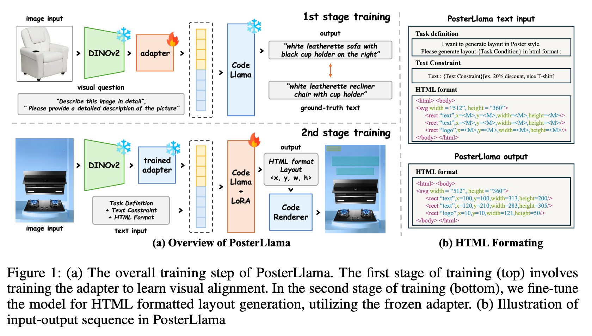

# [LG] PosterLlama: Bridging Design Ability of Langauge Model to Contents-Aware Layout Generation

- paper: https://arxiv.org/pdf/2404.00995
- github: https://anonymous.4open.science/r/PosterLlama/readme.md
- CVPR 2024 GDUG workshop accepted (인용수: 0회, 2024-07-01 기준)
- downstream task: Content-aware Layout Generation

# 1. Motivation

- 기존 Layout Generation 모델들은 layout을 numerical optimization으로 접근하여, layout design의 복잡한 의미를 간과함

  ex. `"The text" + "the underlay"` vs. `"Element 1" + "Element 2"`

  $\to$ Language model 기반으로 layout을 해석하면, 풍부한 design knowledge를 지렛대 삼아 HTML code기반으로 생성할 수 있음

  ​     (ex. LayoutNUWA, LayoutPrompter, LayoutGPT, etc)

- 하지만, LLM 기반은 visual content를 고려하고 있지 않음

  $\to$ 1. **visual & textual content-aware**하게 **LLM**으로 학습하는 방법은 없을까? 

- 하지만, layout generation을 위한 데이터셋은 양이 적고, license 이슈로 학습에 사용할 수 없음

  $\to$ 2. **적은 양**의 **데이터**를 통해 **LLM** 모델을 학습할 방법을 고안해보자!

# 2. Contribution

- Visual & Textual content-aware layout generation을 하는 PosterLLaMA를 제안함

- Two-stage training process 기반으로 학습 (Mini-GPT4)

  - 1st stage: Adapter만 학습 (LLM, VFM freeze)
  - 2nd stage: HTML sequence를 생성하도록 LLM을 LoRA기반으로 PEFT

-  Copy right issue + 상대적으로 학습할 양이 적은 poster dataset $\to$ 새로운 **depth-based augmentation** 기법을 제안함

  - salient object의 depth map을 기준으로 Image Generation된 이미지를 학습에 활용 $\to$ inpainting으로 인한 artifact 이슈 (data leakage) 해결

    

- 모든 type의 conditional generation에 통용되는 content-aware layout generation

# 3. PosterLLaMA

Layout Generation을 HTML sequence generation task로 문제를 정의

- Overall Diagram

  

## 3.1 Input/Output Sequence Formatting

- Layout을 주어진 content *C*를 조건으로 생성하는 task

  $\{e_i\}_{i=1}^N, e_i=\{t_i, s_i, c_i\}$

  - $t_i$: bbox location $(x_i, y_i)$

  - $s_i$: bbox scale (w_i, h_i)$

  - $c_i$: element category (text, logo, underlay, embellishment, etc)

    GEN-I: Image만 주어졌을때 Layout 생성 / GEN-IT: Layout+bbox location주어졌을 때 Layout 생성 / GEN-ITS: Layout+bbox location+bbox scale 주어졌을 때 Layout 생성

- HTML formatting : 단순한 numerical optimization만으로는 training distribution 학습 외에 추가적인 표현을 얻기 힘듦

  -  LLM의 extensive design knowledge를 활용하기 위함 

    `{Task Condition} = {according to the categories and image}`: GEN-IT case 등등 모든 type의 conditional layout generation 표현이 가능함

    - 나머지 layout attribute는 Mask token으로 <M> 처리

  - 학습 순서를 random하게 하기 위해 random permutation으로 iteration마다 순서를 바꿈

  - x,y,w,h는 discretized attribute를 활용

## 3.2 Training Method

- Mini-GPT4에서 학습한 VQA 방식의 Instruction Tuning으로 학습

  - 1st pretraining : adapter만 학습

    - extensive amount의 aligned image-text pair로 학습 $\to$ **얼마나 많은 데이터? 어떤 Caption 데이터? (Quantity / Quality)**
    - Data: 2M image-captioning dataset (LAION+CC+SBU)
      - Training: A100 x 2ea (5days) $\to$ batch 32 (gradient accumulation)
      - Inference: *top-p* (p=0.9), top-k(k=3) similarity

  - 2nd finetuning: Visual adapter frozen하고 LLM의 LoRA만 학습

    `{Task Condition} = {according to the categories and image}`  $\to$ **0GEN-IT 외에도 GEN-ITS, GEN-I, 등으로  학습? 얼마나 많은 데이터? 어떤 Caption 데이터? (Quantity / Quality)**

## 3.3 Depth-Guided Poster Augmentation

- LAION과 같은 방대한 dataset에 비해 poster dataset은 두 가지 이슈가 있음

  - Quantity : LLM 학습을 위한 양이 적음

  - Copyright Issue: 학습에 활용 불가

    $\to$ depth-based augmentation으로 생성된 이미지로 학습

  

  - 장점
    - Quantity 증가
    - Undesireable Artifact 해결: 기존 Poster dataset은 Inpainting기반으로 poster dataset을 생성하다 보니, 해당 inpainted artifact에 overfit하는 이슈 해결

# 4. Experiments

- LLM : CodeLlaMA

- Visual Encoder: DINOv2-base ViT (image resolution: 224x224)

- 정량적 결과

  

- 정성적 결과

  

- Data Leakage

  - RADM보다 FID, occ, rea가 낮은 이유 분석

    - 가설: RADM은 inpainting artifact를 학습하여, 해당 영역에 layout을 잘 생성함. 이는 FID, occ, rea metric에 영향을 끼침

      

- Ablation

  - Visual encoder에 따른 비교

    

  - Augmentation 유무에 따른 성능 비교

    #### 

  - Conditional Generation 

    - Recover: Random noise를 가하고 복원되는지 파악. 

      

    

  - Code Renderer : Canvas 크기를 넘는 element 생성을 하지 않아 overflow를 해결

  - Poster Generation Pipeline

    - Text만 TextAny로 생성하고, 나머지는 one-click advertisement poster생성 
      - input: user의 text
      - output: designed poster

    

    - 우측 2열은 Chinease2English 변환에 따라 bbox크기 & word길이 mismatch로 쪼그라든 typography가 생성됨

