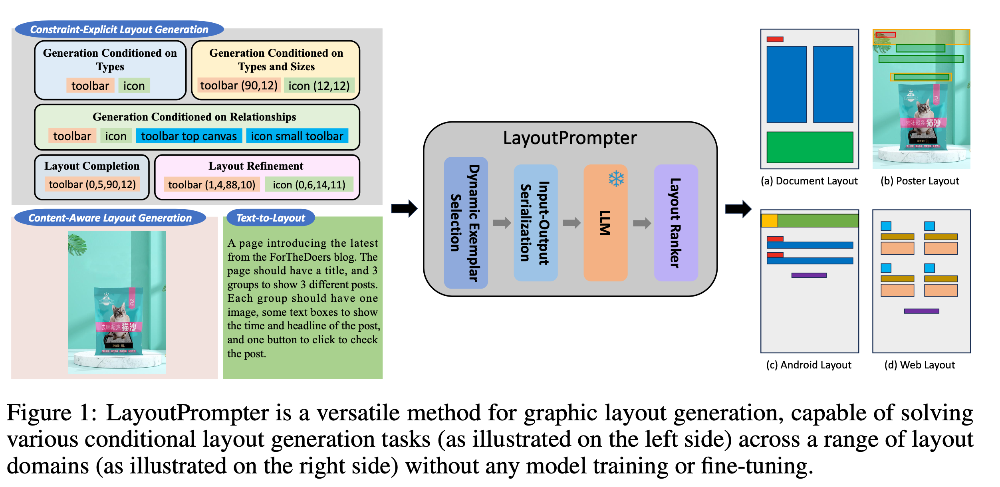

# [LG] LayoutPrompter: Awaken the Design Ability of Large Language Models

- paper: https://arxiv.org/pdf/2311.06495
- github: https://github.com/microsoft/LayoutGeneration/tree/main/LayoutPrompter
- NeurIPS 2023 accepted (인용수: 9회, '24-07-02 기준)
- downstream task: Class aware Layout Generation

# 1. Motivation

- Graphic layout generation 의 다양한 task들 (constraint-explicit (content-agnostic) layout generation, content-aware layout generation, text-to-layout )은 task specific하게 학습되어 unified 모델이 부족했음 $\to$ 실용성이 부족

- LLM을 leverage 삼아 prompt tuning만으로 해결해보자!

  

# 2. Contribution

# 3. LayoutPrompter

# 4. Experiments
