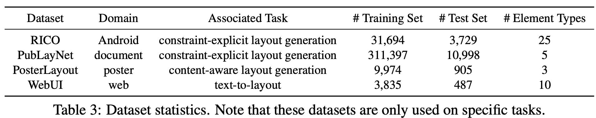
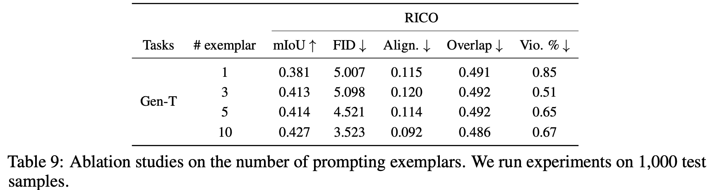

# [LG] LayoutPrompter: Awaken the Design Ability of Large Language Models

- paper: https://arxiv.org/pdf/2311.06495
- github: https://github.com/microsoft/LayoutGeneration/tree/main/LayoutPrompter
- NeurIPS 2023 accepted (인용수: 25회, '24-12-21 기준)
- downstream task: Class aware Layout Generation

# 1. Motivation

- Graphic layout generation의 다양한 task들 (constraint-explicit (content-agnostic) layout generation, content-aware layout generation, text-to-layout )은 task specific하게 학습되어 unified 모델이 부족했음 $\to$ 실용성이 부족

- LLM을 leverage 삼아 prompt tuning만으로 해결해보자!

  

# 2. Contribution

- LLM의 layout 관련 지식을 깨우고, 다양한 user 제약을 만족하는 layout 생성 task를 수행하는 LayoutPrompter를 제안함
  - Input-output serialization: LLM의 입력 token을 생성하기 위해 입출력을 LLM 입력에 적합하게 맞춰주는 module. layout-related knowledge인 HTML 기반으로 구현
  - Dynamic exampler selection: prompt 생성에 활용할 exempler를 채택하는게 목적. 유사한 exempler를 추출하기 위해 평가 suite를 만듦
  - Layout ranker: 동일 prompt로 여러 layout을 생성하고, ranking을 매기는 module.

- 4개의 benchmark에서 SOTA

# 3. LayoutPrompter

- overview

  

- Prompt **P**

   

  - R: Task-specific Preamble (접두어)
    - task description
    - layout domain
    - canvas size
  - $F_X, F_Y$; input x, y를 serialize하는 함수
  - G: exempler selection 함수

- Input-Output Serialization 

  - Content Constraint: Saliency map에서 threshold 이상인 값을 갖는 픽셀을 외접하는 박스

    

    $F_X(x)$=Content Constraint: left $l_m$ px,top $t_m$px,width $w_m$px,height $h_m$px

  - Output layout serialization: HTML format으로 변환

    

- Dynamic Exempler Selection

  - constraint의 유사도를 기준으로 상위 K개의 exempler를 도출

    

  - Task별로 계산 기준이 다름

    - Constraint-Explicit Layout Generation
  
      
  
      - p: element-wise constraint
      - **g**: geometry
      - $\mathbb{M}_{max}$: constraint가 같은 (ex. 같은 type) element간의 bipartite 그래프를 Hungrian matching으로 생성할 때, maximum matching된 갯수
  
    - Content aware Layout Generation
  
      
  
      - m: saliency map
  
    - Text-to-Layout Generation
  
      
  
      - n: Clip text embedding
  
  - Layout Ranker
  
    - Visually Pleasing (Alignment, Overlap) 하고, real layout과 유사 (mIoU)한 layout을 계산하여 rerank 수행
  
    

# 4. Experiments

- Dataset

  

- Implementation Detail

  - GPT-3 (text-davinci-003) model 활용
  - L=10 의 ranking output 생성
  - N=10의 exempler 사용

- 정량적 결과

- Constraint-explicit layout generation

  - 정량적 결과

    

  - 정성적 결과

    

- Content-aware Layout Generation

  - 정량적 결과

    

  - 정성적 결과

    

  - Text-to-Layout Generation: 두 task보다 어려워, training-free방식인 LayoutPrompter가 못함

    - 정량적 결과

      

    - 정성적 결과

      

- Ablation Study

  - 모듈별 성능 기여

    

  - Data pool 갯수에 따른 성능

    

  - Exempler 갯수에 따른 성능

    

  - Seed에 따른 성능 변화

    
