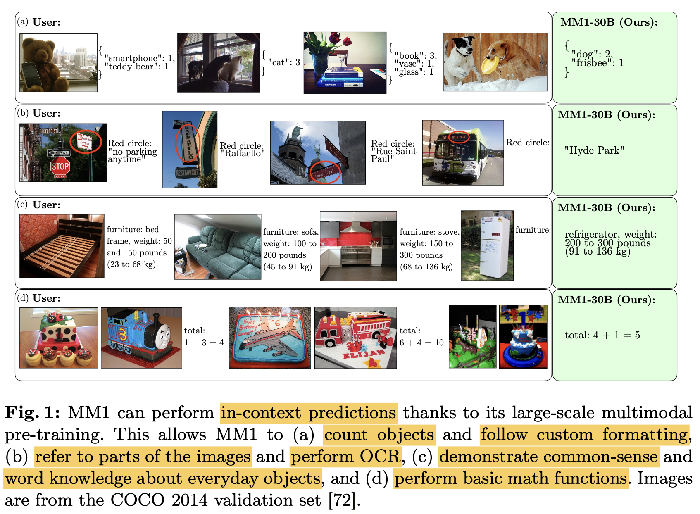

# [MM] MM1: Methods, Analysis & Insights from Multimodal LLM Pre-training

- paper: https://arxiv.org/pdf/2403.09611
- archived (인용수: 52회, '24-07-07 기준)

# Abstract

- MLLM의 다양한 architecture component 별, data choice별 학습 결과를 분석함
  - ex. Image Captioning only vs. Imange Captioning + Text-only dataset
- 핵심적인 design lession 우순선위를 제안: 
  - Image resolution = image-token 갯수 > visual connector 디자인

# 1. Introduction

- in-context learning 능력 예시

  

- Chain-of-Thought

  

# 2. Recipe for Building MM1

- Architecture

  

  - Image encoder: ViT-L/14 with CLIP loss; resolution 336x336
  - Connector: C-Abstractor / Average Pooling 
  - Language Model : 1.2B / 3.5B

- Data

  - Caption images (45%) + Interleaved image-text documents (45%) + text-only (10%)

- Training procedure

  - Contrastive Loss > Reconstruction Loss

- Encoder Lesson

  - Image resolution > Model size > Training data composition

    

- VL Connector Lesson: 

  

  - visual token / image resolution은 영향을 끼침
  - VL connector type은 영향이 없음

- Data Lesson

  

  - Captioning data : zero-shot performance에 긍정적
  - Interleaved image-text data + text-only data: few-shot performance에 긍정적
  - Captioned image : Interleaved image-text data : text-only data = 4:4:1 이 제일 성능 향상에 좋았음

# 3. Final Training Recipe

- Image encoder: ViT-H/14 with CLIP loss; resolution 378x378

- Connector: C-Abstractor (144 token)

- Data: Captioned image : Interleaved image-text data : text-only data = 4:4:1

- Model scaling: Model scale에 따라 최적의 learning rate를 extrapolate하여 도출

  

  

  - $\eta$: learning rate
  - *N*: # of parameters

- MoE

  - top-2 gating으로 scaling 효과를 볼 수 있음 (LLM decoder-only 부분만 변경)

- Final Pre-training Result

  

# 4. Supervised Fine-Tuning

- LLaVA-NeXT와 같이 GPT-4V가 생성한 caption으로 학습 / 검증 데이터 수집 (1.45M examples)

- Higher resolution

  - Pre-training 할때보다 고해상도 학습을 위해 positional embedding interpolation 수행 $\to$ 672x672

  - sub-image decompostion: 1344x1344 이미지를 672x672로 resize / sub-image로 나누어 처리

    

- Lesson: Pre-training이 SFT의 성능 향상에 기여함

  
