# [MM] Florence-2: Advancing a Unified Representation for a Variety of Vision Tasks

- paper: https://arxiv.org/pdf/2311.06242
- github: https://huggingface.co/microsoft/Florence-2-base
- archived (인용수: 10회, '24-07-10 기준)
- downstream task: zero-shot object detection & captioning & segmentation 

# 1. Motivation

- Multi-task 수행할 수 있는 Vision Foundation Model을 만들기 위해서는 공간적 / 의미론으로 다양한 spectrum의 complex task를 통해 학습해야 한다.

- 하지만, 이를 학습하기 위해서는 포괄적인 visual annotation을 필요로 한다. 

  $\to$ 포괄적인 visual feature를 unified pretraining framework를 통해 singular network로 학습해보면 어떨까?

  

# 2. Contribution

- 다재다능한 visual foundation model Florence-2를 제안한
  - Vision-Language tasks: Zero-shot captioning & visual grounding & referring expression comprehension
  - Vision tasks: Zero-shot classification & object detection & semantic segmentation
- Finetuning 이후에는 SOTA specialist 성능을 냄
- Florence의 backbone은 다른 SSL 기반 backbone보다 downstream task에서 좋은 성능을 냄 $\to$ visual representation을 잘 학습

# 3. Florence-2

## 3.1 Rethinking Vision Model Pre-training

- Self-supervised Learning / Weakly-supervised Learning / Supervised Learning의 한계

  - SSL: 좋은 feature를 학습하지만, 특정 attribute를 증폭함

  - WSL: 구조화되지 않은 textual annotation을 활용하는 장점이 있지만, image-level feature만 학습함

  - SL: Object recognition은 잘하지만, adaptability가 약함

    $\to$ Unified VFM 학습하기 위해서는 **single task limitation**을 해결하고, **visual & textual** semantics를 통합해 학습해야함

## 3.2 Comprehensive Multitask Learning

위의 제약을 해결하기 위해 다양한 multi task learning을 수행함

1. Image-level Understanding

   - high-level semantic을 학습하기 위해 linguistic description을 통해 학습함

     ex. Image captioning, Image classificaiton, Visual Question & Answering

2. Region/pixel-level Understanding

   - 구체적인 object & entity localization, object간의 관계 (공간적인)을 학습

     ex. Object detection, Semantic segmentation, Referring expression comprehension

3. Fine-grained visual-semantic alignment

   - Local detail을 capture하기 위해 local visual entities, semantic concept을 이해하도록 학습

     ex. fine-grained text & visual understanding

## 3.3 Model

- overall architecture : seq2seq paradigm

  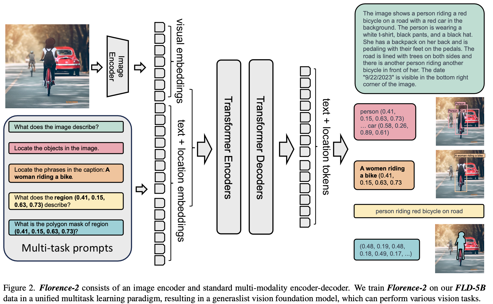

  - Input: Text-specific prompt와 image를 입력

    - 모든 task를 translation problem으로 정의

      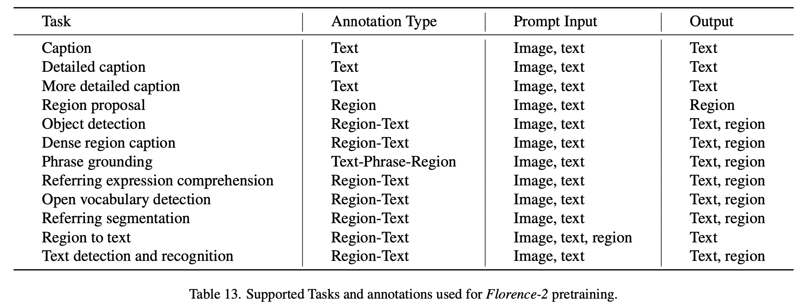

  - Output: text / region

    - region: 해당 localized 영역을 좌표로 표시 $\to$ 1,000개의 localized bin을 additional vocabulary로 학습

  - Architecture

    - Visual Encoder: DaViT
    - Multimodality encoder-decoder
      - input
        - text embedding: **T**$_{prompt} \in \mathbb{R}^{N_t \times D}$ 
        - visual embedding: **V** $ \in \mathbb{R}^{N_v \times D}$

  - Objectives

    

## 3.3 Data Engine

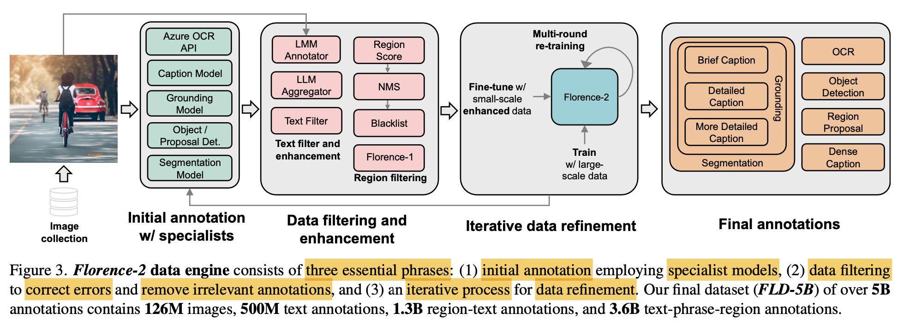

(1) initial annotation: Opensource Benchmark의 human annotation을 적극 활용하되, specialized model의 synthetic annotation도 사용

(2) Data filtering & enhancement: 너무 복잡한 object를 갖는 이미지는 filtering (대체로 noisy하므로) + bbox 가 confidence score 낮으면 filtering

(3) Iterative data refinement: filtered data로 학습한 모델의 출력을 가지고 annotation을 수정해서 재학습

- FLD-5B

  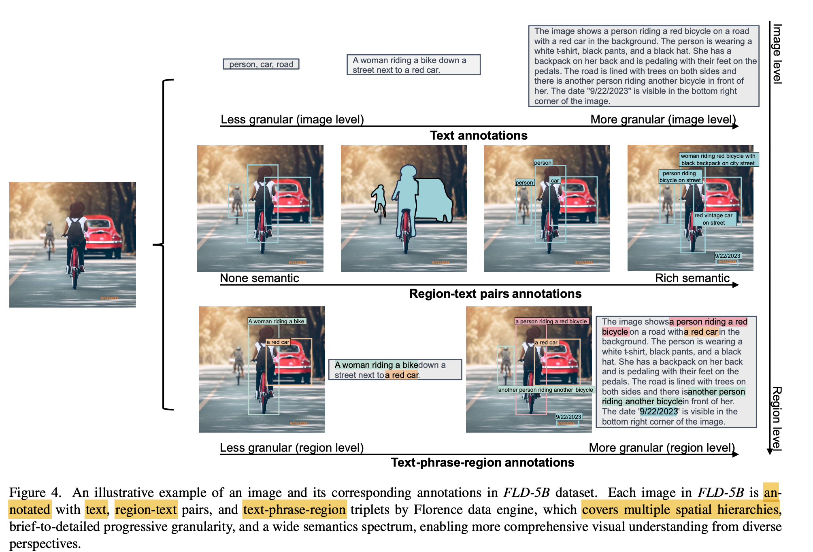

  - Images: 126M

  - Text annotation: 500M

  - text-region: 1.3B

  - text phrase-region: 3.6B

    

  ## 3.4 Data Analysis

  - Annotation Statistics

    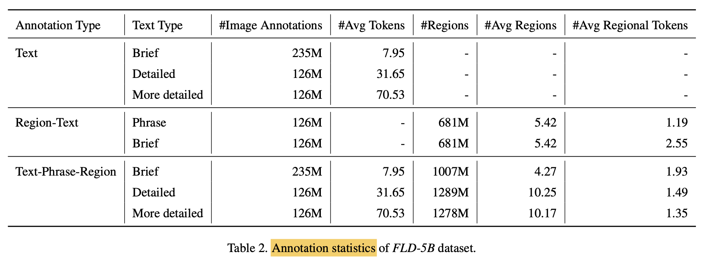

  - Semantic Coverage: SpaCy에 영감을 얻어 POS(part-of-speech) tags & dependency parsing tree로 측정 $\to$ [18] 참고

    

  - BBox의 분포

    

# 4. Experiments

- Zero-shot Vision-Lanugage tasks

  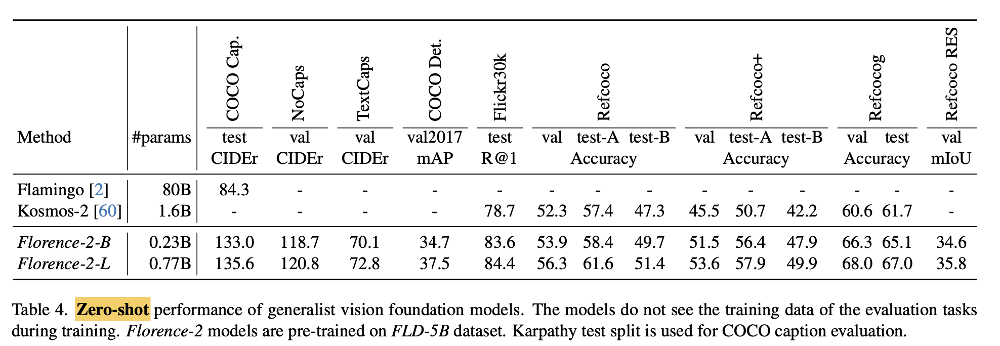

- Specialist performance: 해당 dataset으로 finetuned 결과

  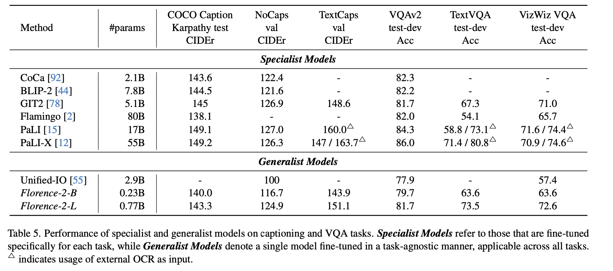

  

- Training Efficay 분석

  

  Florence가 supervised pretraining보다 downstream task에 성능 향상을 시킨다 $\to$ 좋은 visual representation이라는 반증

  - object detection

    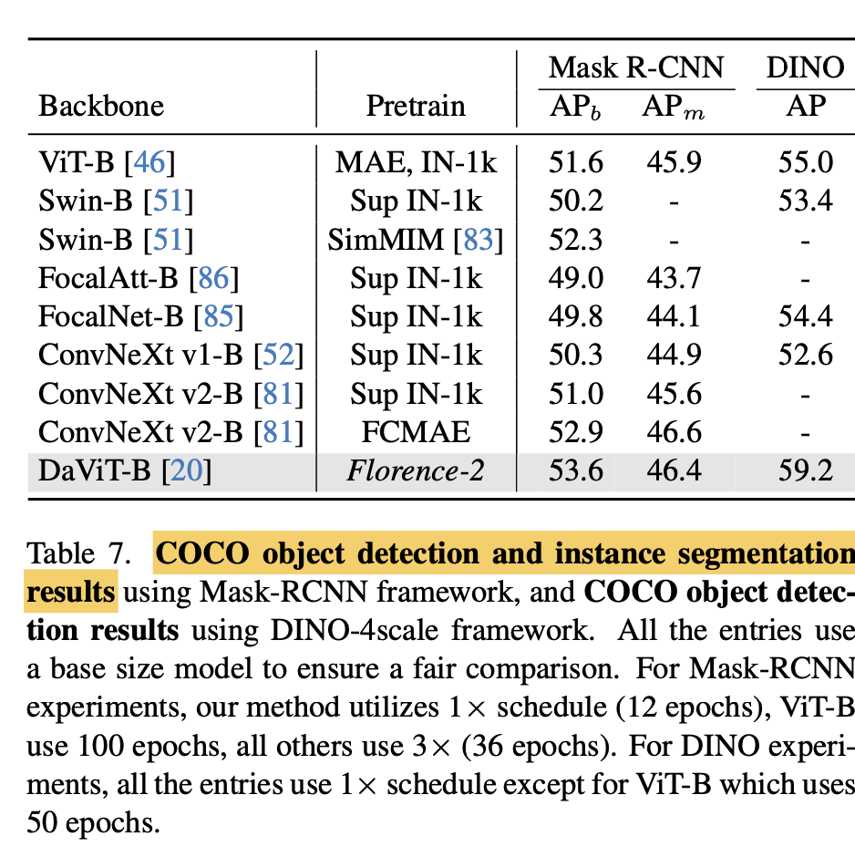

  - semantic segmentation

    

    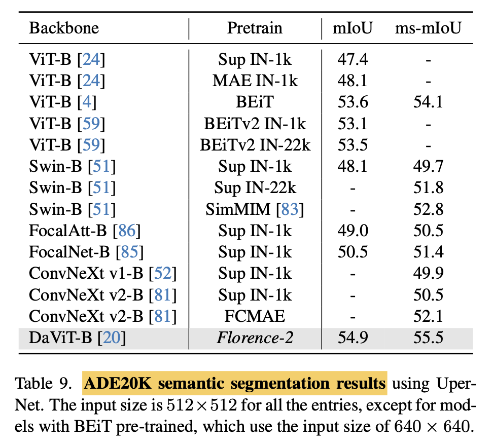

- Ablation studies

  - image-level vs. image + region level vs.  image + region + pixel level

    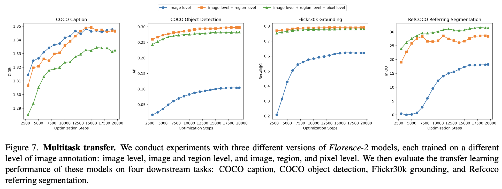

  - Model scaling

    

  - Data scaling

    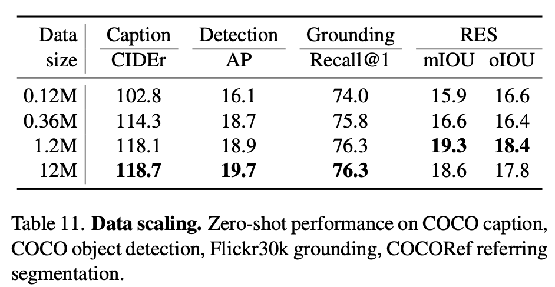

  - Freezing

    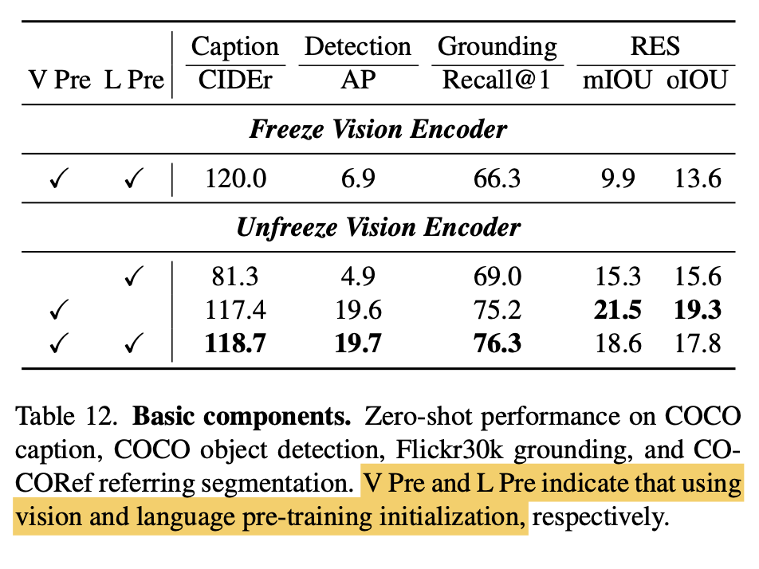
