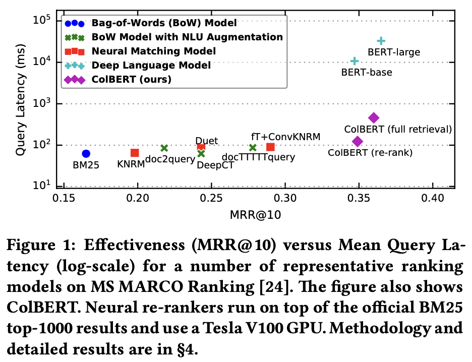
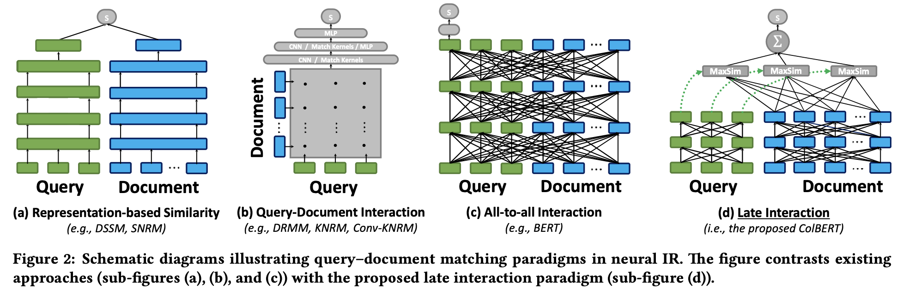
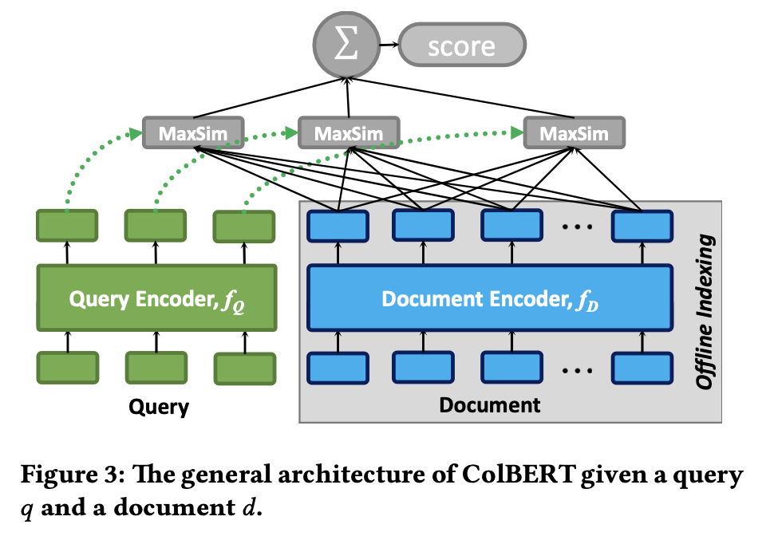
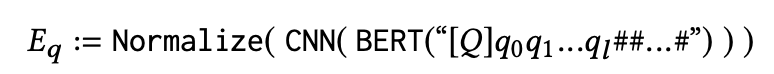
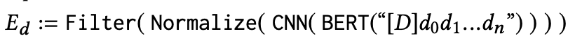
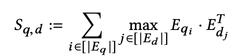

# [IR] ColBERT: Efficient and Effective Passage Search via Contextualized Late Interaction over BERT

- paper: https://arxiv.org/pdf/2004.12832
- github: https://github.com/stanford-futuredata/ColBERT
- SIGIR 2020 accepted(인용수: 1071, '24-07-13)
- downstream task: Information Retrieval (IR)

# 1. Motivation

- IR task에서 Deep Learning 기반 Language Model (LM)의 fine-tuning으로 인해 성능 향상이 되었음

  - MRR@10: 7% 향상
  - latency: 1,000배 증가 (high-end GPU기준)

- 하지만, 그에 따른 computational cost 증가로 query-document pair기반 수많은 계산을 통해 relevance score 계산이됨

  $\to$vector search처럼 offline으로 미리 vectorized하여 속도 향상시킬 수 있는 방법은 없을까? (<100ms)

# 2. Contribution

- BERT기반의 효율적인 retrieval을 하는 새로운 ranking model "ColBERT"를 제안함

  - query & document를 **독립적**으로 **embedding** gndp *late interaction architecture*를 통해 cheat & powerful interaction step인 "maxsim"을 수행
  - LM의 표현력의 이점과 **document representation**을 **offline으로 pre-compute**함으로써 query processing의 속도를 비약적으로 발전시킬 수 있음 $\to$ *pruning friendly* **vector-similarity indteraction mechanism**

- IR benchmark에서 speed-accuracy trade-off에서 우수한 curve를 보임

  

# 3. ColBERT 

- why ColBERT? 

  - **Co**ntextualized **L**ate interaction over **BERT**

  

  (a) *representation-focused* rankers: Query & Document를 독립적으로 embedding하고, 마지막 vector간의 similarity를 통해 relavance score 계산

  $\to$ document를 offline으로 pre-comute 가능 (속도 향상)

  (b) *interaction-focused* rankers: word-level & phrase-level interaction을 통해 similarity score를 도출

  (c) 더 powerful한 *interaction-focused* rankers: word-within + across *q & d* interaction 수행

  $\to$ (b), (c)는 (a)에 비해 성능이 우수하나 속도가 느림

  (d) (a)처럼 query & document간에 representation을 독립적으로 LM기반으로 embedding 후, late interaction인 maximum similarity를 통해 vector-search 가능해짐

- Architecture

  

  - query encoder

    1. BERT based WordPiece로 tokenize 수행 (mask token (#)로 padding)
    2. Activation 없는 Linear Layer 통과 (dimension 맞추는 기능: *m*)
    3. L2 normalization $\to$ [-1, 1]

    

  - document encoder (offline)

    - query encoder와 동일하나, document token [D]를 [CLS] token 뒤에 사용
    - punctuation (comma, mark, etc) 제거하는 filter 통과 (해당 token은 무의미하다는 가정)

    

  - late interaction mechanism

    - trainable parameter-free
    - $<q, d^+, d^->$ pair를 통해 pair-wise softmax cross-entropy loss로 학습
      - $d^+$: positive document
      - $d^-$: negative document

    

    - $S_{q,d}$: *q* query와 *d* document간의 **relavance score**

- Offline Indexing: Computing & Scoring Document Embeddings

- End-to-end Top-*k* Retrieval with ColBERT

# 4. Experiments
