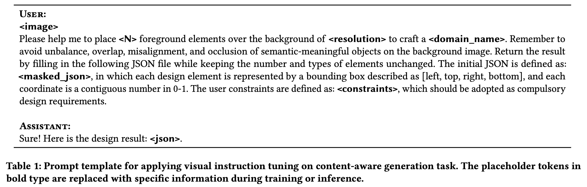

# [LG] PosterLLaVa: Constructing a Unified Multi-modal Layout Generator with LLM

- paper: https://arxiv.org/pdf/2406.02884
- github: https://github.com/posterllava/PosterLLaVA
- archived (인용수: 0회, '24-07-17 기준)
- downstream task: Content-aware Layout Generation

# 1. Motivation

- 기존에 content-aware layout generation은 real-world과 동떨어진 oversimplified (요소 갯수 <15) 데이터로만 구성되어 있어, 적용에 한계가 있음

  $\to$ 복잡한 데이터를 구성해야함

- Multi-modal Instruction Tuning에서 영감을 받아, instruction-following MLLM을 만들어보자

  $\to$ LLaVa를 기반으로 layout generation을 수행하는 PosterLLaVa를 구현해보자!

# 2. Contribution

- 통합된 Layout Generation인 "PosterLLaVA"를 제안함
  - Input instruction을 통해 다양한 디자인 시나리오에 적응 가능
- 디자인 프로세스의 효율성과 직관성을 향상시킴
  - Natural Language input
- Real-world complicated poster dataset "QB-Poster를 제안함"

# 3. PosterLLava

- Methodology

  

  - $L_j$: j번째 layout (page)

  - **I**$_i$: i번째 요소 이미지 $\to$ 실제로 pretrained ViT의 embedding결과를 활용

    

  - $x_i, y_i, h_i, w_i$: i번째 요소의 noramilzed box attributes (background image로 normalize)

  - $c_i$: text로 표현된 category name

- Training scheme

  - 기존에 pre-training & finetuning이 아닌, finetuning만 진행

    $\to$단, image-text alignment가 된 pretrained adapter를 활용하여 pre-training을 skip

- Prompt Template

  

  - domain_name: 해당 benchmark의 domain을 표현

    ex. "commercial poster", "advertising banner"

  - masked_json: category 정보 외 bbox정보를 지운 json 형태

- Overall Architecture

  

# 4. Experiments

- Datasets

  

- Results

  - PosterLayout dataset

    

  - CGL-GAN dataset

    

  - Ad banner dataset

    

  - Youtube dataset

    

  - QB-poster

    

    - LayoutPrompter: *Chatgpt-3.5.turbo-instruct*

- Qualitative Result

  

  - User Constraint Scenario

    

  

  - Ablation Study

    
