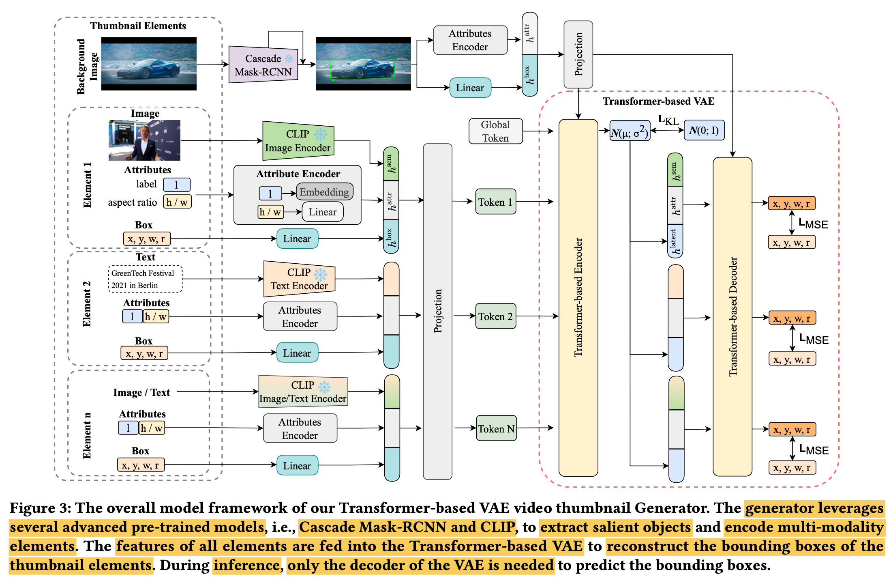

# [VTG] HPCVTG: Toward Human Perception-Centric Video Thumbnail Generation

- paper: https://dl.acm.org/doi/10.1145/3581783.3612434
- github: https://github.com/yangtao2019yt/HPCVTG (깡통)
- ACM MM 2023 accepted (인용수: 167회, 24'-07-23 기준)
- downstream task: Video Thumbnail Generation Task

# 1. Motivation

- Online video를 시청하는 user가 항해(서칭)하는 과정에서 video thumbnail은 user의 attention을 취득하는데 중요한 역할을 수행한다.
- 하지만 매력적이고 충분한 정보를 담은 video thumbnail을 취득하는데 2가지 어려움이 존재한다.
  1. 미적인 기준들 간의 충돌(Layout Visual Balance vs. Symmetry)로 인해 미적인 원칙들 골고루 균형있게 찾기가 어려움
  2. 핵심 image frame (keyframe)과 해당 text paired data가 부재
- 위 두가지 문제를 해결하는 방법을 고안해보자!

# 2. Contribution

- 디자인 원칙을 만족하는 thumbnail을 생성하는 새로운 기법을 제안
  - Layout의 visual balance를 만족할 것
  - Element간 overlap을 피할것
- Large-scale video thumbnail design dataset (10K videos)를 제안함
  - video당 10개씩 총 100K thumbnail image존재
    - 2K는 human feedback으로 라벨링
- Few-shot Learning (MAML)기반의 rapid adaptation을 통해 다양한 human preference를 빠르게 반영 가능함
  - MAML + Human Feedback의 새로운 연구방향 제시
    - 모델: LayoutGAN++ (VAE)
    - MAML: Few-shot learning으로, human annotation cost를 줄일 수 있음

# 3. HPCVTG

- Preliminaries

  - Automatic Video Thumbnail Generation

    - 비디오의 내용을 요약하는 대표성이 있는 커버 page를 생성하는 task

    - 목적함수

      

      - $\Epsilon^{bg}$: Salient Object for the background image

      - $\Epsilon^{fg}$: Keyframe ($e^{fr}_i$) + key text ($e_i^{text}$)의 집합

        

        - $\Epsilon^{fr}$: keyframes

          

          - Elements
            - class: *l*=['title', 'subtitle', 'frame', 'background']
            - bbox: (*x,y,w,h,r*) (*r*: rotation angle)

        - $\Epsilon^{text}$: Key texts

  - Model-Agnostic Meta-Learning (MAML)

    - 목적: 좋은 초기 model parameter를 학습하기 위함

      - 새로운 task (new user, new preference)에 빠르게 적응하기 위함

    - 목적함수

      

      - $\beta$: learning rate
      - $D_T^{val}$: *T* task의 검증셋
      - $D_T^{train}$: *T* task의 학습셋 (few-shot)
      - $\theta^K$: K iteration adaptation된 model weight

- HPCVTG

  - overall architecture

    - 세 가지 모듈로 구성

    

    1. Thumbnail elements extraction

       - Key texts extraction

         - Video content에 어울리는 title과 description의 words, phrases를 ChatGPT를 통해 추출

           

         - 특수문자는 제거

       - Key frames extraction

         - Video를 20초에 1장씩 frame을 추출하고,
         - Key text와 Clip기반으로 similarity score가 제일 높은 frame을 추출

    2. Aesthetic Principles

       - 미적 기준은 주관적이고, 좋은 결과에 대한 분산이 크기 때문에 *m*개의 원칙을 세워 이를 충족하도록 함

         

         - P: Design Constraint

         - L: Design Principle

         - n=5가지 중요 원칙

           1. Background covered: 전체 background frame 중에 생성된 layout bbox가 얼마나 위치하는지를 loss로 정의

              

              - *F*: background area
              - $e_i$: i번째 element

           2. Rotation Diversity

              - Rotation의 출력 결과가 획일적인걸 방지하고자, 분산값을 늘리도록 loss로 정의

                

           3. Intrusiveness: 생성된 layout이 background image의 얼굴 영역을 blocking하지 않도록 loss를 정의

              

           4. Border-Crossing: 생성된 layout이 Background frame의 경계영역을 넘지 않도록 loss로 정의

              

         - 기타 2가지 고려한 사항

           1. Saliency + semantic information 모두 활용 (semantic segmentation score + saliency score)
           2. Predefined font size, font candidate, font style를 가지고 text element를 search할 때마다 랜덤하게 생성
              1. Font size
                 1. title: [0.12H, 0.18H]
                 2. subtitle: [0.068H, 0.084H]
              2. Font candidate
                 1. Title: 23개
                 2. Subtitle: 42개

       - Objective Function

         - Visual Balance: 전체 element의 "gravity"가 중심을 향하도록 loss를 설계 (Gravity: 모든 요소의 중점의 평균)

           

           - $C_m$: Frame의 중점
           - $C_o$: Layout의 중점 ($a_e=h_ew_e$)

         - Compactness: Element가 corner에 산발되지 않도록 class 중점을 기준으로 regularization loss을 부여

           

         - Attractiveness: Watching poster라는 논문 그대로 인용 $\to$ [46]

       - Constraints

         - Element Non-overlapping: 두 keyframe내 요소간의 IoU upperbound를 설계

           

         - Saliency Unobstructed: Background의 saliency영역을 forground elemnt가 overlap하지 않계 설계

           

       - Searching Algorithm: GA (Genetic Algorithm) 사용

    3. Thumbnail Neural Generator

    - Architecture: Clip-t, Clip-I, Mask-RCNN, LayoutVAE 사용

      

      - Forground Element embedding

        

        - 

      - Background embedding: Mask-RCNN의 bbox로 saliency detection

        

      - LayoutVAE

        - input: forground / background embedding
        - output: reconstructed bbox

        

        

      - Loss

        

    - Total Loss

      

- Learning with Human Feedback

  - 2K개의 비디오에 대해 수행
  - 9개 중 3개는 principle-based / 나머지 6개는 random 추출 후, 사람에게 점수를 부여하도록 함

- Training

  - pretraining: Random + principle based 로 추출한 pseudo preference로 학습

    

  - finetuning: human preference로 학습

# 4. Experiments

- 정량적 분석

  

- 정성적 분석

  

- Ablation study

  
