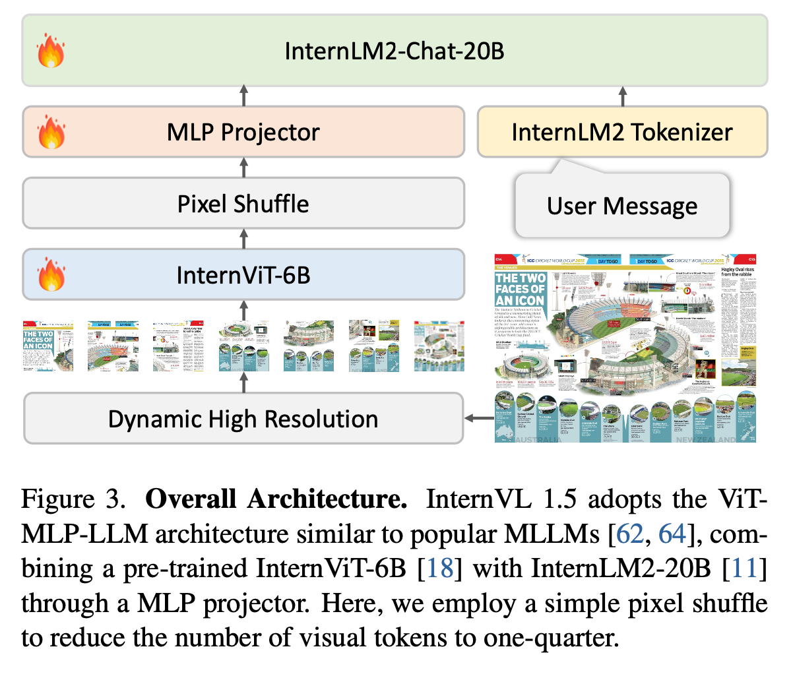

# [MM] InternVL-1.5: How Far Are We to GPT-4V? Closing the Gap to Commercial Multimodal Models with Open-Source Suites

- paper: https://arxiv.org/pdf/2404.16821
- github: https://github.com/OpenGVLab/InternVL
- CVPR 2024 Oral accpeted (인용수: 51회, '24-07-31 기준)
- downstream task: Multi-Modal VQA, OCR, Multi-Conversation, etc

# 1. Motivation

- Open-source와 Proprietary Commercial model간의 성능 격차가 존재함

  

  - 성능 격차의 3가지 원인

    - Parameter Scale: Opensource는 Vision model의 parameter 300M + Language Model의 parameter가 7B/13B
    - Image Resolution: Opensource는 Fixed resolution을 사용하는데 비해, commercial model은 dynamic resolution을 활용
    - Multilingual Capability: Opensource는 대부분 영어에 국한되어 학습되는데 비해, commerical model은 다국어로 학습

    $\to$ 3가지 문제를 보완한 MLLM을 만들어보자!

    

# 2. Contribution

- Stronger Vision Encoder: 기존 MLLM의 Vision Encoder (ViT-Eva-Clip/ViT-DinoV2)보다 대규모인 InterViT-6B에 대해 Image Captioning / VQA 등 다양한 pretraining으로 학습시켜 다양한 LLM에 transferable한 Vison Encoder를 제안함
- Dynmaic High-Resolution: 448x448 pixel 단위로 patch를 aspect ratio별로 쪼개어 AR이 보존되도록 학습함 $\to$ 4K까지 학습 가능
- High-Quality Bilingual Dataset: 중국어&영어로된 opensource Multi-modal dataset을 모아서 학습시킴 $\to$ 8/18 Multimodal benchmark에서 SOTA (including Chat-GPT-4v, Claude-3.5)

# 3. InternVL-1.5

- overall architecture

  - 기존 MLLM architecture와 동일한 "ViT-MLP-LLM" 구조
    - Image EncodeR: InterViT-6B
    - LLM: InternLM2-20B

  

- Dynamic High Resolution

  - 기존의 image encoder는 fixed shape (ex. 224x224, 336x336)로 학습함으로써 aspect ratio, high resolution을 전혀 고려하지 못함 $\to$ sub-optimal

  - Pre-defined aspect ratio로 resize하여 448x448 patch단위로 token embedding하는 dynamic high resolution 방식을 체택

    

    - 학습 중에는 1 ~ 12개의 patch로 학습했으나, 실험 결과 40개까지 zero-shot ability를 보임

      (ex. $800 \times 1300 \to 896 \times 1344$ Resize후 $448 \times 448$ patch로 2x3개로 나눔)

    - Thumbnail image는 global 이해력을 향상시키기 위해 추가

  - Pixel Shuffle: visual token 수를 줄이기 위해 사용. 1/4로 줄여 256 visual token으로 표현 $\to$ Check

- High-Quality Bilingual Dataset

  - Pretraining

    

  - Finetuning

    

- Data Translation Pipeline

  - 공개된 benchmark dataset은 대부분 영어이므로, 중국어 등 다국어 데이터셋을 만들기 위해 ChatGPT-4V에 아래와 같은 prompt를 통해 번역을 진행

    

# 4. Experiments

- 정량적 결과

  - 16 benchmarks

    

  - MMT-Bench & Multi-Turn Benchmark

    

- 정성적 평가

  - vs. ChatGPT-4v

    

    

    

    

    

    

- Ablation Study

  - Dynamic Resolution에 따른 성능

    
