# [MM] LaViT: UNIFIED LANGUAGE-VISION PRETRAINING IN LLM WITH DYNAMIC DISCRETE VISUAL TOKENIZATION

- paper: https://arxiv.org/pdf/2309.04669
- github: https://github.com/jy0205/LaVIT
- ICLR 2024 accepted (인용수: 28회, '24-08-28 기준)
- downstream task: Zero-shot T2I / I2T Understanding & Generation

# 1. Motivation

- 기존 MLLM 모델은 대부분 Vision과 Language를 연결할 때 frozen LLM과 심플한 MLP로 이루어진 adapter 구조로 연결함

  $\to$ 이는 visual 정보를 prompt로만 사용하고, 추가 지도학습을 하지 않아 LLM모델의 잠재력을 충분히 활용 불가능 

- LLM을 학습하는 연구도 등장하였으나, text와 image를 따로 목적함수를 두어 학습함으로써 통합된 multi-modal modeling이 불가능함

- text & image의 목적함수를 통합하여 LLM의 잠재력을 끌어올려 학습해보자!

  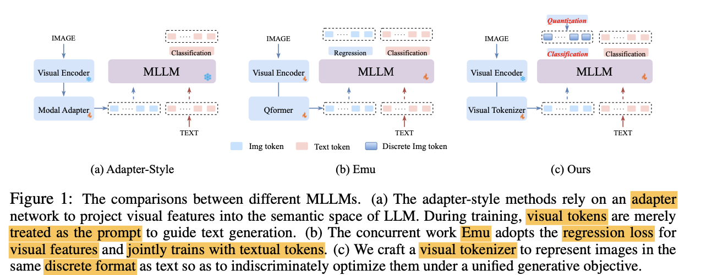

# 2. Contribution

- LLM의 학습 패러다임을 유산으로 받아 image/text 의 next token을 Auto-regressive하게 예측하도록 학습을 하는 멀티모달 LLM, LaVIT (Language-VIsion Transformer) 모델을 제안함

  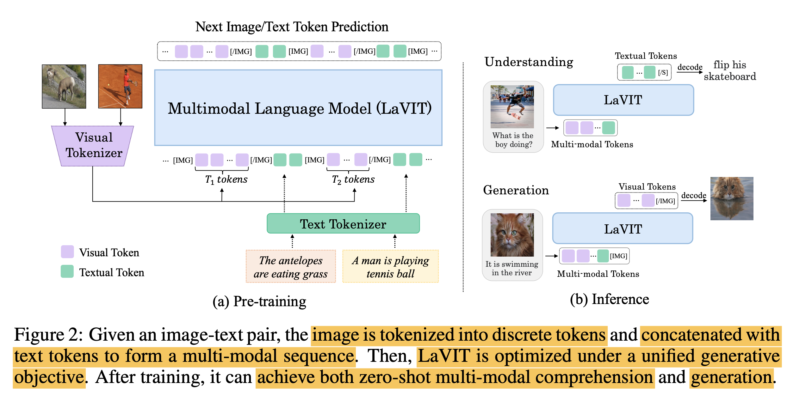

  - 단순한 Adapter구조가 아닌, Visual token을 discretize하는 visual tokenizer를 추가하여 visual token을 LLM입장에서 외국어 단어를 추가한 것처럼 학습을 수행
  - 특징 
    - Discrete Visual Token: LLM모델의 Next Token prediction loss로 visual token을 학습하기 위해 discretize을 수행
    - Dynamic Token Allocation: 이미지는 domain 특성상 token간 중복 정보가 존재하므로, 요약을 수행하는게 좋음. (Token-merging) 그리고 이미지에 따라 token 갯수도 동적으로 변화하는게 바람직함

- Discrete visual token은 동적으로 이미지 컨텐츠에 따라 크기가 바뀔 수 있음 $\to$ 중복 제거하고, 표현력 증가 가능 (최적화 가능)

- VLM task에서 Zero-shot에서 SOTA 달성

# 3. LaViT

- Overall architecture

  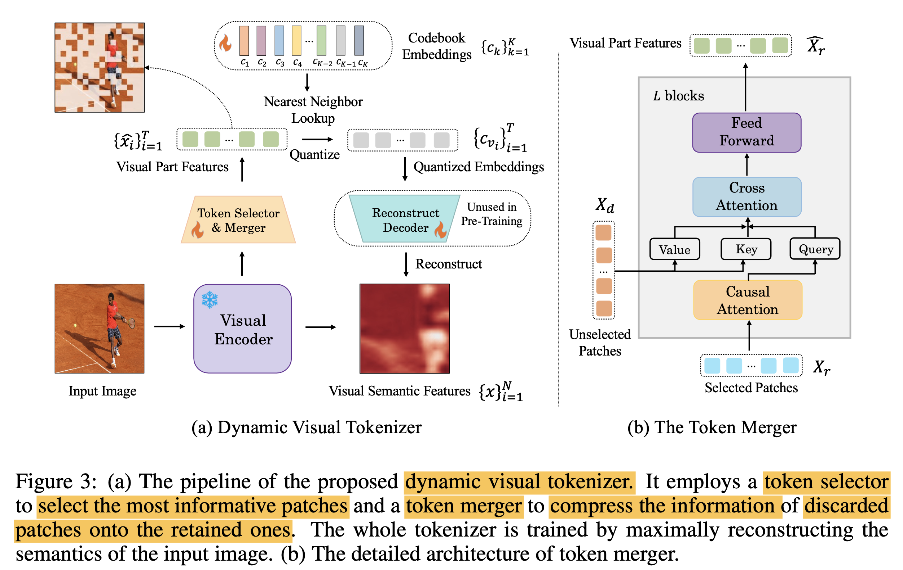

## 3.1 Dynamic Visual Tokenizer

- Token Selector: 이미지 내에서 forground에 해당하는 영역의 visual token만 추출

  - MLP layer로 구성

    - output: distribtuion $\pi$를 출력하여 해당 분포에서 sampling 수행

      -  $\pi \in R^{N \times 2}$

        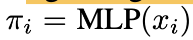

      - binary mask *M*을 Gimpal Softmax 함수를 통과시켜 추출 $M \in {0,1}^N$

        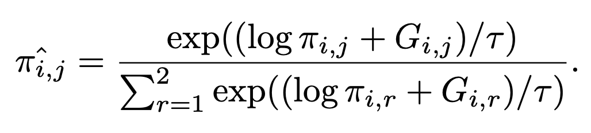

      

- Token Merger: Not selected token (* N*) 의 detail한 정보를 selected token (*N-T*) 에 merge시키는 역할

  - Binary Mask *M*을 통해 selected / unselected token을 구분하고  Cross Attention을 수행

    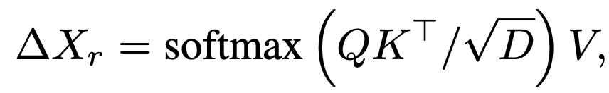

    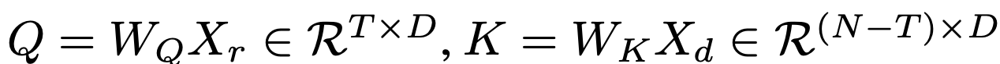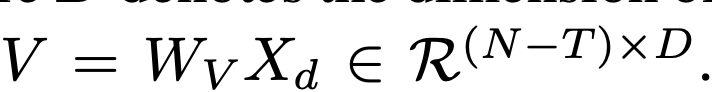

- Vector Quantization & Training

  - Visual code book (*K*)를 학습

    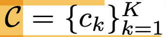

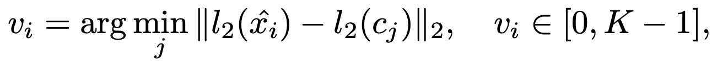

- Visual codebook의 discrete token으로 reconstruction된 이미지와 GT 이미지의 cosine 유사도를 높아지도록 학습

- selected token ratio ($\rho$)를 만족하도록 학습

  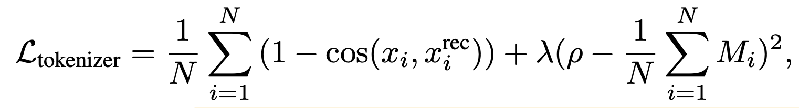

- Decoding to Pixel

  - Stable Diffusion을 활용하되, tokenizer의 출력 $x_i^{rec}$을 condition으로 받아서 학습

    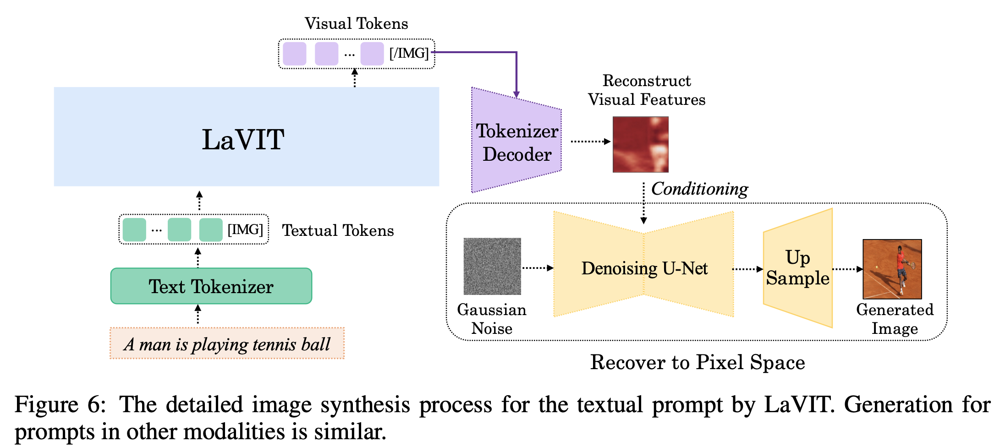

    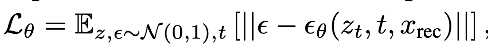

    - 예시

      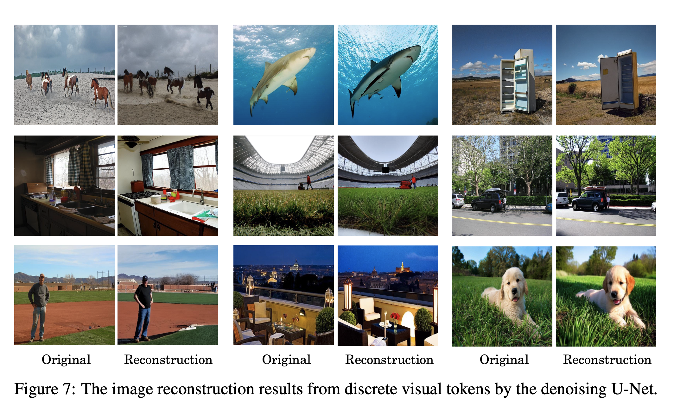

## 3.2 Unified Generative Modeling

- 2개의 special token [IMG], [/IMG]을 이미지 전후에 입력

- 2D의 rasterized image token 을 1D의 causal dependency를 갖는 형태로 tokenize 

- 순서에 영향이 없도록 [image,text]랑 [text,image] 꼴로 concat하여 번갈아 학습

  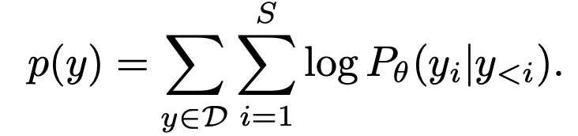

## 3.3 Model Pretraining

1. Tokenizer Training

- visual codebook (*K=16,384*)랑 token selector, merger를 학습하고 encoder는 freeze
- Dataset: LAION-400M을 batch size 2048로 학습
- $\rho=1/3$

2. Unified Vision-Language Pre-training

- LLaMA-7B을 unfrozen하여 학습

# 4. Experiments

- Zero-shot multi-modal understanding

  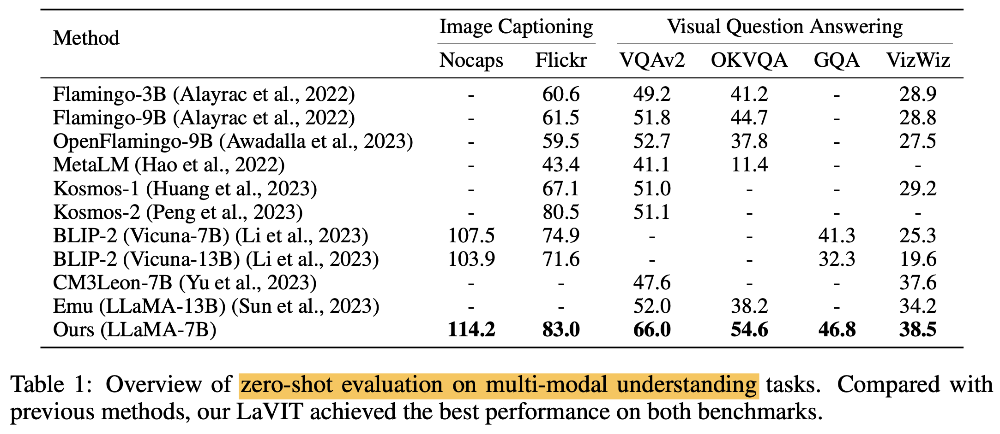

- Zero-shot T2I generation

  - simple prompt: “Question: {} Answer: {}”를 사용하여 생성

  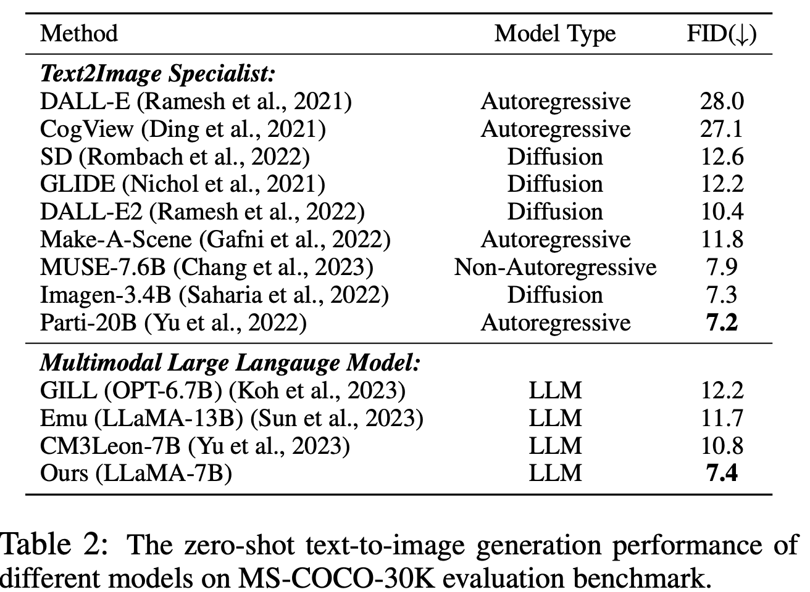

- 정성적 평가

  - Text prompt 기반 이미지 생성

    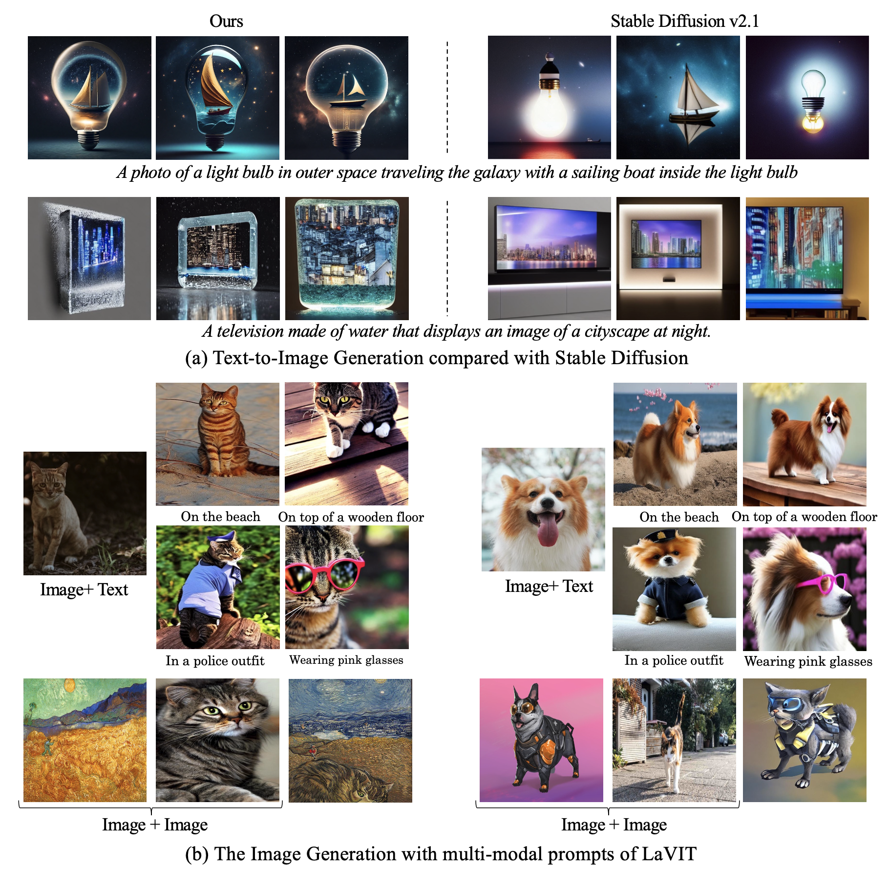

- Ablation Study

  - Token classification vs. Regression? Classification!

    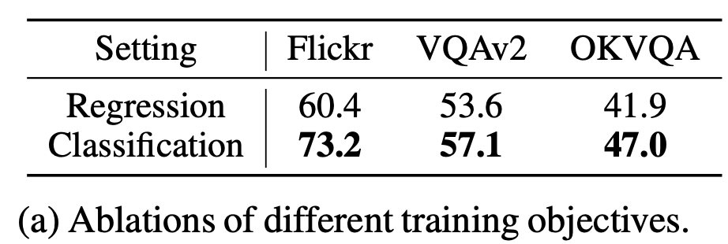

  - Dynamic vs. Fixed Token Length

    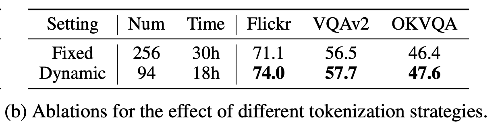

  - Token selector & merger의 효과 (a) & Visual Codebook의 clustering 효과

    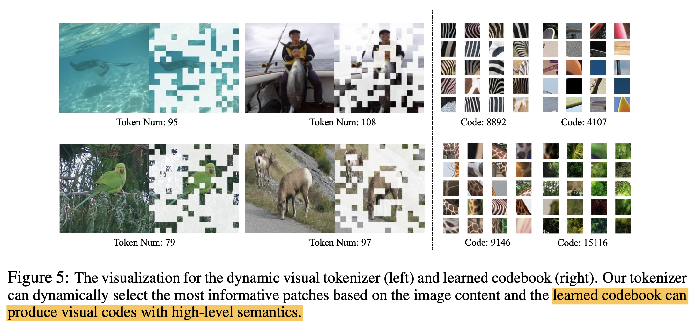

    - (a) background를 잘 찾아야 하는 레이아웃 자동생성 모델에 적용 가능하지 않을까?
    - (b) 업종분류에 활용하면 좋지 않을까?

    
