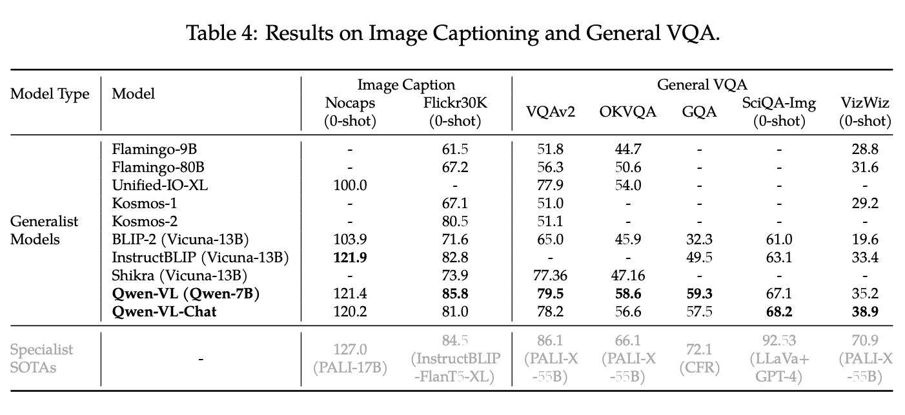
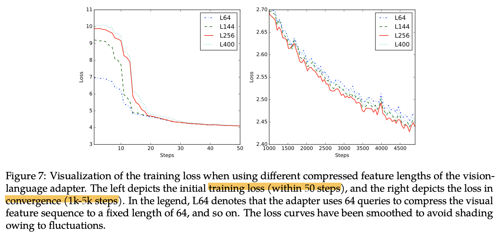

# Qwen-VL: A Versatile Vision-Language Model for Understanding, Localization, Text Reading, and Beyond

- paper: https://arxiv.org/pdf/2308.12966
- github: https://github.com/QwenLM/Qwen-VL
- Hugging-face: https://huggingface.co/Qwen/Qwen-VL
- archived (인용수: 274회, '24-09-02 기준)
- Downstream task: VLU tasks (Image captioning, VQA, text-oriented QA, visual grounding, etc)

# 1. Motivation

- 기존 LVLMs은 Object grounding (물체의 위치를 찾는 능력) 혹은 text reading (OCR)과 같이 fine-grained visual understanding을 잘 하지 못함
- 이러한 한계를 극복하는 다재다능한 VLM (Vision Language foundation Model)을 개발해보자!

# 2. Contribution

- 우수한 성능: vision-중심의 understanding benchmark에서 top-tier accuracy를 냄 (기존 + 새로운 dialogue benchmarks)

  

- 다언어 지원: 기존 (open-source) 모델은 영어 위주였으나, Qwen-VL은 영어+중국어 위주로 학습셋 구성

- 다중 이미지 지원: 기존 모델들이 단일 이미지-텍스트로 학습한대 비해, 다중 이미지를 학습함으로써 이미지간의 context를 이해할 수 있음

- 정밀한 비전 이해능력: 해상도 증가 (448x448)와 말뭉치(corpus)로 학습 $\to$ grounding, text-reading, text-oriented QA, fine-grained dialog 성능 우수

  

# 3. Qwen-VL

## 3.1 모델 구성

- LLM: Qwen-7B
- Visual Encoder: ViT (Openclip's ViT-bigG/14)
- Adapter: position-aware vision-language adapter (Cross-attention layer + learnable query로 구성)
  - image feature를 압축하는 역할 (256개)
  - 위치정보를 고려하여 2D absolution position encoding을 추가

## 3.2 입출력

- Input

  - Image: 2개의 special token (, </img>)를 앞뒤로 붙이고, 256 fixed length로 encoding

  - Bbox: 2개의 speical token (<box>, </box>)를 앞뒤에 붙여 타 text와 구별했으며, 1,000개의 bin으로 쪼개 bbox를 표현 (xyxy format)

    - 2개의 reference token (<ref>, </ref>)를 사용하여 bbox를 표현하는 content 앞뒤로 붙여줌

      

## 3.3 학습

- 3개의 stage로 학습 (2개의 pre-training + 1개의 SFT)

1. Pre-training

   - 데이터 특징: 방대한 양 + weakly labeled + web-crawled set (image-text)

     - English (78%) + Chinease (22%) $\to$ Alibaba Co.

     

     - 전체 이미지-텍스트 pair중 28%만 남기고 Filtering

       

   - 1번째 pretraining : Image-captioning task

     - 해상도: 224x224
     - 모델: Vision encoder와 VL adapter만 학습 (LLM은 freeze)

   - 2번째 pretraining : Multi-task pretraining (7개)

     - 해상도: 448x448
     - 모델: Vision encoder와 VL adapter만 학습 (LLM은 freeze)

     

     - Pre-training 시, LLM고유의 언어 능력을 잊지 않고자 학습셋에 추가

2. Supervised Fine-Tuning (SFT) : Instruction-finetuning하여 instruction을 following하는 능력을 키움

   - Caption data / LLM이 만든 dialogue data / localization + multi-image comprehension용 350K data로 학습

   - vision encoder는 freeze하고 VL adapter + LLM만 학습

     

- Hyper-parameter

- 학습 단계가 오를수록 learning rate랑 training step은 줄어듦

# 4. Experiments

- 2-stage pretraining 결과: Qwen-VL

- SFT 결과: Qwen-VL-Chat

- Evaluation Metrics

  

1. Image Captioning & VQA

   

2. Text-oreiented QA

   

3. Refer Expression Comprehension

   - 정밀한 이미지 이해 + localization 능력을 측정하기 위함

     

4. Few-shot Learning (In-Context) 능력

   - 모델 입력에 정답은 몇개 (few-shot)넣어주고 성능을 측정

   - 다중 이미지를 지원하는 능력으로 인해 성능 향상을 보임

     

5. Instruction Following 능력

   - TochStone: open-ended VL benchmark
   - SEED-Bench : 189K multi-choice question으로 구성된 human-annotated된 데이터. 12개의 task가 공간적+시간적 이해를 측정하도록 구성됨
   - MME: 모델의 인식 능력을 평가하도록 14개의 subtask로 구성됨

   

- Ablation Studies

  - VL projector의 learnable query갯수 $\to$ 너무 적으면 너무 압축하여 이미지 정보 손실 발생하고, 너무 많으면 계산량이 증가함

  - 실험 결과 256개가 train-spped 모두 적당함

    