# [SSL][CLS][SS] BEIT V2: Masked Image Modeling with Vector-Quantized Visual Tokenizers

- paper: https://arxiv.org/pdf/2208.06366
- github: https://github.com/microsoft/unilm
- archived (인용수: 231회, '24-09-04 기준)
- downstream task: SS, CLS

# 1. Motivation

- Data-Hungry한 Transformer를 label 없이 self-supervised로 학습하는 MIM (Masked Image Modeling) 등장으로 ViT계열이 최근 급부상 중임

- Pixel-level의 ViT patches를 복원하는 것은 high-level semantic context보다 pixel 값 예측에 집중하느라 high-level semantic을 놓칠 수 있다.

  - ex. "귀"에 해당하는 **visual word**, "혀"에 해당하는  **visual word**

    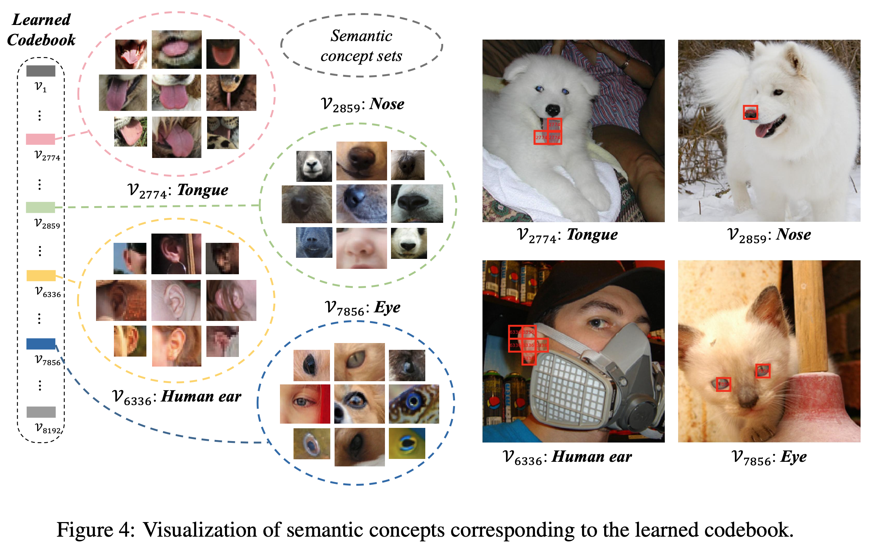

    $\to$ high level semantic을 학습하기 위해서 NLP처럼 learnable discretized codebook을 써보자!

# 2. Contribution

- VQKD (Vector-Quantized Knowledge Distillation) 기반의 self-supervised representation learning을 제안함

  - 기존에 Pixel-level 학습에서 벗어나, semantic-level MIM (Masked Image Modeling)을 사용

- Patch aggregation 전략을 제안하여, global한 구조를 더욱 잘 학습하는 discrete semantic token ([CLS])를 제안함

- Image Classification (linear probing, fine-tuning), semantic segmentation에서 좋은 성능을 보임 $\to$ 좋은 visual representation임을 증명

  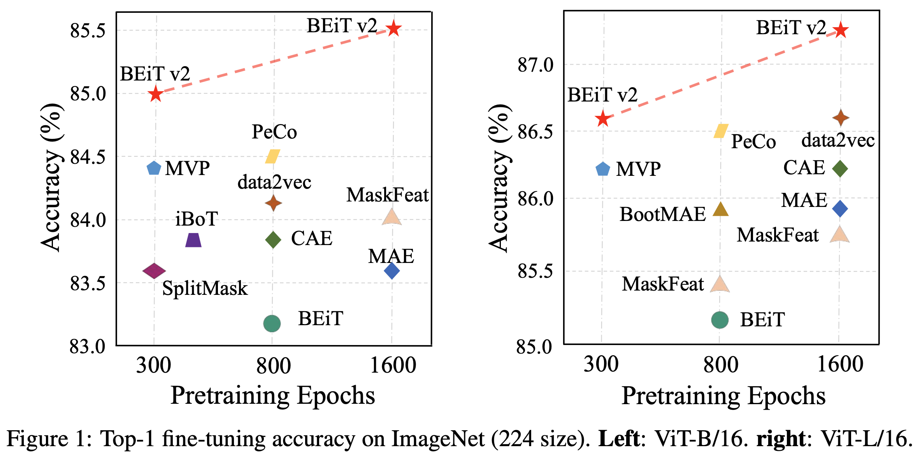

# 3. BEIT-V2

## 3.1 Training Visual Tokenizer

- VQ-KD (Vector Quantized Knowledge Distillation)

  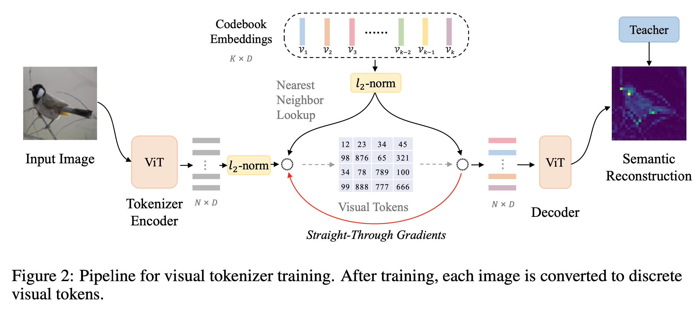

  - ViT encoder 

    - 입력 : *$N=HW/P^2$* 갯수의 patch들을 입력
      - image: 224x224
      - patch size: 14x14 
      - patch 갯수: 16
    - 출력: {**h**$_i$}$_{i=1}^N$ , *D*차원의 *N*개의 vector

  - Visual Tokenizer

    - 입력: {**h**$_i$}$_{i=1}^N$ , *D*차원의 *N*개의 vector
    - 출력: {**v**$_i$}$_{i=1}^N$ , *D*차원의 *N*개의 vector
      - **v**: codebook의 learnable embedding vector

  - Nearest Neighbor look-up으로 기존 visual encoder 값을 대체

    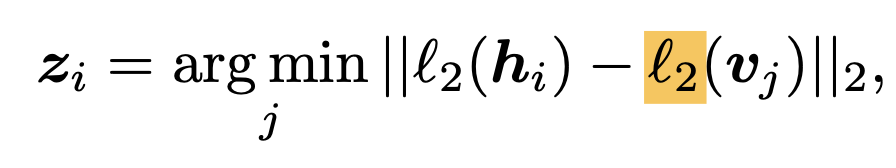

    - **z**$_i$: i번째 patch 중에 codebook embedding 중 가장 가까운 codebook의 index (scalar)

- Objectives

  - quantized 된 visual embedding **v**$_{z_i}$를 decoder에 입력하여 teacher (DINO 혹은 CLIP)의 feature-map으로 복원

    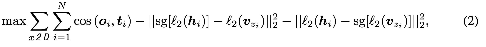

    - **o**$_i$: i번째 patch의 decoder output
    - **t**$_i$: i번째 patch의 teacher output

## 3.2 Improving codebook utilization

- K개의 codebook visual word가 다 사용되지 않는 문제가 있음
- codebook embedding을 저차원으로 mapping후 argmin을 하고 다시 고차원 mapping으로 복원하는 trick 사용
- codebook update시 EMA를 사용

## 3.3 Pretraining BEIT v2

- MIM loss를 적용 (40%를 masking하고 masking token으로 대체된 input에 대해 복원한 결과로 loss를 측정)

  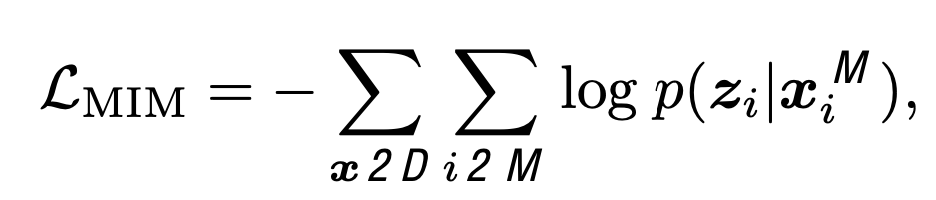

  - **z**$_i$: i번째 masked된  patch의 original image

- Global representation 추가

  - [CLS] token을 모델 중간(*l*번째 layer의) patch token들에 추가하여 shallow decoder를 붙여, 이미지를 복원하도록 학습함

    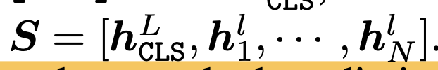

    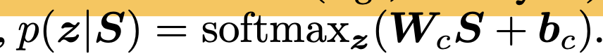

  - 목적: [CLS] token이 다른 patch token들의 정보를 취합하도록 학습하는 효과

    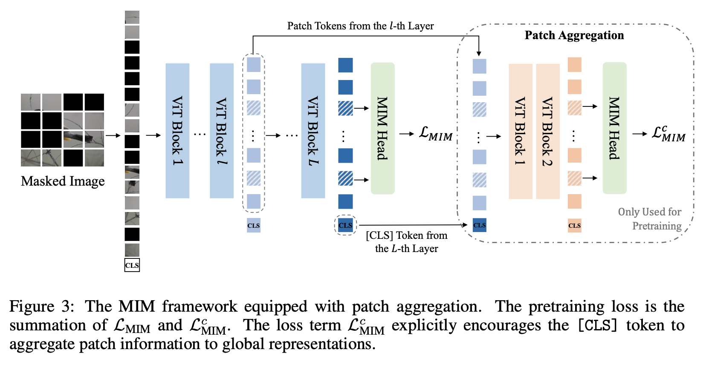

# 4. Experiments

- 정량적 결과

  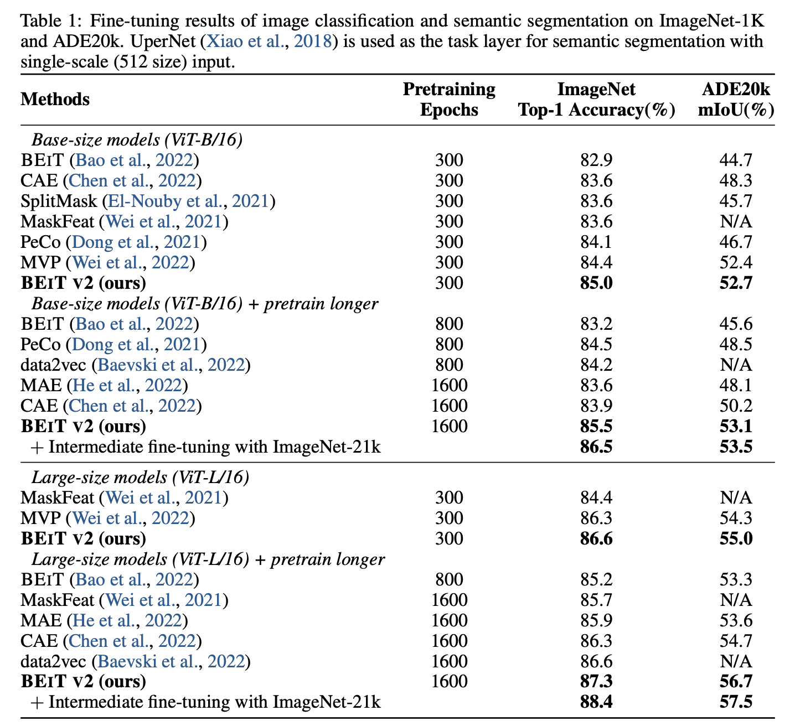

- Linear probing & Adversarial Attack

  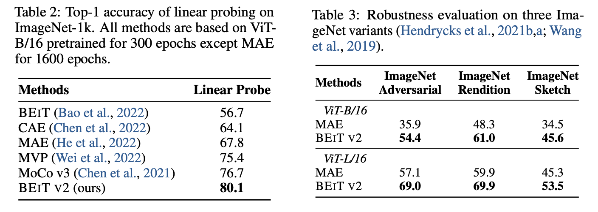

- Ablation Study

  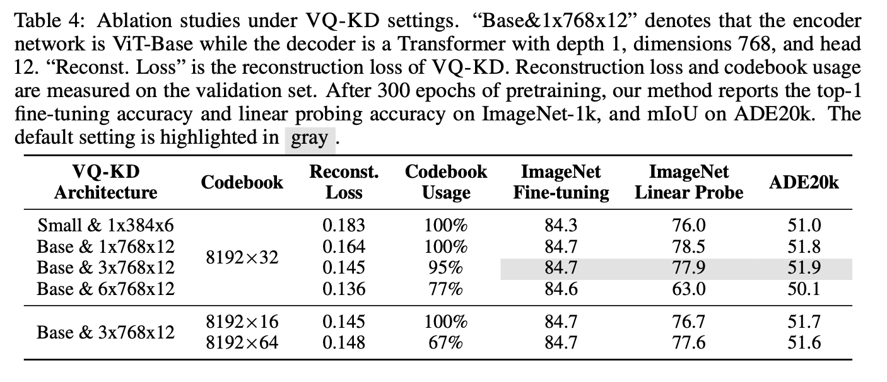

- Aggregation layer에 따른 성능 비교

  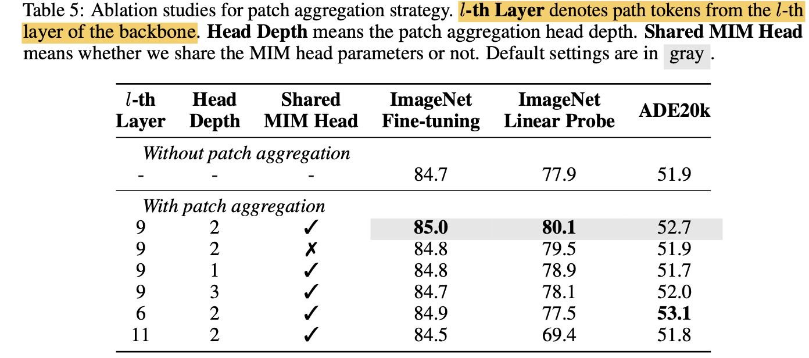

- VQ target에 따른 성능 분석

  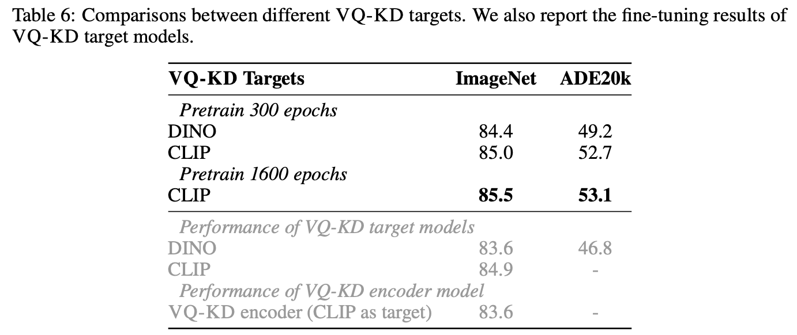

- Visualiation of codebook

  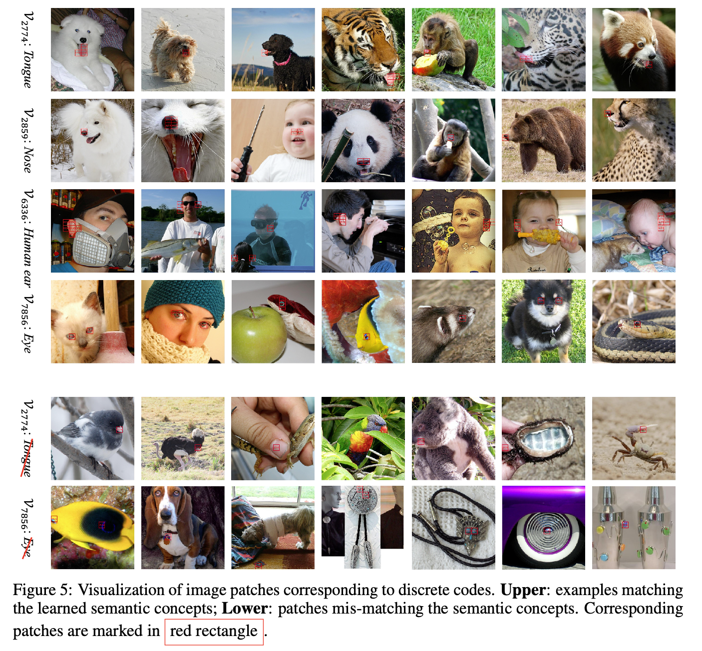