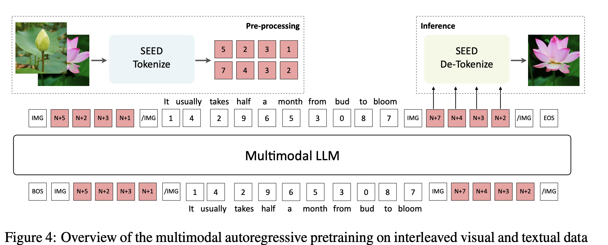
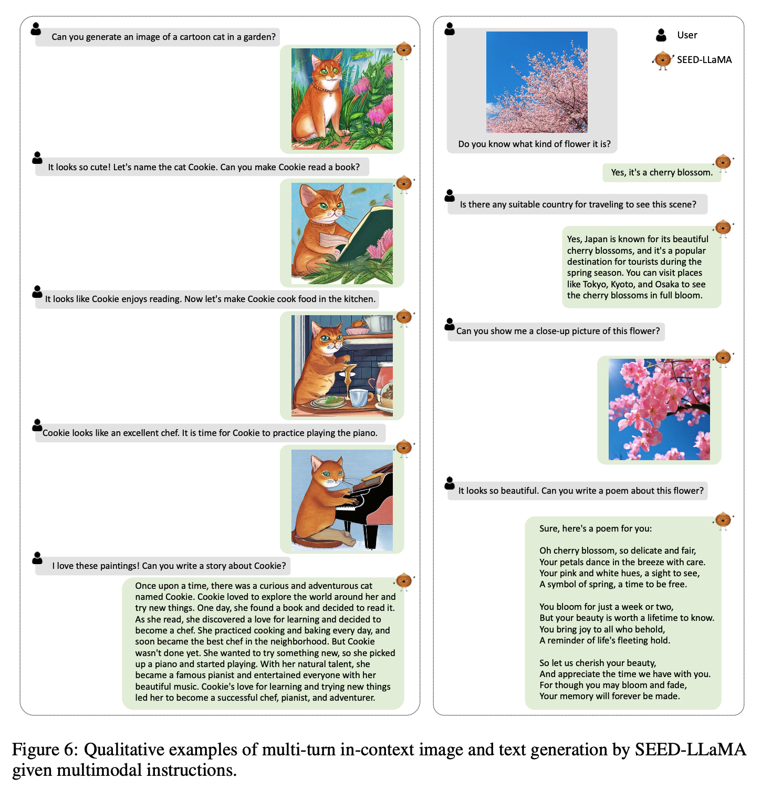

# [MM] Making LLaMA SEE and Draw with SEED Tokenizer

- paper: https://arxiv.org/abs/2310.01218
- github: https://github.com/AILab-CVC/SEED
- ICLR 2024 accepted (인용수: 43회, '24-09-11 기준)
- downstream task: Image Captioning, Image/Video Question & Answering (Multi-modal understading & reasoning), Text-to-Image Generation (Multimodal generation)

# 1. Motivation

- 최근 MLLM은 multi-modal comprehension & generation task를 통합하는데 어려움을 겪고 있음

- 이는 LLM의 입력으로 들어가는 Image token이 text token과 다른 점들이 있기 때문

  - Image token은 독립된 2D patch position간의 bi-directional attention을 통해 학습함으로써 상호 종속되게 (inter-dependence) 학습됨

    - 반면, Text token은 1D left-to-right causal attention을 통해 학습이 됨

  - Image token은 low-level semantic (색, edge, 등)을 보유한 반면 Text token은 "단어" 기반으로 high-level semantic을 보존함

  - Image token은 continuous 값인데 비해, text token은 discretized된 codebook에서 뽑아옴

    $\to$ semantic level을 맞추고, discretized codebook을 사용하며, 1D rasterized order로 예측을 수행하는 visual tokenizer를 만들어 LLM 학습에 사용한 목적 함수 (Next-word prediction) 그대로 학습하면 훨씬 좋지 않을까?

    

# 2. Contribution

- LLM의 token은 modality에 상관없이 high-level semantic을 capture해야 한다는 insight를 가지고 SEED라는 Advanced image tokenizer를 제안함
  - LLM의 학습 레시피를 그대로 사용하기 위해서 visual tokenizer가 high-semantic token을 추출하는건 필수적
- Multi-modal generation & understanding을 성공적으로 수행하는 통합된 framework인 SEED-LLaMa를 제안함.
- T2I, I2T 등 다양한 Multi-modal task에서 좋은 성능을 내며, Multi-turn In-context understanding & generation 능력을 갖음

# 3. SEED-LLaMa

- Overall architecture

  

## 3.1 SEED tokenizer의 구성

- ViT encoder $\to$ Blip-2 것 활용

  - Input : $3 \times 224 \times 224$의 이미지
  - Output: $P^2 \times D$의 visual feature

- Causal Q-Former: ViT visual feature의 visual token 갯수를 줄여 주고, 압축하는 역할 $\to$ Blip-2 것 활용

  - Input: $P^2 \times D$의 visual feature
  - Output: $32 \times D$ 로 압축된 causal embedding

- VQ Codebook: Continuous Causal embedding 값을 high-level semantic을 갖는 K개의 discretized codebook로 mapping하는 역할

  - Input:  $32 \times D$ 로 압축된 causal embedding
  - Output:  $32 \times D$ 로 압축된 discretized causal embedding

- MLP: Image를 생성하기 위해 unCLIP-SD의 text prompt가 embedding되는 latent space로 mapping하는 역할 (1 token)

  - Input: Codebook의 discretized causal embedding 32개 중 1개의 token $1 \times D$ 
  - Output: unCLIP-SD의 text latent space로 mapping된 generation embedding $1 \times D$ 

- UNet decoder $\to$ unCLIP SM 것 활용

  - Input: generation embedding $1 \times D$ 
  - Output: 생성된 Image $3 \times 224 \times 224$

  - Training

    I. Causal Q-Former

    - 256개의 patch를 32개의 learnable query와 cross attention시켜, 이미지 내의 visual feature를 추출하도록 learnable query를 학습
      - Blip-2 Q-former를 initial weight로 활용

    - Contrastive Loss를 적용하여 Image를 넣고 생성된 causal embedding이 text feature와 최대한 유사해지도록 학습
      - Uni-directional Attention: 기존 Q-Former와 다르면서 LLM과 유사하게 Causal Attention으로 구성

    II. Visual Tokenizer & De-tokenize

    - Causal embedding: Multi-layer Transformer로 된 decoder를 사용하여 discrete code가 causal embedding을 복원하도록 학습 (MSE Loss)
    - Generation embedding: MLP를 통해 1개의 token에 대해 frozen unCLIP-SD의 text latent space를 복원하도록 학습 (MSE Loss)
    - Codebook 
      - Size $K=8192$
      - Random initialized

## 3.2 SEED-LLaMa

1. Multi-modal Pretraining

   - Interleaved visual & textual data로 구성된 multi-modal prompt를 활용하여 Next-word prediction loss로 학습

     

     - $u_i$: visual or textual token

   - Pretrained LLM (Vicuna-7B/13B or LLaMa-2 7B/13B)를 활용

   - Visual codebook 8192개를 LLM vocabulary에 추가

   - 학습 전략

     

     - 초기에 visual codebook이 추가되었기 때문에 Embedding layer (visual encoder)랑 LLM-LoRA로 학습
     - 초기 학습 이후, LLM-LoRA로 학습된 weight는 LLM으로 merge하고, LLM만 full-finetuning (embedding layer는 freeze하는게 안정적으로 학습됨)

   - 학습 데이터

     

   - 학습 시간: Vicuna-7B 기준 A100-40G Gpu 64대로 144시간 소요 (우리 8대 기준 24일)

2. Multi-modal Instruction Tuning

   - 학습 데이터

     

   - 템플릿

     

   - 학습 시간

     - SEED-LLaMA-8B 기준 A100-80G 32대로 16시간 (우리 8대 기준 64시간)

# 4. Experiments

- Causal Embedding 평가 기준

  - Image-Text retrieval
    - COCO, Flickr30K (Recall@K)
      - 공평한 비교를 위해 Blip-2의 ITM re-rank module을 제거함

- Causal Embedding 결과

  - Text-to-Image & Image-to-Text Retrieval 

  

  - Image Generation (Clip-Similarity score)

    

    

- SEED-LLaMa

  - Understanding tasks

    

  - Generation tasks

    

  - Emergent Ablility

    - Multi-turn In-context Multimodal Generation

      

      

    - Composition Image Generation (Stylized Image Generation, Image Blending, Multimodal Composition, In-Context Generation)

      

  

- Ablation Study

  - Causal Visual codes vs Bilateral Visual codes

    - Bilateral의 경우 5K caption 중 2134개만 성공적으로 이미지를 생성 했으나 $\to$ 32개의 token이 생성되지 않아 문제되는 case가 많음
    - Causal의 경우 5K caption 중 4997개를 성공적으로 이미지를 생성함 $\to$ non-causal은 unstable 모델 성능을 냄

  - Seed-LLama pretraining

    - LoRA + Fullfinetuning이 LoRA보다 좋음 (embedding layer는 freeze)

      

    