# [MM] Qwen2-VL: Enhancing Vision-Language Model's Perception of the Wolrd at Any Resolution

- paper: https://arxiv.org/abs/2409.12191
- github: https://github.com/QwenLM/Qwen2-VL
- acrchived (0회, '24-09-23 기준)
- downstream task: VQA, Document & Diagram Reading & Multilingual OCR & Math Reasoning & REC & Video Understanding & Visual Agent

# 1. Motivation

- 기존 MLLM연구에서 모든 image는 기정의된 고정된 해상도로 resize되어 들어가고 있어, image의 컨텐츠에 무관하게 일관된 visual token 갯수가 들어가고 있었음
- 구체적으로 scale-then-padding을 하고 있어 비록 일관된 입력이 들어가는 장점이 있으나, 고해상도의 경우 시각적 정보를 손해보는 경우가 많이 발생함
- 입력되는 이미지 컨텐츠, 해상도에 따라 동적으로 해상도를 변화해주는 것이 시각적 정보를 최적으로 보존하며, 계산량을 최적으로 관리해주는 것임
- 이를 위한 모델을 개발해보자!

# 2. Contribution

- 다양한 해상도, 가로세로 비율에 대해 SOTA understading 능력을 보유함 (DocVQA, InfoVQA, RealWorldVQA, VTVQA, Math Vista, etc)

  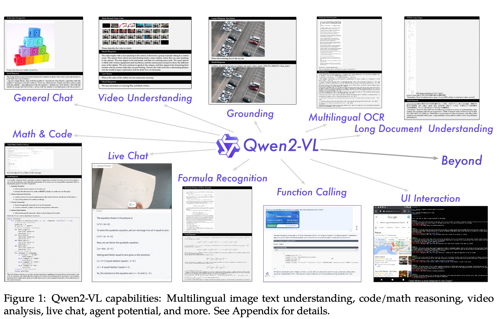alogue, content creation, etc)

- Video 길이 최대 1시간까지 커버 가능함 (Video-based QA, dialogue, etc)

- Robust한 agent 능력을 보유함 (mobile phone, robots, etc)

- 다국어 지원 (한국어 포함)

# 3. Qwen2-VL

- 3가지 버전의 scaled model을 opensource화함

  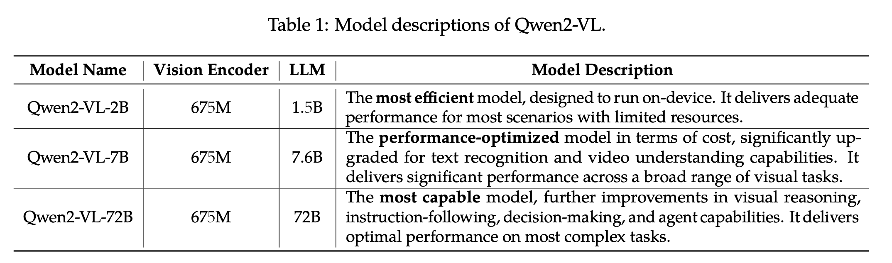

## 3.1 Model Architecture

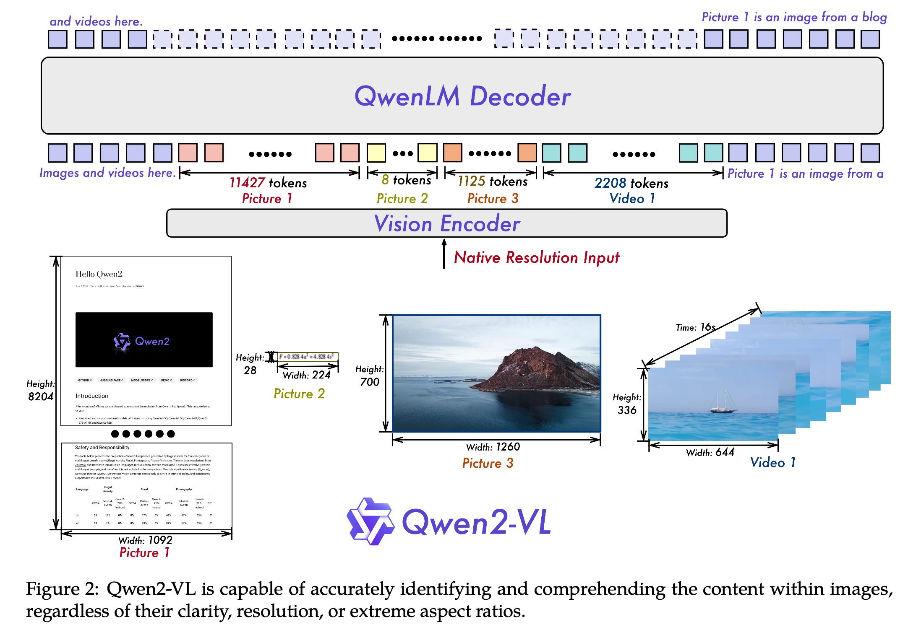

- Image & Video encoder: 675M ViT encoder (pretrained model)

- Naive Dynamic Resolution

  - 이미지 해상도를 기준으로 14x14 patch로 쪼개고, 해당 patch 2x2를 1개의 token으로 변환
    - ex. 8,204 x 1,092 / 14 / 14 / 4 = 11,427
    - ex. 224 * 28 / 14 / 14 / 4 = 7.7 (8)
  - image 시작, 끝에 <|vision_start|>, <|vision_end|> special token을 추가하여 이미지 입력임을 표시

- Multimodal Rotary Postion Embedding (M-RoPE)

  - 기존에 1D-RoPE가 sequence 축만 고려해서 position embedding을 추가했음

  - 여기서는 height, width, sequence 3축으로 확장

    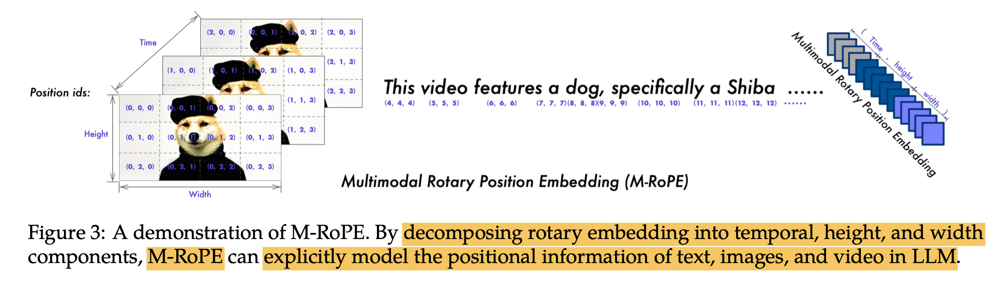

  - Video input에서는 temporal 축으로 이미지가 바뀔때마다 증가시켜줌

- Image & Video Understanding 통합

  - 기존 연구에서는 image & video를 다른 modality로 보고자 했으나, 우리는 시간당 2개의 frame을 추출함으로써 두개를 같은 modality로 바라봄
    - 즉, 이미지가 입력일 경우, 1초짜리 video라 보고, 중복된 이미지 2개를 입력
  - 3D Convolution을 활용하여 3D tube를 생성 (3D feature)
  - 최대 token을 16,384개로 제한 걸어둠

## 3.2 Training

- 3-stage training을 수행

  - 1-stage : image-text간의 alignment (ViT)만 학습 $\to$ DFN기반으로 pretrained model 사용하되, 1D-RoPE 를 2D-RoPE로 바꿈

    - 학습량: 600B tokens
    - 학습 task: image-text relationship, textual content recognition (OCR), image classification
    - 해당 task는 visual-textual correlation과 alignment를 이해하는데 있어 매우 중요하다고 함

  - 2-stage: 모든 parameter를 학습하되, V-L 복합적인 학습을 수행 

    - 학습량: 800B tokens
    - 학습 task: complex, real-world datasetㅇ로 학습했따고 함. pure textual data를 학습에 활용하여 model의 언어적 전문성을 해치지 않고자 함

  - Final stage: ViT는 freeze시키고 LLM만 instruction dataset으로 학습

    - Chat-ML format으로 학습했다고 함 (Multi-modal conversational data)

      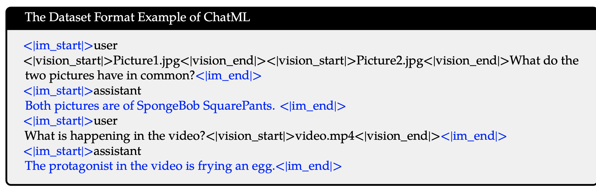

    - Bbox는 0~1000의 integer로 normalize하여 학습 & <|box_start|>, <|box_end|> 같은 speical token 추가했다고함 (Qwen-VL과 동일)
    - Box에 대한 설명 ㅊ가시, <|object_ref_start|>, <|object_ref_end|>와 같은 speical token도 추가했다고 함 (Qwen-VL과 동일)

## 3.3 Multimodal Model Infrastructure

- Storage
  - Text랑 vision data를 decoupling했다고 함
    - Text: CPFS (Cloud Parallel File Storage)
    - Vision: Alibaba Cloud's OSS (Object Storage Service) 
- Parallelism
  - data parallelism (DP), tensor parallelism (TP), 그리고 pipeline parallelism (PP), sequence parallelism (SP) 를 활용함
  - deepspeed's zero-1 redundancy optimizer를 활용함 $\to$ check 

# 4. Experiments

- MM understanding

  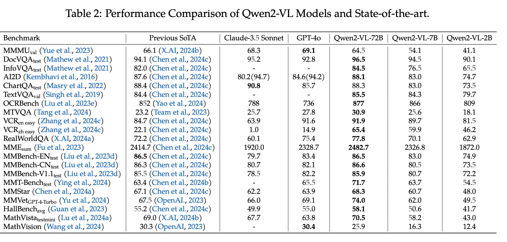

- Multi-Lingual OCR

  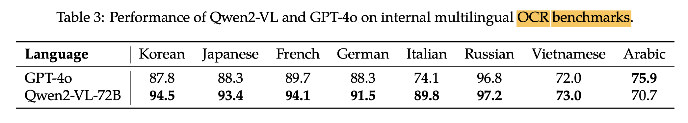

- Video QA

  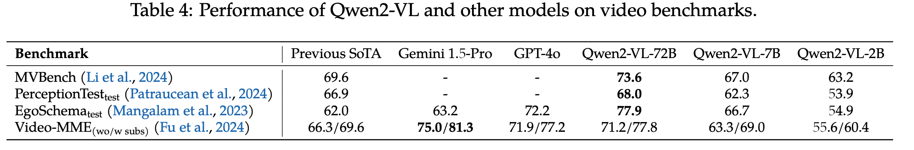

- Agent benchmark

  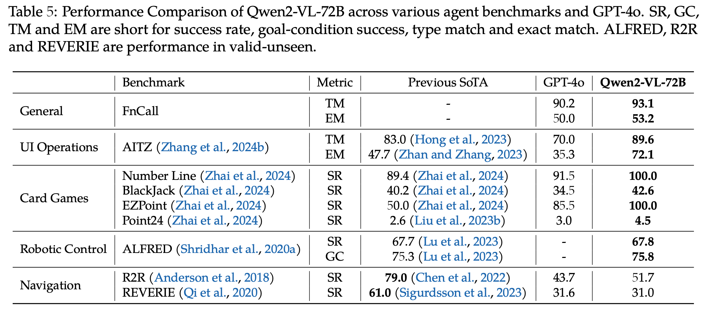

- Referring Expression Comprehension task

  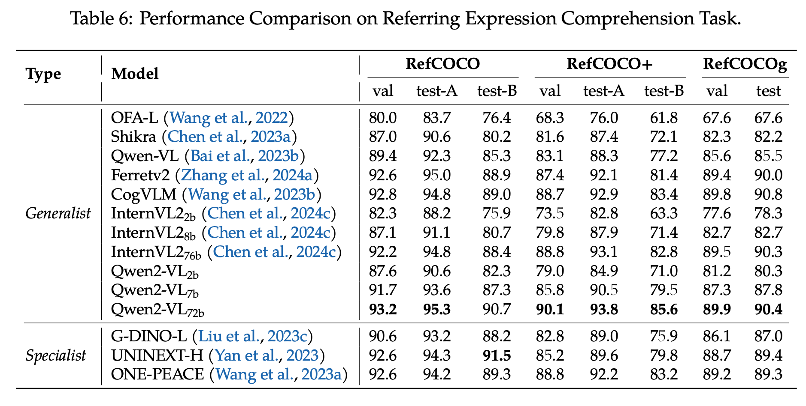

- Ablation studies

  - Fixed vs. Dynamic & Pixel에 따른 + visual token 갯수에 따른 성능 비교

    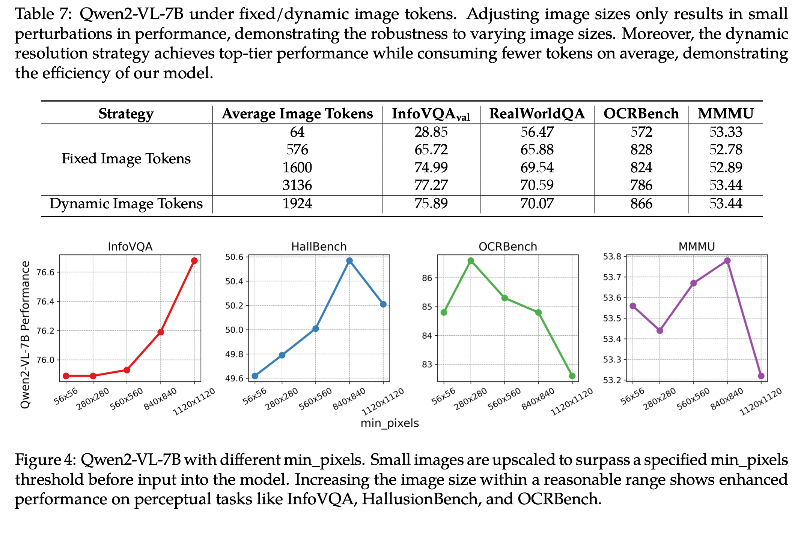

- 1D-RoPE vs. M-RoPE & inference시 max sequence에 따른 성능 비교

  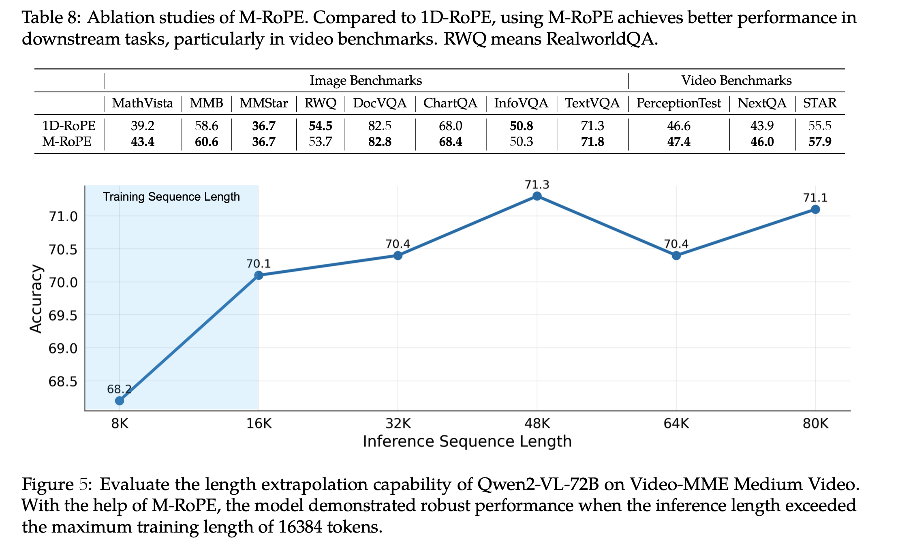