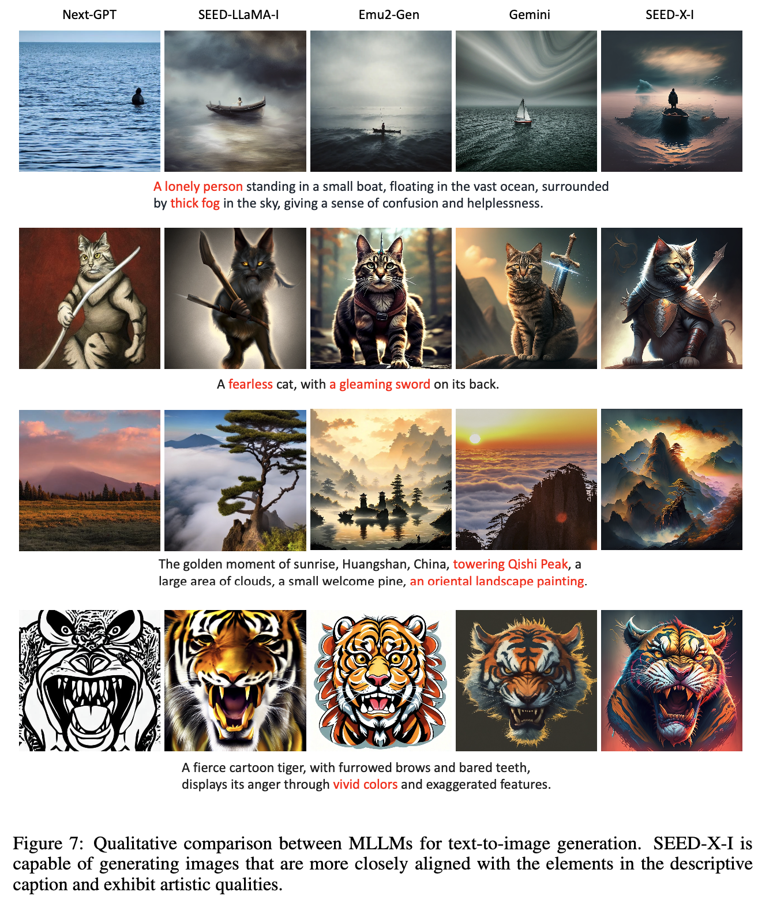

# [MM] SEED-X: Multimodal Models with Unified Multi-granularity Comprehension and Generation

- paper: https://arxiv.org/pdf/2404.14396
- github: https://github.com/AILab-CVC/SEED-X
- archived (인용수: 15회, '24-10-02 기준)
- Downstream task: Multimodal comprehension & Generation

# 1. Motivation

- 기존 SEED-LLaMA의 후속작. 기존 논문의 한계점은 fixed size image만 수용 가능하기 때문에 dynamic 해상도 수용이 불가하여 real-world 적용이 힘듦.
- 이를 해결하고자 다양한 사이즈 & Aspect Ratio도 수용 가능하며, 이미지를 이해 & 생성할 수 있는 모델을 만들어보자!

# 2. Contribution

- 임의의 사이즈 & Aspect ratio를 이해 가능한 SEED-LLaMA의 후속작 SEED-X를 제안 $\to$ pretarined ViT + SDXL de-tokenizer를 사용

  

  - 우측 상단: 길쭉한 이미지 이해 가능

  - 아래서 두번째 우측: slide layout 생성 (slide creation)  $\to$ Content-aware Layout 생성 가능 (Text content도 생성)

  - 기타 기능: , storytelling 가능

    

- Multi-granularity 이미지 생성이 가능한 SEED-X를 제안

  - Low-level image 조작 가능 $\to$ Multi-granularity de-tokenization 학습 phase를 통해 이미지 생성 & 이미지 editing이 가능

    

  - High-level instruction-following image 생성

    

    - 두번째 개 사진: 기존의 개의 형상은 유지하면서 오른쪽 개만 선글라스 착용 가능
    - 세번째 애기 사진: 기존의 애기 형상은 유지하면서 개만 제거

# 3. SEED-X

- 기존 모델들

  

- Architecture

  

  - 좌측: Pretraining phase. Visual de-tokenizer (4 Cross Attention Layer)를 통해 learnable query를 학습하여 SDXL의 입력으로 들어감 (text feature를 대체)
    - Dataset: LAION-COCO, Unsplash, LAION-Aesthetics, JoruneyDB
  - 우측: Finetuning phase. Visual de-tokenizer를 conditional image와 함께 학습 (Image editing)
    - conditional image는 low-level detail를 보존하기 위해 추가 condition으로 들어감. $\to$ InstructPix2Pix의 VAE encoder를 사용
    - Dataset: MagicBrush, In-house image editing data

- Dynamic Resolution

  - 아래 목적함수를 만족하는 $N_h, N_w$를 찾아 unsample 후 grid로 쪼개어 입력

    

    - H, W: original image size

    - $N_t, N_t$: 기존 Pretrained visual encoder training resolution  

    - $N_h, N_w$: grid size

      $\to$ visual token 크기는 입력되는 이미지마다 달라지지만, ViT에 입력 visual token의 갯수는 고정

  - Sub-image마다 2D positional information을 입력하기 위해 sub-image 의 중점 ($x_c, y_c$) grid을 기준으로 positional embedding을 extrapolate (외분)

    

- Training Step

  1. Multimodal Pre-training

     - 목적함수: Next-word prediction + image feature regression

       

       - $N=64$개의 learnable queries를 가지고 image reconstruction loss를 설계

       - LLM: Llama-2-chat-13B + LoRA로 초기화

       - ViT: Qwen-VL + 1D average pooling로 초기화

       - MM projector:  SDXL의 text feature뽑는 4개의 cross-attention layer로 초기화

         - Learnable Queries는 ViT visual token과 cross attention하게 됨

       - 총 48 H800-80G GPPUs로 10일간 학습 (158M samples)

         

     - detection & referencing 능력을 주기 위해 224개의 bbox token + 6개의 speical token을 추가함

       

  2. Multimodal Instruction TUning

     -  Downstream task별로 Instruction tuning을 진행

# 4. Experiments

- MLLM Benchmarks

  

- Real-world applications

  

- Image Manipulation task

  

- Text-to-Image generation task

  

- Multi-modal comprehension examples

  

  